<div align="center" style="margin-top: -5px;">


  
## Universidad Peruana de Ciencias Aplicadas

**Facultad:** Ingeniería

**Carrera:** Ingeniería de Software

**Periodo:** 2026-10

**Código del Curso**: 1ASI0732

**Curso:** Diseño de Experimentos de Ingeniería de Software

**NRC:** 12305

**Profesor:** Noriega Melendez, Julio Manuel

### Informe de TB1

**Startup:** GeoPsLabs

**Nombre del producto:** GeoPs

***“Tu ciudad, tus promociones, tu ahorro.”***

#### Relación de integrantes

| Integrante                              | Código       |
|-----------------------------------------|--------------|
| Barba Estrada, Bryan Eduardo            | U202323479   |
| Salazar Caballero, Alvaro Fabrizzio     | U202321941   |
| Cárdenas Concha, Santiago Iván          | U202311207   |
| Vera Nuñez Nicolas Alejandro            | U202214869   |
| Valverde Portuguez, Natalia Ximena      | U20231a816   |
| Choy Robles, Vanessa May Lang           | U202317450   |
| Diestra Zambrano Adriana Maria          | U202218110   |

<div align="center"><h3>Abril 2026</h3></div><br>

</div>

---

### Registro de Versiones

| Versión | Fecha | Autor | Descripción de modificación |
| :---- | :---- | :---- | :---- |
| TB1 | 27/04/2026 | Barba Estrada, Bryan Eduardo <br> Cárdenas Concha, Santiago Iván <br> Diestra Zambrano Adriana Maria <br> Valverde Portuguez, Natalia Ximena <br> Salazar Caballero, Alvaro Fabrizzio <br> Choy Robles, Vanessa May Lang <br> Vera Nuñez, Nicolas Alejandro | En la primera entrega del informe de nuestro proyecto, hemos realizado los primeros 5 capítulos del informe y también entregamos la primera versión del landing page de GeoPS. |

---

- [Universidad Peruana de Ciencias Aplicadas](#universidad-peruana-de-ciencias-aplicadas)
  - [Informe de TB1](#informe-de-tb1)
    - [Relación de integrantes](#relación-de-integrantes)
  - [Registro de Versiones](#registro-de-versiones)
- [Capitulo 1: Introducción](#capitulo-1-introducción)
  - [1.1. Startup Profile](#11-startup-profile)
    - [1.1.1. Descripcion del Startup](#111-descripcion-del-startup)
    - [1.1.2. Perfiles de Integrantes del equipo](#112-perfiles-de-integrantes-del-equipo)
  - [1.2. Solution Profile](#12-solution-profile)
    - [1.2.1 Antecedentes y problemática](#121-antecedentes-y-problemática)
        - [1.2.1.1. What](#1211-what)
        - [1.2.1.1.1. ¿Cuál es el problema?](#12111-cuál-es-el-problema)
        - [1.2.1.1.2. ¿Cuál es la relación con la persona en cuestión?](#12112-cuál-es-la-relación-con-la-persona-en-cuestión)
        - [1.2.1.2. When](#1212-when)
        - [1.2.1.2.1. ¿Cuándo sucede el problema?](#12121-cuándo-sucede-el-problema)
        - [1.2.1.2.2. ¿Cuándo utiliza el cliente el producto?](#12122-cuándo-utiliza-el-cliente-el-producto)
        - [1.2.1.3. Where](#1213-where)
        - [1.2.1.3.1. ¿Dónde está el cliente cuando usa el producto?](#12131-dónde-está-el-cliente-cuando-usa-el-producto)
        - [1.2.1.3.2. ¿A dónde se dirige?](#12132-a-dónde-se-dirige)
        - [1.2.1.3.3. ¿Dónde surge el problema?](#12133-dónde-surge-el-problema)
        - [1.2.1.4. Who](#1214-who)
        - [1.2.1.4.1. ¿Quiénes están involucrados?](#12141-quiénes-están-involucrados)
        - [1.2.1.4.2. ¿A quiénes les sucede el problema?](#12142-a-quiénes-les-sucede-el-problema)
        - [1.2.1.4.3. ¿Quién lo utilizará?](#12143-quién-lo-utilizará)
        - [1.2.1.5. Why](#1215-why)
        - [1.2.1.5.1. ¿Cuál es la causa del problema?](#12151-cuál-es-la-causa-del-problema)
        - [1.2.1.6. How](#1216-how)
        - [1.2.1.6.1. ¿En qué condiciones los clientes usan nuestro producto?](#12161-en-qué-condiciones-los-clientes-usan-nuestro-producto)
        - [1.2.1.6.2. ¿Cómo nos conocieron los compradores?](#12162-cómo-nos-conocieron-los-compradores)
        - [1.2.1.6.3. ¿Cómo prefieren los usuarios acceder a nuestro contenido?](#12163-cómo-prefieren-los-usuarios-acceder-a-nuestro-contenido)
        - [1.2.1.6.4. ¿Qué llevó a la persona a llegar a esta situación?](#12164-qué-llevó-a-la-persona-a-llegar-a-esta-situación)
        - [1.2.1.7. How much](#1217-how-much)
    - [1.2.2. Lean UX Process](#122-lean-ux-process)
      - [1.2.2.1. Lean UX Problem Statements](#1221-lean-ux-problem-statements)
      - [1.2.2.2. Lean UX Assumptions](#1222-lean-ux-assumptions)
      - [1.2.2.3. Lean UX Hypothesis Statements](#1223-lean-ux-hypothesis-statements)
      - [1.2.2.4. Lean UX Canvas](#1224-lean-ux-canvas)
  - [1.3. Segmentos objetivos](#13-segmentos-objetivos)
- [Capitulo 2: Requirements Elicitation \& Analysis](#capitulo-2-requirements-elicitation--analysis)
  - [2.1. Competidores](#21-competidores)
    - [2.1.1. Analisis competitivo](#211-analisis-competitivo)
    - [2.1.2. Estrategias y tácticas frente a competidores](#212-estrategias-y-tácticas-frente-a-competidores)
  - [2.2. Entrevistas](#22-entrevistas)
    - [2.2.1. Diseño de entrevistas](#221-diseño-de-entrevistas)
    - [2.2.2. Registro de entrevistas](#222-registro-de-entrevistas)
    - [2.2.3. Análisis de entrevistas](#223-análisis-de-entrevistas)
  - [2.3. Needfinding](#23-needfinding)
    - [2.3.1. User Personas](#231-user-personas)
    - [2.3.2  User Task Matrix](#232--user-task-matrix)
    - [2.3.3. User Journey Mapping](#233-user-journey-mapping)
    - [2.3.4. Empathy Mapping](#234-empathy-mapping)
  - [2.4. Ubiquitous Language](#24-ubiquitous-language)
- [Capitulo 3: Requirements Specification](#capitulo-3-requirements-specification)
  - [3.1. User Stories](#31-user-stories)
  - [3.2. Impact Mapping](#32-impact-mapping)
  - [3.3. Product Backlog](#33-product-backlog)
- [Capítulo 4: Product Design](#capítulo-4-product-design)
  - [4.1. Style Guidelines](#41-style-guidelines)
    - [4.1.1. General Style Guidelines](#411-general-style-guidelines)
    - [4.1.2. Web Style Guidelines](#412-web-style-guidelines)
  - [4.2. Information Architecture](#42-information-architecture)
    - [4.2.1. Organization Systems](#421-organization-systems)
    - [4.2.2. Labeling Systems](#422-labeling-systems)
    - [4.2.3. SEO Tags and Meta Tags](#423-seo-tags-and-meta-tags)
    - [4.2.4. Searching Systems](#424-searching-systems)
    - [4.2.5. Navigation Systems](#425-navigation-systems)
  - [4.3. Landing Page UI Design](#43-landing-page-ui-design)
    - [4.3.1. Landing Page Wireframe](#431-landing-page-wireframe)
    - [4.3.2. Landing Page Mock-up](#432-landing-page-mock-up)
  - [4.4. Web Applications UX/UI Design](#44-web-applications-uxui-design)
    - [4.4.1. Web Applications Wireframes](#441-web-applications-wireframes)
    - [4.4.2. Web Applications Wireflow Diagrams](#442-web-applications-wireflow-diagrams)
    - [4.4.3. Web Applications Mock-ups](#443-web-applications-mock-ups)
    - [4.4.4. Web Applications User Flow Diagrams](#444-web-applications-user-flow-diagrams)
  - [4.5. Web Applications Prototyping](#45-web-applications-prototyping)
  - [4.6. Domain-Driven Software Architecture](#46-domain-driven-software-architecture)
    - [4.6.1. Software Architecture Context Diagram](#461-software-architecture-context-diagram)
    - [4.6.3. Software Architecture Container Diagrams](#463-software-architecture-container-diagrams)
    - [4.6.4. Software Architecture Components Diagrams](#464-software-architecture-components-diagrams)
  - [4.7. Software Object-Oriented Design](#47-software-object-oriented-design)
    - [4.7.1. Class Diagrams](#471-class-diagrams)
    - [4.7.2. Class Dictionary](#472-class-dictionary)
  - [4.8. Database Design](#48-database-design)
    - [4.8.1. Relational/Non-Relational Database Diagram](#481-relationalnon-relational-database-diagram)
- [Capítulo 5: Product Implementation](#capítulo-5-product-implementation)
  - [5.1. Software Configuration Management](#51-software-configuration-management)
    - [5.1.1. Software Development Environment Configuration](#511-software-development-environment-configuration)
    - [5.1.2. Source Code Management](#512-source-code-management)
    - [5.1.3. Source Code Style Guide \& Conventions](#513-source-code-style-guide--conventions)
    - [5.1.4. Software Deployment Configuration](#514-software-deployment-configuration)
  - [5.2. Product Implementation \& Deployment.](#52-product-implementation--deployment)
    - [5.2.1. Sprint Backlogs](#521-sprint-backlogs)
    - [5.2.2. Implemented Landing Page Evidence](#522-implemented-landing-page-evidence)
    - [5.2.3. Implemented Frontend-Web Application Evidence](#523-implemented-frontend-web-application-evidence)
    - [5.2.4. Implemented RESTful API and/or Serverless Backend Evidence](#524-implemented-restful-api-andor-serverless-backend-evidence)
    - [5.2.5. RESTful API documentation](#525-restful-api-documentation)
    - [5.2.6. Team Collaboration Insights](#526-team-collaboration-insights)
  - [5.3 Video About-the-Product](#53-video-about-the-product)
- [Conclusiones](#conclusiones)
- [Bibliografía](#bibliografía)
- [Anexos](#anexos)


---

## Capitulo 1: Introducción

### 1.1. Startup Profile
  #### 1.1.1. Descripcion del Startup

**GeoPS Labs** es una startup enfocada en el desarrollo de soluciones tecnológicas que centralizan la oferta de productos asiáticos y orientales en la zona de Lima Moderna, conectando este creciente mercado de cultura oriental (gastronomía, cosmética e insumos coreanos, japoneses y chinos) con usuarios mediante publicidad hiperlocalizada basada en análisis de geolocalización inteligente.

A través de una plataforma web accesible desde cualquier navegador, los usuarios pueden visualizar ofertas de insumos, alimentos y artículos orientales en tiempo real, mientras que los comercios especializados acceden a un panel de gestión de campañas con herramientas de marketing basadas en proximidad y perfil de movimiento. Esto permite aumentar la conversión de sus estrategias publicitarias con un menor costo y mayor control de resultados en un mercado de nicho. **GeoPS Labs** apuesta por combinar tecnología, datos y experiencia de usuario para generar beneficios reales, priorizando siempre la privacidad y la relevancia en la entrega de contenidos.
  
  **Misión**

  Conectar personas y comercios de productos orientales en Lima Moderna de manera inteligente y relevante, facilitando el acceso a la cultura y productos de origen asiático mediante tecnología web de geolocalización respetuosa y personalizada.
  
  **Visión**

  Ser la plataforma web líder en la centralización y publicidad hiperlocalizada de productos asiáticos en Latinoamérica, revolucionando la manera en que los comercios especializados y usuarios interactúan en el entorno digital urbano.
  
  #### 1.1.2. Perfiles de Integrantes del equipo

  <h2 align="center">Nuestro Equipo</h2>

  <div align="center">
  
  <br>
  **Bryan**
  
  <br>
  **Álvaro**
  
  <br>
  **Santiago**

  <br>
  **Nicolas**
  
  </div>

### 1.2. Solution Profile

  **GeoPS Labs (Geo Publicity Service)** es una plataforma web que centraliza comercios de productos asiáticos y orientales (Corea, Japón y China) con consumidores en Lima Moderna mediante geolocalización inteligente y notificaciones web push, ofreciendo promociones y publicidad relevante en tiempo real.

  La solución permite a los negocios especializados gestionar campañas digitales de manera sencilla y accesible desde un navegador, mientras que los usuarios disfrutan de una experiencia rápida y personalizada para localizar artículos de gastronomía o cosmética oriental sin necesidad de descargar aplicaciones adicionales.

  Con un diseño responsive que se adapta a cualquier dispositivo, **GeoPS Labs** busca:

  - Optimizar la búsqueda de productos asiáticos específicos y de tendencia en zonas de conveniencia.

  - Impulsar la digitalización de las PyMEs dedicadas al rubro oriental en el mercado peruano.

  - Fortalecer la conexión entre negocios especializados y clientes interesados en la cultura asiática dentro de Lima Moderna. 

  #### 1.2.1 Antecedentes y problemática
  En el Perú, las PyMEs del sector de importación y comercialización de productos asiáticos enfrentan barreras críticas para digitalizarse, dependiendo aún de métodos tradicionales o redes sociales saturadas donde el mensaje se pierde (PCM, 2023). En Lima Moderna, el interés por la gastronomía, cosmética e insumos orientales ha crecido exponencialmente, logrando que la penetración de marcas asiáticas en los hogares pase del 9.3% al 24.6% en solo tres años (Kantar, 2025). Sin embargo, los consumidores experimentan fatiga publicitaria, desconfiando de anuncios genéricos, pese a que el 83% de peruanos declara preferir activamente estos productos (IPSOS, 2025).

  Aunque existen apps de delivery, estas cobran comisiones de hasta el 30%, lo que asfixia el margen de las PyMEs y deja un vacío para que los comercios locales conecten directamente con los vecinos. Con peruanos pasando más de 5 horas diarias conectados (Loza, 2024), existe una desconexión: el cliente quiere el producto asiático de tendencia que está cerca, pero no tiene una herramienta eficiente para localizarlo. GeoPS Labs cierra esta brecha centralizando la oferta oriental en una plataforma web responsiva que elimina los altos costos de intermediación.


  ###### 1.2.1.1. What
  ###### 1.2.1.1.1. ¿Cuál es el problema?
  Las PyMEs de productos asiáticos en Lima enfrentan altos costos para pautar en grandes plataformas y falta de herramientas para medir cuántos usuarios de su entorno cercano realmente ingresan a su establecimiento físico. Según el BID (2020), el 74% de las micro y pequeñas empresas carece de capacidades para adoptar herramientas digitales competitivas. A esto se suma que el 64% de los usuarios considera la publicidad online irrelevante (Nielsen, 2021), ignorando ofertas de productos orientales por no considerarlas oportunas o geográficamente accesibles.

  ###### 1.2.1.1.2. ¿Cuál es la relación con la persona en cuestión?
  Para el consumidor de Lima Moderna, la problemática se traduce en frustración: recibe publicidad de productos asiáticos genéricos que no puede adquirir de inmediato o que requieren envíos costosos, perdiendo oportunidades de ahorro en su zona. Para el comerciante, implica ineficiencia: invierte en publicidad sin métricas de proximidad claras, limitando su capacidad de competir con grandes importadoras que dominan el entorno digital (World Bank, 2019).

  ###### 1.2.1.2. When
  ###### 1.2.1.2.1. ¿Cuándo sucede el problema?
  El problema es crítico en el momento de la intención de compra inmediata, cuando el usuario busca un insumo o producto asiático específico y la publicidad que recibe no es contextual. Según el Informe Digital 2024 (Kemp, 2024), aunque los peruanos pasan más de 5 horas conectados, la saturación de anuncios masivos disminuye la utilidad de la información en el momento clave de decisión.

  ###### 1.2.1.2.2. ¿Cuándo utiliza el cliente el producto?
  Los consumidores pueden acceder a GeoPS Web en cualquier momento de su jornada digital, ya sea desde dispositivos de escritorio en sus hogares o mediante smartphones. A diferencia de las aplicaciones móviles que requieren instalación, esta solución web elimina fricciones y permite un acceso inmediato, especialmente en instantes donde la proximidad y la oportunidad de adquirir productos asiáticos son factores decisivos. Esto resulta clave porque, de acuerdo con Think with Google (2019), el 76% de las personas que buscan algo cercano en su dispositivo visitan un negocio relacionado en el plazo de 24 horas, y el 28% de esas búsquedas resultan en una compra. Con GeoPS Web, se busca que estas oportunidades de mercado no se pierdan por falta de visibilidad o relevancia geográfica de los comercios especializados.

  ###### 1.2.1.3. Where
  ###### 1.2.1.3.1. ¿Dónde está el cliente cuando usa el producto?
  El cliente se encuentra principalmente en los distritos que conforman Lima Moderna (San Borja, Surco, Miraflores, San Isidro, Jesús María, Lince, Magdalena y Pueblo Libre), navegando desde su smartphone o laptop. La geolocalización habilitada en los navegadores modernos permite que la experiencia de GeoPS Web sea fluida y precisa, detectando la ubicación del usuario en tiempo real para mostrar ofertas exclusivas de tiendas de productos orientales y asiáticos situadas a pocos metros de su posición actual.

  ###### 1.2.1.3.2. ¿A dónde se dirige?
  El usuario suele estar en trayectos hacia su hogar, oficina o centros de estudio. GeoPS Web aprovecha estos desplazamientos para recomendar promociones en comercios especializados que se encuentran en su ruta habitual dentro de los distritos de la zona moderna.

  ###### 1.2.1.3.3. ¿Dónde surge el problema?
  El problema surge en los entornos comerciales de Lima Moderna, donde la alta densidad de negocios asiáticos carece de un canal digital centralizado que organice su oferta para el público local. Según el Banco Mundial (2019), esta desconexión tecnológica limita la competitividad de las PyMEs y genera pérdidas al no conectar el stock de nicho con consumidores cercanos. GeoPS Labs resuelve esta brecha mediante publicidad hiperlocal desde el navegador, vinculando la oferta especializada con la demanda urbana en tiempo real.

  ###### 1.2.1.4. Who
  ###### 1.2.1.4.1. ¿Quiénes están involucrados?
  En el ecosistema de GeoPS Web intervienen principalmente tres actores clave que dan vida a la plataforma:

  - Consumidores de Cultura Asiática: Usuarios residentes o visitantes de Lima Moderna que buscan productos auténticos de tendencia (K-Beauty, J-Food, snacks coreanos, cosmética japonesa, etc.) de forma rápida, verificada y sin pagar sobrecostos por envíos a larga distancia.

  - PyMEs Orientales Especializadas: Pequeños y medianos comercios (markets, boutiques de skincare o restaurantes) que necesitan digitalizar su oferta de nicho para captar al público de su entorno geográfico inmediato de manera eficiente.

  - Administradores de GeoPS Labs: Actúan como el facilitador tecnológico responsable de garantizar la seguridad de los datos, la usabilidad de la plataforma web y la transparencia en la entrega de las notificaciones de proximidad.

  ###### 1.2.1.4.2. ¿A quiénes les sucede el problema?
  El problema afecta a los consumidores de Lima Moderna, quienes debido a la fatiga publicitaria y la falta de información centralizada, pierden oportunidades de ahorro en productos asiáticos cercanos, y a las PyMEs del sector oriental, que quedan invisibilizadas frente a grandes cadenas al no poder costear marketing digital ni altas comisiones de delivery. Según Nielsen (2021), esta desconexión se refleja en que el 64% de los usuarios considera irrelevante la publicidad actual, mientras que el Banco Mundial (2019) advierte que esta falta de herramientas de proximidad limita severamente la competitividad de los pequeños negocios locales.
  
  ###### 1.2.1.4.3. ¿Quién lo utilizará?
  La plataforma será utilizada por consumidores entusiastas de la cultura asiática en Lima Moderna, quienes buscan acceso inmediato a promociones de K-Beauty o J-Food sin descargar aplicaciones adicionales, y por dueños de PyMEs orientales, que requieren un panel sencillo para autogestionar su publicidad hiperlocal sin depender de intermediarios costosos. Este formato de aplicación web responde a la tendencia marcada por Statista (2022), donde más del 70% de los usuarios prefieren soluciones digitales de acceso directo y sin procesos complejos de instalación, consolidando a GeoPS Web como una herramienta ágil para conectar la oferta especializada con la demanda local en tiempo real.
  
  ###### 1.2.1.5. Why
  ###### 1.2.1.5.1. ¿Cuál es la causa del problema?
  La causa principal radica en una brecha estructural de acceso tecnológico y económico: las PyMEs de productos asiáticos carecen de los recursos financieros y conocimientos técnicos para competir en canales digitales tradicionales o costear comisiones de delivery, lo que las mantiene atadas a métodos de difusión ineficientes (BID, 2020). Por otro lado, para los consumidores, la saturación de publicidad genérica y la falta de una plataforma centralizada que organice la oferta por proximidad generan desconfianza y fatiga publicitaria (Nielsen, 2021). Esta combinación de factores, sumada a la limitada adopción de herramientas de geolocalización por parte de los pequeños comercios, crea una desconexión donde la oferta especializada no logra alcanzar al público interesado que se encuentra en su entorno inmediato (World Bank, 2019).

  ###### 1.2.1.6. How
  ###### 1.2.1.6.1. ¿En qué condiciones los clientes usan nuestro producto?
  Los usuarios acceden a GeoPS Web desde el navegador en momentos de necesidad inmediata, ya sea para localizar ofertas de productos asiáticos cerca de su posición o al planear una compra de tendencia en Lima Moderna. Bajo estas condiciones, el cliente demanda rapidez, personalización y simplicidad sin fricciones de descarga; mientras tanto, las PyMEs lo utilizan como una herramienta de bajo costo y fácil gestión para visibilizar su stock en tiempo real. Según Think with Google (2019), esta capacidad de respuesta inmediata es decisiva, ya que la mayoría de las búsquedas de proximidad se realizan bajo condiciones de movilidad y resultan en una visita al negocio físico en menos de 24 horas.

  ###### 1.2.1.6.2. ¿Cómo nos conocieron los compradores?
  La plataforma se da a conocer estratégicamente mediante redes sociales, motores de búsqueda y marketing de contenidos enfocado en tendencias asiáticas. En el Perú, más del 70% de los usuarios descubre nuevas marcas en línea, principalmente a través de anuncios digitales y recomendaciones en comunidades especializadas (Kemp, 2024). GeoPS Web aprovecha este comportamiento para captar al público de Lima Moderna que ya consume contenido sobre cultura oriental, convirtiendo ese interés digital en visitas presenciales a los comercios locales.
  
  ###### 1.2.1.6.3. ¿Cómo prefieren los usuarios acceder a nuestro contenido?
  Los usuarios prefieren la inmediatez de las notificaciones web push combinada con la autonomía de la búsqueda activa dentro de la plataforma. Esta preferencia por la personalización contextual es clave para GeoPS Web, considerando que un 60% de los consumidores latinoamericanos valora que la publicidad sea relevante según su ubicación (Nielsen, 2021).
  
  ###### 1.2.1.6.4. ¿Qué llevó a la persona a llegar a esta situación?
  Los consumidores llegaron a esta situación debido a la saturación de publicidad genérica y la creciente falta de confianza en anuncios que no coinciden con su ubicación real. Por su parte, las PyMEs del sector asiático se enfrentan a la presión de digitalizarse bajo barreras económicas y técnicas que las mantienen invisibilizadas. Según el Banco Mundial (2019), esta desconexión es una consecuencia directa de la falta de herramientas tecnológicas accesibles que permitan a los pequeños comercios competir en igualdad de condiciones en el entorno digital.
  
  ###### 1.2.1.7. How much
  El impacto de la problemática es considerable: las PyMEs pierden clientes cercanos al no contar con herramientas para medir su alcance, mientras que el BID (2020) estima que la digitalización puede aumentar sus ventas en más de un 30%. Por otro lado, para los consumidores, esto se traduce en una pérdida de ahorro de tiempo y dinero al no acceder a ofertas oportunas. GeoPS Web captura este valor mediante un modelo de proximidad accesible desde el navegador que optimiza la inversión publicitaria y la eficiencia de compra en el distrito.

  **Figura 1**<br>
  *How much — KPIs objetivo*

  <div align="center">
      
  </div>

  *Nota.* Elaboración propia.

  #### 1.2.2. Lean UX Process
  
  ##### 1.2.2.1. Lean UX Problem Statements
  - Hemos observado que los consumidores interesados en productos orientales/asiáticos en Lima Moderna descubren constantemente productos atractivos en redes sociales, pero tienen dificultades para encontrar dónde comprarlos cerca, verificar su disponibilidad o identificar tiendas confiables que los ofrezcan.
  **¿Cómo podríamos ayudar a estos consumidores a descubrir productos asiáticos auténticos, cercanos y disponibles en tiempo real desde una sola plataforma?**

  - Hemos observado que los negocios especializados en productos orientales/asiáticos dependen principalmente de redes sociales para promocionarse, lo que limita su visibilidad local, dificulta captar clientes cercanos en el momento de compra y reduce su capacidad de convertir interés digital en visitas al local.
  **¿Cómo podríamos ayudar a estos negocios a aumentar su visibilidad hiperlocal y atraer consumidores cercanos con intención real de compra?**

  - Hemos observado que los consumidores desconfían de promociones poco claras, productos no auténticos o publicaciones desactualizadas, especialmente cuando descubren productos importados en redes sociales sin información verificable sobre precio, ubicación o disponibilidad.
  **¿Cómo podríamos ofrecer una experiencia confiable y transparente que permita descubrir productos orientales con mayor seguridad y confianza?**

  - Hemos observado que muchas tiendas especializadas en productos asiáticos tienen una oferta valiosa y diferenciada, pero no cuentan con herramientas simples para comunicar promociones, disponibilidad y novedades de forma geolocalizada y en tiempo real.  
  **¿Cómo podríamos facilitar a estos negocios una forma simple y efectiva de promocionar sus productos a consumidores cercanos sin depender exclusivamente de redes sociales?**

  ##### 1.2.2.2. Lean UX Assumptions
  
  **Business Outcomes (Resultados de negocio que esperamos)**  
  - Incrementar en al menos un 20% la visibilidad digital de tiendas especializadas en productos asiáticos durante los primeros 6 meses, mediante una plataforma enfocada en descubrimiento hiperlocal.
  - Aumentar en un 15% la afluencia de clientes a negocios afiliados en Lima Moderna durante el primer semestre, gracias a promociones geolocalizadas y descubrimiento contextual.
  - Lograr que al menos el 30% de los negocios afiliados publiquen promociones activas semanalmente durante los primeros 3 meses, validando el uso recurrente de la plataforma.
  - Consolidar un modelo de monetización escalable basado en suscripciones premium y promoción destacada para negocios especializados.

  **User Outcomes (Resultados esperados para los usuarios)**  
  - Los consumidores podrán descubrir productos orientales auténticos de forma rápida y centralizada, evitando búsquedas dispersas en redes sociales o tiendas no verificadas.
  - Los usuarios encontrarán tiendas cercanas con productos asiáticos disponibles, promociones vigentes y ubicación clara, reduciendo tiempo e incertidumbre en el proceso de compra.
  - Los consumidores recibirán una experiencia más confiable al visualizar información relevante y actualizada sobre productos, precios, disponibilidad y reputación del negocio. 
  - Los negocios podrán promocionar productos específicos, comunicar novedades y atraer clientes cercanos sin depender únicamente de Instagram o TikTok.

  **Features (Características clave que lo habilitan)**  

  *Para consumidores:*
  - Descubrimiento de productos asiáticos por ubicación y categoría
  - Mapa interactivo con tiendas orientales cercanas
  - Visualización de productos destacados, promociones y disponibilidad
  - Sistema de reseñas y validación de tiendas
  - Guardado de productos y tiendas favoritas
  - Notificaciones sobre nuevos productos o promociones cercanas

  *Para negocios:*  
  - Panel web para registrar productos, promociones y stock destacado  
  - Publicación de ofertas en tiempo real 
  - Visibilidad geolocalizada dentro de Lima Moderna
  - Gestión de promociones por producto y categoría
  - Métricas de interacción (clics, vistas, guardados)
  - Herramientas para destacar productos nuevos o en tendencia

  ##### 1.2.2.3. Lean UX Hypothesis Statements

  - **Si implementamos una plataforma de descubrimiento geolocalizado** que permita a los usuarios encontrar productos orientales/asiáticos cercanos según su ubicación,
**entonces** observaremos que los consumidores descubrirán tiendas y productos de interés con mayor rapidez y frecuencia,
**porque asumimos** que los usuarios valoran encontrar productos auténticos y difíciles de conseguir de forma inmediata, cercana y centralizada,
**mediremos** el tiempo promedio de descubrimiento, cantidad de búsquedas realizadas por usuario y número de clics en productos o tiendas cercanas.

  - **Si ofrecemos a los consumidores información clara y verificada** sobre productos asiáticos, incluyendo precio, disponibilidad, ubicación y autenticidad,
**entonces** aumentará la confianza del usuario al explorar productos y tiendas dentro de la plataforma,
**porque asumimos** que los consumidores desconfían de publicaciones ambiguas o desactualizadas y prefieren información transparente antes de decidir una compra,
**mediremos** la tasa de interacción con productos verificados, tiempo de permanencia en fichas de producto y porcentaje de consultas realizadas sobre tiendas verificadas.

  - **Si ofrecemos a los negocios especializados un panel web intuitivo** para registrar productos, publicar promociones y destacar novedades en tiempo real,
  **entonces** aumentará la frecuencia con la que los negocios actualizan su catálogo y promociones dentro de GeoPS,
**porque asumimos** que una herramienta simple y rápida reducirá la dependencia exclusiva de redes sociales y facilitará la promoción digital de productos especializados,
**mediremos** la frecuencia de publicación de productos, número de promociones activas por negocio y tasa de actualización semanal del catálogo.  

  - **Si integramos un mapa interactivo** con tiendas especializadas en productos asiáticos y la distancia respecto al usuario,
**entonces** facilitaremos la decisión de visitar una tienda física cercana,
**porque asumimos** que la proximidad y la conveniencia son factores clave cuando los consumidores buscan productos específicos en el momento,
**mediremos** la cantidad de interacciones con el mapa, clics en “cómo llegar” y número de visitas a perfiles de tiendas desde la vista geolocalizada.

  - **Si incorporamos un sistema de reseñas y valoraciones verificadas** sobre tiendas y productos orientales,
**entonces** aumentará la percepción de confianza y credibilidad dentro de la plataforma,
**porque asumimos** que los consumidores confían más en la experiencia de otros compradores al momento de probar productos importados o poco conocidos,
**mediremos** el número de reseñas publicadas, calificación promedio por tienda, tasa de interacción con reseñas y su impacto en la visualización de productos.
  
  ##### 1.2.2.4. Lean UX Canvas

  **Figura 2**<br>
  *Lean UX Canvas — GeoPS*

  <div align="center">
      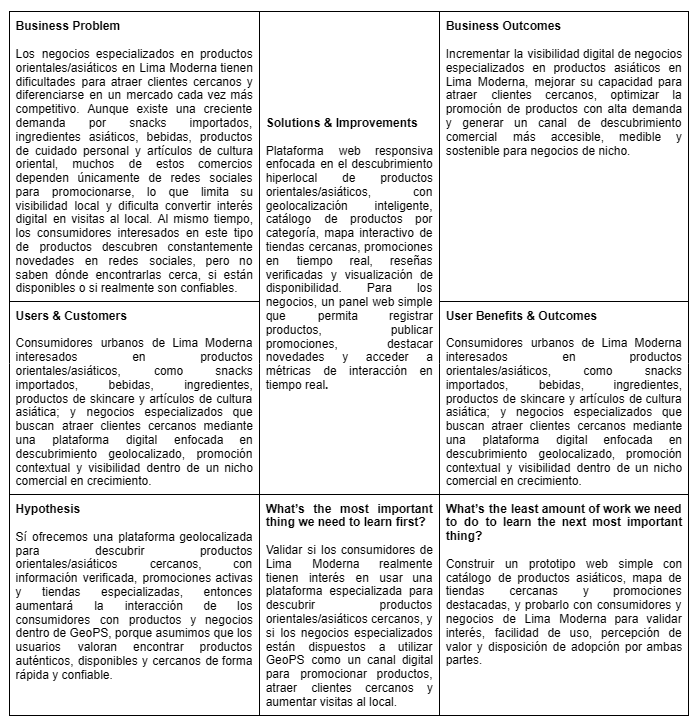
  </div>

  *Nota.* Elaboración propia.

### 1.3. Segmentos objetivos

**Segmento Objetivo #1: Negocios especializados en productos orientales/asiáticos**

**Aspectos Demográficos**  
- Sexo: Todos los géneros.  
- Edad: 24 años a más.  
- Nivel Socioeconómico: Medio (propietarios o administradores de pequeños y medianos negocios).
- Ocupación: Dueños, administradores o encargados de negocios especializados.   

**Aspectos Geográficos**  
- Nacionalidad: Peruana.  
- Zona Geográfica: Lima Moderna.
- Distritos objetivo: Jesús María, Lince, Magdalena del Mar, Pueblo Libre, Surquillo y San Miguel.

**Aspectos Psicográficos**  
- Dolor Principal: Tienen productos con alta demanda e interés creciente, pero carecen de visibilidad hiperlocal y herramientas accesibles para conectar con consumidores cercanos en el momento exacto de compra.

- Objetividad: Aumentar su visibilidad, atraer clientes cercanos y convertir interés digital en visitas al local mediante promociones segmentadas y descubrimiento geolocalizado.

- Nuestra Solución: GeoPS les ofrece una plataforma web donde pueden promocionar productos asiáticos, publicar ofertas en tiempo real, aparecer en búsquedas geolocalizadas y conectar con consumidores cercanos interesados en este tipo de productos.

**Segmento Objetivo #2: Consumidores urbanos interesados en productos orientales/asiáticos**

**Aspectos Demográficos**  
- Sexo: Todos los géneros.  
- Edad: 18 a 45 años.  
- Nivel Socioeconómico: Medio y medio–alto (jóvenes profesionales, estudiantes, familias).  
- Ocupación: Estudiantes, jóvenes profesionales y consumidores digitales.

**Aspectos Geográficos**  
- Nacionalidad: Peruana.  
- Zona Geográfica: Lima Moderna.
- Distritos objetivo: Jesús María, Lince, Magdalena del Mar, Pueblo Libre, Surquillo y San Miguel.

**Aspectos Psicográficos**  
- Dolor Principal: Descubren productos orientales en redes sociales o por recomendación, pero no saben dónde encontrarlos cerca, si están disponibles o si realmente valen la pena.

- Objetividad: Descubrir productos asiáticos auténticos, tiendas cercanas y promociones relevantes de manera rápida, confiable y centralizada.

- Nuestra Solución: GeoPS les permite descubrir productos orientales cercanos, explorar tiendas especializadas, recibir promociones relevantes y encontrar productos auténticos en tiempo real desde una sola plataforma.

---


## Capitulo 2: Requirements Elicitation & Analysis
### 2.1. Competidores
  #### 2.1.1. Analisis competitivo

  **Tabla 1**   
  *Análisis competitivo — GeoPS vs Competidores*

  | Competitive Analysis Landscape | Startup <p align="center"></p>  GeoPs | Competidor 1 <p align="center"></p> Groupon | Competidor 2 <p align="center"></p> Tiendeo | Competidor 3 <p align="center"></p> RetailMeNot |
  |--------------------------------|------------------|----------------------|----------------------|--------------------------|
  | Overview                                               | Plataforma de publicidad hiperlocalizada que utiliza la geolocalización del navegador y notificaciones push para conectar negocios con usuarios cercanos. | Plataforma web de descuentos en productos, servicios y experiencias, con ofertas por tiempo limitado. Su fuerte está en la compra de cupones antes de ir al negocio. | Plataforma web y móvil que agrega folletos y ofertas digitales de tiendas físicas. Facilita la consulta de promociones para planificar compras en un área específica. | Plataforma web de cupones y ofertas online. Ofrece códigos de descuento para compras en línea y cupones imprimibles o para mostrar en tiendas físicas. |
  | Ventaja competitiva ¿Qué valor ofrece a los clientes?  | Publicidad relevante sin descarga. Ofrecemos ofertas contextuales y en tiempo real a los clientes, y un canal de marketing efectivo y asequible a los negocios locales. | Descuentos atractivos. Facilitan el descubrimiento de nuevas experiencias a menor costo para los clientes y garantizan un alto volumen de ventas para los negocios. | Planificación de compras. Ayudan a los clientes a comparar precios y planificar sus compras con folletos digitales, mientras digitalizan las campañas de folletos de los negocios. | Ahorro versátil. Proporcionan a los clientes acceso a una amplia variedad de cupones para compras online y físicas, y a los negocios un canal para distribuir descuentos a una gran base de usuarios. |
  | Mercado objetivo                                       | Usuarios que buscan ofertas personalizadas y negocios que buscan publicitarse. | Usuarios que buscan descuentos en una amplia gama de categorías. | Consumidores que planifican sus compras en tiendas físicas y buscan las mejores ofertas en su área. | Consumidores que buscan descuentos al comprar en tiendas físicas y en línea. |
  | Estrategias de marketing                               | Marketing digital y publicidad en redes sociales dirigida a PyMEs y usuarios interesados en ofertas locales y tecnología de geolocalización. | Ofertas diarias y por tiempo limitado, marketing por correo electrónico, publicidad en redes sociales y promociones especiales. | Agregación de folletos digitales de diversas tiendas, notificaciones de nuevas ofertas y tiendas cercanas, publicidad online. | Promoción de cupones y ofertas a través del sitio web y publicidad digital. |
  | Productos & Servicios                                  | Publicidad contextual por ubicación, notificaciones de ofertas cercanas y gestión de campañas con analíticas. | Cupones digitales para productos, servicios y experiencias; ofertas limitadas; marketplace. | Folletos digitales de tiendas locales, buscador de ofertas por ubicación/categoría y alertas de promociones. | Cupones y códigos online/en tienda y extensión de navegador para descuentos automáticos. |
  | Precios & Costos                                       | Modelo gratuito para usuarios consumidores. De pago para negocios. | Modelo gratuito para usuarios (pagan solo los cupones). De pago para negocios. | Modelo gratuito, con anuncios. De pago para negocios. | Modelo Gratuito. De pago para negocios. |
  | Canales de distribución (Web y/o Móvil)                | Página web. | Página web, aplicación móvil y correo electrónico. | Página web y aplicación móvil. | Página web y aplicación móvil. |
  | Fortalezas                                             | Sin fricción de descarga. Acceso instantáneo por web. Publicidad en tiempo real. Impacta a clientes por proximidad.Herramientas para PyMEs. Dashboard analítico. | Sin fricción de descarga. Acceso instantáneo por web. Publicidad en tiempo real. Impacta a clientes por proximidad. Herramientas para PyMEs. Dashboard analítico. | Formato familiar. Los folletos digitales son fáciles de usar. Centralización. Reúne ofertas de múltiples tiendas. Credibilidad. Relaciones con grandes minoristas. | Variedad de descuentos. Amplia base de datos de cupones. Cobertura online/offline. Cubre diferentes hábitos de compra. Extensión de navegador. Automatiza el ahorro en línea. |
  | Debilidades                                            | Depende del navegador. Requiere permisos de ubicación. Privacidad. La recolección de datos es un tema sensible. | Modelo agresivo. Puede devaluar la marca de los negocios. Sin tiempo real. Las ofertas son limitadas y no contextuales. | Poca personalización. Depende de lo que los minoristas publican. Actualización manual. El contenido no es dinámico ni en tiempo real. | Sin hiper localización. No ofrece la experiencia de proximidad. Calidad de cupones. Algunos códigos pueden no funcionar. |
  | Oportunidades                                          | Crecimiento del comercio local. Aumento de la preferencia por negocios de barrio. Expansión del marketing de proximidad. Los negocios buscan publicidad más dirigida. | Expansión de servicios. Podrían incluir nuevas categorías. Mayor integración. Posibilidad de ofrecer ofertas más personalizadas por ubicación. | Alertas personalizadas. Notificar a usuarios sobre ofertas de tiendas favoritas. Mayor interacción. Crear listas de compras desde los folletos. | Expansión geográfica. Oportunidad de entrar con fuerza en nuevos mercados. Integración con billeteras digitales. Facilitar el uso de los descuentos. |
  | Amenazas                                               | Competencia de apps nativas. Pueden ofrecer una integración más profunda. Monopolio de gigantes. Google Maps es una fuerte competencia indirecta. | Nuevas startups. El surgimiento de apps locales más ágiles. Fatiga del usuario. El modelo de cupones puede volverse predecible. | Competencia de Google Ads. Los minoristas pueden optar por publicidad más efectiva. Obsolescencia. Los usuarios jóvenes pueden considerar los folletos digitales obsoletos. | Competencia de tiendas. Los minoristas desarrollan sus propias apps de lealtad. Fatiga de cupones. Los usuarios se cansan de buscar descuentos y prefieren precios directos. |

  *Nota.* Elaboración propia.

  #### 2.1.2. Estrategias y tácticas frente a competidores 

  **1. Estrategias para Mitigar Debilidades Propias**
  Frente a la dependencia del navegador y la privacidad: La principal debilidad de GeoPS es la necesidad de que el usuario dé su permiso de ubicación. Para mitigar esta fricción, la plataforma debe ser transparente y construir confianza.

  **Táctica:** Ofrece la opción de explorar la plataforma sin compartir la ubicación de inmediato, permitiendo al usuario buscar ofertas manualmente por distritos o categorías antes de que se sientan cómodos compartiendo su ubicación.

  **2. Estrategias para Aprovechar Oportunidades**
  Frente al crecimiento del comercio local y el marketing de proximidad: Este es el momento ideal para que GeoPS se posicione como el líder del marketing de proximidad en el mercado peruano.

  **Táctica:** Organizar webinars y talleres gratuitos dirigidos a dueños de PyMEs para educarlos sobre el marketing de proximidad y cómo pueden usar la plataforma para crecer.

  **Táctica:** Crear un programa de referidos para que los negocios existentes reciban descuentos al invitar a otros a unirse a la plataforma, expandiendo la red de forma orgánica.

  **3. Estrategias para Afrontar Amenazas**
  Frente a la posible saturación y el surgimiento de nuevas apps: El riesgo de que el mercado se sature con ofertas irrelevantes es alto. GeoPS debe enfocarse en la calidad sobre la cantidad.

  **Táctica:** Establecer criterios estrictos para los negocios que deseen unirse a la plataforma. Priorizar la calidad de las ofertas y la reputación de los negocios para mantener la confianza de los usuarios.

  **Táctica:** Ofrecer herramientas de segmentación avanzadas para que los negocios publiquen ofertas ultra-específicas, evitando el "ruido" publicitario para el usuario final.

  Frente a la preferencia por las apps nativas: Aunque GeoPS es web, puede ofrecer una experiencia muy similar a una app.

  **Táctica:** Destacar las ventajas de no tener que descargar ni actualizar la aplicación. Usar mensajes como "Accede a ofertas al instante, sin descargas, sin ocupar memoria". Esto posiciona la plataforma como una solución ágil y moderna.

### 2.2. Entrevistas
  #### 2.2.1. Diseño de entrevistas

  **Segmento #1: Dueños de negocios locales**

  **Características demográficas:**
  * ¿Cuál es tu edad?
  * ¿De qué rubro es tu negocio?
  * ¿Dónde se encuentra ubicado tu local principal?
  
  **Preguntas principales:**
  * ¿Cuál consideras que es el mayor reto para atraer nuevos clientes hoy en día?
  * ¿Qué estrategias de promoción has usado antes? ¿Cuáles funcionaron y cuáles no?
  * ¿Qué tan efectivas son para ti las redes sociales como canal publicitario?
  * ¿Qué temores o barreras tienes al invertir en nuevas formas de publicidad?
  * ¿Cómo mides actualmente si tu publicidad está funcionando?
  * ¿Qué papel juegan las ofertas y descuentos en tu estrategia de ventas?
  
  **Preguntas sobre el proyecto:**
  * Si existiera una plataforma que conecte tu negocio con clientes cercanos, ¿qué funcionalidades te gustaría que tuviera?
  * ¿Qué tipo de clientes te interesa atraer más (nuevos, frecuentes, turistas, vecinos)?
  * ¿Qué tan dispuesto estarías a pagar por una herramienta digital que realmente te acerque a clientes locales?
  * Si pudieras diseñar la aplicación perfecta para promocionar tu negocio, ¿qué funciones no podrían faltar?

  **Segmento #2: Consumidores de ofertas de diferentes ámbitos**

  **Características demográficas:**
  * ¿Cuál es tu edad?
  * ¿En qué distrito/ciudad vives?
  * ¿Con qué frecuencia sueles buscar o aprovechar ofertas?
  * ¿Qué tan familiarizado estás con el uso de plataformas digitales?
  
  **Preguntas principales:** 
  * Cuéntame de la última vez que buscaste ofertas locales. ¿Cómo fue la experiencia?
  * ¿Qué aspectos te resultan más molestos o poco prácticos en la forma en que te enteras de promociones hoy?
  * ¿Qué tipo de publicidad sueles ignorar o rechazar? ¿Por qué?
  * ¿Qué tan importante es para ti la facilidad y rapidez al encontrar una oferta?
  * ¿Usas herramientas como Google Maps o redes sociales para decidir si visitar un local? ¿Por qué sí o por qué no?
  * ¿Qué factores te hacen confiar o desconfiar de una promoción?
  
  **Preguntas sobre el proyecto:**
  * ¿Qué te gustaría que fuera diferente en la forma de recibir promociones cerca de ti?
  * ¿Qué preocupaciones tendrías al compartir tu ubicación o datos personales en una app de este tipo? ¿Qué te daría seguridad?
  * ¿Cómo sería para ti la experiencia ideal al descubrir ofertas en tu zona?

  #### 2.2.2. Registro de entrevistas

  **Segmento #1: Dueños de negocios locales**

  **Tabla 2**   
  *Registro de entrevistas — Segmento 1*

  | Número de registro | Datos del entrevistado | Captura |
  |--------------------|-------------------------|---------|
  | **1** | **Nombre:** Mirta <br> **Edad:** 57 años <br> **Distrito:** Jesús María <br> **Duración de la entrevista:** 5 minutos y 54 segundos <br> **Enlace:** https://youtu.be/fC130lduBCM <br> **Resumen:** En esta entrevista, Mirta, una comerciante de 57 años, dueña de una piñatería, habla sobre los desafíos de su negocio, especialmente la promoción y la competencia. Menciona que utiliza redes sociales como Instagram y Facebook, pero que la clave para ella es el trato personalizado al cliente y las recomendaciones de boca en boca. Prefiere usar WhatsApp para comunicarse con sus clientes y valora la interacción directa. También expresa su interés en una herramienta digital que la conecte con clientes locales. | **Figura 3**<br>*Entrevista 1 — Segmento 1* <div align="center">  </div> *Nota.* Elaboración propia. |
  | **2** | **Nombre:** Kelly <br> **Edad:** 21 años <br> **Distrito:** Jesús María <br> **Duración de la entrevista:** 3 minutos y 8 segundos <br> **Enlace:** https://youtu.be/k7YhV_pqApc <br> **Resumen:** En esta entrevista, Kelly, la dueña de una tienda de mascotas, de 21 años, comparte sus ideas sobre el marketing digital. Destaca que el mayor desafío es el uso de las redes sociales para atraer clientes, y que las ofertas como "compra uno y lleva uno gratis" han sido muy efectivas. También menciona que se están enfocando en TikTok para transmisiones en vivo, lo cual ha aumentado sus ventas y seguidores. Explica que miden el éxito de su publicidad directamente a través de las ventas y que buscan clientes recurrentes. Finalmente, describe una aplicación ideal que le gustaría para su negocio, con funciones para ver productos, ofertas y realizar compras desde casa. | **Figura 4**<br> *Entrevista 2 — Segmento 1* <div align="center">  </div> *Nota.* Elaboración propia. |
  | **3** | **Nombre:** Cesar <br> **Edad:** 50 años <br> **Distrito:** Miraflores <br> **Duración de la entrevista:** 3 minutos y 34 segundos <br> **Enlace:** https://youtu.be/VHkTCRW2Igc <br> **Resumen:** En este video, se entrevista al dueño de un negocio de comida. Habla sobre la efectividad del "boca a boca" y el uso de WhatsApp para las ventas. Mide el éxito de su promoción directamente a través de las ventas generadas por WhatsApp. Expresa interés en una plataforma digital para negocios locales que le permita mostrar sus platos con fotos y videos, y que le ayude a atraer clientes, especialmente turistas, ya que considera que tienen mayor poder adquisitivo. Además, está dispuesto a pagar por una aplicación si esta le garantiza la captación de clientes locales de manera efectiva. | **Figura 5**<br> *Entrevista 3 — Segmento 1* <div align="center">  </div> *Nota.* Elaboración propia. |

  *Nota.* Elaboración propia.

  **Segmento #2: Consumidores de ofertas de diferentes ámbitos**

  **Tabla 3**   
  *Registro de entrevistas — Segmento 2*  

  | Número de registro | Datos del entrevistado | Captura |
  |--------------------|-------------------------|---------|
  | **1** | **Nombre:** Ariana Puscan <br> **Edad:** 28 años <br> **Distrito:** Magdalena <br> **Ocupación:** Abogada <br> **Duración de la entrevista:** 5 minutos y 49 segundos <br> **Enlace:** https://l1nq.com/8gjygzw <br> **Resumen:** En este video, se entrevista a Ariana Puscan, una joven de 28 años del distrito de Magdalena. Es una consumidora recurrente de snacks asiáticos, adquiriéndolos mensualmente. Su descubrimiento de productos se basa principalmente en recomendaciones y ofertas vistas en Instagram y TikTok. Sus compras son mayoritariamente impulsivas o casuales cuando encuentra artículos en supermercados, sin apoyarse en aplicaciones específicas. Recientemente, visitó un establecimiento tras verlo en redes sociales, teniendo una experiencia satisfactoria. Finalmente, considera que nuestra aplicación sería de gran valor. La percibe como una herramienta clave para localizar puntos de venta exactos y facilitar el acceso a una mayor variedad de productos asiáticos.| **Figura 6**<br> *Entrevista 1 — Segmento 2* <div align="center">  </div> *Nota.* Elaboración propia. |
  | **2** | **Nombre:** Olga Consuelo Arce Quesada <br> **Edad:** 25 años <br> **Distrito:** Magdalena <br> **Ocupación:** Comunicadora Corporativa <br> **Duración de la entrevista:** 7 minutos y 16 segundos <br> **Enlace:** https://l1nq.com/ck0dyrh <br> **Resumen:** En este video, Olga Consuelo Arce Quesada, de 25 años, de Magdalena. Es una consumidora frecuente de snacks, bebidas y productos de belleza. Si bien descubre tiendas asiáticas mediante redes sociales o de forma presencial, señala una brecha en la información: las ofertas no están digitalizadas y solo las descubre al visitar el punto de venta. Su experiencia revela una dificultad específica al buscar productos de belleza, ya que no suelen estar disponibles en cadenas comerciales como Miniso. Actualmente, su búsqueda depende exclusivamente de la suerte al encontrar recomendaciones en TikTok, lo que dificulta la compra efectiva. Olga valida positivamente la propuesta de nuestra aplicación. Destaca la importancia de una plataforma integral que geolocalice tiendas cercanas, ofrezca visibilidad de ofertas en tiempo real y permita filtrar los establecimientos por categorías para optimizar su experiencia de compra. | **Figura 7**<br> *Entrevista 2 — Segmento 2* <div align="center">  </div> *Nota.* Elaboración propia. |

  *Nota.* Elaboración propia.

  #### 2.2.3. Análisis de entrevistas

  **Segmento #1: Dueños de negocios locales**

  A partir de las entrevistas a tres dueños de negocios, de edades y rubros variados, podemos extraer las siguientes conclusiones:

  **a) La tecnología es una herramienta de apoyo, no un reemplazo de las estrategias tradicionales.** El 100% de los entrevistados (Mirta, Kelly y Cesar) enfatiza la importancia del contacto personal y el "boca a boca". Aunque todos usan plataformas digitales (WhatsApp, Facebook, Instagram, TikTok), lo hacen para complementar sus métodos tradicionales, como el trato personalizado o la venta directa. Esto demuestra que valoran la conexión humana tanto o más que las herramientas digitales.

  **b) Existe una clara y urgente necesidad de una plataforma digital centralizada y adaptada a negocios locales.** El 100% de los entrevistados expresa su interés en una herramienta digital que resuelva problemas específicos. Mirta busca una que la conecte con clientes locales, Kelly describe una app ideal para mostrar productos y gestionar ventas, y Cesar menciona que pagaría por una solución que le garantice la captación de clientes de su zona. Esto evidencia que los dueños de negocios están buscando una solución que vaya más allá de las redes sociales genéricas, y que les ofrezca funcionalidades específicas para su tipo de negocio.

  **c) El éxito del marketing digital se mide directamente en ventas, no en interacciones superficiales.** El 100% de los entrevistados evalúa la efectividad de sus esfuerzos de promoción en función de los resultados tangibles. Kelly y Cesar mencionan explícitamente que miden su éxito a través de las ventas generadas por WhatsApp, y Mirta se enfoca en que sus acciones de marketing se traduzcan en nuevas recomendaciones. Esto indica que para este segmento, el objetivo principal de cualquier herramienta digital es el crecimiento de los ingresos.

  **Segmento #2: Consumidores de ofertas de diferentes ámbitos**

  A partir de de las entrevistas a tres jóvenes consumidores de ofertas, podemos extraer las siguientes conclusiones:

  **a) Existe una desconfianza generalizada hacia la publicidad intrusiva y las ofertas poco realistas.** Un 100% de los entrevistados (Andrés, Ángel y Elian) manifiesta su rechazo a las estrategias de marketing que no son de su interés. Andrés detesta la publicidad en la calle, Ángel desconfía de los descuentos "muy llamativos" que parecen estafas, y a Elian le molesta la publicidad de ofertas ya caducadas. Esto demuestra que este segmento prefiere la proactividad de buscar sus propias ofertas en plataformas que confían en vez de ser interrumpidos por información irrelevante o sospechosa.

  **b) La conveniencia, la relevancia y la personalización son elementos clave para la adopción de plataformas de ofertas.** El 100% de los entrevistados valora la facilidad de uso y la personalización. Andrés sugiere que las promociones se adapten a sus intereses, mientras que Elian desearía ofertas personalizadas basadas en su historial de compras, similar a TikTok. Ángel, por su parte, busca recibir notificaciones de ofertas que le interesen sin tener que buscar manualmente. Para este segmento, una experiencia ideal no implica buscar constantemente, sino que las ofertas adecuadas "lleguen a ellos" de manera organizada y relevante.

  **c) La seguridad y la transparencia son esenciales para generar confianza.** Dos de los tres entrevistados (Andrés y Ángel) mencionan la importancia de la confianza. Andrés afirma que la reputación de la empresa es crucial y sugiere que las aplicaciones deberían solicitar datos a los creadores para generar seguridad. Ángel se sentiría seguro compartiendo sus datos si la empresa es profesional y cifra la información. Por otro lado, Elian, que no tiene preocupaciones sobre compartir datos en aplicaciones de entrega, muestra que la confianza se puede construir si la plataforma es conocida y tiene un historial de uso común, como un app de delivery. Esto demuestra que este segmento tiene un nivel de conciencia sobre la seguridad de sus datos y que la transparencia es fundamental para que se sientan cómodos usando una plataforma de ofertas.

### 2.3. Needfinding
  #### 2.3.1. User Personas
  
  **Segmento #1: Dueños de negocios locales**

  **Figura 9**<br>
  *User Persona — Segmento 1*

  <div align="center">
      
  </div>

  *Nota.* Elaboración propia (realizado en Uxpressia).

  **Segmento #2: Consumidores de ofertas de diferentes ámbitos**

  **Figura 10**<br>
  *User Persona — Segmento 2*

  <div align="center">
      
  </div>

  *Nota.* Elaboración propia (realizado en Uxpressia).

  #### 2.3.2  User Task Matrix

  **Segmento #1: Dueños de negocios locales**

  **Tabla 4**
  *User Task Matrix — Segmento 1*  

  | Task                                                                  | Frecuencia | Importancia |
  |-----------------------------------------------------------------------|------------|-------------|
  | Promocionar productos y servicios en redes sociales                   | Alto       | Alto        |
  | Responder a consultas de clientes por diversos canales                | Alto       | Alto        |
  | Crear y publicar ofertas especiales o promociones                     | Medio      | Alto        |
  | Actualizar el inventario de productos y sus precios                   | Medio      | Medio       |
  | Buscar nuevas ideas de marketing o tendencias digitales               | Bajo       | Medio       |
  | Registrar y dar seguimiento a nuevos clientes                         | Alto       | Alto        |
  | Analizar qué tipo de promoción genera más ventas                      | Bajo       | Medio       |
  | Interactuar con comentarios o mensajes de clientes en sus publicaciones | Medio      | Alto        |

  *Nota.* Elaboración propia.

  **Segmento #2: Consumidores de ofertas de diferentes ámbitos**

  **Tabla 5**   
  *User Task Matrix — Segmento 2*

  | Task                                                                 | Frecuencia | Importancia |
  |----------------------------------------------------------------------|------------|-------------|
  | Buscar activamente ofertas para productos o servicios específicos    | Alto       | Alto        |
  | Validar la credibilidad de una oferta (reputación, comentarios)       | Alto       | Alto        |
  | Comparar precios y promociones entre diferentes tiendas o apps        | Alto       | Alto        |
  | Leer reseñas y opiniones de otros usuarios                            | Medio      | Alto        |
  | Planificar gastos personales y asignar un presupuesto para ocio       | Alto       | Alto        |
  | Revisar notificaciones de ofertas que le interesan                    | Alto       | Alto        |
  | Compartir ofertas encontradas con amigos o familiares                 | Bajo       | Bajo        |
  | Guardar ofertas para usarlas en el futuro                             | Medio      | Medio       |

  *Nota.* Elaboración propia.
  
  #### 2.3.3. User Journey Mapping

  **Segmento #1: Dueños de negocios locales**

  **Figura 11**<br>
  *User Journey Mapping — Segmento 1*

  <div align="center">
      
  </div>

  *Nota.* Elaboración propia (realizado en Uxpressia).

  **Segmento #2: Consumidores de ofertas de diferentes ámbitos**

  **Figura 12**<br>
  *User Journey Mapping — Segmento 2*

  <div align="center">
      
  </div>

  *Nota.* Elaboración propia (realizado en Uxpressia).

  #### 2.3.4. Empathy Mapping

  **Segmento #1: Dueños de negocios locales**

  **Figura 13**<br>
  *Empathy Mapping — Segmento 1*

  <div align="center">
      
  </div>

  *Nota.* Elaboración propia (realizado en Uxpressia).

  **Segmento #2: Consumidores de ofertas de diferentes ámbitos**

  **Figura 14**<br>
  *Empathy Mapping — Segmento 2*

  <div align="center">
      
  </div>

  *Nota.* Elaboración propia (realizado en Uxpressia).


### 2.4. Ubiquitous Language   

* **Oferta:** Una promoción, descuento o paquete especial que un negocio publica con el objetivo de atraer a nuevos clientes o fidelizar a los existentes.

* **Dueño de Negocio:** La persona encargada de un negocio local que busca herramientas y estrategias para promocionar sus productos o servicios.

* **Consumidor:** Un usuario que busca activamente promociones y descuentos, con la meta de ahorrar dinero o encontrar productos de su interés.

* **Conversión:** El momento en que un consumidor completa una acción deseada, como canjear una oferta, realizar una compra o contactar a un negocio.

* **Credibilidad:** El nivel de confianza que una oferta o un negocio genera en el consumidor, influenciado por la reputación y la transparencia de la información.

* **Canje:** El proceso en el que un consumidor valida y utiliza una oferta para obtener el beneficio prometido por el negocio.

* **Fidelización:** Las estrategias que un negocio implementa para retener a sus clientes y fomentar que repitan sus compras a largo plazo.

## Capitulo 3: Requirements Specification 
### 3.1. User Stories

Las User Stories representan las necesidades y expectativas de los usuarios finales expresadas en un lenguaje sencillo y centrado en su valor.  
A través de ellas se traduce lo que los usuarios quieren lograr al usar el producto, asegurando que las funcionalidades desarrolladas estén alineadas con sus objetivos reales.

**Tabla 6**   
*Epics — Agrupación de requerimientos de alto nivel del producto GeoPS*  

| Epic                                               | ID   |
|----------------------------------------------------|------|
| Registro y Autenticación                           | EP01 |
| Descubrimiento y Gestión de Ofertas (Clientes)     | EP02 |
| Gestión de Campañas Publicitarias (Proveedores)    | EP03 |
| Planes y Suscripciones (Clientes y Proveedores)    | EP04 |
| Experiencia del Usuario y Contenido                | EP05 |

*Nota.* Elaboración propia.

**Tabla 7**   
*User Stories — Especificación de requerimientos funcionales de GeoPS*  

| Story ID | Título                                                      | Descripción                                                                                                                                                       | Criterios de aceptación                                                                                                                                                                                                                           | Relacionado con (Epic ID) |
|----------|--------------------------------------------------------------|-------------------------------------------------------------------------------------------------------------------------------------------------------------------|--------------------------------------------------------------------------------------------------------------------------------------------------------------------------------------------------------------------------------------------------|----------------------------|
| US01     | Registro de Usuario en la Plataforma Web                    | Como usuario, quiero poder registrarme en la plataforma web con mi correo electrónico y contraseña para poder acceder a las ofertas personalizadas.                | Escenario 01: Dado que estoy en la página de registro, Cuando ingreso un correo electrónico válido, una contraseña segura, confirmo la contraseña y hago clic en “Registrar”, Entonces el sistema crea la cuenta y muestra mensaje de éxito.       | EP01                       |
| US02     | Inicio de Sesión de Usuario en la Plataforma Web             | Como usuario, quiero poder iniciar sesión en la plataforma web con mi correo electrónico y contraseña para acceder a mis ofertas guardadas.                        | Escenario 01: Dado que estoy en la página de inicio de sesión, Cuando ingreso mis credenciales correctas y hago clic en “Iniciar sesión”, Entonces el sistema autentica y me redirige a “Mis ofertas guardadas”.                                   | EP01                       |
| US03     | Registro de Negocio en la Plataforma Web                     | Como dueño de negocio, quiero poder registrar mi negocio proporcionando información detallada para poder crear campañas publicitarias.                             | Escenario 01: Dado que estoy en la página de registro de negocio, Cuando ingreso un correo válido, contraseña y datos obligatorios, Entonces el sistema crea la cuenta del negocio y muestra un mensaje de éxito.                                   | EP01                       |
| US04     | Inicio de Sesión de Negocio en la Plataforma Web             | Como dueño de negocio, quiero poder iniciar sesión con mi correo electrónico y contraseña para acceder al panel de gestión de campañas.                           | Escenario 01: Dado que estoy en la página de inicio de sesión de negocios, Cuando ingreso mis credenciales correctas, Entonces el sistema autentica y me redirige al panel de gestión.                                                             | EP01                       |
| US05     | Recuperación de Contraseña en la Plataforma Web              | Como usuario o dueño de negocio, quiero poder recuperar mi contraseña para restablecer el acceso en caso de olvido.                                                | Escenario 01: Dado que estoy en la página de recuperación de contraseña, Cuando ingreso un correo válido y confirmo la acción, Entonces el sistema envía un enlace de restablecimiento y muestra un mensaje de confirmación.                        | EP01                       |
| US06     | Búsqueda de Ofertas por Ubicación en la Plataforma Web       | Como usuario, quiero poder buscar ofertas cercanas a mi ubicación para encontrar promociones convenientes y ahorrar tiempo.                                        | Escenario 01: Dado que permití el acceso a mi ubicación, Cuando realizo una búsqueda, Entonces el sistema muestra un listado de promociones ordenadas por cercanía.                                                                                 | EP02                       |
| US07     | Búsqueda de Ofertas por Categoría en la Plataforma Web       | Como usuario, quiero poder filtrar ofertas por categoría para encontrar fácilmente las promociones que me interesan.                                              | Escenario 01: Dado que estoy en la sección de búsqueda, Cuando selecciono una categoría, Entonces el sistema muestra solo las ofertas correspondientes.                                                                                            | EP02                       |
| US08     | Visualización de Detalles de Oferta en la Plataforma Web     | Como usuario, quiero poder visualizar los detalles de una oferta para conocer toda la información antes de aprovecharla.                                          | Escenario 01: Dado que estoy en el listado de ofertas, Cuando selecciono una oferta, Entonces el sistema muestra la información detallada (descripción, precio, vigencia, ubicación, condiciones de uso).                                            | EP02                       |
| US09     | Visualización de Ofertas en Mapa en la Plataforma Web        | Como usuario, quiero visualizar las ofertas en un mapa para ubicar rápidamente negocios cercanos.                                                                  | Escenario 01: Dado que estoy en la sección de ofertas, Cuando selecciono “Ver en mapa”, Entonces el sistema muestra un mapa interactivo con ubicación de negocios y ofertas.                                                                        | EP02                       |
| US10     | Guardar Ofertas en la Plataforma Web                         | Como usuario, quiero poder guardar ofertas para revisarlas más tarde y no perder promociones de interés.                                                           | Escenario 01: Dado que estoy viendo una oferta, Cuando hago clic en “Guardar oferta”, Entonces el sistema la almacena en mi perfil y me permite acceder desde “Mis ofertas guardadas”.                                                              | EP02                       |
| US11     | Creación de Campaña Publicitaria en la Plataforma Web        | Como dueño de negocio, quiero crear campañas publicitarias para promocionar mis productos o servicios.                                                             | Escenario 01: Dado que estoy en el panel de gestión, Cuando completo los campos obligatorios, Entonces el sistema guarda la campaña y la muestra en la lista de campañas activas.                                                                   | EP03                       |
| US12     | Edición de Campaña Publicitaria en la Plataforma Web         | Como dueño de negocio, quiero editar campañas publicitarias existentes para actualizar información y mejorar efectividad.                                          | Escenario 01: Dado que estoy en el panel de gestión, Cuando selecciono una campaña activa y modifico sus datos, Entonces el sistema guarda cambios y actualiza la información visible.                                                               | EP03                       |
| US13     | Eliminación de Campaña Publicitaria en la Plataforma Web     | Como dueño de negocio, quiero eliminar campañas publicitarias para retirar promociones que ya no deseo mantener.                                                   | Escenario 01: Dado que estoy en el panel de gestión, Cuando selecciono una campaña activa y confirmo “Eliminar”, Entonces el sistema elimina la campaña y desaparece de la lista de activas.                                                         | EP03                       |
| US14     | Visualización de Campañas Activas en la Plataforma Web       | Como dueño de negocio, quiero visualizar todas mis campañas activas para dar seguimiento.                                                                          | Escenario 01: Dado que estoy en el panel de gestión, Cuando accedo a “Campañas Activas”, Entonces el sistema muestra un listado de todas las campañas vigentes.                                                                                      | EP03                       |
| US15     | Visualización de Métricas de Campañas en la Plataforma Web   | Como dueño de negocio, quiero visualizar métricas de mis campañas para evaluar desempeño y tomar decisiones.                                                       | Escenario 01: Dado que estoy en el panel de gestión, Cuando selecciono una campaña específica y accedo a métricas, Entonces el sistema muestra visualizaciones, clics, interacciones y duración.                                                      | EP03                       |
| US16     | Filtrado de Campañas por Estado en la Plataforma Web         | Como dueño de negocio, quiero filtrar mis campañas por estado para gestionarlas fácilmente.                                                                        | Escenario 01: Dado que estoy en la sección de gestión, Cuando selecciono un estado específico, Entonces el sistema muestra únicamente campañas de ese estado.                                                                                        | EP03                       |
| US17     | Notificaciones de Rendimiento de Campaña en la Plataforma Web| Como dueño de negocio, quiero recibir notificaciones sobre el rendimiento de mis campañas sin revisarlas constantemente.                                           | Escenario 01: Dado que tengo una campaña activa, Cuando ocurre un evento relevante (ej. campaña por finalizar), Entonces el sistema me muestra una notificación con resumen del evento.                                                              | EP03                       |
| US18     | Exportación de Reportes de Campañas en la Plataforma Web     | Como dueño de negocio, quiero exportar reportes de mis campañas para analizarlos externamente.                                                                     | Escenario 01: Dado que estoy en la sección de métricas, Cuando selecciono “Exportar reporte”, Entonces el sistema genera archivo en PDF o Excel con información de la campaña.                                                                       | EP03                       |
| US19     | Configuración de Presupuesto de Campaña en la Plataforma Web | Como dueño de negocio, quiero configurar presupuesto de campañas para controlar gastos y optimizar inversión.                                                      | Escenario 01: Dado que estoy creando o editando una campaña, Cuando ingreso presupuesto y confirmo, Entonces el sistema guarda el presupuesto y lo muestra en el panel.                                                                               | EP03                       |
| US20     | Pausar Campaña Publicitaria en la Plataforma Web             | Como dueño de negocio, quiero pausar campañas temporalmente sin eliminarlas.                                                                                      | Escenario 01: Dado que estoy en el panel de gestión, Cuando selecciono una campaña activa y hago clic en “Pausar”, Entonces el sistema cambia estado a “Pausada”.                                                                                    | EP03                       |
| US21     | Reactivar Campaña Publicitaria en la Plataforma Web          | Como dueño de negocio, quiero reactivar campañas pausadas para retomar su difusión.                                                                               | Escenario 01: Dado que estoy en el panel de gestión, Cuando selecciono una campaña pausada y hago clic en “Reactivar”, Entonces el sistema cambia estado a “Activa”.                                                                                  | EP03                       |
| US22     | Programar Fecha de Inicio de Campaña en la Plataforma Web    | Como dueño de negocio, quiero programar fecha de inicio para campañas.                                                                                             | Escenario 01: Dado que estoy creando campaña, Cuando selecciono fecha futura, Entonces el sistema guarda programación y activa automáticamente la campaña en esa fecha.                                                                              | EP03                       |
| US23     | Programar Fecha de Fin de Campaña en la Plataforma Web       | Como dueño de negocio, quiero programar fecha de fin para campañas.                                                                                                | Escenario 01: Dado que estoy creando o editando campaña, Cuando selecciono fecha de fin, Entonces el sistema cambia estado a “Finalizada” automáticamente al concluir el periodo.                                                                    | EP03                       |
| US24     | Segmentación de Campañas por Ubicación en la Plataforma Web  | Como dueño de negocio, quiero segmentar campañas por ubicación para dirigir anuncios a usuarios de un área objetivo.                                               | Escenario 01: Dado que estoy creando o editando campaña, Cuando defino una zona geográfica o radio, Entonces el sistema limita visualización de la campaña a usuarios dentro del área configurada.                                                    | EP03                       |
| US25     | Segmentación de Campañas por Demografía en la Plataforma Web | Como dueño de negocio, quiero segmentar campañas por demografía e intereses para dirigirlas al público más relevante.                                              | Escenario 01: Dado que estoy creando o editando campaña, Cuando selecciono filtros de segmentación (edad, género, intereses), Entonces el sistema configura campaña solo para usuarios que cumplen esos criterios.                                      | EP03                       |
| US26     | Duplicar Campaña Publicitaria en la Plataforma Web           | Como dueño de negocio, quiero duplicar campañas existentes para ahorrar tiempo en creación.                                                                        | Escenario 01: Dado que estoy en el panel de gestión, Cuando selecciono una campaña y hago clic en “Duplicar”, Entonces el sistema crea nueva campaña con mismos datos de la original.                                                                 | EP03                       |
| US27     | Previsualización de Campaña en la Plataforma Web             | Como dueño de negocio, quiero previsualizar campañas antes de publicarlas.                                                                                         | Escenario 01: Dado que estoy en proceso de creación o edición, Cuando hago clic en “Previsualizar”, Entonces el sistema muestra vista simulada de cómo se verá publicada la campaña.                                                                  | EP03                       |
| US28     | Historial de Campañas en la Plataforma Web                   | Como dueño de negocio, quiero visualizar historial de todas mis campañas para llevar registro de promociones realizadas.                                           | Escenario 01: Dado que estoy en el panel de gestión, Cuando accedo a “Historial de campañas”, Entonces el sistema muestra listado con todas las finalizadas y sus datos principales.                                                                  | EP03                       |
| US29     | Configuración de Idioma en la Plataforma Web                 | Como usuario, quiero seleccionar idioma de la plataforma para visualizar contenido en mi preferencia.                                                              | Escenario 01: Dado que estoy en la página principal, Cuando selecciono un idioma en el selector, Entonces el sistema cambia todo el contenido al idioma elegido.                                                                                      | EP05                       |
| US30     | Accesibilidad en la Plataforma Web                           | Como usuario, quiero que la plataforma cumpla criterios de accesibilidad (contraste, lectores de pantalla, navegación con teclado).                                | Escenario 01: Dado que navego en la plataforma, Cuando interactúo con elementos, Entonces el sistema permite usarlos de manera accesible.                                                                                                            | EP05                       |
| US31     | Registro de Puntos de Interés Habituales en la Plataforma Web| Como usuario, quiero registrar puntos de interés habituales para recibir promociones en esas zonas.                                                                | Escenario 01: Dado que estoy en mi perfil, Cuando agrego dirección o selecciono punto en mapa, Entonces el sistema guarda ese punto de interés y muestra promociones cercanas.                                                                        | EP04                       |
| US32     | Suscripción a Plan Premium (Proveedor)                       | Como proveedor, quiero suscribirme al plan Premium para acceder a estadísticas y herramientas avanzadas.                                                           | Escenario 01: Dado que estoy en la página de planes, Cuando selecciono “Hazte Premium” y completo pago, Entonces el sistema actualiza cuenta a Premium y habilita beneficios avanzados.                                                               | EP04                       |
| US33     | Suscripción a Plan Premium (Cliente)                         | Como cliente, quiero suscribirme al plan Premium para acceder a descuentos exclusivos y promociones especiales.                                                    | Escenario 01: Dado que estoy en página de planes, Cuando selecciono “Hazte Premium” y completo pago, Entonces el sistema actualiza mi cuenta a Premium y habilita beneficios exclusivos.                                                              | EP04                       |
| US34     | Gestión de Suscripción (Cliente/Proveedor)                   | Como usuario, quiero gestionar mi suscripción para cambiar de plan, renovar o cancelar.                                                                            | Escenario 01: Dado que estoy en Mi cuenta → Suscripción, Cuando selecciono una acción y confirmo, Entonces el sistema aplica cambios y muestra confirmación.                                                                                         | EP04                       |
| US35     | Encabezado con navegación                                    | Como visitante, quiero un encabezado con menú de navegación.                                                                                                       | Escenario 01: Dado que accedo a la landing, Cuando interactúo con el encabezado, Entonces puedo navegar entre secciones principales.                                                                                                                 | EP05                       |
| US36     | Información en el footer                                     | Como visitante, quiero ver información útil en el pie de página.                                                                                                   | Escenario 01: Dado que navego en la página principal, Cuando llego al pie de página, Entonces observo enlaces a contacto, términos y redes sociales.                                                                                                  | EP05                       |
| US37     | Visualización de Encabezado con Navegación en Landing Page   | Como visitante, quiero ver un encabezado con navegación a las secciones principales.                                                                               | Escenario 01: Dado que accedo a la landing page, Cuando visualizo la parte superior, Entonces el sistema muestra un encabezado con enlaces a secciones principales.                                                                                   | EP05                       |
| US38     | Visualización de Hero Section en la Landing Page             | Como visitante, quiero ver un mensaje principal con un call-to-action en la parte superior.                                                                        | Escenario 01: Dado que accedo a la landing, Cuando llego a la sección principal, Entonces visualizo mensaje destacado y un botón de acción (ej. “Únete ahora”).                                                                                      | EP05                       |
| US39     | Visualización de Sección de Promociones en Landing Page      | Como visitante, quiero ver una sección con promociones disponibles.                                                                                                | Escenario 01: Dado que navego en la landing, Cuando llego a “Ver Promociones”, Entonces el sistema muestra promociones representativas con información básica.                                                                                        | EP05                       |
| US40     | Visualización de Marcas y Tiendas en la Landing Page         | Como visitante, quiero ver logos e información de marcas asociadas para confiar en la plataforma.                                                                  | Escenario 01: Dado que navego en la landing, Cuando llego a “Marcas y Tiendas Asociadas”, Entonces el sistema muestra logos e información básica de negocios afiliados.                                                                              | EP05                       |
| US41     | Visualización de “Quiénes Somos” en Landing Page             | Como visitante, quiero ver sección “Quiénes Somos” para comprender misión de GeoPS.                                                                                | Escenario 01: Dado que navego en la landing, Cuando llego a “Quiénes Somos”, Entonces el sistema muestra información sobre misión de GeoPS de forma clara y atractiva.                                                                               | EP05                       |
| US42     | Consulta de Preguntas Frecuentes en Landing Page             | Como visitante, quiero acceder a sección de FAQ para resolver dudas sin contactar soporte.                                                                         | Escenario 01: Dado que navego en la landing, Cuando despliego una pregunta, Entonces el sistema muestra respuesta correspondiente de manera clara.                                                                                                    | EP05                       |
| US43     | Visualización de Footer con Información de Contacto          | Como visitante, quiero ver un pie de página con redes sociales y datos de contacto.                                                                                | Escenario 01: Dado que navego en la landing, Cuando llego al pie de página, Entonces el sistema muestra enlaces activos a redes sociales y datos de contacto.                                                                                        | EP05                       |
| US44     | Diseño Responsivo en la Landing Page                         | Como visitante, quiero que la landing se adapte automáticamente a mi dispositivo.                                                                                  | Escenario 01: Dado que accedo a la landing desde móvil o tablet, Cuando navego, Entonces el sistema muestra contenido ajustado correctamente al tamaño de pantalla.                                                                                   | EP05                       |
| US45     | Optimización y Pruebas Finales de la Landing Page            | Como visitante, quiero que la landing funcione en distintos navegadores y cargue rápido.                                                                           | Escenario 01: Dado que accedo a la landing desde diferentes navegadores y dispositivos, Cuando navego por las secciones, Entonces el sistema mantiene buen rendimiento, muestra todo correctamente y no presenta errores de compatibilidad.            | EP05                       |

*Nota.* Elaboración propia.

**Technical Stories**

Las Technical Stories detallan requerimientos técnicos derivados de las User Stories.  
Están orientadas al equipo de desarrollo y especifican aspectos relacionados con infraestructura, integraciones, seguridad o rendimiento, necesarios para que las funcionalidades puedan implementarse correctamente.

**Tabla 8**  
*Technical Stories — Requerimientos técnicos para la implementación del producto GeoPS*  

| Story ID | Título                               | Descripción                                                                 | Criterios de Aceptación                                                                                                                                                                  | Relacionado con (US ID) |
|----------|---------------------------------------|-----------------------------------------------------------------------------|------------------------------------------------------------------------------------------------------------------------------------------------------------------------------------------|--------------------------|
| TS01     | Endpoint: Registrar usuario          | Como Developer, deseo exponer `POST /auth/register` para crear cuentas de usuario con validación de email y password. | **Scenario: Registro exitoso**<br> Dado un payload válido,<br> Cuando envío POST `/auth/register`,<br> Entonces responde 201 con id y email.<br><br> **Scenario: Email en uso**<br> Dado un email ya registrado,<br> Cuando envío POST `/auth/register`,<br> Entonces responde 409 con error `email_taken`. | US01 |
| TS02     | Endpoint: Login de usuario           | Como Developer, deseo exponer `POST /auth/login` para autenticar usuarios y emitir un JWT. | **Scenario: Credenciales válidas**<br> Dado email y password correctos,<br> Cuando envío POST `/auth/login`,<br> Entonces responde 200 con `access_token`.<br><br> **Scenario: Credenciales inválidas**<br> Dado password incorrecto,<br> Cuando envío POST `/auth/login`,<br> Entonces responde 401 con error `invalid_credentials`. | US02 |
| TS03     | Endpoint: Recuperar contraseña       | Como Developer, deseo exponer `POST /auth/forgot-password` para enviar un link de reseteo vía email. | **Scenario: Solicitud válida**<br> Dado un email registrado,<br> Cuando envío POST `/auth/forgot-password`,<br> Entonces responde 202 con status=`email_sent`.<br><br> **Scenario: Email no registrado**<br> Dado email inexistente,<br> Cuando envío POST `/auth/forgot-password`,<br> Entonces responde 202 sin revelar existencia. | US05 |
| TS04     | Endpoint: Búsqueda de ofertas por ubicación | Como Developer, deseo exponer `GET /offers?lat={lat}&lng={lng}&radiusKm={r}` para listar ofertas cercanas. | **Scenario: Consulta válida**<br> Dado coordenadas correctas,<br> Cuando envío GET,<br> Entonces responde 200 con lista de ofertas.<br><br> **Scenario: Parámetros faltantes**<br> Dado falta lat/lng,<br> Cuando envío GET,<br> Entonces responde 400 con error `invalid_params`. | US06 |
| TS05     | Endpoint: Ofertas por categoría      | Como Developer, deseo exponer `GET /offers?category={slug}` para filtrar ofertas. | **Scenario: Categoría válida**<br> Dado category existente,<br> Cuando envío GET,<br> Entonces responde 200 con lista de ofertas.<br><br> **Scenario: Categoría inválida**<br> Dado category no existe,<br> Cuando envío GET,<br> Entonces responde 200 con lista vacía. | US07 |
| TS06     | Endpoint: Detalle de oferta          | Como Developer, deseo exponer `GET /offers/{id}` para obtener detalles completos. | **Scenario: Oferta encontrada**<br> Dado id válido,<br> Cuando envío GET,<br> Entonces responde 200 con detalle.<br><br> **Scenario: Oferta inexistente**<br> Dado id inválido,<br> Cuando envío GET,<br> Entonces responde 404 con error `not_found`. | US08 |
| TS07     | Endpoint: Guardar oferta (favoritos) | Como Developer, deseo exponer `POST /users/me/saved-offers` para guardar ofertas de usuario autenticado. | **Scenario: Guardado exitoso**<br> Dado token válido,<br> Cuando envío POST con offerId,<br> Entonces responde 201 con `saved=true`.<br><br> **Scenario: Sin autenticación**<br> Dado falta token,<br> Cuando envío POST,<br> Entonces responde 401 con error `unauthorized`. | US10 |
| TS08     | Endpoint: Crear campaña              | Como Developer, deseo exponer `POST /campaigns` para que un proveedor cree campañas publicitarias. | **Scenario: Creación válida**<br> Dado payload con título, fechas y presupuesto correctos,<br> Cuando envío POST,<br> Entonces responde 201 con estado `draft`.<br><br> **Scenario: Fechas inválidas**<br> Dado `endDate < startDate`,<br> Cuando envío POST,<br> Entonces responde 422 con error `invalid_dates`. | US11 |
| TS09     | Endpoint: Editar campaña             | Como Developer, deseo exponer `PUT /campaigns/{id}` para editar campañas existentes. | **Scenario: Actualización válida**<br> Dado proveedor dueño de campaña,<br> Cuando envío PUT,<br> Entonces responde 200 con `updated=true`.<br><br> **Scenario: Sin permisos**<br> Dado proveedor no dueño,<br> Cuando envío PUT,<br> Entonces responde 403 con error `forbidden`. | US12 |
| TS10     | Endpoint: Pausar/Reactivar campaña   | Como Developer, deseo exponer `PATCH /campaigns/{id}/pause` y `/resume` para controlar estado. | **Scenario: Pausa válida**<br> Dado campaña activa,<br> Cuando envío PATCH `/pause`,<br> Entonces responde 200 con status=`paused`.<br><br> **Scenario: Reactivación válida**<br> Dado campaña pausada,<br> Cuando envío PATCH `/resume`,<br> Entonces responde 200 con status=`active`. | US20 / US21 |

*Nota.* Elaboración propia.

### 3.2. Impact Mapping

El Impact Mapping es una técnica de planificación estratégica que conecta los objetivos del negocio con los entregables del producto. Ayuda a visualizar cómo las funcionalidades contribuyen a alcanzar los resultados esperados, identificando actores, impactos deseados y soluciones clave.

**Figura 14**<br>
*Impact Mapping — GeoPS*

<div align="center">
    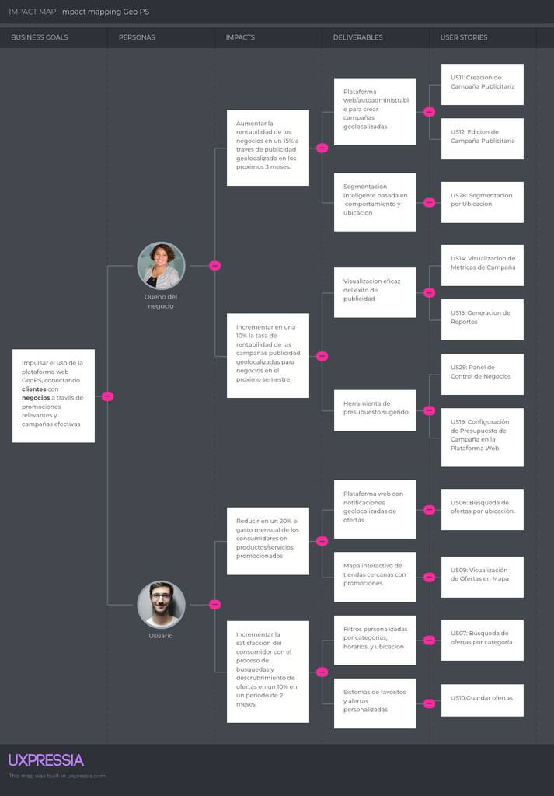
</div>

*Nota.* Elaboración propia (realizado en Uxpressia).

### 3.3. Product Backlog

El **Product Backlog** es una lista priorizada de funcionalidades, mejoras y requisitos técnicos que guiarán la evolución del producto.  
Su propósito es organizar el trabajo en función del valor que aporta al usuario y al negocio, sirviendo como una hoja de ruta flexible y adaptable durante el desarrollo.

**Enlace al Tablero:** https://trello.com/invite/b/6827b176ac2901fb01dfde7f/ATTI41e099b86c4d473204a21f0e3359cadd5F57D4C1/product-backlog-geops

**Vista del Product Backlog en Trello**

**Figura 15**<br>
*Product Backlog — GeoPS*

<div align="center">
    
</div>

*Nota.* Elaboración propia (realizado en Trello).

**Tabla 9**   
*Product Backlog — Priorización de funcionalidades del producto GeoPS*  

| # Orden | User Story ID | Título | Descripción | Story Points |
|---------|---------------|--------|-------------|--------------|
| 1  | US35 | Encabezado con navegación | Como visitante, deseo ver un encabezado con navegación para desplazarme fácilmente por la landing page. | 2 |
| 2  | US36 | Información en el footer | Como visitante, deseo visualizar un pie de página con enlaces a contacto y redes sociales para resolver dudas y confiar en la plataforma. | 2 |
| 3  | US37 | Visualización de Encabezado con Navegación en la Landing Page | Como visitante de la página web, quiero ver un encabezado con navegación a las secciones principales para poder desplazarme fácilmente por la landing page. | 2 |
| 4  | US38 | Visualización de Hero Section | Como visitante, deseo ver un mensaje principal con un botón de acción para comprender la propuesta de valor y registrarme. | 3 |
| 5  | US39 | Visualización de Sección de Promociones | Como visitante, deseo ver promociones destacadas en la página principal para identificar beneficios de usar la plataforma. | 3 |
| 6  | US40 | Visualización de Marcas y Tiendas Asociadas | Como visitante, deseo ver logos e información de negocios asociados para confiar en la plataforma. | 3 |
| 7  | US41 | Visualización de la Sección “Quiénes Somos” | Como visitante, deseo conocer la misión y visión de la empresa para confiar en la plataforma. | 3 |
| 8  | US42 | Consulta de Preguntas Frecuentes | Como visitante, deseo acceder a una sección de FAQ para resolver mis dudas sin necesidad de soporte. | 3 |
| 9  | US43 | Visualización de Footer con Contacto y Redes Sociales | Como visitante, deseo ver enlaces de contacto y redes sociales para comunicarme fácilmente. | 2 |
| 10 | US44 | Diseño Responsivo | Como visitante, deseo que la página se adapte a móviles y tablets para visualizar el contenido correctamente. | 5 |
| 11 | US45 | Optimización y Pruebas Finales | Como visitante, deseo que la página funcione en cualquier navegador y cargue rápido para tener una experiencia fluida. | 2 |
| 12 | US29 | Configuración de Idioma | Como usuario, deseo cambiar el idioma de la plataforma para usarla en mi preferencia. | 2 |
| 13 | US30 | Accesibilidad | Como usuario, deseo que la plataforma sea accesible para poder usarla sin limitaciones. | 3 |
| 14 | US31 | Registro de Puntos de Interés Habituales | Como usuario, deseo registrar puntos de interés habituales para recibir promociones de esas zonas. | 5 |
| 15 | US06 | Búsqueda de Ofertas por Ubicación | Como usuario, deseo buscar ofertas cercanas a mi ubicación para aprovechar promociones locales. | 5 |
| 16 | US07 | Búsqueda de Ofertas por Categoría | Como usuario, deseo filtrar ofertas por categoría para encontrar fácilmente las de mi interés. | 3 |
| 17 | US08 | Visualización de Detalles de Oferta | Como usuario, deseo ver la información detallada de una oferta para decidir si la aprovecho. | 2 |
| 18 | US09 | Visualización de Ofertas en Mapa | Como usuario, deseo ver ofertas en un mapa para ubicar negocios cercanos. | 5 |
| 19 | US10 | Guardar Ofertas | Como usuario, deseo guardar ofertas para revisarlas más tarde. | 3 |
| 20 | US32 | Suscripción a Plan Premium (Proveedor) | Como proveedor, deseo suscribirme al plan Premium para acceder a estadísticas y segmentación. | 5 |
| 21 | US33 | Suscripción a Plan Premium (Cliente) | Como cliente, deseo suscribirme al plan Premium para acceder a descuentos exclusivos. | 5 |
| 22 | US34 | Gestión de Suscripción | Como usuario, deseo gestionar mi suscripción (cambiar, renovar, cancelar) según mis necesidades. | 5 |
| 23 | US01 | Registro de Usuario | Como usuario, deseo registrarme en la plataforma con mi correo y contraseña para acceder a promociones personalizadas. | 5 |
| 24 | US02 | Inicio de Sesión de Usuario | Como usuario, deseo iniciar sesión en la plataforma con mis credenciales para acceder a mi cuenta. | 3 |
| 25 | US03 | Registro de Negocio | Como proveedor, deseo registrar mi negocio para poder crear campañas. | 5 |
| 26 | US04 | Inicio de Sesión de Negocio | Como proveedor, deseo iniciar sesión en la plataforma con mis credenciales para acceder a mi panel. | 3 |
| 27 | US05 | Recuperación de Contraseña | Como usuario/proveedor, deseo recuperar mi contraseña en caso de olvido para restablecer el acceso. | 3 |
| 28 | US11 | Creación de Campaña Publicitaria | Como proveedor, deseo crear campañas publicitarias para promocionar mis productos o servicios. | 8 |
| 29 | US12 | Edición de Campaña Publicitaria | Como proveedor, deseo editar campañas publicitarias para actualizar su información. | 5 |
| 30 | US13 | Eliminación de Campaña Publicitaria | Como proveedor, deseo eliminar campañas para retirar promociones que ya no deseo mantener. | 3 |
| 31 | US14 | Visualización de Campañas Activas | Como proveedor, deseo ver mis campañas activas para hacer seguimiento. | 3 |
| 32 | US15 | Visualización de Métricas de Campañas | Como proveedor, deseo ver métricas de mis campañas para evaluar su desempeño. | 5 |
| 33 | US16 | Filtrado de Campañas por Estado | Como proveedor, deseo filtrar campañas por estado para organizarlas mejor. | 3 |
| 34 | US17 | Notificaciones de Rendimiento de Campaña | Como proveedor, deseo recibir notificaciones sobre el rendimiento de mis campañas. | 3 |
| 35 | US18 | Exportación de Reportes de Campañas | Como proveedor, deseo exportar reportes en PDF/Excel para analizarlos externamente. | 5 |
| 36 | US19 | Configuración de Presupuesto | Como proveedor, deseo configurar el presupuesto de una campaña para controlar mis gastos. | 3 |
| 37 | US20 | Pausar Campaña Publicitaria | Como proveedor, deseo pausar campañas para detener temporalmente su difusión. | 2 |
| 38 | US21 | Reactivar Campaña Publicitaria | Como proveedor, deseo reactivar campañas pausadas para retomar su difusión. | 2 |
| 39 | US22 | Programar Fecha de Inicio de Campaña | Como proveedor, deseo programar la fecha de inicio de una campaña para automatizar su publicación. | 3 |
| 40 | US23 | Programar Fecha de Fin de Campaña | Como proveedor, deseo programar la fecha de fin de una campaña para que se cierre automáticamente. | 3 |
| 41 | US24 | Segmentación de Campañas por Ubicación | Como proveedor, deseo segmentar mis campañas por ubicación para llegar al público adecuado. | 5 |
| 42 | US25 | Segmentación de Campañas por Demografía e Intereses | Como proveedor, deseo segmentar mis campañas por demografía e intereses para dirigirlas mejor. | 5 |
| 43 | US26 | Duplicar Campaña Publicitaria | Como proveedor, deseo duplicar campañas para reutilizar configuraciones anteriores. | 3 |
| 44 | US27 | Previsualización de Campaña Publicitaria | Como proveedor, deseo previsualizar campañas antes de publicarlas. | 3 |
| 45 | US28 | Historial de Campañas Publicitarias | Como proveedor, deseo ver un historial de campañas anteriores para llevar registro. | 3 |

*Nota.* Elaboración propia.

---

## Capítulo 4: Product Design

### 4.1. Style Guidelines

  #### 4.1.1. General Style Guidelines

  **Branding**

  - El nombre completo de nuestro servicio es “Geo Publicity Service”.
  - Para el dominio web y la aplicación, así como para ser más memorable, se utilizará el nombre corto GeoPS.
  - El tagline es “Promociones cerca de ti”, reflejando el servicio principal de promocionar ofertas de diversas tiendas cerca de tu ubicación.
  - El logo tiene un diseño sencillo, lo que lo hace minimalista y fácil de recordar. Además, el uso del color morado demuestra creatividad e innovación.

  **Figura 16**<br>
  *Logo — GeoPS*

  <div align="center">
      
  </div>

  *Nota.* Elaboración propia.

  **Typography**

  Las tipografías seleccionadas son Poppins y Lobster. Lobster fué elegida principalmente para representar nuestro Logo GeoPS de una manera expresiva, atrayendo la atención de los usuarios a nuestra landing page. La tipografía Poppins se utiliza en los párrafos, títulos, subtítulos y botones de la página, transmitiendo claridad y profesionalismo, ofreciendo una buena legibilidad en la página web mediante su amplia variedad de pesos de letra.

  **Tamaños y peso de tipografía**

  Lobster: Peso 400, 60 px de tamaño para el logo.
  Poppins:

  - Títulos: Peso 600, 35 px de tamaño.
  - Párrafos y texto secundario: Peso 300, 20 px de tamaño.
  - Texto terciario: Peso 400, 16 px de tamaño.
  - Pié de imagen y video: Peso 300, 16 px de tamaño.
  - Texto dentro de imágenes: Peso 600, 24 px de tamaño.
  - Texto de botones CTA: Peso 600, 25 px de tamaño.

  **Colors**

  Utilizaremos la siguiente paleta de colores:

  **Figura 17**<br>
  *Paleta de Colores — GeoPS*

  <div align="center">
      
  </div>

  *Nota.* Elaboración propia (realizado en Coolors).

  <br>

  |                                                                         |                                                                                                                                                                                                                                                     |
  | ----------------------------------------------------------------------- | --------------------------------------------------------------------------------------------------------------------------------------------------------------------------------------------------------------------------------------------------- |
  |  | El color amatista se utiliza principalmente en el menú vertical, el cual necesita resaltar. Este color representa la innovación y modernidad, atrayendo la atención de los usuarios sin tener que ser agresivo.                                     |
  |      | El color índigo es utilizado para secciones que desean llamar la atención mostrando información importante, todo en un espacio pequeño. El color muestra elegancia, formalidad y confianza al ser un color fuerte.                                  |
  |      | El color blanco es utilizado en el cuerpo de la página web. El color blanco muestra un área limpia, clara y donde hay espacio visual para mostrar las secciones de nuestra landing page.                                                            |
  |        | El color negro es utilizado en botones principales y el footer de nuestra página. El color negro demuestra profesionalismo y un contraste fuerte con los otros colores utilizados, especialmente el color blanco.                                   |
  |            | El color uva es utilizado en botones CTA de tamaño mediano y secciones con imágenes. Este color muestra energía, dinamismo y una personalidad fuerte, en comparación a otros botones principales. También ayuda a destacar el texto de los botones. |
  |  | El color verónica es utilizado en botones pequeños CTA. Este color muestra juventud y frescura al ser un poco más claro que los otros colores de tono parecido.                                                                                     |

  **Spacing**

  - El espacio en el diseño de GeoPS se enfocará en proporcionar una experiencia visual clara y accesible para el usuario, reflejando los principios de orden y claridad. Se utilizarán márgenes amplios para resaltar los elementos clave, como botones y áreas interactivas, permitiendo una navegación fluida y sin distracciones.
  - Al utilizar muchas imágenes, consideramos utilizar un espaciado horizontal entre las imágenes lo suficiente para mostrarlas con claridad visual y sin que interrumpa la navegación del usuario.
  - El espaciado será utilizado para diferenciar las zonas de información, especialmente en secciones interactivas con párrafos.

  **Tonos de Comunicación**

  El tono de comunicación de GeoPS será amigable, cercano y orientado al usuario. Buscamos establecer una conexión genuina mediante un lenguaje claro y accesible a todos, sin utilizar demasiados tecnicismos. Resaltaremos los beneficios y la facilidad de uso de nuestra aplicación web, sin abrumar al usuario con tanta información. Queremos que el usuario se sienta valorado y escuchado en cada interacción.

  #### 4.1.2. Web Style Guidelines

  En esta sección, se describe la guía de nuestra landing page con sus características en el estilo para mantener una coherencia visual.

  **Estructura general de la página**

  **Cabecera**:

  - Logotipo: El logotipo de nuestra startup está ubicado en la esquina superior izquierda. Cuando haces click, te redirigirá a la página principal.
  - Barra de búsqueda: La barra de búsqueda está ubicada en la parte superior derecha. Servirá para ubicar fácilmente y rápidamente secciones en la página.
  - Menú de navegación: El menú de navegación se ubica en la parte superior izquierda y en la esquina derecha. Es un conjunto de botones que permite la navegación en la página principal. Los botones designados son: 
  <br>

    1. Inicio
    2. Marcas
    3. Conoce más
    4. Inicia sesión

  **Cuerpo**:

  - Sección principal: La sección principal es la que va a atraer al usuario. Se muestran promociones conocidas y ofertas.
  - Beneficios: Muestra que nuestra página ofrece beneficios, ofertas y promociones en diversas tiendas.
  - Empresas que confían en nosotros: Muestra las marcas que tienen confianza en nosotros y están dispuestos a promocionar sus productos en nuestra página.
  - Quienes somos: Muestra información de la empresa y permite conocer más de nosotros mediante un botón.
  - Planes: Permite la muestra y promoción de los planes de compra de nuestra empresa para los usuarios de la página.
  - Promociones: Muestra diversas promociones de diferentes tipos en varias tiendas.
  - Invitación a los negocios: Sección de llamado a los usuarios que tienen negocios que desean participar en nuestro programa.
  - Dudas: Sección que muestra preguntas frecuentes de nuestra empresa y las responde de una manera corta y clara.
  - Conocenos mejor: Muestra los videos que hablan sobre nuestra marca de empresa para conectar con el usuario que ve los videos.

  **Pié de página**:

  - Copyright: Se incluye la información sobre los derechos de autor de la marca.
  - Enlaces de soporte: Se proporcionan links de soporte y ayuda, tales como “Nosotros”, “Servicios” y “Contacto”.
  - Redes sociales: Se incluyen los iconos de las redes sociales de nuestro emprendimiento para conectar con la audiencia en otras plataformas, las cuales son Instagram y LinkedIn.
  - Logotipo y eslogan: Se incluye el Logo con su eslogan que representa nuestra empresa. La frase designada es: “Promociones cerca de ti”

  **Diseño de la Landing Page**:

  **Figura 18**<br>
  *Landing Page — GeoPS*

  <div align="center">
      
      <br>
      
      <br>
      
  </div>

  *Nota.* Elaboración propia (realizado en Figma).

### 4.2. Information Architecture

  #### 4.2.1. Organization Systems

  Se aplicarán distintos sistemas de organización de contenido tanto visual como estructural, adaptados al flujo operativo de nuestros usuarios (consumidores y negocios locales). Esto permitirá ofrecer una experiencia clara, intuitiva y eficaz durante el uso de la plataforma.

  **Organización Visual del Contenido**

  **Jerárquica:**
  En las pantallas principales, como el Dashboard de usuario y el panel de negocios, los elementos más importantes (promociones destacadas, métricas de campaña) estarán resaltados con mayor tamaño, color contrastante y posición superior.

  **Secuencial:**
  Utilizado en procesos como la creación de campañas publicitarias o el registro de preferencias de usuario. Se presentarán pasos guiados (wizard) que aseguren que tanto consumidores como negocios completen los procesos de manera ordenada y sin omitir información clave.

  **Matricial:**
  Aplicada en la visualización de datos cruzados, como patrones de movilidad de consumidores versus resultados de campañas. Los negocios podrán ver las relaciones entre ubicación, horario y efectividad publicitaria.

  **Esquemas de Categorización del Contenido**

  **Por Tópicos:**
  Será el sistema predominante en los menús de navegación. Las funcionalidades estarán agrupadas en temas específicos:

  _Para consumidores:_

  - Promociones cercanas
  - Favoritos
  - Historial de ofertas
  - Ajustes de privacidad

  _Para negocios:_

  - Campañas
  - Segmentación
  - Métricas
  - Configuración

  **Cronológico:**
  Usado en los reportes de campañas publicitarias (para negocios) y en el historial de notificaciones recibidas (para consumidores). La información se mostrará ordenada por fecha y hora, permitiendo un seguimiento preciso.

  **Alfabético:**
  Utilizado en listados como directorios de comercios o categorías de productos, facilitando la búsqueda rápida por nombre.

  **Según audiencia:**
  La experiencia estará personalizada según el segmento objetivo:

  - **Consumidores de ofertas locales:** acceso a promociones activas, historial de notificaciones, filtros de búsqueda por categoría, proximidad o momento del día.

  - **Dueños de negocios locales:** acceso a herramientas de creación de campañas, segmentación por patrones de movilidad, visualización de métricas en dashboards interactivos y configuración de notificaciones.

  #### 4.2.2. Labeling Systems

  En GeoPS se ha implementado un sistema de etiquetado claro y funcional, adaptado al entorno de consumo y gestión de campañas locales. El objetivo es reducir la carga cognitiva y facilitar la interacción rápida con la plataforma.

  **Principios utilizados**

  **Simplicidad y claridad:**
  Se prioriza el uso de términos breves y familiares para cada segmento. Ejemplo para consumidores: "Ofertas cercanas", "Favoritos", "Historial". Ejemplo para negocios: "Campañas", "Segmentación", "Métricas".

  **Evitar ambigüedad:**
  Se evita la jerga técnica. Por ejemplo, se prefiere "Crear campaña" en lugar de "Configurar pauta publicitaria", o "Promoción activa" en lugar de "Anuncio en circulación".

  **Consistencia visual:**
  Todas las etiquetas siguen una presentación uniforme en botones, menús y formularios, asegurando que el usuario reconozca patrones de uso fácilmente.

  #### 4.2.3. SEO Tags and Meta Tags

  Las Meta Tags son esenciales para el posicionamiento de la plataforma en buscadores y para su correcta presentación en navegadores y redes sociales.

  **Meta Tags a utilizar en GeoPS**

  **Título:**

  ```html
  <title>
    GeoPS | Publicidad Hiperlocal y Contextual para Consumidores y Negocios
  </title>
  ```

  **Codificación de caracteres:**

  ```html
  <meta charset="UTF-8" />
  ```

  **Descripción:**

  ```html
  <meta
    name="description"
    content="GeoPS es una aplicación web que conecta negocios locales con consumidores mediante publicidad hiperlocal y contextual. Ofrece promociones relevantes en el momento y lugar adecuado, cuidando la privacidad y simplicidad de uso."
  />
  ```

  **Palabras clave:**

  ```html
  <meta
    name="keywords"
    content="publicidad local, promociones cercanas, geolocalización, campañas digitales, consumidores, negocios locales, ofertas hiperlocales, marketing contextual, GeoPS"
  />
  ```

  **Autor y Derechos de Autor:**

  ```html
  <meta name="author" content="GeoPS Team - UPC" />
  <meta name="copyright" content="GeoPS © 2025. Todos los derechos reservados." />
  ```

  **Viewport:**

  ```html
  <meta name="viewport" content="width=device-width, initial-scale=1.0" />
  ```

  #### 4.2.4. Searching Systems

  Los sistemas de búsqueda en GeoPS facilitan el acceso rápido a promociones o campañas según el segmento objetivo.

  **Opciones de búsqueda en la aplicación**

  **Barra de búsqueda global:**

  - Presente en el encabezado superior.
  - Permite búsquedas generales tanto para consumidores como para negocios.
  - Incluye icono de lupa y placeholder "Buscar promociones o campañas".

  **Filtros por módulo:**

  _Para consumidores:_

  - Categoría de producto/servicio
  - Distancia/proximidad
  - Horario de vigencia
  - Negocio emisor de la promoción

  _Para negocios:_

  - Campañas activas/inactivas
  - Segmentación (ubicación, rango horario, movilidad)
  - Tipo de promoción
  - Resultados por fecha

  **Visualización:**

  - Resultados organizados por relevancia o cercanía.
  - Paginación de 10 resultados por página.
  - Indicadores visuales de color para destacar promociones activas.
  - Acciones rápidas (Guardar, Editar, Compartir).

  #### 4.2.5. Navigation Systems

  Los sistemas de navegación guiarán a los usuarios a través de la Landing Page y la aplicación web, adaptados a cada segmento objetivo.

  **Navegación de la Landing Page**

  **Menú principal:**
  Logo GeoPS, Productos, Negocios, Nosotros, Planes, Registrarse, Iniciar Sesión.

  **Secciones principales:**

  - **Hero section:** "Publicidad hiperlocal y contextual al alcance de todos" con botón "Comenzar ahora".
  - **Características:** Tarjetas con los beneficios para consumidores y negocios.
  - **Nosotros:** Información sobre la startup, misión y visión.
  - **Planes:** Opciones diferenciadas para consumidores (gratis) y negocios (básico, premium).
  - **Contacto:** Formulario para consultas o soporte.

  **Navegación de la aplicación web**

  **Estructura general:**

  - **Menú superior:** Logo, búsqueda, notificaciones, perfil.
  - **Dashboard principal:**
    - Para consumidores: Promociones cercanas y destacadas.
    - Para negocios: Resumen de campañas y métricas.

  **Menú lateral por perfil:**

  - **Consumidores:** Promociones, Favoritos, Historial, Ajustes.
  - **Negocios:** Campañas, Segmentación, Métricas, Configuración.

  **Elementos auxiliares:**

  - Botones de acción rápida (guardar, crear, compartir).
  - Notificaciones en tiempo real.
  - Enlaces entre módulos relacionados.

### 4.3. Landing Page UI Design

  #### 4.3.1. Landing Page Wireframe

  **Enlace Diseño Figma:** https://www.figma.com/design/mHHx8WStPBr63tLYj42pBX/GeoPs?node-id=336-2468&t=1Nm0EVmUTgy7sfDx-1

  **Figura 19**<br>
  *Wireframe — Landing Page GeoPS*

  <div align="center">
      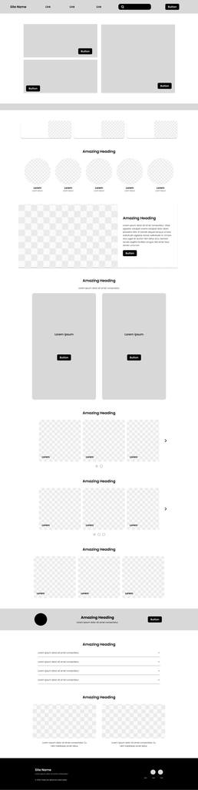
  </div>

  *Nota.* Elaboración propia (realizado en Figma).

  #### 4.3.2. Landing Page Mock-up

  **Enlace Diseño Figma:** https://www.figma.com/design/mHHx8WStPBr63tLYj42pBX/GeoPs?node-id=336-2468&t=1Nm0EVmUTgy7sfDx-1

  **Figura 20**<br>
  *Mock-up — Landing Page GeoPS*

  <div align="center">
      
  </div>

  *Nota.* Elaboración propia (realizado en Figma).

### 4.4. Web Applications UX/UI Design

  #### 4.4.1. Web Applications Wireframes

  **Enlace Diseño Figma:** https://www.figma.com/design/mHHx8WStPBr63tLYj42pBX/GeoPs?node-id=336-2468&t=1Nm0EVmUTgy7sfDx-1

  **Login**

  **Inicio de sesión y registro**

  **Figura 21**<br>
  *Wireframe — Inicio de Sesión y Registro*

  <div align="center">
      
  </div>

  *Nota.* Elaboración propia (realizado en Figma).

  **Consumidores**

  **Home**

  **Figura 22**<br>
  *Wireframe — Home Consumidor*

  <div align="center">
      
  </div>

  *Nota.* Elaboración propia (realizado en Figma).
  <br>
  
  **Ofertas**

  **Figura 23**<br>
  *Wireframe — Ofertas Consumidor*

  <div align="center">
      
  </div>

  *Nota.* Elaboración propia (realizado en Figma).
  <br>
  
  **Categorías**

  **Figura 24**<br>
  *Wireframe — Categorías Consumidor*

  <div align="center">
      
  </div>

  *Nota.* Elaboración propia (realizado en Figma).
  <br>

  **Favoritos**

  **Figura 25**<br>
  *Wireframe — Favoritos Consumidor*

  <div align="center">
      
  </div>

  *Nota.* Elaboración propia (realizado en Figma).
  <br>

  **Mis Cupones**

  **Figura 26**<br>
  *Wireframe — Mis Cupones Consumidor*

  <div align="center">
      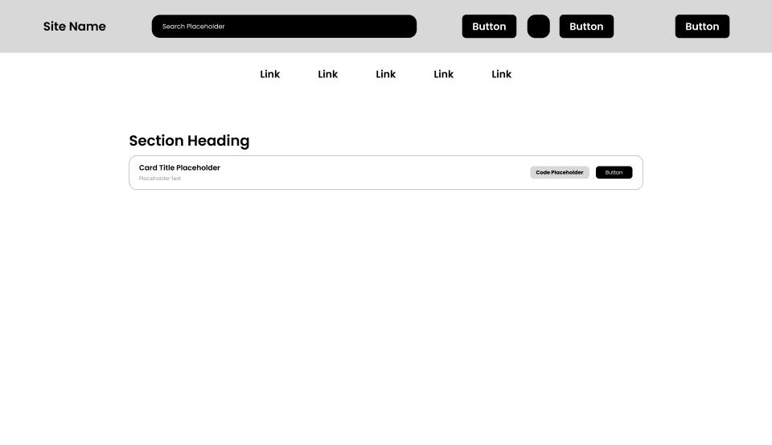
  </div>

  *Nota.* Elaboración propia (realizado en Figma).
  <br>

  **Planes**

  **Figura 27**<br>
  *Wireframe — Planes Consumidor*

  <div align="center">
      
  </div>

  *Nota.* Elaboración propia (realizado en Figma).
  <br>

  **Acceso Ubicación**

  **Figura 28**<br>
  *Wireframe — Acceso a Ubicación Consumidor*

  <div align="center">
      
  </div>

  *Nota.* Elaboración propia (realizado en Figma).
  <br>

  - Ubicación Permitida

    **Figura 29**<br>
    *Wireframe — Ubicación Permitida Consumidor*

    <div align="center">
        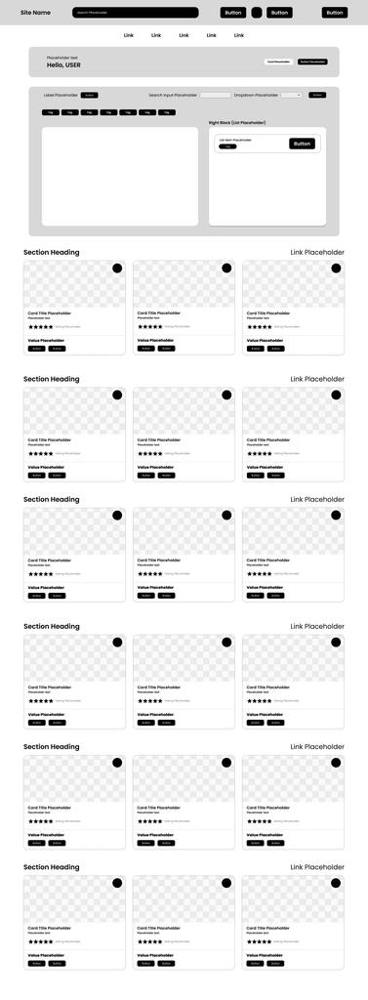
    </div>

    *Nota.* Elaboración propia (realizado en Figma).
    <br>

  **Secciones**

  **Figura 30**<br>
  *Wireframe — Secciones Consumidor*

  <div align="center">
      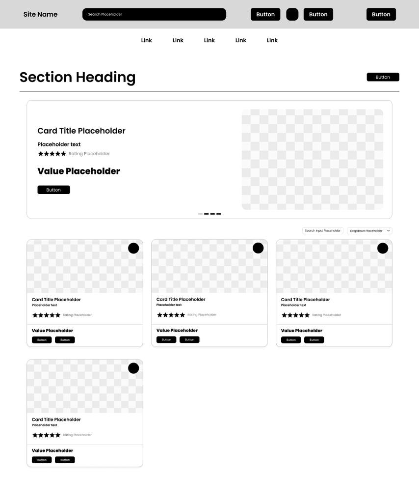
  </div>

  *Nota.* Elaboración propia (realizado en Figma).
  <br>

  **Carrito de Compras**

  **Figura 31**<br>
  *Wireframe — Agregar Oferta al Carrito Consumidor*

  <div align="center">
      
  </div>

  *Nota.* Elaboración propia (realizado en Figma).
  <br>

  **Pago**

  **Figura 32**<br>
  *Wireframe — Pago Consumidor*

  <div align="center">
      
  </div>

  *Nota.* Elaboración propia (realizado en Figma).
  <br>

  **Ayuda**

  **Figura 33**<br>
  *Wireframe — Ayuda Consumidor*

  <div align="center">
      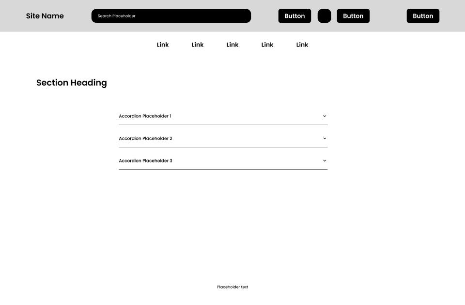
  </div>

  *Nota.* Elaboración propia (realizado en Figma).
  <br>

  **Notificaciones**

  - Notificaciones Generales

    **Figura 34**<br>
    *Wireframe — Notificaciones Consumidor*

    <div align="center">
        
    </div>

    *Nota.* Elaboración propia (realizado en Figma).
    <br>

  - Notificaciones Leídas

    **Figura 35**<br>
    *Wireframe — Notificaciones Leídas Consumidor*

    <div align="center">
        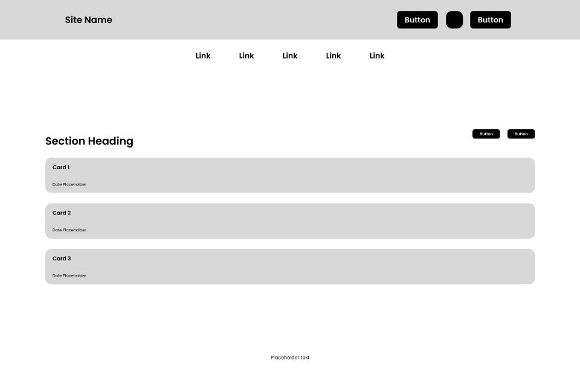
    </div>

    *Nota.* Elaboración propia (realizado en Figma).
    <br>

  - Sin Notificaciones

    **Figura 36**<br>
    *Wireframe — Sin Notificaciones Consumidor*

    <div align="center">
        
    </div>

    *Nota.* Elaboración propia (realizado en Figma).
    <br>

  **Perfil**

  **Figura 37**<br>
  *Wireframe — Perfil Consumidor*

  <div align="center">
      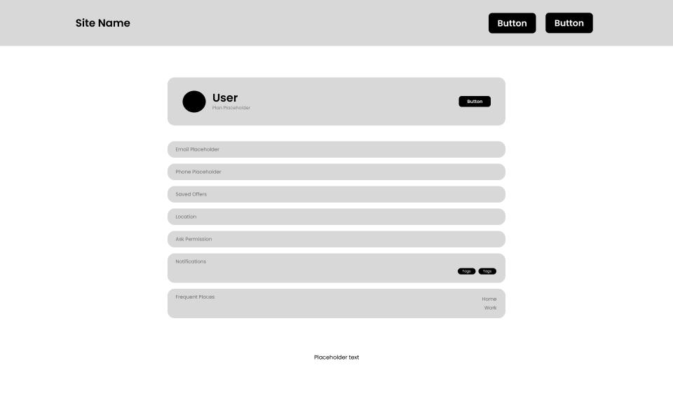
  </div>

  *Nota.* Elaboración propia (realizado en Figma).
  <br>

  - Editar Perfil

    **Figura 38**<br>
    *Wireframe — Editar Perfil Consumidor*

    <div align="center">
        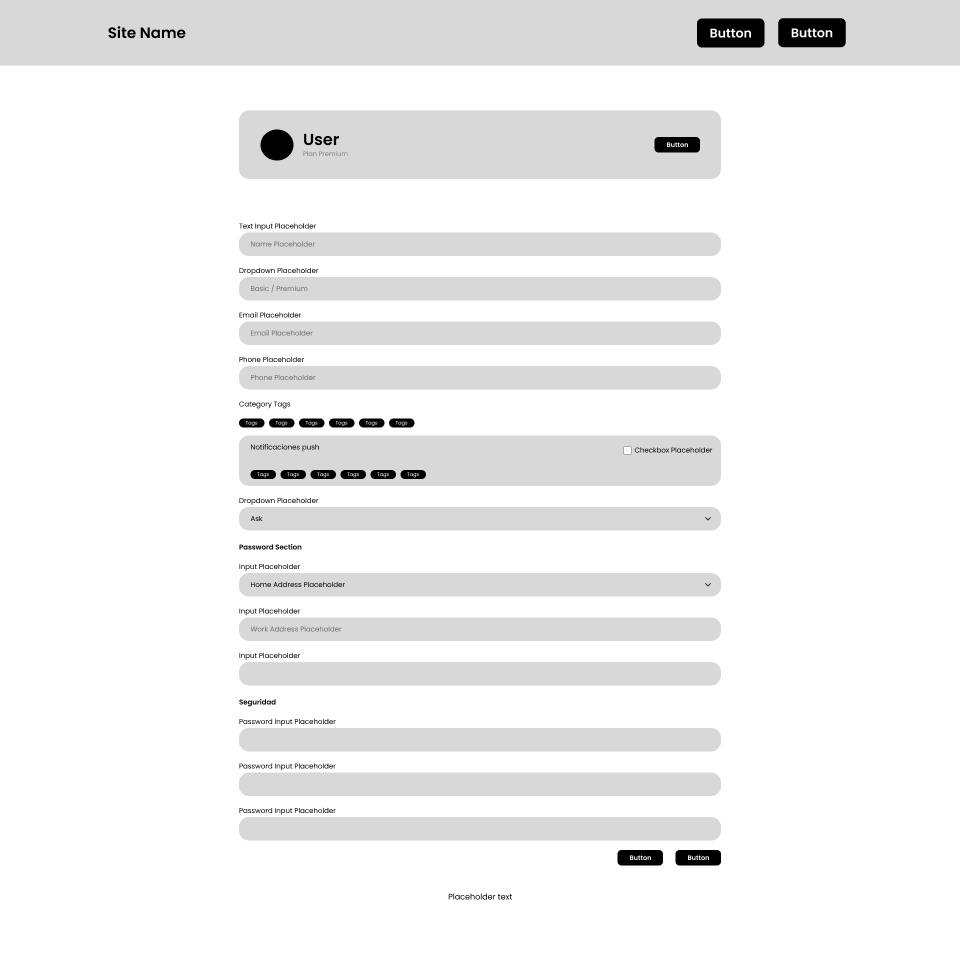
    </div>

    *Nota.* Elaboración propia (realizado en Figma).
    <br>

  **Cerrar Sesión**

  **Figura 39**<br>
  *Wireframe — Cerrar Sesión Consumidor*

  <div align="center">
      
  </div>

  *Nota.* Elaboración propia (realizado en Figma).

  **Proveedores**

  **Resumen**

  **Figura 40**<br>
  *Wireframe — Resumen Proveedor*

  <div align="center">
      
  </div>

  *Nota.* Elaboración propia (realizado en Figma).
  <br>

  **Campañas**

  **Figura 41**<br>
  *Wireframe — Campañas Proveedor*

  <div align="center">
      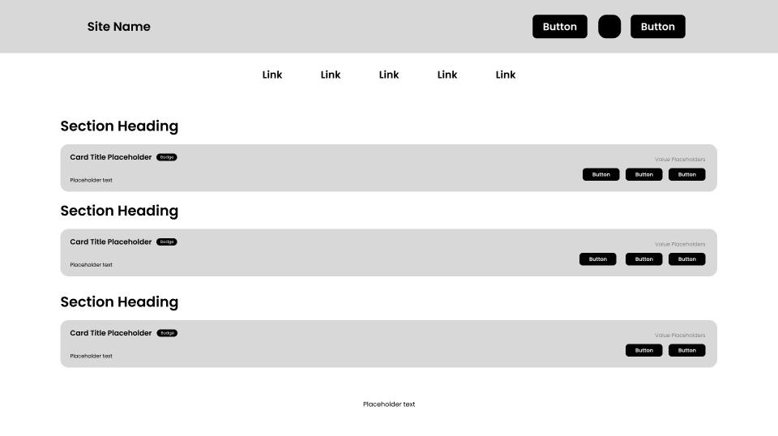
  </div>

  *Nota.* Elaboración propia (realizado en Figma).
  <br>

  **Crear**

  **Figura 42**<br>
  *Wireframe — Crear Campaña Proveedor*

  <div align="center">
      
  </div>

  *Nota.* Elaboración propia (realizado en Figma).
  <br>

  - Crear campaña

    **Figura 43**<br>
    *Wireframe — Formulario Crear Campaña Proveedor*

    <div align="center">
        
    </div>

    *Nota.* Elaboración propia (realizado en Figma).
    <br>

  - Campaña creada

    **Figura 44**<br>
    *Wireframe — Campaña Creada Proveedor*

    <div align="center">
        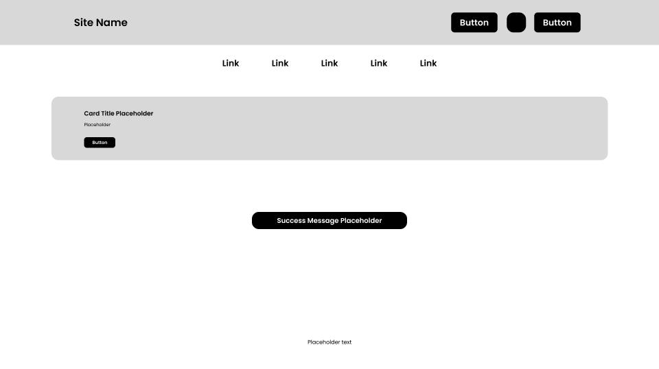
    </div>

    *Nota.* Elaboración propia (realizado en Figma).
    <br>

  **Reportes**

  **Figura 45**<br>
  *Wireframe — Reportes Proveedor*

  <div align="center">
      
  </div>

  *Nota.* Elaboración propia (realizado en Figma).
  <br>

  **Comentarios**

  **Figura 46**<br>
  *Wireframe — Comentarios Proveedor*

  <div align="center">
      
  </div>

  *Nota.* Elaboración propia (realizado en Figma).
  <br>

  **Planes**

  **Figura 47**<br>
  *Wireframe — Planes Proveedor*

  <div align="center">
      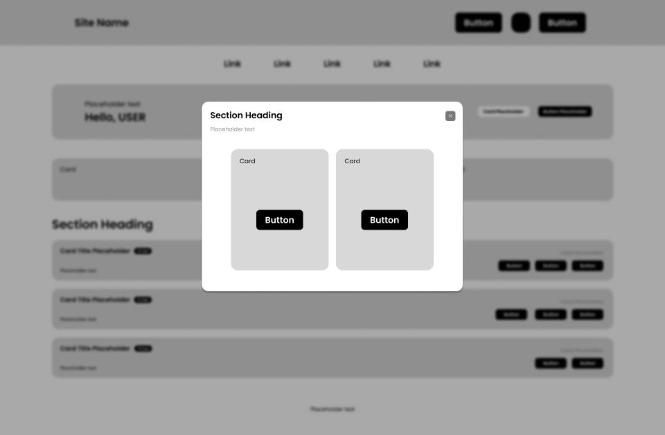
  </div>

  *Nota.* Elaboración propia (realizado en Figma).
  <br>

  **Ayuda**

  **Figura 48**<br>
  *Wireframe — Ayuda Proveedor*

  <div align="center">
      
  </div>

  *Nota.* Elaboración propia (realizado en Figma).
  <br>

  **Notificaciones**

  - Notificaciones Generales

    **Figura 49**<br>
    *Wireframe — Notificaciones Proveedor*

    <div align="center">
        
    </div>

    *Nota.* Elaboración propia (realizado en Figma).
    <br>

  - Notificaciones Leídas

    **Figura 50**<br>
    *Wireframe — Notificaciones Leídas Proveedor*

    <div align="center">
        
    </div>

    *Nota.* Elaboración propia (realizado en Figma).
    <br>

  - Sin Notificaciones

    **Figura 51**<br>
    *Wireframe — Sin Notificaciones Proveedor*

    <div align="center">
        
    </div>

    *Nota.* Elaboración propia (realizado en Figma).
    <br>

  **Perfil**

  **Figura 52**<br>
  *Wireframe — Perfil Proveedor*

  <div align="center">
      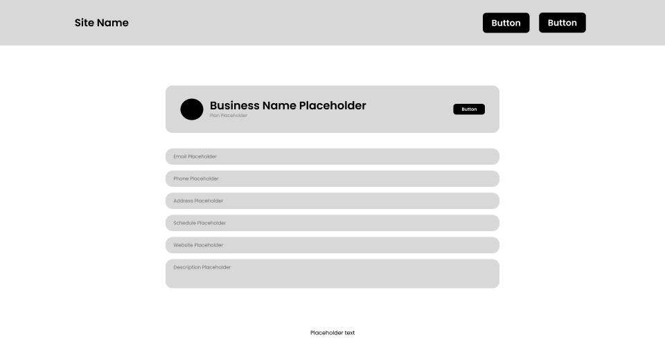
  </div>

  *Nota.* Elaboración propia (realizado en Figma).
  <br>

  - Editar perfil

    **Figura 53**<br>
    *Wireframe — Editar Perfil Proveedor*

    <div align="center">
        
    </div>

    *Nota.* Elaboración propia (realizado en Figma).
    <br>

  **Cerrar Sesión**

  **Figura 54**<br>
  *Wireframe — Cerrar Sesión Proveedor*

  <div align="center">
      
  </div>

  *Nota.* Elaboración propia (realizado en Figma).

  #### 4.4.2. Web Applications Wireflow Diagrams

  Ver Wireflows Diagrams Overflow: https://overflow.io/s/FAPMCERY

  **Login**

  **User Goal: Iniciar Sesión**

  - Usuario: Cliente o Proveedor

    El usuario accede a la aplicación desde la vista de login, elige su rol (cliente o proveedor) e ingresa sus credenciales. Si los datos son correctos, el sistema valida la información y redirige al dashboard correspondiente. En caso contrario, se muestra un mensaje de error para reintentar.

    **Figura 55**<br>
    *User Goal — Iniciar Sesión*

    <div align="center">
        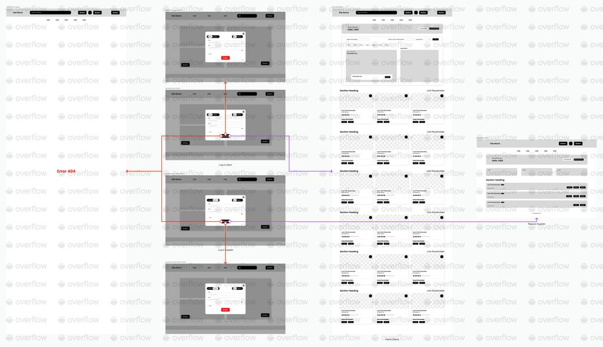
    </div>

    *Nota.* Elaboración propia (realizado en Overflow).

  **Consumidores**

  **User Goal: Visualizar planes**

  - Usuario: Consumidor

    El consumidor ingresa a la sección de planes desde el home. Allí puede ver las opciones de suscripción disponibles. Cada plan muestra sus características principales y beneficios. El usuario evalúa y elige el que mejor se ajusta a sus necesidades.

    **Figura 56**<br>
    *User Goal — Visualizar Planes*

    <div align="center">
        
    </div>

    *Nota.* Elaboración propia (realizado en Overflow).
    <br>

  **User Goal: Permitir acceso a ubicación**

  - Usuario: Consumidor

    El sistema solicita al consumidor acceso a su ubicación. El usuario recibe una ventana emergente para aceptar o rechazar. Al aceptar, la aplicación muestra ofertas cercanas personalizadas. Si no lo permite, solo se muestran resultados generales.

    **Figura 57**<br>
    *User Goal — Permitir Acceso a Ubicación*

    <div align="center">
        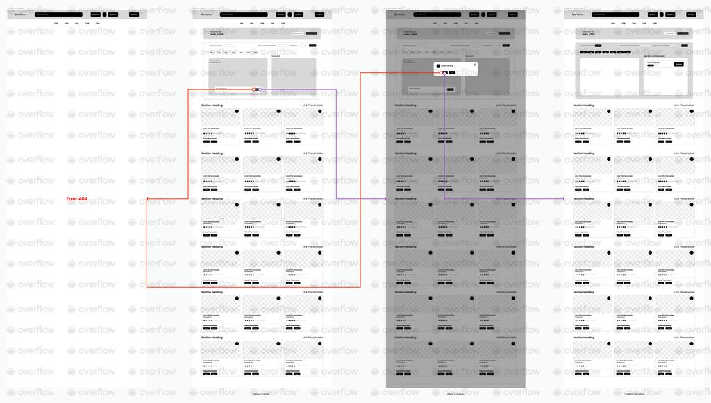  
    </div>

    *Nota.* Elaboración propia (realizado en Overflow).
    <br>

  **User Goal: Acceso a Ayuda, Notificaciones y Perfil**

  - Usuario: Consumidor

    El consumidor desde el header accede al centro de ayuda, revisa sus notificaciones (con la opción de marcar como leídas o limpiarlas) y puede entrar a su perfil. En el perfil tiene acceso a la información registrada y ajustes personales.

    **Figura 58**<br>
    *User Goal — Acceso a Ayuda, Notificaciones y Perfil*

    <div align="center">
        
    </div>

    *Nota.* Elaboración propia (realizado en Overflow).
    <br>

  **User Goal: Acceso a Links Principales (Ofertas, Categorías, Favoritos, Cupones)**

  - Usuario: Consumidor

    Desde el home, el consumidor selecciona alguno de los accesos rápidos (Ofertas, Categorías, Favoritos, Cupones). El sistema lo redirige a la sección correspondiente. En cada sección se muestran los elementos relacionados, organizados para facilitar la navegación.

    **Figura 59**<br>
    *User Goal — Acceso a links Principales*

    <div align="center">
        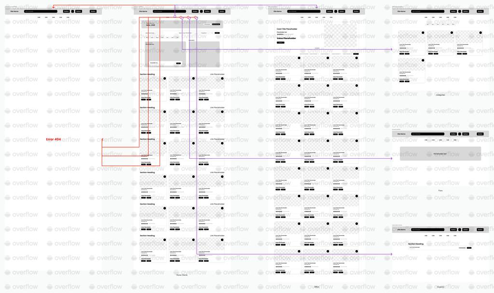
    </div>

    *Nota.* Elaboración propia (realizado en Overflow).
    <br>

  **User Goal: Detalle de Sección y Proceso de Pago**

  - Usuario: Consumidor

    El consumidor entra a una sección (ej. cines), selecciona una oferta y accede al detalle. Desde allí puede añadir al carrito o comprar directamente. Posteriormente continúa con el proceso de pago, confirmando el método y finalizando la transacción.

    **Figura 60**<br>
    *User Goal — Detalle de Sección y Proceso de Pago*

    <div align="center">
        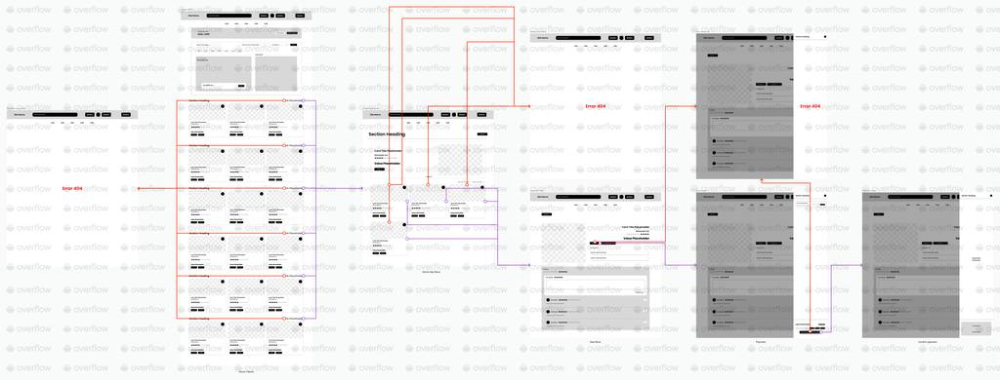
    </div>

    *Nota.* Elaboración propia (realizado en Overflow).
    <br>

  **User Goal: Cerrar Sesión**

  - Usuario: Consumidor

    El consumidor, desde el perfil, selecciona la opción de cerrar sesión. El sistema valida la acción y cierra la cuenta activa.

    **Figura 61**<br>
    *User Goal — Cerrar Sesión*

    <div align="center">
        
    </div>

    *Nota.* Elaboración propia (realizado en Overflow).

  **Proveedores**

  **User Goal: Visualizar Planes**

  - Usuario: Proveedor

    El proveedor accede a la sección de planes desde la opción resumen. Allí se le muestran las opciones de suscripción que permiten ampliar beneficios en la plataforma.

    **Figura 62**<br>
    *User Goal — Visualizar Planes*

    <div align="center">
        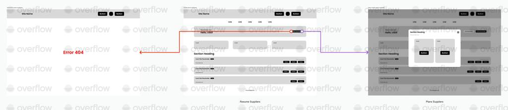
    </div>

    *Nota.* Elaboración propia (realizado en Overflow).
    <br>

  **User Goal: Acceso a Ayuda, Notificaciones y Perfil**

  - Usuario: Proveedor

    El proveedor accede desde el header a secciones complementarias. En Ayuda, encuentra respuestas rápidas a dudas frecuentes. En Notificaciones, revisa avisos relevantes y puede marcarlos como leídos o eliminarlos. Finalmente, en Perfil, gestiona la información de su negocio.

    **Figura 63**<br>
    *User Goal — Acceso a Ayuda, Notificaciones y Perfil*

    <div align="center">
        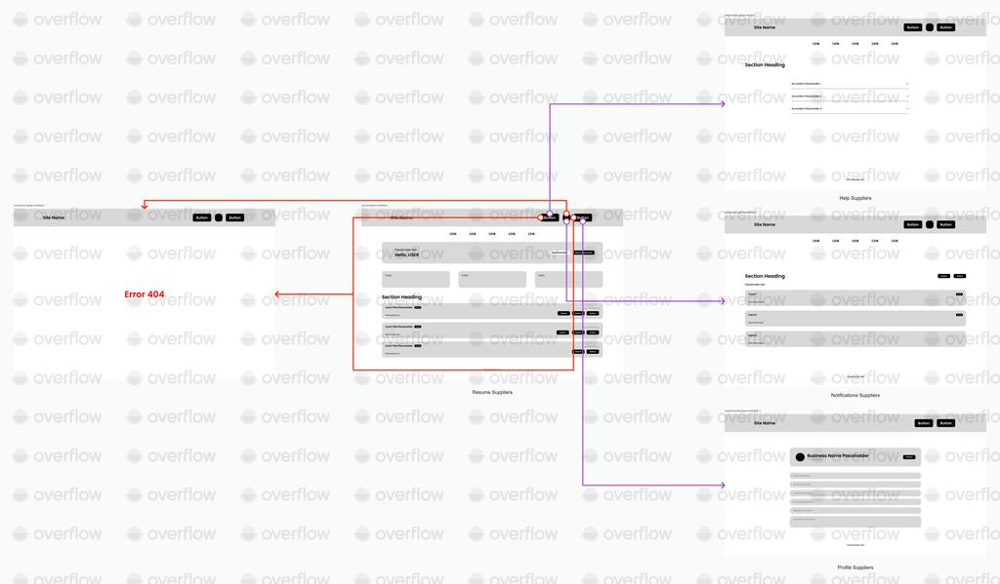
    </div>

    *Nota.* Elaboración propia (realizado en Overflow).
    <br>

  **User Goal: Acceso a Lnks Principales**

  - Usuario: Proveedor

    El proveedor, desde la vista de resumen, puede navegar hacia los enlaces principales de la plataforma: campañas, creación de nuevas promociones, reportes y comentarios de clientes.

    **Figura 64**<br>
    *User Goal — Acceso a links Principales*

    <div align="center">
        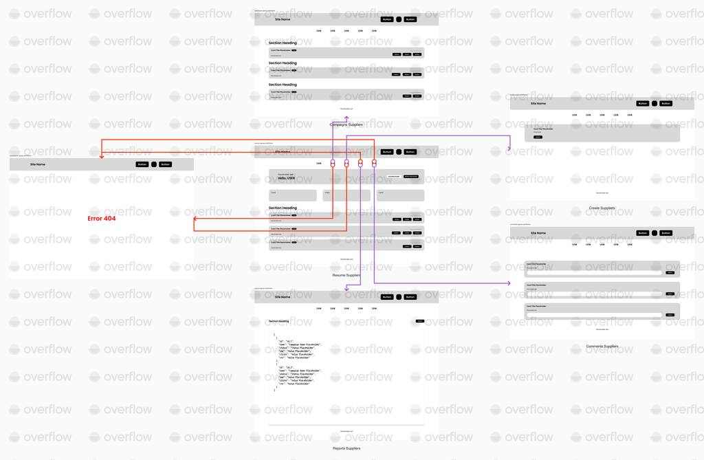
    </div>

    *Nota.* Elaboración propia (realizado en Overflow).
    <br>

  **User Goal: Cerrar Sesión**

  - Usuario: Proveedor

    El proveedor, desde el perfil, selecciona cerrar sesión. El sistema valida la acción y cierra la cuenta activa.

    **Figura 65**<br>
    *User Goal — Cerrar Sesión*

    <div align="center">
        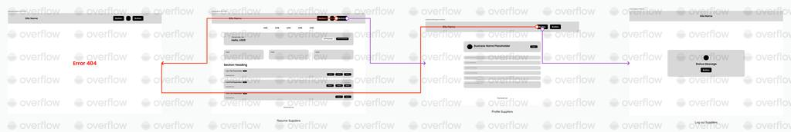
    </div>

    *Nota.* Elaboración propia (realizado en Overflow).

  #### 4.4.3. Web Applications Mock-ups

  **Enlace Diseño Figma:** https://www.figma.com/design/mHHx8WStPBr63tLYj42pBX/GeoPs?node-id=336-2468&t=1Nm0EVmUTgy7sfDx-1

  **Login**

  **Inicio de Sesión y Registro**

  **Figura 66**<br>
  *Mock-up — Inicio de Sesión y Registro*

  <div align="center">
      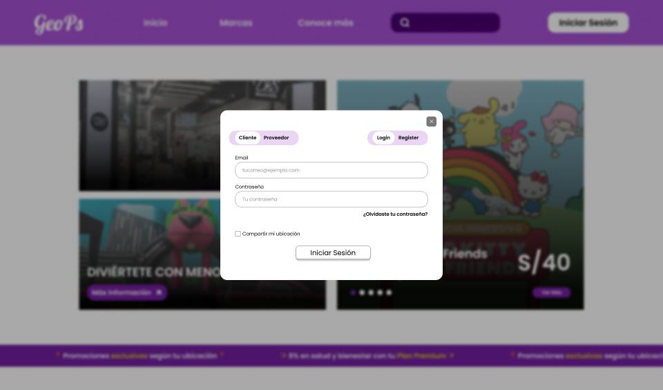
  </div>

  *Nota.* Elaboración propia (realizado en Figma).

  **Consumidores**

  **Home**

  **Figura 67**<br>
  *Mock-up — Home*

  <div align="center">
      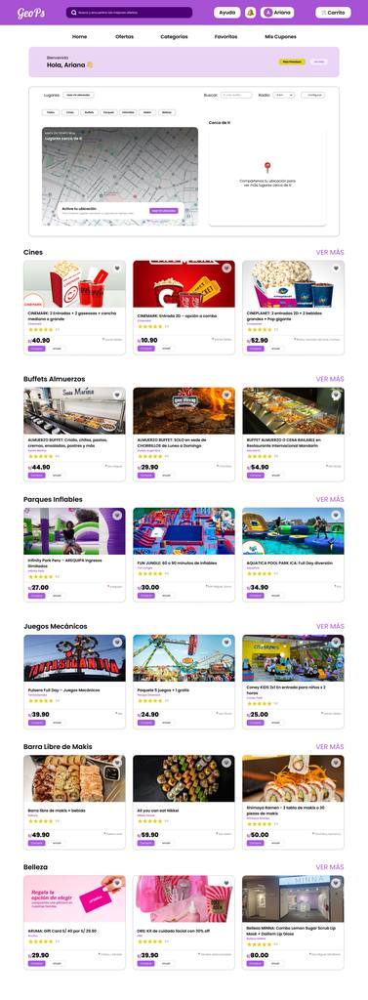
  </div>

  *Nota.* Elaboración propia (realizado en Figma).
  <br>

  **Ofertas**

  **Figura 68**<br>
  *Mock-up — Ofertas*

  <div align="center">
      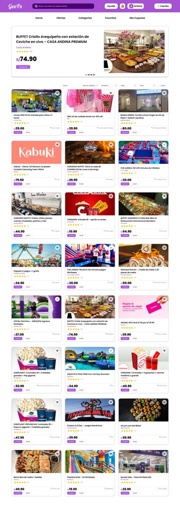
  </div>

  *Nota.* Elaboración propia (realizado en Figma).
  <br>

  **Categorias**

  **Figura 69**<br>
  *Mock-up — Categorías*

  <div align="center">
      
  </div>

  *Nota.* Elaboración propia (realizado en Figma).
  <br>

  **Favoritos**

  **Figura 70**<br>
  *Mock-up — Favoritos*

  <div align="center">
      
  </div>

  *Nota.* Elaboración propia (realizado en Figma).
  <br>

  **Cupones**

  **Figura 71**<br>
  *Mock-up — Cupones*

  <div align="center">
      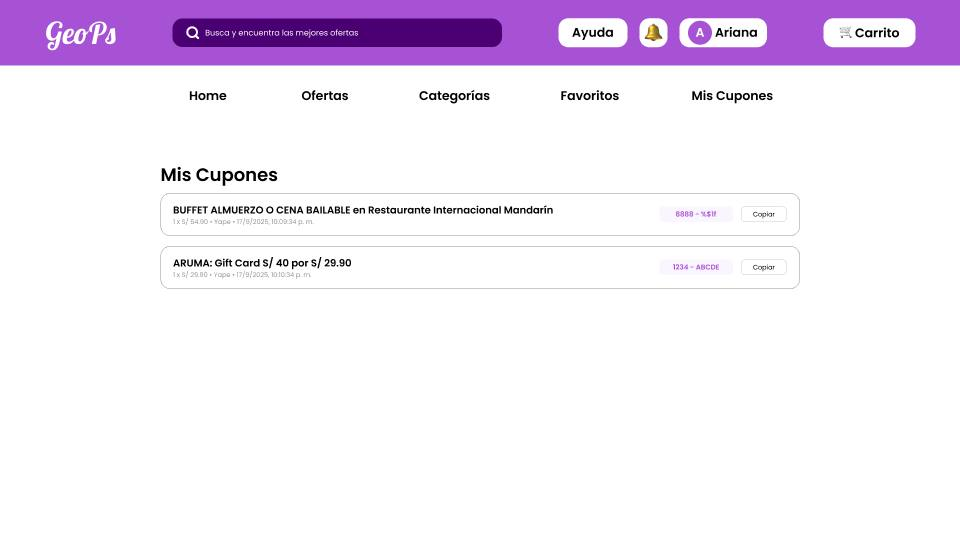
  </div>

  *Nota.* Elaboración propia (realizado en Figma).
  <br>

  **Planes**

  **Figura 72**<br>
  *Mock-up — Planes*

  <div align="center">
      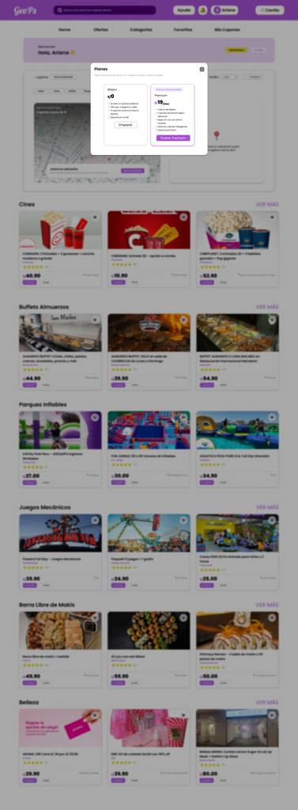
  </div>

  *Nota.* Elaboración propia (realizado en Figma).
  <br>

  **Acceso Ubicación**

  **Figura 73**<br>
  *Mock-up — Solicitud de Acceso a Ubicación*

  <div align="center">
      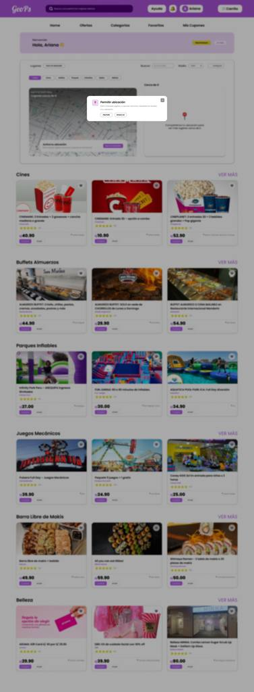
  </div>

  *Nota.* Elaboración propia (realizado en Figma).
  <br>

  **Ubicación Permitida**

  **Figura 74**<br>
  *Mock-up — Ubicación Permitida*

  <div align="center">
      
  </div>

  *Nota.* Elaboración propia (realizado en Figma).
  <br>

  **Secciones**

  - Cines

    **Figura 75**<br>
    *Mock-up — Sección Cines*

    <div align="center">
        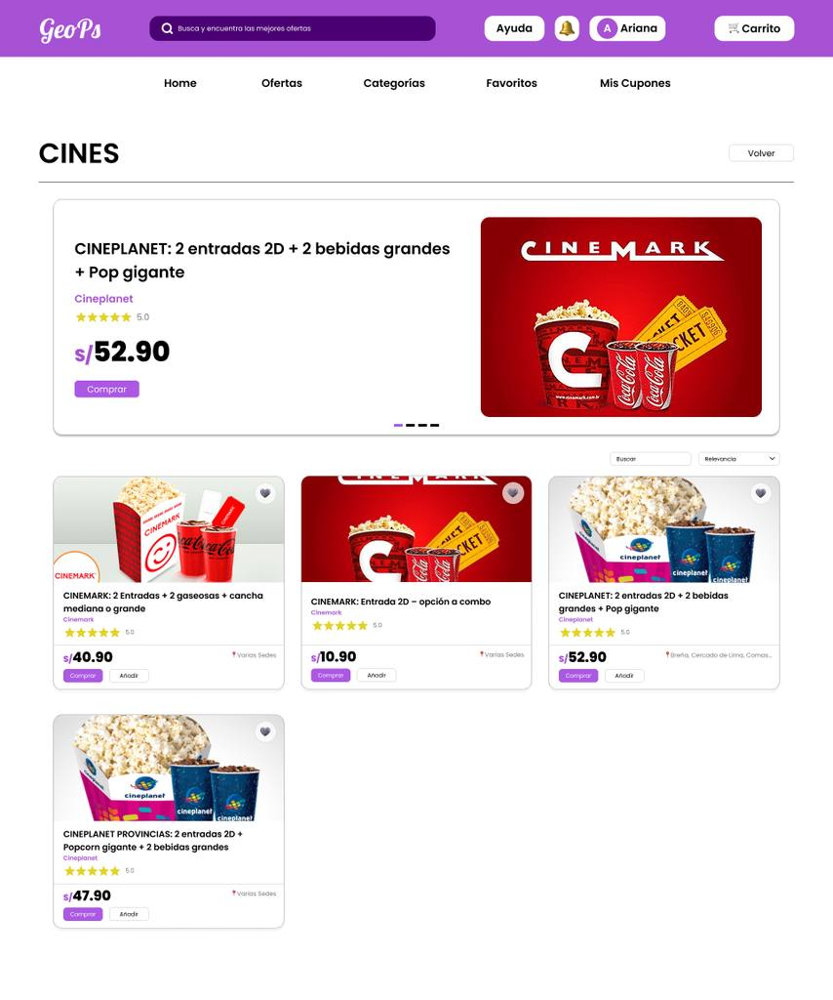
    </div>

    *Nota.* Elaboración propia (realizado en Figma).
    <br>

  - Buffets

    **Figura 76**<br>
    *Mock-up — Sección Buffets*

    <div align="center">
        
    </div>

    *Nota.* Elaboración propia (realizado en Figma).
    <br>

  - Parques

    **Figura 77**<br>
    *Mock-up — Sección Parques*

    <div align="center">
        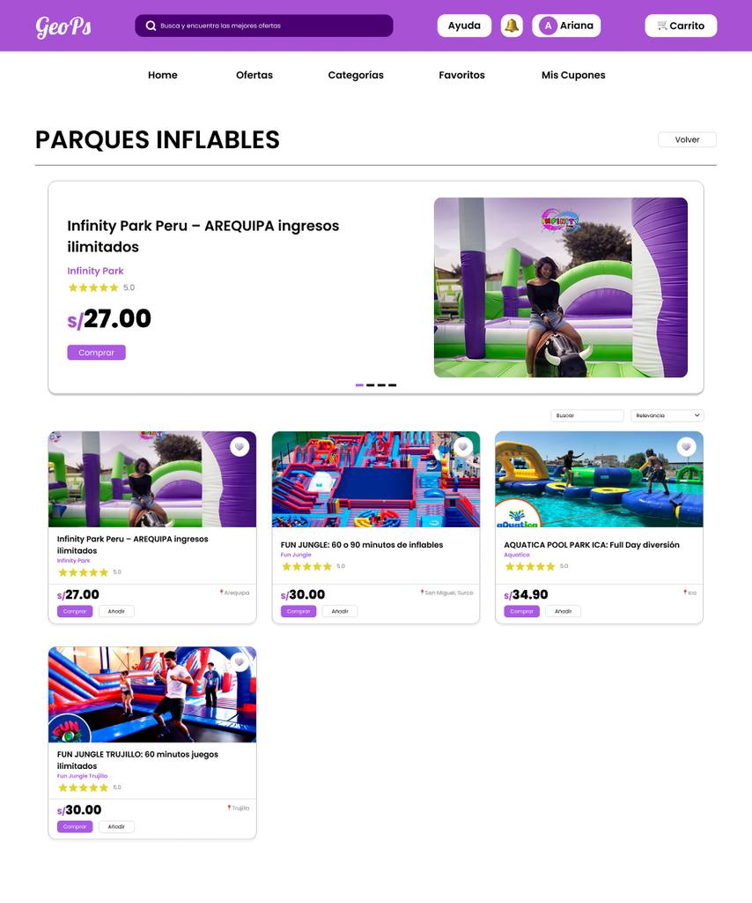
    </div>

    *Nota.* Elaboración propia (realizado en Figma).
    <br>

  - Juegos

    **Figura 78**<br>
    *Mock-up — Sección Juegos*

    <div align="center">
        
    </div>

    *Nota.* Elaboración propia (realizado en Figma).
    <br>

  - Makis

    **Figura 79**<br>
    *Mock-up — Sección Makis*

    <div align="center">
        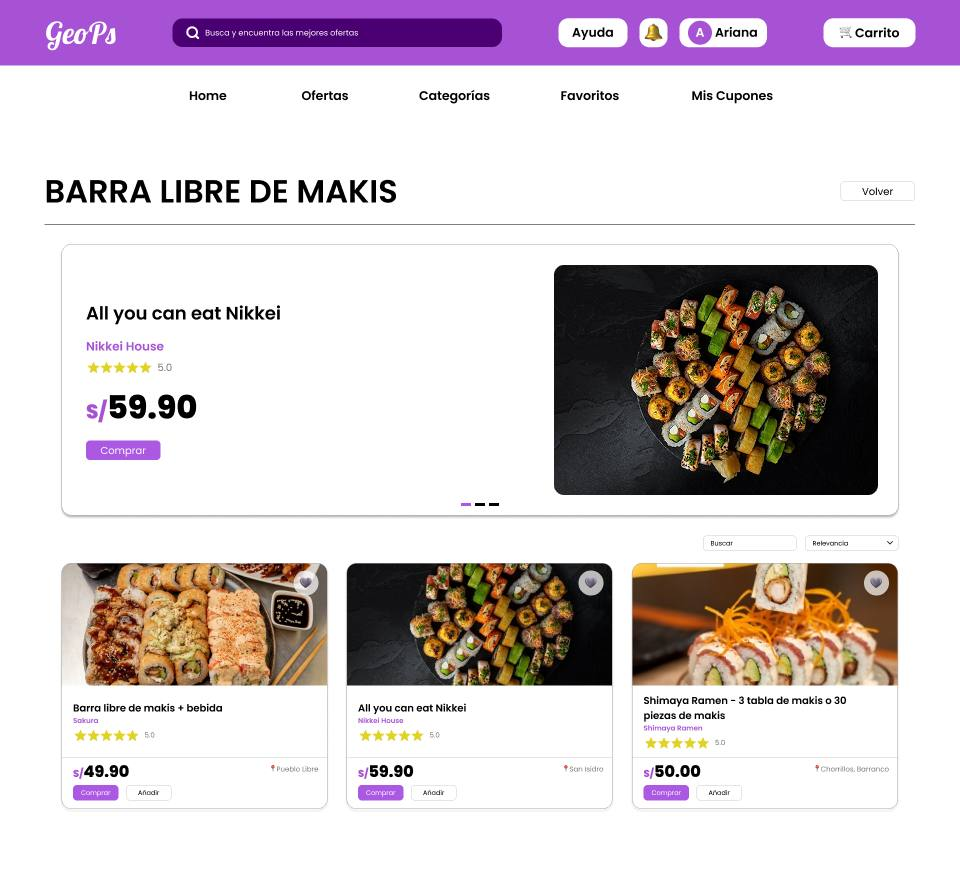
    </div>

    *Nota.* Elaboración propia (realizado en Figma).
    <br>

  - Belleza

    **Figura 80**<br>
    *Mock-up — Sección Belleza*

    <div align="center">
        
    </div>

    *Nota.* Elaboración propia (realizado en Figma).
    <br>

  **Carrito de Compras**

  - Agregar Oferta al Carrito

    **Figura 81**<br>
    *Mock-up — Agregar Oferta al Carrito*

    <div align="center">
        
    </div>

    *Nota.* Elaboración propia (realizado en Figma).
    <br>

  - Oferta Agregada al Carrito

    **Figura 82**<br>
    *Mock-up — Oferta Agregada al Carrito*

    <div align="center">
        
    </div>

    *Nota.* Elaboración propia (realizado en Figma).
    <br>

  **Pago**

  - Ver Carrito

    **Figura 83**<br>
    *Mock-up — Carrito de Compras*

    <div align="center">
        
    </div>

    *Nota.* Elaboración propia (realizado en Figma).
    <br>

  - Procesar Pago

    **Figura 84**<br>
    *Mock-up — Proceso de Pago*

    <div align="center">
        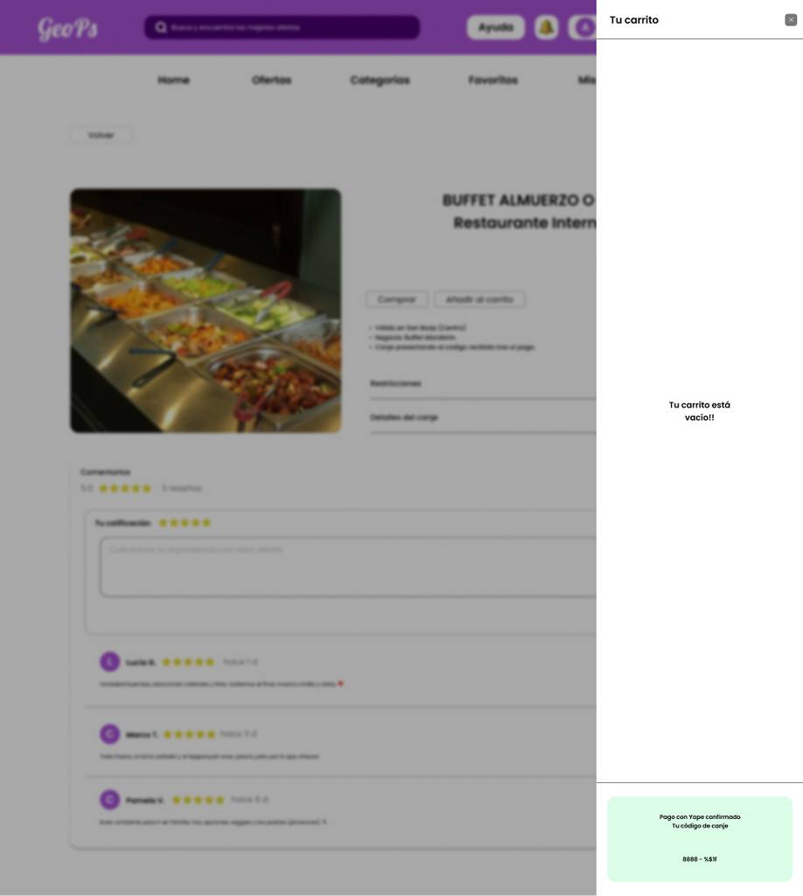
    </div>

    *Nota.* Elaboración propia (realizado en Figma).
    <br>
    
  **Ayuda**

  **Figura 85**<br>
  * *

  <div align="center">
      
  </div>

  *Nota.* Elaboración propia (realizado en Figma).
  <br>

  **Notificaciones**

  - Notificaciones Generales

    **Figura 86**<br>
    *Mock-up — Notificaciones Generales*

    <div align="center">
        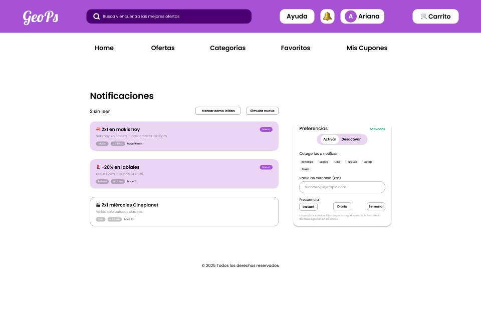
    </div>

    *Nota.* Elaboración propia (realizado en Figma).
    <br>

  - Notificaciones Leídas

    **Figura 87**<br>
    *Mock-up — Notificaciones leídas*

    <div align="center">
        
    </div>

    *Nota.* Elaboración propia (realizado en Figma).
    <br>

  - Sin Notificaciones

    **Figura 88**<br>
    *Mock-up — Sin Notificaciones*

    <div align="center">
        
    </div>

    *Nota.* Elaboración propia (realizado en Figma).
    <br>

  **Perfil**

  **Figura 89**<br>
  *Mock-up — Perfil*

  <div align="center">
      
  </div>

  *Nota.* Elaboración propia (realizado en Figma).
  <br>

  - Editar Perfil

    **Figura 90**<br>
    *Mock-up — Editar Perfil*

    <div align="center">
        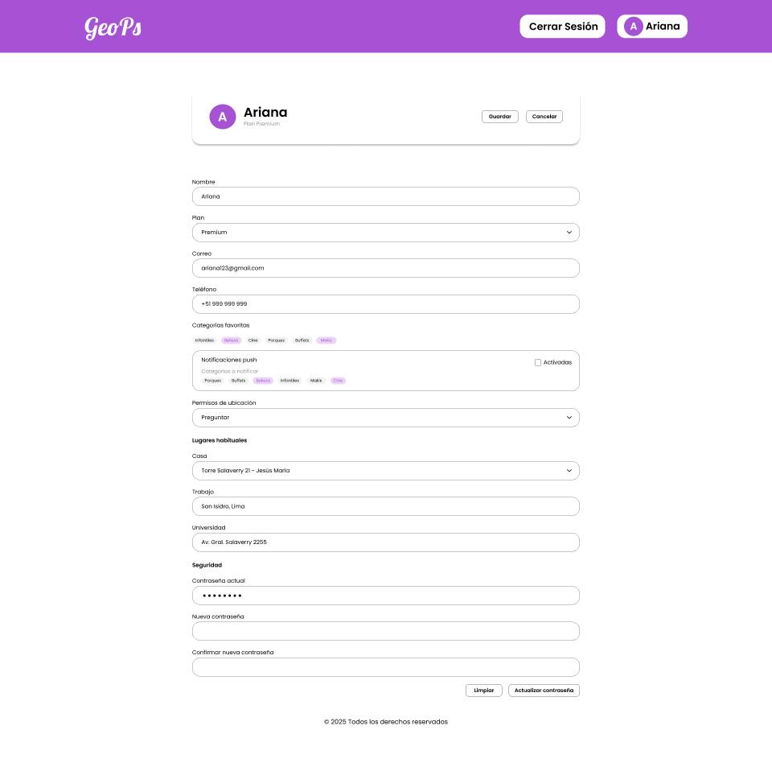
    </div>

    *Nota.* Elaboración propia (realizado en Figma).
    <br>

  **Cerrar Sesión**

  **Figura 91**<br>
  *Mock-up — Cerrar Sesión*

  <div align="center">
      
  </div>

  *Nota.* Elaboración propia (realizado en Figma).

  **Proveedores**

  **Resumen**

  **Figura 92**<br>
  *Mockup — Resumen Proveedor*

  <div align="center">
      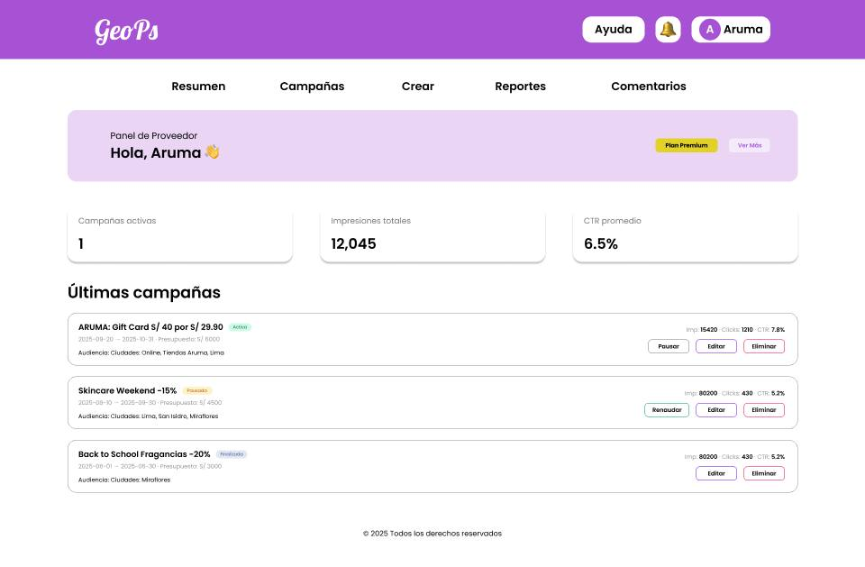
  </div>

  *Nota.* Elaboración propia (realizado en Figma).  
  <br>

  **Campañas**

  **Figura 93**<br>
  *Mockup — Campañas Proveedor*

  <div align="center">
      
  </div>

  *Nota.* Elaboración propia (realizado en Figma).  
  <br>

  **Crear**

  **Figura 94**<br>
  *Mockup — Sección Crear Proveedor*

  <div align="center">
      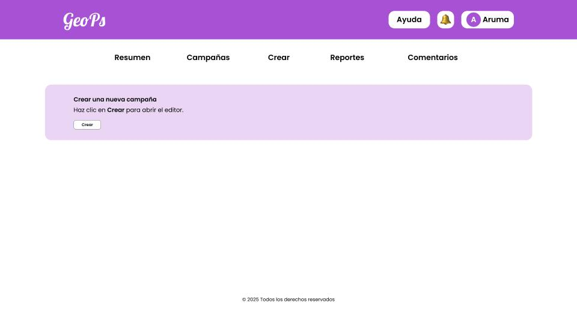
  </div>

  *Nota.* Elaboración propia (realizado en Figma).  
  <br>

  - Crear Campaña

    **Figura 95**<br>
    *Mockup — Crear Campaña Proveedor*

    <div align="center">
        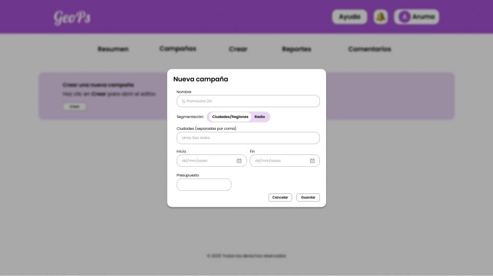
    </div>

    *Nota.* Elaboración propia (realizado en Figma).  
    <br>

  - Campaña Creada

    **Figura 96**<br>
    *Mockup — Campaña Creada Proveedor*

    <div align="center">
        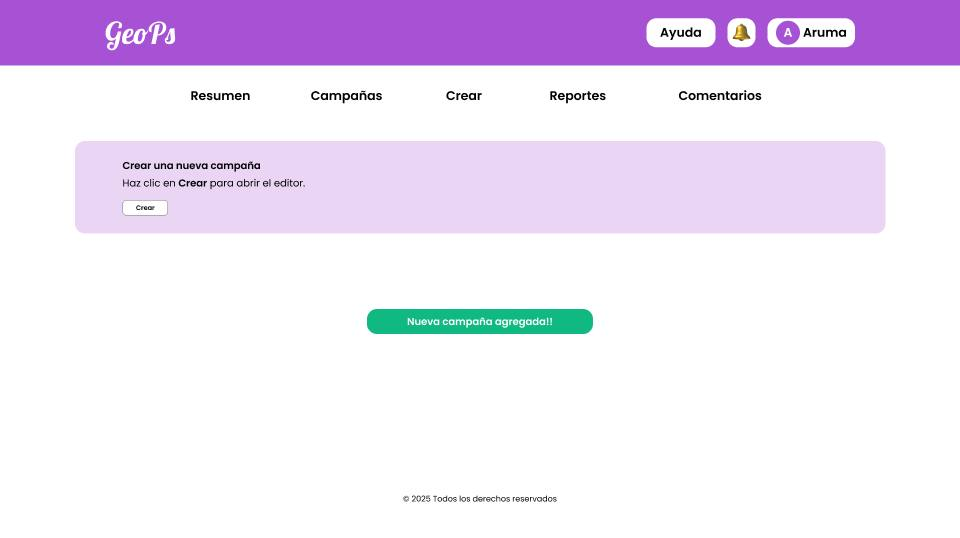
    </div>

    *Nota.* Elaboración propia (realizado en Figma).  
    <br>

  **Reportes**

  **Figura 97**<br>
  *Mockup — Reportes Proveedor*

  <div align="center">
      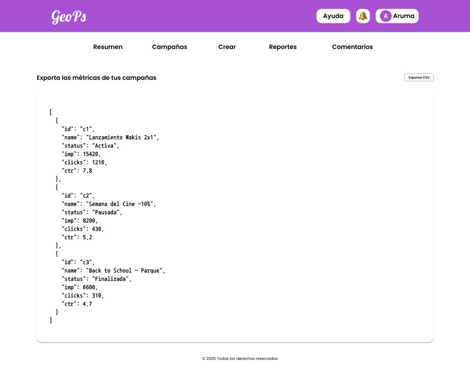
  </div>

  *Nota.* Elaboración propia (realizado en Figma).  
  <br>

  **Comentarios**

  **Figura 98**<br>
  *Mockup — Comentarios Proveedor*

  <div align="center">
      
  </div>

  *Nota.* Elaboración propia (realizado en Figma).  
  <br>

  **Planes**

  **Figura 99**<br>
  *Mockup — Planes Proveedor*

  <div align="center">
      
  </div>

  *Nota.* Elaboración propia (realizado en Figma).  
  <br>

  **Ayuda**

  **Figura 100**<br>
  *Mockup — Ayuda Proveedor*

  <div align="center">
      
  </div>

  *Nota.* Elaboración propia (realizado en Figma).  
  <br>

  **Notificaciones**

  - Notificaciones Generales

    **Figura 101**<br>
    *Mockup — Notificaciones Proveedor*

    <div align="center">
        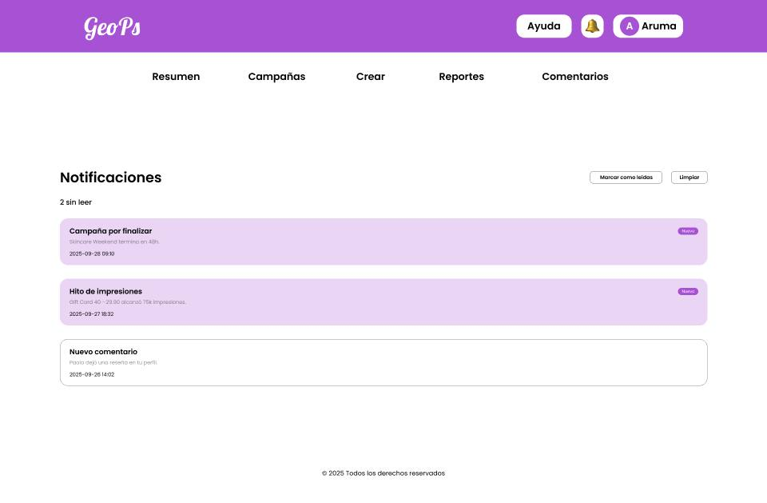
    </div>

    *Nota.* Elaboración propia (realizado en Figma).  
    <br>

  - Notificaciones Leídas

    **Figura 102**<br>
    *Mockup — Notificaciones Leídas Proveedor*
  
    <div align="center">
        
    </div>
  
    *Nota.* Elaboración propia (realizado en Figma).  
    <br>

  - Sin Notificaciones

    **Figura 103**<br>
    *Mockup — Sin Notificaciones Proveedor*

    <div align="center">
        
    </div>

    *Nota.* Elaboración propia (realizado en Figma).  
    <br>

  **Perfil**

  **Figura 104**<br>
  *Mockup — Perfil Proveedor*

  <div align="center">
      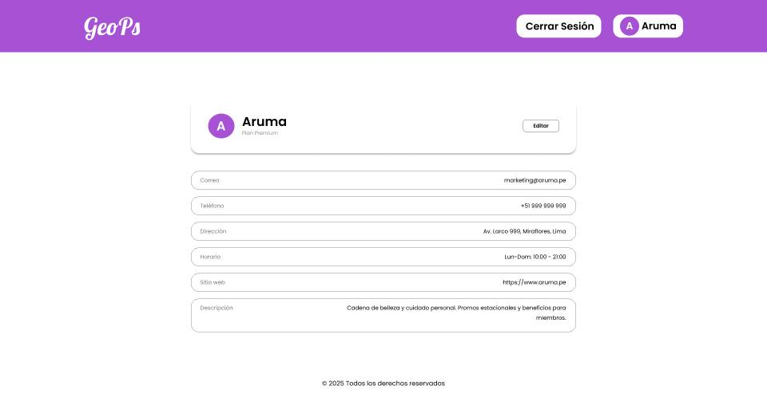
  </div>

  *Nota.* Elaboración propia (realizado en Figma).  
  <br>

  - Editar perfil

    **Figura 105**<br> 
    *Mockup — Editar Perfil Proveedor*

    <div align="center">
        
    </div>

    *Nota.* Elaboración propia (realizado en Figma).  
    <br>

  **Cerrar Sesión**

  **Figura 106**<br> 
  *Mockup — Cerrar Sesión Proveedor*

  <div align="center">
      
  </div>

  *Nota.* Elaboración propia (realizado en Figma).

  #### 4.4.4. Web Applications User Flow Diagrams

  **General**

  Iniciar Sesión en Consumidor o Proveedor:

  **Figura 107**<br>
  *USFD — Iniciar sesión (Cliente / Proveedor)*

  <div align="center">
      
  </div>

  *Nota.* Elaboración propia.  
  <br>

  **Consumidores**

  **Acceder a Opciones de Empresa (Campañas, Crear, Reportes y Comentarios)**

  **Figura 108**<br>
  *USFD — Acceso a links principales Consumidor*

  <div align="center">
      
  </div>

  *Nota.* Elaboración propia.  
  <br>

  **Acceder a Links Principales**

  **Figura 109**<br>
  *USFD — Acceso a links principales Consumidor*

  <div align="center">
      
  </div>

  *Nota.* Elaboración propia.  
  <br>

  **Cerrar Sesión**

  **Figura 110**<br>
  *USFD — Cerrar sesión Consumidor*

  <div align="center">
      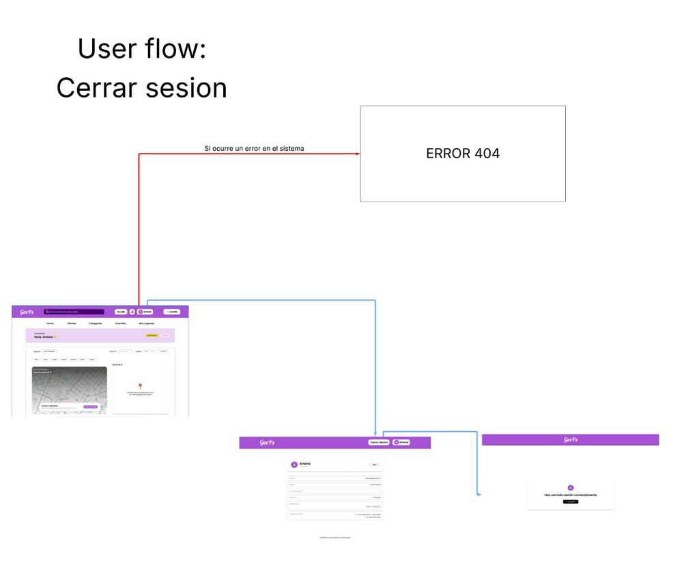
  </div>

  *Nota.* Elaboración propia.  
  <br>

  **Proveedores**

  **Acceder a Links Principales**

  **Figura 111**<br>
  *USFD — Acceso a Links Principales Proveedor*

  <div align="center">
      
  </div>

  *Nota.* Elaboración propia.  
  <br>

  **Acceder a Ayuda, Notificaciones y Perfil**

  **Figura 112**<br>
  *USFD — Acceso a Ayuda, Notificaciones y Perfil Proveedor*

  <div align="center">
      
  </div>

  *Nota.* Elaboración propia.  
  <br>

  **Cerrar Sesión**

  **Figura 113**<br>
  *USFD — Cerrar Sesión Proveedor*

  <div align="center">
      
  </div>

  *Nota.* Elaboración propia.

  ### 4.5. Web Applications Prototyping

  Para el desarrollo del prototype utilizamos la herramienta Figma, en la cual agregamos interacciones a los mock-ups previamente diseñados. Esto permitió simular el flujo de navegación y visualizar la experiencia del usuario de manera más realista.

  **Enlace Diseño Figma Prototype:** https://www.figma.com/proto/mHHx8WStPBr63tLYj42pBX/GeoPs?node-id=2-511&t=I0J1dH7e40wYL90d-1&scaling=min-zoom&content-scaling=fixed&page-id=0%3A1&starting-point-node-id=426%3A3299

  **Figura 114**<br>
  *Prototype — GeoPS*

  <div align="center">
      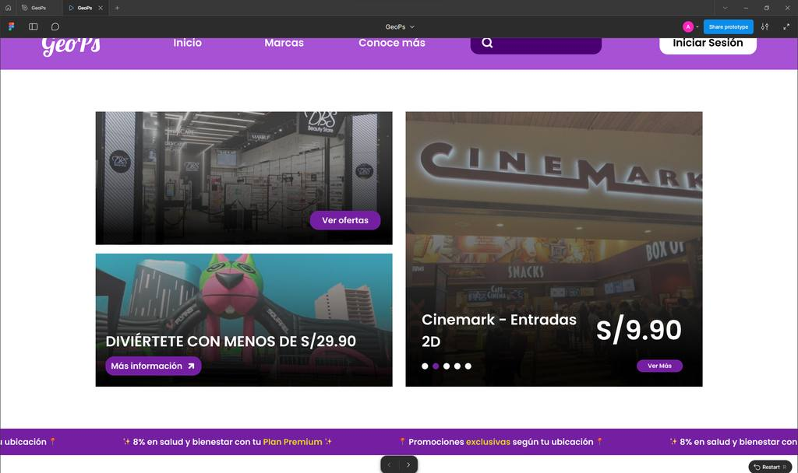
  </div>

  *Nota.* Elaboración propia (realizado en Figma).  
  <br>

  **Enlace Video Web Application Prototype:** https://upcedupe-my.sharepoint.com/:v:/g/personal/u202318049_upc_edu_pe/IQD6SaN-XMsAR6NvgRD_Ev7BAf-nnmSLy5uYleYv0lLnt0Q?nav=eyJyZWZlcnJhbEluZm8iOnsicmVmZXJyYWxBcHAiOiJTdHJlYW1XZWJBcHAiLCJyZWZlcnJhbFZpZXciOiJTaGFyZURpYWxvZy1MaW5rIiwicmVmZXJyYWxBcHBQbGF0Zm9ybSI6IldlYiIsInJlZmVycmFsTW9kZSI6InZpZXcifX0%3D&e=V5Lp6h

  ### 4.6. Domain-Driven Software Architecture

  La arquitectura de software basada en Domain-Driven Design (DDD) se centra en el dominio del negocio, buscando que la aplicación represente de forma fiel los procesos, reglas y necesidades de los usuarios. Con este enfoque, el desarrollo se mantiene alineado con los objetivos estratégicos de la organización y se favorece una comunicación más clara y efectiva entre los equipos técnicos y los expertos del negocio.

  Se utilizó el modelo C4 (Contexto, contenedor y componentes), el cual permite visualizar el sistema en diferentes capas.

  #### 4.6.1. Software Architecture Context Diagram

  **Figura 119**<br>
  *Software Architecture Context Diagram — GeoPS*

  <div align="center">
      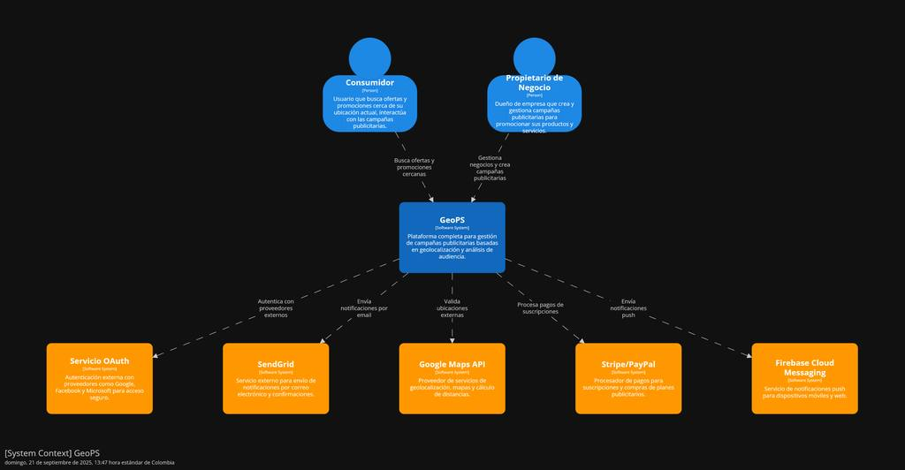
  </div>

  *Nota.* Elaboración propia (realizado en Structurizr).  
  
  El Diagrama de Contexto del sistema de GeoPS muestra una visión de alto nivel de sus componentes y cómo interactúan con usuarios y servicios externos. Este diagrama es útil para comprender la funcionalidad del sistema y sus dependencias.

  En el centro del diagrama se encuentra GeoPS, la plataforma principal. Su propósito es gestionar la creación de campañas publicitarias geolocalizadas y analizar su audiencia.

  **Actores principales**:
  Los principales actores que interactúan con el sistema GeoPS son:

  - Consumidor: Este usuario busca ofertas y promociones basadas en su ubicación actual. Interactúa con campañas publicitarias.

  - Propietario de Negocio: Este usuario es dueño de una empresa que crea y gestiona campañas publicitarias para promover sus productos y servicios.

  **Servicios Externos**:

  Para su funcionamiento, GeoPS se apoya en varios servicios externos:

  - **Servicio OAuth** (Autenticación): Permite a los usuarios autenticarse a través de proveedores como Google, Facebook y Microsoft, garantizando un acceso seguro.

  - **SendGrid** (Servicio de envío): Se encarga de enviar notificaciones por correo electrónico y confirmaciones a los usuarios.

  - **Google Maps API** (Proveedor de servicios): Proporciona servicios de geolocalización, mapas y cálculos de distancia, que son esenciales para las campañas geolocalizadas.

  - **Stripe/PayPal** (Procesador de pagos): Maneja los pagos, aportes y suscripciones a planes de la plataforma.
  - **Firebase Cloud Messaging** (Servicio de notificaciones): Permite el envío de notificaciones push para dispositivos móviles y web, habilitando la comunicación en tiempo real.

  #### 4.6.3. Software Architecture Container Diagrams

  **Figura 120**<br>
  *Software Architecture — Container Diagram GeoPS*

  <div align="center">
      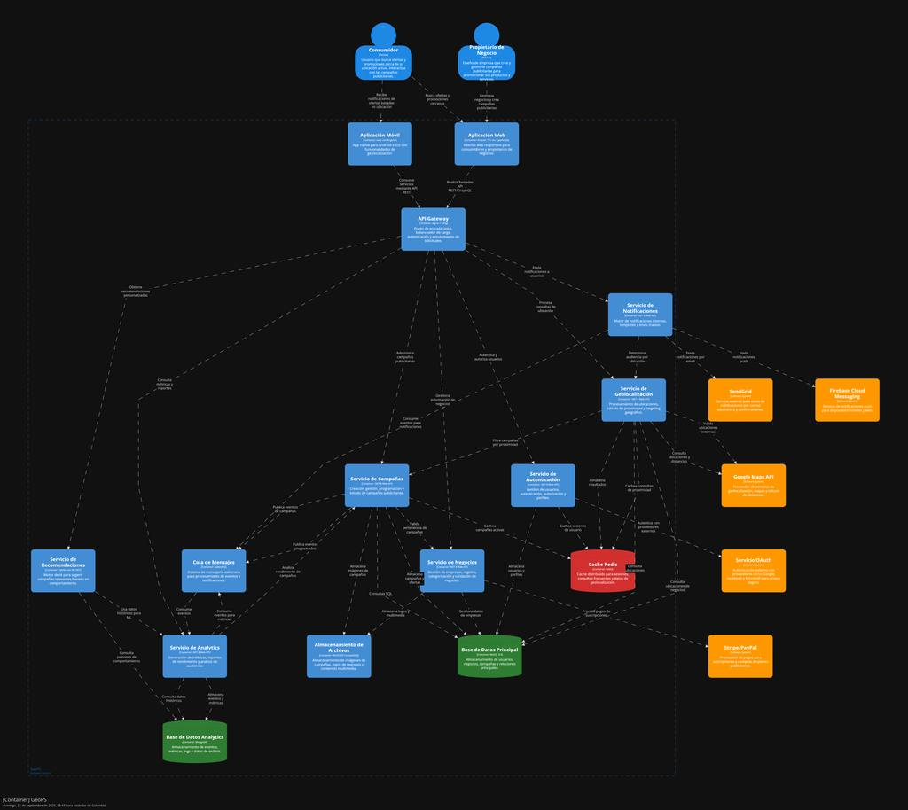
  </div>

  *Nota.* Elaboración propia (realizado en Structurizr).  

  Los usuarios principales, Consumidor y Propietario de Negocio, acceden al sistema a través de distintas aplicaciones web. Los Consumidores utilizan una Aplicación Web , que les permite explorar ofertas y promociones. Por otro lado, los Propietarios de Negocio acceden a una Aplicación Web, donde gestionan sus campañas publicitarias. Ambas aplicaciones se comunican con el backend a través de un API Gateway.

  El backend está compuesto por varios microservicios que manejan funcionalidades específicas del sistema:

  - **Servicio de Autenticación**: Gestiona el inicio de sesión y la seguridad de los usuarios.

  - **Servicio de Campañas**: Permite la creación y gestión de las campañas publicitarias geolocalizadas.

  - **Servicio de Negocios**: Se encarga de la información de las empresas y sus productos.

  - **Servicio de Geoposicionamiento**: Maneja la lógica relacionada con la ubicación y las distancias.

  - **Servicio de Analítica**: Procesa los datos para generar estadísticas sobre las campañas.

  - **Servicio de Notificaciones**: Administra las notificaciones internas del sistema.

  **Almacenamiento de Datos y Caching**

  El sistema utiliza varios contenedores para la persistencia y el manejo de datos:

  - **Base de Datos Relacional** (PostgreSQL): Almacena los datos principales del sistema, como información de usuarios, negocios y campañas.

  - **Base de Datos Analítica**: Guarda la información utilizada para generar reportes y análisis.

  - **Almacenamiento de Archivos** (Cloud Storage): Se utiliza para almacenar activos como imágenes y logotipos.

  - **Cache Redis**: Mejora el rendimiento del sistema almacenando datos de acceso frecuente para reducir la carga de la base de datos principal.

  **Integración con Servicios Externos**

  Para complementar su funcionalidad, GeoPS se integra con diversos servicios externos:

  **Servicio de Autenticación** (OAuth): Permite a los usuarios autenticarse a través de terceros.

  **Google Maps API**: Proveedor esencial para los servicios de mapas y geolocalización.

  **SendGrid**: Encargado del envío de correos electrónicos transaccionales y de notificaciones.

  **Stripe/PayPal**: Procesan los pagos y las suscripciones a los planes de la plataforma.

  **Firebase Cloud Messaging**: Habilita el envío de notificaciones push a dispositivos móviles y web.

  Este diagrama ilustra la arquitectura modular y escalable de GeoPS, mostrando cómo todos sus componentes se comunican para dar soporte a las operaciones principales de la plataforma publicitaria geolocalizada.

  #### 4.6.4. Software Architecture Components Diagrams

  **Servicio de Analíticas**
  
  **Figura 121**<br>
  *Software Architecture — Analytics Service Components Diagram*

  <div align="center">
      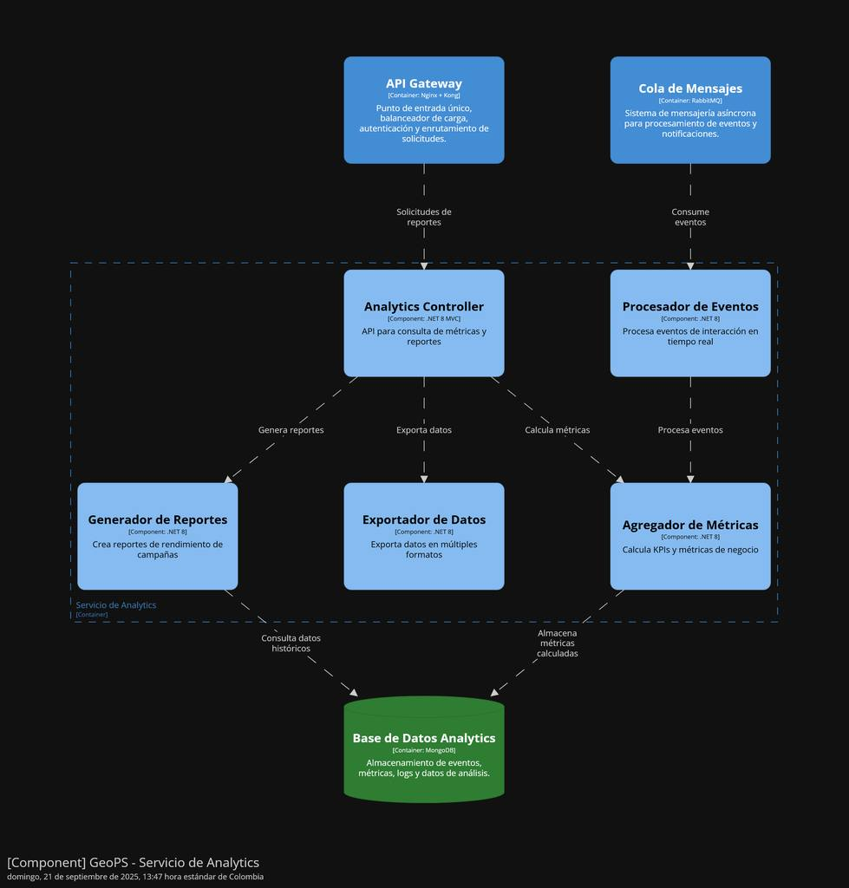
  </div>

  *Nota.* Elaboración propia (realizado en Structurizr).

  El diagrama muestra la arquitectura de componentes del Servicio de Analítica de GeoPS, detallando cómo se gestionan y procesan los datos para la generación de reportes y métricas. Este servicio es fundamental para que los Propietarios de Negocio puedan medir el rendimiento de sus campañas.

  **Componentes principales**
  El flujo de datos comienza con dos puntos de entrada:

  **API Gateway**: Sirve como un punto de entrada único y seguro para las solicitudes de reportes provenientes del frontend.

  **Cola de Mensajes** (RabbitMQ): Recibe eventos de interacción en tiempo real desde otros servicios del sistema.

  Una vez que los datos o solicitudes ingresan al sistema, son procesados por los siguientes componentes:

  **Analytics Controller**: Es la API principal del servicio. Recibe las solicitudes de reportes desde el API Gateway y delega la tarea de generar los informes y exportar los datos.

  **Procesador de Eventos** (Event Loop): Consume los eventos de la Cola de Mensajes en tiempo real y los procesa para su posterior análisis.

  **Agregador de Métricas**: Recibe los eventos procesados y calcula las métricas y los indicadores clave de rendimiento (KPIs) de negocio. Almacena estas métricas calculadas en la base de datos.

  **Generador de Reportes**: Se encarga de crear los reportes de rendimiento de las campañas, consultando los datos históricos y las métricas calculadas almacenadas.

  **Exportador de Datos**: Permite exportar los datos analíticos en múltiples formatos.

  **Servicio de Campañas**

  **Figura 122**<br>
  *Software Architecture — Campaign Service Components Diagram*

  <div align="center">
      
  </div>

  *Nota.* Elaboración propia (realizado en Structurizr).

  Este diagrama representa la arquitectura de los componentes del Servicio de Campañas en GeoPS, encargado de gestionar la creación, publicación, administración y disponibilidad de las campañas dentro de la plataforma.

  **Flujo de Datos y Componentes**

  El flujo inicia con las acciones del **Propietario de Negocio**, que interactúa con el sistema para crear o gestionar una campaña:

  - **API Gateway**  
    Actúa como punto central de comunicación, enviando solicitudes al servicio.

  - **Campaign Controller**  
    Interpreta las solicitudes relacionadas a la creación, edición, activación o consulta de campañas.

  - **Gestor de Campañas**  
    Aplica reglas de negocio: validación de fechas, segmentación, disponibilidad, límites de uso, etc.

  - **Campaign Repository**  
    Persiste la información de campañas en la base de datos y permite consultas rápidas.

  Además, los cambios importantes son registrados en el sistema a través del:

  - **Event Publisher**  
    Publica eventos como:
    - *Campaña Creada*
    - *Campaña Activada*
    - *Campaña Actualizada*

  Estos eventos son consumidos por otros servicios como **Analítica** o **Notificaciones**, habilitando la actualización en tiempo real del estado y el seguimiento de métricas.

  **Objetivo General del Servicio**

  Garantizar que los Propietarios de Negocios cuenten con herramientas para:

  - Crear campañas personalizadas  
  - Activarlas según la geolocalización del público objetivo  
  - Gestionar su disponibilidad y contenido  
  - Mantener consistencia en los datos del negocio  

  **Servicio de Geolocalización**

  **Figura 123**<br>
  *Software Architecture — Geolocation Service Components Diagram*

  <div align="center">
      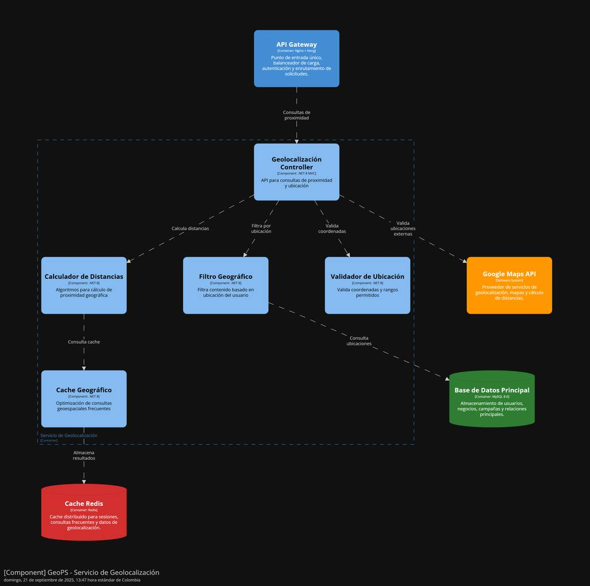
  </div>

  *Nota.* Elaboración propia (realizado en Structurizr).

  Este diagrama detalla la arquitectura de componentes del Servicio de Geoposicionamiento de GeoPS, mostrando cómo se gestionan las funcionalidades basadas en la ubicación. El servicio permite a la plataforma determinar la proximidad geográfica y filtrar contenido relevante para los usuarios.

  **Flujo de Datos y Componentes**
  El flujo comienza con el API Gateway, que recibe las solicitudes de geolocalización. Estas solicitudes son dirigidas al Geolocalización Controller, que actúa como la API principal del servicio, gestionando la lógica de ubicación y proximidad.

  El servicio se apoya en los siguientes componentes para procesar la información geográfica:

  **Validador de Ubicación**: Es el primer punto de validación. Se asegura de que las coordenadas proporcionadas estén dentro de rangos y zonas permitidas. También se comunica con servicios externos, como la Google Maps API, para validar y enriquecer la información de ubicación, así como para realizar cálculos de distancia.

  **Filtro Geográfico**: Una vez que la ubicación es validada, este componente filtra el contenido (como campañas o negocios) basándose en la ubicación actual del usuario.

  **Calculador de Distancias**: Utiliza los datos del usuario y del contenido para calcular la distancia geográfica. Este componente consulta un Cache Geográfico para optimizar el rendimiento y evitar cálculos repetitivos.

  **Cache Geográfico** (Redis): Almacena resultados de cálculos de distancias y ubicaciones frecuentes. También se utiliza un Cache Redis para guardar las sesiones de los usuarios, lo que mejora la velocidad del servicio al recordar la ubicación del usuario y los filtros aplicados.

  **Almacenamiento y Servicios Externos**

  **Base de Datos Principal**: Almacena la información de los negocios, las campañas y las relaciones principales, que el servicio de geolocalización consulta para determinar el contenido relevante.

  **Google Maps API**: Es un servicio externo vital que provee las funcionalidades de geolocalización, mapas y cálculo de distancias.

### 4.7. Software Object-Oriented Design

  #### 4.7.1. Class Diagrams

  El diagrama de clases de GeoPS está organizado siguiendo los principios de Domain-Driven Design (DDD) con arquitectura hexagonal y CQRS, dividido en 11 bounded contexts que representan las áreas principales del negocio. El diseño sigue una separación clara entre las capas de dominio, aplicación, infraestructura e interfaces.

  **Figura 124**<br>
  *Diagrama de Clases de GeoPS*
  
  <div align="center">
      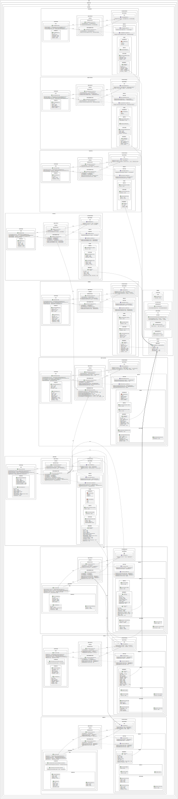
  </div>

  **Bounded Contexts implementados:**

  **Contextos Core (4):**
  1. **Identity BC**: Gestiona usuarios, autenticación y perfiles (User aggregate)
  2. **Offers BC**: Maneja ofertas geolocalizadas vinculadas a campañas (Offer aggregate)
  3. **Cart BC**: Gestión del carrito de compras y items (Cart, CartItem aggregates)
  4. **Payments BC**: Procesamiento de pagos con múltiples métodos (Payment aggregate, PaymentMethod, PaymentStatus enums)

  **Contextos Supporting (6):**
  5. **Coupons BC**: Generación y redención de cupones tras compras (Coupon aggregate)
  6. **Notifications BC**: Sistema de notificaciones en tiempo real (Notification aggregate, NotificationType enum, NotificationFactoryService)
  7. **Reviews BC**: Reseñas y calificaciones de ofertas (Review aggregate)
  8. **Favorites BC**: Gestión de ofertas favoritas por usuario (Favorite aggregate)
  9. **Subscriptions BC**: Planes Free y Premium (Subscription aggregate, SubscriptionType enum)
  10. **Campaign BC**: Gestión de campañas publicitarias (Campaign aggregate, CampaignStatus enum)

  **Shared Kernel (1):**
  11. **Shared BC**: Componentes compartidos (AuditableAbstractAggregateRoot, configuraciones JPA, CORS, OpenAPI)

  **Arquitectura por capas:**

  - **Domain Layer**: Aggregates, Entities, Value Objects, Commands, Queries, Service Interfaces
  - **Application Layer**: CommandServiceImpl, QueryServiceImpl (implementan CQRS)
  - **Infrastructure Layer**: JPA Repositories con Spring Data
  - **Interfaces Layer**: REST Controllers, Resources, Assemblers

  #### 4.7.2. Class Dictionary

  **Identity Bounded Context**

  **Tabla 10**   
  *Class Dictionary — Identity BC*  

  | **Clase**                 | **Atributos**                                                                                                                                     | **Descripción**                                                                                                                                       |
  | ------------------------- | ------------------------------------------------------------------------------------------------------------------------------------------------- | ----------------------------------------------------------------------------------------------------------------------------------------------------- |
  | **User**                  | - id: Long<br>- name: String<br>- email: String<br>- phone: String<br>- password: String<br>- role: String<br>- userType: String                 | Aggregate root que representa usuarios del sistema. Extiende AuditableAbstractAggregateRoot para auditoría automática (createdAt, updatedAt).        |
  | **UserCommandService**    | + handle(CreateUserCommand): Optional\<User\><br>+ handle(UpdateUserCommand): Optional\<User\><br>+ handle(DeleteUserCommand): boolean           | Interfaz del dominio para operaciones de escritura siguiendo patrón CQRS.                                                                            |
  | **UserQueryService**      | + handle(GetUserByIdQuery): Optional\<User\><br>+ handle(GetAllUsersQuery): List\<User\><br>+ handle(GetUserByEmailQuery): Optional\<User\>      | Interfaz del dominio para operaciones de lectura siguiendo patrón CQRS.                                                                              |
  | **UserController**        | + getAllUsers(): ResponseEntity<br>+ getUserById(id): ResponseEntity<br>+ createUser(resource): ResponseEntity<br>+ updateUser(): ResponseEntity  | REST Controller que expone endpoints en /api/v1/users. Usa UserCommandService y UserQueryService.                                                    |
  | **UserRepository**        | + findByEmail(email): Optional\<User\><br>+ findByPhone(phone): Optional\<User\><br>+ existsByEmail(email): boolean                              | Repositorio JPA con métodos de consulta personalizados. Extiende JpaRepository.                                                                      |
  | **CreateUserCommand**     | + name: String<br>+ email: String<br>+ phone: String<br>+ password: String                                                                       | Record inmutable que representa el comando para crear usuario (patrón CQRS).                                                                         |
  | **UserResource**          | + id: Long<br>+ name: String<br>+ email: String<br>+ phone: String<br>+ role: String<br>+ userType: String                                       | Código para respuestas API. Transformado desde User mediante UserResourceFromEntityAssembler.                                                           |

  *Nota.* Elaboración propia.

  **Offers Bounded Context**

  **Tabla 11**   
  *Class Dictionary — Offers BC*  

  | **Clase**                 | **Atributos**                                                                                                                                                                                                  | **Descripción**                                                                                                                             |
  | ------------------------- | -------------------------------------------------------------------------------------------------------------------------------------------------------------------------------------------------------------- | ------------------------------------------------------------------------------------------------------------------------------------------- |
  | **Offer**                 | - id: Long<br>- campaign: Campaign<br>- title: String<br>- partner: String<br>- price: BigDecimal<br>- originalPrice: BigDecimal<br>- category: String<br>- location: String<br>- latitude/longitude: Double | Aggregate root de ofertas. Relación ManyToOne con Campaign. Incluye geolocalización (latitude, longitude) para targeting.                  |
  | **OfferCommandService**   | + handle(CreateOfferCommand): Optional\<Offer\><br>+ handle(UpdateOfferCommand): Optional\<Offer\><br>+ handle(DeleteOfferCommand): void                                                                      | Servicio de comandos para operaciones de escritura en ofertas.                                                                              |
  | **OfferQueryService**     | + handle(GetOfferByIdQuery): Optional\<Offer\><br>+ handle(GetAllOffersQuery): List\<Offer\><br>+ handle(GetOffersByIdsQuery): List\<Offer\>                                                                  | Servicio de consultas para operaciones de lectura en ofertas.                                                                               |
  | **OfferController**       | + getAllOffers(): ResponseEntity<br>+ getOfferById(id): ResponseEntity<br>+ createOffer(resource): ResponseEntity<br>+ updateOffer(): ResponseEntity                                                          | REST Controller en /api/v1/offers. Implementa endpoints CRUD completos.                                                                     |
  | **OfferRepository**       | + findByCategory(category): List\<Offer\><br>+ findByValidUntilAfter(date): List\<Offer\>                                                                                                                     | Repositorio JPA con consultas por categoría y validez temporal.                                                                             |
  | **CreateOfferCommand**    | + campaignId: Long<br>+ title: String<br>+ partner: String<br>+ price: BigDecimal<br>+ description: String<br>+ category: String                                                                              | Command para creación de ofertas con validación de Campaign existente.                                                                      |
  | **OfferResource**         | + id: Long<br>+ title: String<br>+ partner: String<br>+ price: BigDecimal<br>+ category: String<br>+ location: String<br>+ imageUrl: String                                                                   | Código de respuesta para ofertas. Transformado mediante OfferResourceFromEntityAssembler.                                                      |

  *Nota.* Elaboración propia.

  **Cart Bounded Context**

  **Tabla 12**   
  *Class Dictionary — Cart BC*  

  | **Clase**                 | **Atributos**                                                                                                                                         | **Descripción**                                                                                                                           |
  | ------------------------- | ----------------------------------------------------------------------------------------------------------------------------------------------------- | ----------------------------------------------------------------------------------------------------------------------------------------- |
  | **Cart**                  | - id: Long<br>- user: User<br>- items: List\<CartItem\><br>- totalItems: Integer<br>- totalAmount: Double                                            | Aggregate root del carrito. Relación ManyToOne con User y OneToMany con CartItem. Calcula totales automáticamente.                       |
  | **CartItem**              | - id: Long<br>- cart: Cart<br>- offerId: Long<br>- offerTitle: String<br>- offerPrice: Double<br>- quantity: Integer<br>- total: Double             | Entity dentro del aggregate Cart. Almacena snapshot de información de la oferta para independencia del bounded context Offers.           |
  | **CartCommandService**    | + handle(AddItemToCartCommand): Optional\<Cart\><br>+ handle(UpdateCartItemCommand): Optional\<Cart\><br>+ handle(ClearCartCommand): boolean        | Servicio de comandos. Valida existencia de User y Offer antes de agregar items.                                                          |
  | **CartQueryService**      | + handle(GetCartByUserIdQuery): Optional\<Cart\><br>+ handle(GetCartByIdQuery): Optional\<Cart\>                                                     | Servicio de consultas para recuperar carritos por usuario o ID.                                                                          |
  | **CartController**        | + getCartByUserId(userId): ResponseEntity<br>+ addItemToCart(userId, resource): ResponseEntity<br>+ updateCartItem(): ResponseEntity                | REST Controller en /api/v1/cart. Gestiona ciclo completo del carrito.                                                                    |
  | **CartRepository**        | + findByUserId(userId): Optional\<Cart\>                                                                                                              | Repositorio JPA. Un usuario tiene un único carrito activo.                                                                                |
  | **AddItemToCartCommand**  | + userId: Long<br>+ offerId: Long<br>+ quantity: Integer                                                                                              | Command para agregar items. Valida stock y disponibilidad de oferta.                                                                     |
  | **CartResource**          | + id: Long<br>+ userId: Long<br>+ items: List\<CartItemResource\><br>+ totalItems: Integer<br>+ totalAmount: Double                                  | Código de respuesta con estructura completa del carrito incluyendo items anidados.                                                          |

  *Nota.* Elaboración propia.

  **Payments Bounded Context**

  **Tabla 13**   
  *Class Dictionary — Payments BC*  

  | **Clase**                  | **Atributos**                                                                                                                                                                 | **Descripción**                                                                                                                                    |
  | -------------------------- | ----------------------------------------------------------------------------------------------------------------------------------------------------------------------------- | -------------------------------------------------------------------------------------------------------------------------------------------------- |
  | **Payment**                | - id: Long<br>- userId: Long<br>- cartId: Long<br>- amount: BigDecimal<br>- paymentMethod: PaymentMethod<br>- status: PaymentStatus<br>- paymentCode: String<br>- completedAt: String | Aggregate root de pagos. Almacena IDs de User y Cart para trazabilidad sin acoplamiento fuerte.                                                   |
  | **PaymentMethod**          | CARD, YAPE, PLIN                                                                                                                                                              | Enum con métodos de pago soportados (tarjeta de crédito, Yape, Plin).                                                                             |
  | **PaymentStatus**          | PENDING, COMPLETED, FAILED                                                                                                                                                    | Enum con estados del pago durante su ciclo de vida.                                                                                               |
  | **PaymentCommandService**  | + handle(CreatePaymentCommand): Optional\<Payment\><br>+ completePayment(paymentId, completedAt): Optional\<Payment\><br>+ failPayment(paymentId): Optional\<Payment\>       | Servicio de comandos. completePayment() dispara creación de notificaciones vía NotificationFactoryService (integración cross-context).            |
  | **PaymentQueryService**    | + handle(GetPaymentByIdQuery): Optional\<Payment\><br>+ handle(GetAllPaymentsByUserIdQuery): List\<Payment\>                                                                 | Servicio de consultas para historial de pagos del usuario.                                                                                        |
  | **PaymentController**      | + createPayment(resource): ResponseEntity<br>+ getPaymentById(id): ResponseEntity<br>+ completePayment(id): ResponseEntity<br>+ failPayment(id): ResponseEntity             | REST Controller en /api/v1/payments. Endpoint PUT /payments/{id}/complete marca pago como completado.                                             |
  | **PaymentRepository**      | + findByUserId(userId): List\<Payment\><br>+ findByCartId(cartId): List\<Payment\><br>+ findByStatus(status): List\<Payment\>                                                | Repositorio JPA con consultas por usuario, carrito y estado.                                                                                      |
  | **CreatePaymentCommand**   | + userId: Long<br>+ cartId: Long<br>+ amount: BigDecimal<br>+ paymentMethod: String<br>+ customerEmail: String                                                               | Command para iniciar pago. Captura información del cliente para procesamiento.                                                                    |
  | **PaymentResource**        | + id: Long<br>+ userId: Long<br>+ amount: BigDecimal<br>+ paymentMethod: String<br>+ status: String<br>+ paymentCodes: List<br>+ completedAt: String                         | Código de respuesta con información completa del pago incluyendo códigos de cupones generados.                                                       |

  *Nota.* Elaboración propia.

  **Notifications Bounded Context**

  **Tabla 14**   
  *Class Dictionary — Notifications BC*  

  | **Clase**                     | **Atributos**                                                                                                                                                                             | **Descripción**                                                                                                                                |
  | ----------------------------- | ----------------------------------------------------------------------------------------------------------------------------------------------------------------------------------------- | ---------------------------------------------------------------------------------------------------------------------------------------------- |
  | **Notification**              | - id: Long<br>- userId: Long<br>- type: NotificationType<br>- title: String<br>- message: String<br>- isRead: boolean<br>- relatedEntityId: String<br>- actionUrl: String                | Aggregate root de notificaciones. Usa NotificationType enum para categorizar. Incluye URL de acción para navegación directa.                  |
  | **NotificationType**          | PAYMENT, PREMIUM_UPGRADE, PROFILE_UPDATE, FAVORITE, COUPON_EXPIRATION, REVIEW_COMMENT                                                                                                    | Enum con tipos de notificaciones soportadas en el sistema.                                                                                    |
  | **NotificationFactoryService**| + createPaymentNotification(userId, paymentId, amount)<br>+ createPremiumUpgradeNotification(userId)<br>+ createFavoriteAddedNotification(userId, offerId, title)                       | Servicio de aplicación que crea notificaciones específicas. Usado por otros bounded contexts (Payments, Reviews, Favorites) para integración.|
  | **NotificationCommandService**| + handle(CreateNotificationCommand): Optional\<Notification\><br>+ handle(MarkNotificationAsReadCommand): Optional\<Notification\>                                                        | Servicio de comandos para crear y marcar como leídas.                                                                                         |
  | **NotificationQueryService**  | + handle(GetNotificationsByUserIdQuery): List\<Notification\><br>+ handle(GetUnreadCountByUserIdQuery): Long                                                                             | Servicio de consultas. Incluye conteo de no leídas para badge en UI.                                                                          |
  | **NotificationController**    | + getNotificationsByUserId(userId): ResponseEntity<br>+ markAsRead(id): ResponseEntity<br>+ markAllAsRead(userId): ResponseEntity<br>+ deleteNotification(id): ResponseEntity           | REST Controller en /api/v1/notifications. Soporte para marcar todas como leídas.                                                              |
  | **NotificationRepository**    | + findByUserId(userId): List\<Notification\><br>+ findByUserIdAndIsRead(userId, isRead): List\<Notification\><br>+ countByUserIdAndIsRead(userId, isRead): Long                          | Repositorio JPA con consultas filtradas por estado de lectura y conteo.                                                                       |
  | **NotificationResource**      | + id: Long<br>+ userId: Long<br>+ type: String<br>+ title: String<br>+ message: String<br>+ isRead: boolean<br>+ relatedEntityId: String<br>+ actionUrl: String<br>+ createdAt: String   | Código de respuesta con información completa incluyendo timestamp de creación.                                                                    |

  *Nota.* Elaboración propia.

  **Shared Kernel**

  **Tabla 15**   
  *Class Dictionary — Shared BC*  

  | **Clase**                                    | **Atributos / Métodos**                                                                                    | **Descripción**                                                                                                                |
  | -------------------------------------------- | ---------------------------------------------------------------------------------------------------------- | ------------------------------------------------------------------------------------------------------------------------------ |
  | **AuditableAbstractAggregateRoot**           | - id: Long<br>- createdAt: Date<br>- updatedAt: Date<br>+ getId(): Long<br>+ getCreatedAt(): Date         | Clase base abstracta para todos los aggregates. Proporciona auditoría automática con @CreatedDate y @LastModifiedDate de JPA. |
  | **SnakeCaseWithPluralizedTablePhysicalNamingStrategy** | + toPhysicalTableName(name, context): Identifier<br>+ toPhysicalColumnName(name, context): Identifier | Naming strategy personalizada de Hibernate. Convierte nombres de Java (camelCase) a snake_case con tablas pluralizadas.       |
  | **JpaAuditingConfiguration**                 | + auditorAware(): AuditorAware\<String\>                                                                   | Configuración Spring para habilitar JPA Auditing (@EnableJpaAuditing).                                                        |
  | **OpenApiConfiguration**                     | + customOpenAPI(): OpenAPI                                                                                 | Configuración de SpringDoc OpenAPI para documentación automática de API REST en /swagger-ui.html.                             |
  | **CorsConfiguration**                        | + corsConfigurationSource(): CorsConfigurationSource                                                       | Configuración CORS para permitir peticiones desde frontend Angular (origins, methods, headers).                                |
  | **MessageResource**                          | + message: String                                                                                          | Código genérico para respuestas simples de texto en endpoints (ej: mensajes de éxito, error).                                    |

  *Nota.* Elaboración propia.

  **Patrones de diseño implementados:**

  - **DDD (Domain-Driven Design)**: Organización en bounded contexts con aggregates claramente definidos
  - **CQRS (Command Query Responsibility Segregation)**: Separación de servicios de comando y consulta


### 4.8. Database Design

  #### 4.8.1. Relational/Non-Relational Database Diagram

  El diseño de la base de datos de GeoPS implementa un esquema relacional robusto que soporta la arquitectura DDD y los 11 bounded contexts del sistema. La base de datos MySQL 8.0 está optimizada para transacciones, consultas geoespaciales mediante ubicació del usuario, y seguimiento completo de interacciones de usuarios con auditoría automática.

  **Figura 125**<br>
  *Diagrama de Base de Datos — GeoPS*

  <div align="center">
      
  </div>

  *Nota.* El script SQL completo de creación de la base de datos se encuentra en `geops-backend/geopsdb.sql`

  **Convenciones de nomenclatura implementadas:**

  - **Nombres de tablas**: snake_case pluralizado (ej: `users`, `cart_items`, `notifications`)
  - **Columnas**: snake_case (ej: `user_id`, `created_at`, `is_read`)
  - **Primary Keys**: `BIGINT AUTO_INCREMENT` para soportar alto volumen de datos
  - **Timestamps**: `DATETIME(6)` con precisión de microsegundos para auditoría exacta
  - **Charset**: `utf8mb4` con collation `utf8mb4_unicode_ci` para soporte Unicode completo
  - **Engine**: InnoDB para transacciones ACID y foreign keys

  **Descripción de las principales tablas por bounded context:**

  **Identity BC:**
  - **users**: Tabla principal de usuarios con autenticación (id, name, email, phone, password, role, user_type, created_at, updated_at)
    * Índice único en `email` para login rápido
    * Soporte para roles y tipos de usuario (FREE, PREMIUM)

  **Offers BC:**
  - **campaigns**: Campañas publicitarias (id, name, description, start_date, end_date, status, created_at, updated_at)
    * Enum status: ACTIVE, INACTIVE, EXPIRED
  - **offers**: Ofertas geolocalizadas (id, campaign_id, title, partner, price, original_price, description, category, location, latitude, longitude, image_url, valid_until, code_prefix, created_at, updated_at)
    * FK a campaigns (ManyToOne)
    * Índices en category y valid_until para filtrado rápido
    * Coordenadas geográficas (DOUBLE) para cálculo de distancias

  **Cart BC:**
  - **carts**: Carrito de compras por usuario (id, user_id, total_items, total_amount, created_at, updated_at)
    * FK a users (ManyToOne)
    * Un carrito activo por usuario
  - **cart_items**: Items individuales del carrito (id, cart_id, offer_id, offer_title, offer_price, offer_image_url, quantity, total, created_at, updated_at)
    * FK a carts (ManyToOne)
    * Snapshot de datos de la oferta para independencia

  **Payments BC:**
  - **payments**: Transacciones de pago (id, user_id, cart_id, offer_id, amount, payment_method, status, payment_code, payment_codes, customer_email, customer_first_name, customer_last_name, completed_at, created_at, updated_at)
    * Enum payment_method: CARD, YAPE, PLIN
    * Enum status: PENDING, COMPLETED, FAILED
    * JSON payment_codes para múltiples cupones generados
    * Índices en user_id, cart_id y status

  **Coupons BC:**
  - **coupons**: Cupones generados post-compra (id, user_id, payment_id, offer_id, code, product_type, payment_code, is_redeemed, redeemed_at, created_at, updated_at)
    * FK a users, payments y offers
    * Índice en code (UNIQUE) para validación rápida
    * Boolean is_redeemed para control de uso

  **Notifications BC:**
  - **notifications**: Sistema de notificaciones en tiempo real (id, user_id, type, title, message, is_read, related_entity_id, related_entity_type, action_url, created_at, updated_at)
    * Enum type: PAYMENT, PREMIUM_UPGRADE, PROFILE_UPDATE, FAVORITE, COUPON_EXPIRATION, REVIEW_COMMENT
    * Índices compuestos en (user_id, is_read) para consultas eficientes
    * action_url para deep linking en la aplicación

  **Reviews BC:**
  - **reviews**: Reseñas y calificaciones de ofertas (id, offer_id, user_id, rating, comment, created_at, updated_at)
    * FK a offers y users
    * Rating INTEGER (1-5) con validación
    * Índice en offer_id para listar reviews por oferta

  **Favorites BC:**
  - **favorites**: Ofertas marcadas como favoritas (id, user_id, offer_id, created_at, updated_at)
    * FK a users y offers
    * Índice único compuesto (user_id, offer_id) para prevenir duplicados

  **Subscriptions BC:**
  - **subscriptions**: Planes de suscripción (id, name, type, price, benefits, is_active, created_at, updated_at)
    * Enum type: FREE, PREMIUM
    * JSON benefits para lista flexible de beneficios
    * Boolean is_active para planes disponibles

  **Características técnicas de optimización:**

  1. **Auditoría automática**: Todas las tablas incluyen `created_at` y `updated_at` gestionadas por JPA Auditing
  2. **Índices estratégicos**: Creados en columnas de búsqueda frecuente (emails, fechas, estados, foreign keys)
  3. **Tipos de datos optimizados**: 
     - BIGINT para IDs (soporta hasta 9,223,372,036,854,775,807 registros)
     - DECIMAL(10,2) para precios (precisión monetaria)
     - VARCHAR con longitudes apropiadas según uso
     - DATETIME(6) para timestamps de alta precisión
  4. **Normalización**: 3ra forma normal (3NF) con desnormalización estratégica en CartItem para performance

  **Relaciones entre tablas:**

  - users 1:N carts (Un usuario tiene un carrito)
  - carts 1:N cart_items (Un carrito tiene múltiples items)
  - campaigns 1:N offers (Una campaña tiene múltiples ofertas)
  - offers 1:N cart_items (Una oferta puede estar en múltiples carritos)
  - users 1:N payments (Un usuario tiene múltiples pagos)
  - payments 1:N coupons (Un pago genera múltiples cupones)
  - users 1:N notifications (Un usuario recibe múltiples notificaciones)
  - offers 1:N reviews (Una oferta tiene múltiples reseñas)
  - users 1:N favorites (Un usuario tiene múltiples favoritos)
  - subscriptions 1:N users (Una subscripcion puede estar en muchos usuarios)

  El diseño prioriza la escalabilidad, integridad de datos y performance en consultas frecuentes como listado de ofertas por categoría/ubicación, historial de pagos, notificaciones no leídas y gestión de carritos activos.

---

## Capítulo 5: Product Implementation

A continuación, se presentará un repositorio central y organizado que servirá como guía para el desarrollo enfocado y consistente de nuestra solución GeoPS.

### 5.1. Software Configuration Management

En esta sección se incluyen los links de las aplicaciones y productos de software realizados durante el ciclo del proyecto en los programas que se utilizaron para desarrollar la plataforma de publicidad hiperlocalizada GeoPS.

  #### 5.1.1. Software Development Environment Configuration

  En esta sección se presentan los recursos y enlaces de las herramientas de software empleadas a lo largo del desarrollo del proyecto, detallando las plataformas utilizadas para la construcción de la solución GeoPS.

  **Product UX/UI Design**

  Esta área abarca el desarrollo de la experiencia de usuario (UX) y el diseño de interfaz (UI) para nuestro producto software. La experiencia de usuario se concentra en analizar y optimizar la interacción global del usuario con la aplicación, mientras que el diseño de interfaz aborda los elementos visuales y la facilidad de uso. Nuestro enfoque UX/UI tiene como meta generar una experiencia fluida, visualmente atractiva y funcional para todos los usuarios. Para este proyecto, desarrollamos prototipos de sitio web adaptados tanto para escritorio como para dispositivos móviles.

  + Figma: Plataforma de diseño colaborativo y herramienta de vectores gráficos basada en la nube, que se distingue por su accesibilidad web y permite desarrollar mockups tanto para navegadores de escritorio como para móviles. https://www.figma.com/design/

  + UXPressia: Solución digital especializada en el mapeo del recorrido del usuario que facilita la creación de mapas de impacto y perfiles de usuario. Esta plataforma nos ha proporcionado los fundamentos para desarrollar User Personas, Mapas de Empatía y Journey Maps. https://uxpressia.com/

  + MIRO: Espacio de trabajo visual colaborativo en línea, utilizado para investigación, lluvia de ideas, esquemas conceptuales, diagramas de estado actual y futuro, además de múltiples actividades de colaboración en equipo. https://miro.com/app/dashboard/

  + Lucid Chart: Plataforma de diagramación colaborativa basada en navegador web, que facilita el trabajo en equipo en tiempo real para crear diagramas UML, mapas conceptuales, esquemas de software y diversos tipos de representaciones gráficas. https://lucid.app/documents#/dashboard

  + Structurizr: Herramienta especializada de diseño arquitectónico que implementa el modelo C4, permitiendo la representación visual de la arquitectura de software de nuestro proyecto. https://structurizr.com/

  **Software Development**

  Comprende la metodología completa de construcción, diseño, codificación, evaluación y mantenimiento de aplicaciones software. Abarca la materialización de especificaciones establecidas durante el ciclo de desarrollo, empleando diversos lenguajes de programación, herramientas especializadas y tecnologías actuales. La finalidad es desarrollar un producto de software robusto y de excelente calidad que satisfaga las especificaciones y expectativas del cliente.

  + GitHub: Plataforma de control de versiones y repositorio colaborativo diseñado para gestionar y almacenar el progreso de proyectos desarrollados por equipos de trabajo. https://github.com/OpenSourceDevUPC

  + Visual Studio Code: Editor de código avanzado que incorpora extensiones personalizables, permitiendo añadir funcionalidades específicas que optimizan la productividad y eficiencia en el desarrollo de software. https://code.visualstudio.com/

  + HTML: Lenguaje fundamental de marcado para la construcción y estructuración de sitios web. Emplea elementos de marcado para organizar contenido como textos, imágenes y vínculos. En conjunto con CSS y TypeScript, constituye el fundamento de la web contemporánea. Implementaremos este lenguaje para desarrollar la estructura de nuestra página web. https://www.jetbrains.com/help/webstorm/editing-html-files.html

  + CSS: Lenguaje de hojas de estilo especializado en gestionar el diseño y presentación visual de páginas web. Facilita la definición de colores, tipografías, espaciados y demás elementos estéticos para optimizar la apariencia del sitio web. Este lenguaje será fundamental para implementar el diseño visual de nuestra plataforma. https://www.jetbrains.com/help/webstorm/style-sheets.html#ws_css_completion

  + TypeScript: Lenguaje de programación versátil y de alto nivel utilizado para incorporar interactividad y comportamiento dinámico en aplicaciones web. Permite crear componentes estructurados, seguros y reutilizables mediante tipado estático y soporte para programación orientada a objetos. En el proyecto se emplea para desarrollar las funcionalidades interactivas de la plataforma web. ttps://www.jetbrains.com/help/webstorm/typescript-support.html

  + C#: Lenguaje de programación creado por Microsoft, orientado principalmente al desarrollo de aplicaciones dentro del entorno .NET. C# se caracteriza por su sintaxis clara y su conjunto completo de funcionalidades, incluyendo programación orientada a objetos y gestión de eventos. https://learn.microsoft.com/es-es/dotnet/csharp/

  + Angular: Framework robusto para el desarrollo de aplicaciones web y móviles contemporáneas. Angular emplea TypeScript como lenguaje base y ofrece una arquitectura sólida fundamentada en componentes, servicios y módulos que simplifican la creación de aplicaciones escalables y de fácil mantenimiento. https://angular.io/

  **Software Deployment**

  Constituye el procedimiento de despliegue y puesta en marcha del software en ambientes de producción o en dispositivos de usuarios finales. Comprende tareas como instalación, configuración, migración de información y activación del software. Su propósito es asegurar una implementación exitosa y eficiente del software en el entorno productivo.

  + Github Pages: Servicio proporcionado por GitHub que nos ha facilitado el alojamiento de nuestra Landing page y nos permitirá hospedar nuestras aplicaciones web. https://pages.github.com/

  **Software Documentation**

  Involucra la elaboración y actualización de documentos que detallan el software, abarcando su arquitectura, diseño, operación, instalación, configuración, uso y mantenimiento. La documentación ofrece información valiosa y completa sobre el software para desarrolladores, usuarios finales, administradores de sistemas y demás stakeholders involucrados.

  + Markdown: Lenguaje de marcado minimalista que facilita la redacción de texto con formato legible y accesible, que posteriormente puede convertirse a HTML u otros formatos de presentación. Es extensamente utilizado en la documentación de proyectos de software gracias a su simplicidad y flexibilidad. Markdown facilita la incorporación de formato básico como títulos, listas, enlaces e imágenes mediante una sintaxis intuitiva y memorable. https://www.markdownguide.org/getting-started/

  #### 5.1.2. Source Code Management

  Para el proyecto GeoPS, utilizamos GitHub como plataforma de control de versiones y colaboración. A continuación se detallan las convenciones adoptadas:

  **Enlace Organización GeoPS:** https://github.com/geops-org

  **Repositorios GitHub:**
  + Enlace Repositorio Project Report: https://github.com/geops-org/geops-report
  + Enlace Repositorio Landing Page: https://github.com/geops-org/geops-landing
  + Enlace Repositorio FrontEnd: https://github.com/geops-org/geops-web
  + Enlace Repositorio BackEnd: https://github.com/geops-org/geops-api

  **GitFlow Workflow:**
  Utilizamos GitFlow como modelo de ramificación:
  + **main:** Rama principal con código de producción estable
  + **develop:** Rama de desarrollo con las últimas características implementadas
  + **feature/:** Ramas para el desarrollo de nuevas funcionalidades específicas
  + **release/:** Ramas para preparar nuevas versiones
  + **hotfix/:** Ramas para correcciones urgentes en producción

  **Conventional Commits:**
  Aplicamos la convención de Conventional Commits para mantener un historial claro:
  + `feat`: Nueva funcionalidad
  + `fix`: Corrección de errores
  + `docs`: Cambios en documentación
  + `style`: Cambios de formato de código
  + `refactor`: Refactorización de código
  + `test`: Adición o modificación de tests

  #### 5.1.3. Source Code Style Guide & Conventions

  En esta sección, establecemos las convenciones y reglas para el estilo del código y convenciones de programación que usamos para la creación de la landing page de GeoPS. Aplicamos estas prácticas con el fin de garantizar la coherencia, legibilidad y calidad del código durante el desarrollo de la página web informativa.

  En este proyecto, empleamos HTML5, CSS3 y TypeScript para desarrollar la landing page, utilizando además frameworks como Bootstrap para el diseño responsivo y bibliotecas para animaciones e interactividad. Por otro lado, utilizamos Gherkin para los casos de prueba del proyecto.

  **Nomenclatura y Convenciones Generales**

  Los nombres asignados a variables, funciones, clases y elementos se definirán en idioma inglés, procurando que tengan relación directa con las secciones y funcionalidades de la landing page. Se evitará el uso inconsistente de mayúsculas y minúsculas, priorizando el uso de camelCase para TypeScript y kebab-case para CSS.

  Ejemplo:
  ```css
  .hero-section {} /* Buena práctica para sección principal */
  .promotion-card {} /* Buena práctica para tarjetas de promociones */
  .contact-form {} /* Buena práctica para formularios de contacto */
  ```

  **Sangría e Identación**

  Utilizamos 2 espacios para la sangría en lugar de tabulaciones, siguiendo las recomendaciones de Google para mantener consistencia en el código de la landing page.

  **HTML5 - Estructura para Landing Page GeoPS**

  + **Document Type:** Utilizamos `<!DOCTYPE html>` para HTML5
  + **Etiquetas Semánticas:** Empleamos etiquetas semánticas apropiadas para la estructura de la landing page:

    ```html
    <header>
      <nav class="navbar">
        <div class="nav-brand">
          
        </div>
        <ul class="nav-menu">
          <li><a href="#home">Inicio</a></li>
          <li><a href="#about">Nosotros</a></li>
          <li><a href="#contact">Contacto</a></li>
        </ul>
      </nav>
    </header>

    <main>
      <section class="hero-section">
        <div class="hero-content">
          <h1 class="hero-title">Conectamos PyMEs con clientes</h1>
          <p class="hero-description">Publicidad efectiva para negocios locales</p>
          <button class="cta-button">Comenzar Ahora</button>
        </div>
      </section>

      <section class="features-section">
        <article class="feature-card">
          <h3>Para Consumidores</h3>
          <p>Descubre ofertas y promociones cercanas</p>
        </article>
      </section>
    </main>
    ```

  + **Atributos Semánticos y de Accesibilidad:**
    ```html
    <button class="cta-button" 
            aria-label="Comenzar registro en GeoPS"
            data-action="register">
      Comenzar Ahora
    </button>

    
    ```

  **CSS3 - Estilos para Landing Page**

  + **Variables CSS para Consistencia:**
    ```css
    :root {
      --primary-color: #3498db;
      --secondary-color: #2c3e50;
      --accent-color: #e74c3c;
      --text-color: #2c3e50;
      --background-color: #ffffff;
      --border-radius: 8px;
      --box-shadow: 0 4px 6px rgba(0, 0, 0, 0.1);
    }
    ```

  + **Componentes Reutilizables:**
    ```css
    .btn {
      padding: 12px 24px;
      border: none;
      border-radius: var(--border-radius);
      font-weight: 600;
      cursor: pointer;
      transition: all 0.3s ease;
    }

    .btn-primary {
      background-color: var(--primary-color);
      color: white;
    }

    .btn-primary:hover {
      background-color: #2980b9;
      transform: translateY(-2px);
      box-shadow: var(--box-shadow);
    }

    .card {
      background: white;
      border-radius: var(--border-radius);
      box-shadow: var(--box-shadow);
      padding: 2rem;
      margin: 1rem 0;
    }
    ```

  + **Responsive Design para Dispositivos Móviles:**
    ```css
    /* Mobile First Approach */
    .hero-section {
      padding: 2rem 1rem;
      text-align: center;
    }
  
    .hero-title {
      font-size: 2rem;
      margin-bottom: 1rem;
    }
  
    /* Tablet */
    @media (min-width: 768px) {
      .hero-section {
        padding: 4rem 2rem;
      }
  
      .hero-title {
        font-size: 2.5rem;
      }
  
      .features-section {
        display: grid;
        grid-template-columns: repeat(2, 1fr);
        gap: 2rem;
      }
    }
  
    /* Desktop */
    @media (min-width: 1024px) {
      .hero-section {
        padding: 6rem 2rem;
      }
  
      .hero-title {
        font-size: 3rem;
      }
  
      .features-section {
        grid-template-columns: repeat(3, 1fr);
      }
    }
    ```

  **typeScript - Funcionalidades de Landing Page**

  + **Convenciones para Interactividad:**
    ```typescript
    // Navegación suave entre secciones
    function smoothScrollTo(targetId) {
      const element = document.getElementById(targetId);
      if (element) {
        element.scrollIntoView({
          behavior: 'smooth',
          block: 'start'
        });
      }
    }

    // Gestión de formularios
    function validateContactForm(formData) {
      const { name, email, message } = formData;
      const errors = [];

      if (!name || name.trim().length < 2) {
        errors.push('El nombre debe tener al menos 2 caracteres');
      }

      if (!isValidEmail(email)) {
        errors.push('Por favor ingresa un email válido');
      }

      return {
        isValid: errors.length === 0,
        errors
      };
    }

    function isValidEmail(email) {
      const emailRegex = /^[^\s@]+@[^\s@]+\.[^\s@]+$/;
      return emailRegex.test(email);
    }
    ```

  + **Manejo de Eventos y Animaciones:**
    ```typescript
    // Inicialización de eventos DOM
    document.addEventListener('DOMContentLoaded', function() {
      initializeNavigation();
      initializeAnimations();
      initializeForms();
    });

    function initializeNavigation() {
      const navLinks = document.querySelectorAll('.nav-menu a');

      navLinks.forEach(link => {
        link.addEventListener('click', function(e) {
          e.preventDefault();
          const targetId = this.getAttribute('href').substring(1);
          smoothScrollTo(targetId);
        });
      });
    }

    // Animaciones en scroll
    function initializeAnimations() {
      const observerOptions = {
        threshold: 0.1,
        rootMargin: '0px 0px -50px 0px'
      };

      const observer = new IntersectionObserver(function(entries) {
        entries.forEach(entry => {
          if (entry.isIntersecting) {
            entry.target.classList.add('animate-in');
          }
        });
      }, observerOptions);

      document.querySelectorAll('.feature-card').forEach(card => {
        observer.observe(card);
      });
    }
    ```

  **Gherkin - Casos de Prueba para Landing Page**

  Aplicamos las siguientes convenciones para los escenarios de prueba:

  ```gherkin
  #------- Escenario de navegación en landing page -------
  Scenario: Usuario navega por las secciones de la landing page
    Given que el usuario está en la landing page de GeoPS
    When hace clic en el enlace "Nosotros" del menú de navegación
    Then debería desplazarse suavemente a la sección "Quiénes Somos"
    And debería ver la información sobre GeoPsLabs
    And el enlace "Nosotros" debería estar resaltado en el menú

  #------- Escenario de formulario de contacto -------
  Scenario: Usuario envía formulario de contacto
    Given que el usuario está en la sección de contacto
    When completa el formulario con los siguientes datos:
      | campo   | valor                    |
      | nombre  | Juan Pérez              |
      | email   | juan@email.com          |
      | mensaje | Estoy interesado en GeoPS |
    And hace clic en "Enviar mensaje"
    Then debería ver un mensaje de confirmación
    And debería recibir un email de confirmación

  #------- Escenario de diseño responsivo -------
  Scenario: Landing page se adapta a dispositivos móviles
    Given que el usuario accede desde un dispositivo móvil
    When carga la landing page de GeoPS
    Then debería ver el menú de navegación como hamburger menu
    And las tarjetas de características deberían apilarse verticalmente
    And todos los elementos deberían ser legibles y accesibles
  ```

  #### 5.1.4. Software Deployment Configuration

  Para el despliegue de la plataforma GeoPS, hemos implementado un proceso de deployment automatizado utilizando GitHub Pages, lo cual nos permite alojar y mantener nuestra Landing Page de manera eficiente y gratuita.

  **Configuración de GitHub Pages para Landing Page**

  El deployment de nuestra Landing Page se realiza a través de GitHub Pages, una solución de hosting estático integrada directamente con nuestro repositorio de GitHub. A continuación se detalla el proceso de configuración implementado:

  **Repositorio de la Landing Page:**
  + **Enlace Repositorio Landing Page:** https://github.com/geops-org/geops-landing
  + **Enlace Landing Page Deploy:** https://github.com/geops-org/geops-landing

  **1. Configuración General del Repositorio**

  La configuración inicial del repositorio incluye la configuración del nombre, template repository, y configuraciones de seguridad para contribuciones:

  **Figura 126**   
  *Configuración general del repositorio de la Landing Page — GitHub*

  <div align="center">
    
  </div>

  *Nota.* Elaboración propia.

  **Configuraciones Clave:**
  + **Repository Name:** Landing
  + **Default Branch:** main
  + **Template Repository:** Deshabilitado
  + **Require contributors to sign off on web-based commits:** Habilitado para mantener la integridad del código

  **2. Configuración de GitHub Pages**

  La configuración de GitHub Pages se realiza desde la sección "Pages" en la configuración del repositorio:

  **Figura 127**   
  *Configuración de GitHub Pages — Landing Page GeoPS*

  <div align="center">
    
  </div>

  *Nota.* Elaboración propia.

  **Configuración de Deployment:**
  + **Source:** Deploy from a branch
  + **Branch:** main / (root)
  + **Custom Domain:** No configurado (usando dominio por defecto)
  + **HTTPS:** Habilitado automáticamente
  + **Enlace Landing Page Deploy:** <https://opensourcedevupc.github.io/Landing/>

  **3. Estado del Repositorio y Deployment**

  El repositorio muestra información detallada sobre el estado del deployment y las características técnicas del proyecto:

  **Figura 128**   
  *Estado del repositorio y configuración de deployment — Landing Page GeoPS*

  <div align="center">
    
  </div>

  *Nota.* Elaboración propia.

  **Métricas del Proyecto:**
  + **Lenguajes:** CSS (48.4%), HTML (35.4%), TypeScript (16.2%)
  + **Último Deployment:** github-pages (4 days ago)
  + **Commits Recientes:** 19 commits desde GilbertHuarcaya
  + **Actividad:** Merge pull request #2 con nuevas imágenes y funcionalidades TypeScript

  **4. Landing Page Desplegada**

  El resultado final del deployment es la landing page completamente funcional y accesible públicamente:

  **Figura 129**   
  *Landing Page desplegada públicamente — GeoPS*

  <div align="center">
    
  </div>

  *Nota.* Elaboración propia.

  **Ventajas del Deployment con GitHub Pages:**

  + **Hosting Gratuito:** No requiere costos adicionales de hosting
  + **Integración Nativa:** Completamente integrado con el workflow de GitHub
  + **Deployment Automático:** Se actualiza automáticamente con cada push al branch main
  + **HTTPS por Defecto:** Seguridad habilitada automáticamente
  + **Custom Domains:** Posibilidad de configurar dominios personalizados
  + **Escalabilidad:** Manejo eficiente de tráfico para sitios estáticos
  + **Versionado:** Historial completo de deployments vinculado a commits
  + **Rollback Sencillo:** Capacidad de revertir a versiones anteriores fácilmente

  **Ventajas de GitHub Pages para GeoPS:**

  - **Integración Nativa:** Conexión directa con nuestro flujo de trabajo en GitHub
  - **SSL Automático:** Certificados HTTPS configurados automáticamente
  - **Deployment Automático:** Actualizaciones instantáneas al hacer push al repositorio
  - **Rendimiento:** CDN global de GitHub para carga rápida
  - **Costo:** Servicio gratuito para proyectos open source

  **Configuración de Archivos del Proyecto:**

  Para asegurar el correcto funcionamiento del deployment, la estructura del repositorio mantiene:

  ```
  Landing/
  ├── index.html          # Página principal
  ├── css/
  │   └── styles.css      # Estilos de la landing page
  ├── js/
  │   └── main.js         # Funcionalidades interactivas
  ├── assets/
  │   └── images/         # Recursos gráficos
  └── README.md           # Documentación del proyecto
  ```

  *Imagen de referencia: Estructura de archivos del repositorio*

  **Verificación del Deployment:**

  Una vez completado el deployment, se puede verificar el estado del mismo en:
  - **GitHub Actions:** Pestaña "Actions" del repositorio para ver el historial de deployments
  - **Settings > Pages:** Estado actual del deployment y URL activa
  - **Enlace Landing Page Deploy:** Verificación directa accediendo a https://opensourcedevupc.github.io/Landing/

  *Imagen de referencia: Verificación exitosa del deployment*

  Esta configuración nos permite mantener nuestra Landing Page actualizada de manera automática y eficiente, asegurando que cualquier cambio en el código se refleje inmediatamente en la versión en producción.

  En esta sección, documentaremos y explicaremos el progreso del Sprint 1 en términos de desarrollo de la plataforma GeoPS y colaboración del equipo. Abordaremos varios aspectos clave, incluyendo la planificación del sprint centrada en funcionalidades de geolocalización y publicidad hiperlocalizada.

### 5.2. Product Implementation & Deployment.

  #### 5.2.1. Sprint Backlogs
  
  #### 5.2.2. Implemented Landing Page Evidence

A continuación se muestran las evidencias de la implementación de la Landing Page:

<div align="center">
  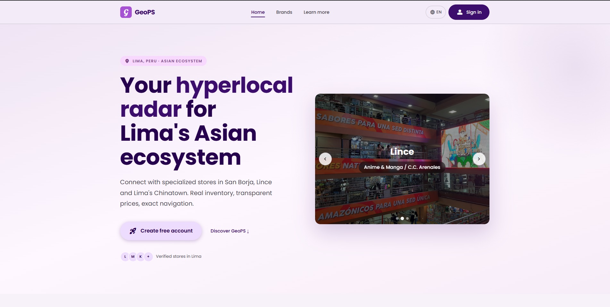
</div>
En esta sección la aplicación presenta su propuesta de valor como un radar hiperlocal en Lima, ofreciendo un acceso directo para que los usuarios creen su cuenta y exploren el ecosistema.

<div align="center">
  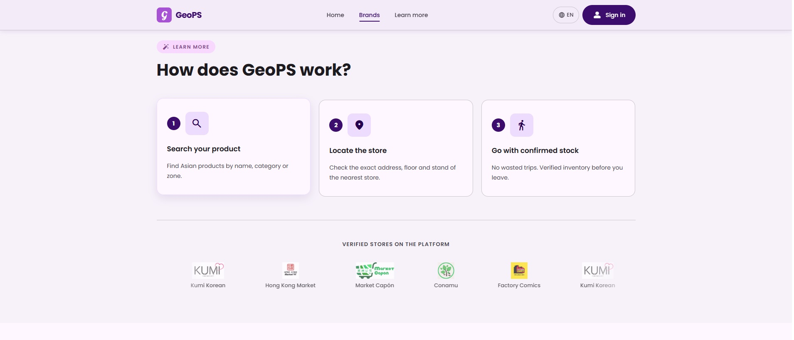
</div>
Aquí la plataforma detalla su proceso operativo basado en la búsqueda de productos, la geolocalización exacta de stands y la verificación de inventario real en tiendas aliadas.
<div align="center">
  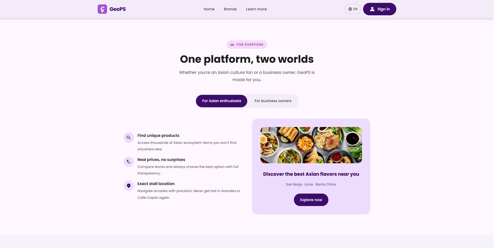
</div>
La interfaz permite elegir entre perfiles de consumidor o negocio, resaltando funciones para comparar precios y navegar con precisión dentro de las galerías más importantes de la ciudad.
<div align="center">
  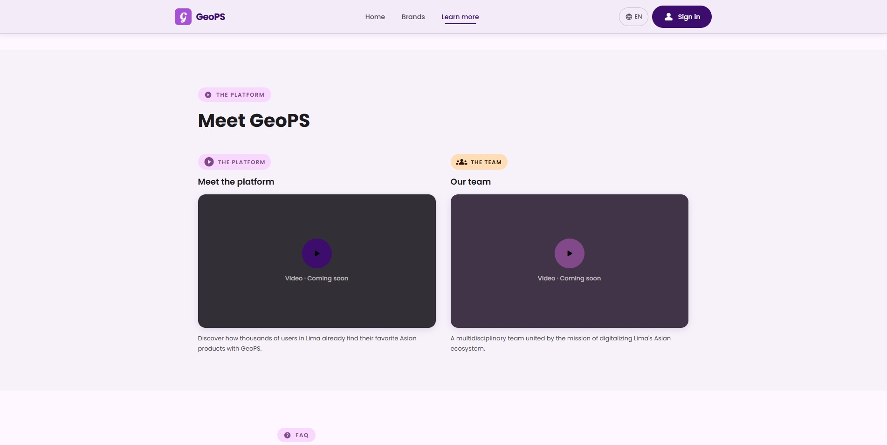
</div>
La Landing Page utiliza este espacio para mostrar su funcionamiento interno mediante videos demostrativos y presentar al equipo responsable de la transformación digital de los comercios asiáticos.
<div align="center">
  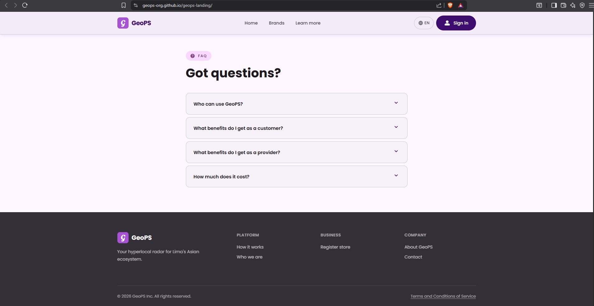
</div>
En esta ventana final, el sistema resuelve dudas frecuentes de los usuarios sobre costos y beneficios, proporcionando además los accesos para el registro formal de nuevos proveedores.
  #### 5.2.3. Implemented Frontend-Web Application Evidence

<div align="center">
  
</div>

<div align="center">
  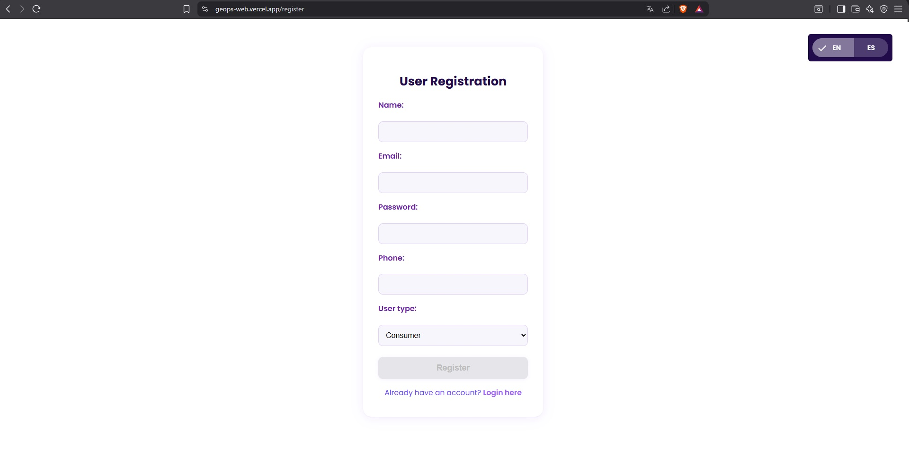
</div>

<div align="center">
  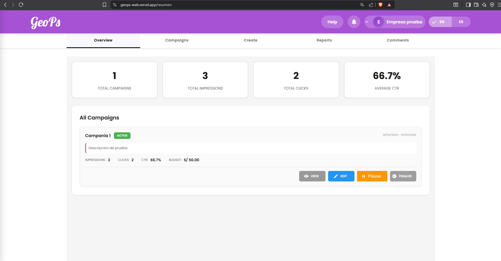
</div>

<div align="center">
  
</div>

<div align="center">
  
</div>

<div align="center">
  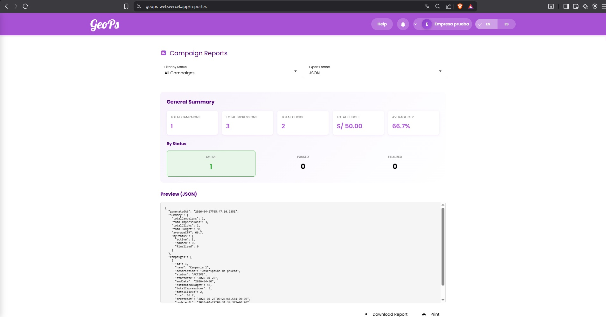
</div>

<div align="center">
  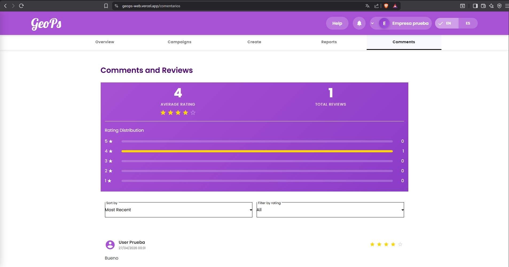
</div>

<div align="center">
  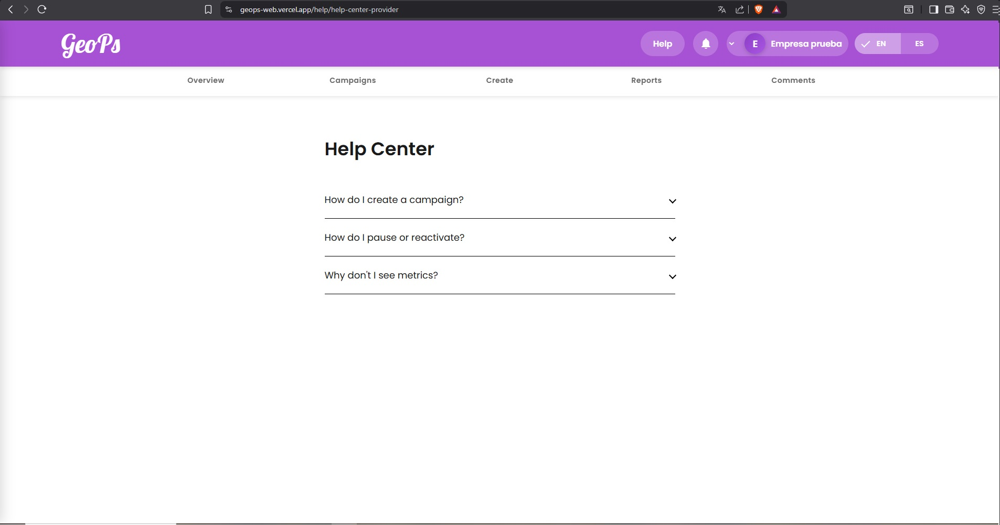
</div>

<div align="center">
  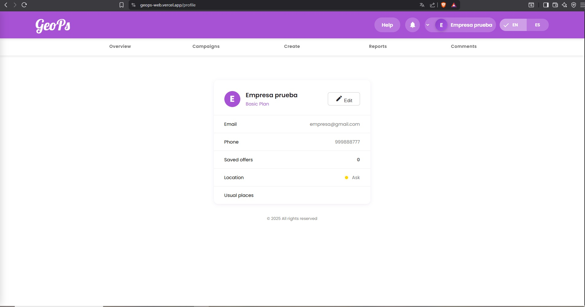
</div>

<div align="center">
  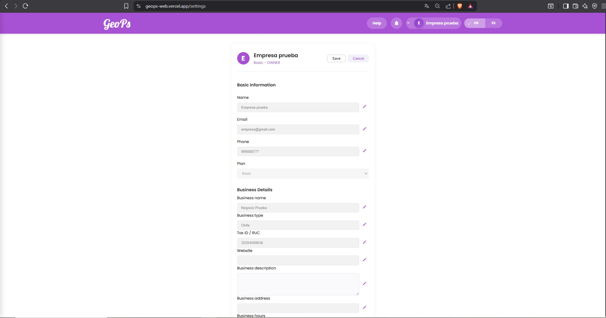
</div>

  #### 5.2.4. Implemented RESTful API and/or Serverless Backend Evidence

<div align="center">
  
</div>

<div align="center">
  
</div>

<div align="center">
  
</div>

<div align="center">
  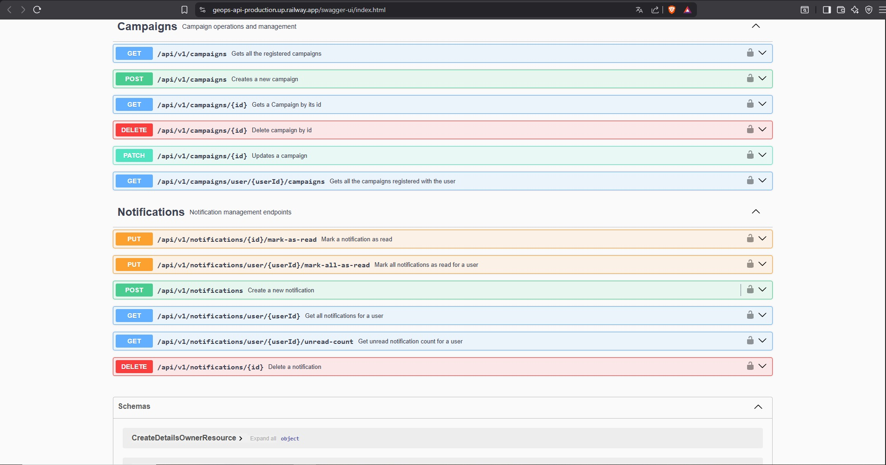
</div>

<div align="center">
  
</div>

  #### 5.2.5. RESTful API documentation

  #### 5.2.6. Team Collaboration Insights


### 5.3 Video About-the-Product

**Enlace Video About The Product - GeoPs:** https://upcedupe-my.sharepoint.com/:v:/g/personal/u202318049_upc_edu_pe/IQClpsJt1lv0SJVXaTq_7_RwAZulho-4j7SJR3cHofT9Bpo?nav=eyJyZWZlcnJhbEluZm8iOnsicmVmZXJyYWxBcHAiOiJTdHJlYW1XZWJBcHAiLCJyZWZlcnJhbFZpZXciOiJTaGFyZURpYWxvZy1MaW5rIiwicmVmZXJyYWxBcHBQbGF0Zm9ybSI6IldlYiIsInJlZmVycmFsTW9kZSI6InZpZXcifX0%3D&e=pc3X8P


## Conclusiones

**Conclusiones y Recomendaciones**

El desarrollo del proyecto GeoPS permitió transformar una idea inicial en una solución tecnológica completa y funcional, integrando landing page, frontend interactivo con Angular y backend robusto con Spring Boot desplegado en la nube. A lo largo de los cuatro sprints se evidenció un progreso consistente en la capacidad técnica del equipo, tanto en términos de diseño de interfaces como en arquitectura de software, integración de servicios y despliegue continuo en plataformas de producción.

A lo largo del proyecto se evidenció una mejora progresiva en la organización del trabajo y en la coordinación del equipo. El uso de metodologías ágiles (Scrum) **SE DEBE EVITAR EL USO DE "metodologías ágiles" REVISAR ANEXO E**, control de versiones mediante GitHub, gestión visual en Trello y comunicación por Discord y Google Meet permitió mantener un flujo de trabajo ordenado y eficiente. Cada sprint aportó valor incremental, fortaleciendo la arquitectura y asegurando la cohesión entre las distintas funcionalidades desarrolladas. El Sprint 4 marcó la culminación del MVP con la implementación del módulo completo de Proveedores, permitiendo a los negocios gestionar campañas publicitarias de manera efectiva.

Desde el punto de vista técnico, se construyó una plataforma sólida que integra módulos esenciales como autenticación, gestión de usuarios, favoritos, ofertas, reseñas, cupones, carritos, pagos, suscripciones y el nuevo módulo de campañas publicitarias para proveedores. El despliegue del backend en Railway y del frontend en Vercel confirma la capacidad del equipo para trabajar con servicios en la nube, manejando entornos reales de producción. La documentación completa del API con Swagger UI facilita la comprensión de los endpoints y permite la futura expansión del sistema.

Las validaciones realizadas con usuarios finales durante el Sprint 4 confirmaron la usabilidad y valor de la plataforma, recibiendo feedback positivo sobre la facilidad de uso, la funcionalidad de geolocalización y los filtros de búsqueda. Los usuarios destacaron la rapidez de GeoPS en comparación con otras plataformas existentes y sugirieron mejoras como el desarrollo de una aplicación móvil nativa y la incorporación de reseñas de usuarios para aumentar la credibilidad de las ofertas.

En su conjunto, el proyecto GeoPS se consolidó como una base tecnológica robusta y escalable, preparada para continuar creciendo en funcionalidades, pruebas automatizadas, mejoras de rendimiento y validaciones continuas de experiencia de usuario. Los resultados obtenidos reflejan un equipo técnicamente competente, organizado y capaz de ejecutar un ciclo completo de desarrollo de software moderno, desde la concepción hasta el deployment en producción y la validación con usuarios reales.

## Bibliografía

Banco Interamericano de Desarrollo (BID). (2020). *La digitalización de las pymes en América Latina y el Caribe*. BID. https://publications.iadb.org

Kemp, S. (2023). *Digital 2023: Peru*. DataReportal. https://datareportal.com/reports/digital-2023-peru

Loza, J. (2024, marzo 15). Peruanos pasan más de cinco horas diarias conectados a internet. *La República*. https://larepublica.pe

Nielsen. (2021). *Trust in Advertising 2021: Global Report*. Nielsen. https://www.nielsen.com

Organisation for Economic Co-operation and Development (OECD). (2020). *SME Policy Index: Latin America and the Caribbean 2019*. OECD Publishing. https://doi.org/10.1787/25203303

Think with Google. (2019). *How mobile search connects consumers to stores*. Google Insights. https://www.thinkwithgoogle.com

World Bank. (2019). *World Development Report 2019: The Changing Nature of Work*. World Bank. https://doi.org/10.1596/978-1-4648-1328-3


## Anexos

**Enlace Organización OpenSourceDevUPC - GeoPs:** https://github.com/OpenSourceDevUPC

**Despliegues y Documentación**

- Enlace API Externo: https://developers.google.com/maps/documentation/javascript/overview?hl=es-419

- Enlace Documentación Swagger: https://geops-backend-production-6f35.up.railway.app/swagger-ui/index.html
  
- Enlace del Proyecto (BackEnd) API Deploy: https://geops-backend-production-6f35.up.railway.app
  
- Enlace del Proyecto (FrontEnd) Deploy: https://geops-frontend.vercel.app/login

- Enlace Landing Page Deploy: https://opensourcedevupc.github.io/Landing/

- Enlace del Servicio JSON Server API: https://json-server-1-p24l.onrender.com/

**Repositorios GitHub**

- Enlace Repositorio BackEnd: https://github.com/geops-org/geops-api

- Enlace Repositorio FrontEnd: https://github.com/geops-org/geops-web

- Enlace Repositorio Landing Page: https://github.com/geops-org/geops-landing

- Enlace Repositorio Project Report: https://github.com/geops-org/geops-report


**Videos Exposiciones**

- Enlace Video Exposición TB1: https://upcedupe-my.sharepoint.com/:v:/g/personal/u202318049_upc_edu_pe/IQAYAOtcnJkrSJ5sMW1GzIvGAXt4Ff89DrfcOtG7Mzwu_LM?nav=eyJyZWZlcnJhbEluZm8iOnsicmVmZXJyYWxBcHAiOiJTdHJlYW1XZWJBcHAiLCJyZWZlcnJhbFZpZXciOiJTaGFyZURpYWxvZy1MaW5rIiwicmVmZXJyYWxBcHBQbGF0Zm9ybSI6IldlYiIsInJlZmVycmFsTW9kZSI6InZpZXcifX0%3D&e=oLgDTu


**Videos About The Team**

- Enlace Video About The Team - GeoPs: https://upcedupe-my.sharepoint.com/:v:/g/personal/u202318049_upc_edu_pe/IQC8deLfhAB-QabaXnuLVJ5oAW9Vq4hqnyj1-bRnjYHHfmY?nav=eyJyZWZlcnJhbEluZm8iOnsicmVmZXJyYWxBcHAiOiJTdHJlYW1XZWJBcHAiLCJyZWZlcnJhbFZpZXciOiJTaGFyZURpYWxvZy1MaW5rIiwicmVmZXJyYWxBcHBQbGF0Zm9ybSI6IldlYiIsInJlZmVycmFsTW9kZSI6InZpZXcifX0%3D&e=P5W6WY

**Video About The Product**

- Enlace Video About The Product - GeoPs: https://upcedupe-my.sharepoint.com/:v:/g/personal/u202318049_upc_edu_pe/IQClpsJt1lv0SJVXaTq_7_RwAZulho-4j7SJR3cHofT9Bpo?nav=eyJyZWZlcnJhbEluZm8iOnsicmVmZXJyYWxBcHAiOiJTdHJlYW1XZWJBcHAiLCJyZWZlcnJhbFZpZXciOiJTaGFyZURpYWxvZy1MaW5rIiwicmVmZXJyYWxBcHBQbGF0Zm9ybSI6IldlYiIsInJlZmVycmFsTW9kZSI6InZpZXcifX0%3D&e=pc3X8P

**Videos Aplicación**

- Enlace Video Web Application Prototype: https://upcedupe-my.sharepoint.com/:v:/g/personal/u202318049_upc_edu_pe/IQD6SaN-XMsAR6NvgRD_Ev7BAf-nnmSLy5uYleYv0lLnt0Q?nav=eyJyZWZlcnJhbEluZm8iOnsicmVmZXJyYWxBcHAiOiJTdHJlYW1XZWJBcHAiLCJyZWZlcnJhbFZpZXciOiJTaGFyZURpYWxvZy1MaW5rIiwicmVmZXJyYWxBcHBQbGF0Zm9ybSI6IldlYiIsInJlZmVycmFsTW9kZSI6InZpZXcifX0%3D&e=V5Lp6h

- Enlace Video Presentación FrontEnd: https://upcedupe-my.sharepoint.com/:v:/g/personal/u202318049_upc_edu_pe/IQBZ_u4YlUBrR5aUuwOgdlXyAayryes00Z1WWwE3w-MPhtU?nav=eyJyZWZlcnJhbEluZm8iOnsicmVmZXJyYWxBcHAiOiJPbmVEcml2ZUZvckJ1c2luZXNzIiwicmVmZXJyYWxBcHBQbGF0Zm9ybSI6IldlYiIsInJlZmVycmFsTW9kZSI6InZpZXciLCJyZWZlcnJhbFZpZXciOiJNeUZpbGVzTGlua0NvcHkifX0&e=i2d5ve

- Enlace Video Presentación BackEnd: https://upcedupe-my.sharepoint.com/:v:/g/personal/u202322855_upc_edu_pe/IQBaDGRLY_lmR7SNyWP_vuefAWi2TUcGcgn4Ua-R3ckkmzM?nav=eyJyZWZlcnJhbEluZm8iOnsicmVmZXJyYWxBcHAiOiJTdHJlYW1XZWJBcHAiLCJyZWZlcnJhbFZpZXciOiJTaGFyZURpYWxvZy1MaW5rIiwicmVmZXJyYWxBcHBQbGF0Zm9ybSI6IldlYiIsInJlZmVycmFsTW9kZSI6InZpZXcifX0%3D&e=b90mcr

**Diseño Figma**

- Enlace Diseño Figma Prototype: https://www.figma.com/proto/mHHx8WStPBr63tLYj42pBX/GeoPs?node-id=2-511&t=I0J1dH7e40wYL90d-1&scaling=min-zoom&content-scaling=fixed&page-id=0%3A1&starting-point-node-id=426%3A3299

- Enlace Diseño Figma: https://www.figma.com/design/mHHx8WStPBr63tLYj42pBX/GeoPs?node-id=336-2468&t=1Nm0EVmUTgy7sfDx-1

**Videos Entrevistas**

