<div align="center" style="margin-top: -5px;">


  
## Universidad Peruana de Ciencias Aplicadas

**Facultad:** Ingeniería

**Carrera:** Ingeniería de Software

**Periodo:** 2026-10

**Código del Curso**: 1ASI0732

**Curso:** Diseño de Experimentos de Ingeniería de Software

**NRC:** 12305

**Profesor:** Noriega Melendez, Julio Manuel

### Informe de TB1

**Startup:** GeoPsLabs

**Nombre del producto:** GeoPs

***“Tu ciudad, tus promociones, tu ahorro.”***

#### Relación de integrantes

| Integrante                          | Código     |
| ----------------------------------- | ---------- |
| Barba Estrada, Bryan Eduardo        | U202323479 |
| Salazar Caballero, Alvaro Fabrizzio | U202321941 |
| Cárdenas Concha, Santiago Iván      | U202311207 |
| Vera Nuñez Nicolas Alejandro        | U202214869 |
| Valverde Portuguez, Natalia Ximena  | U20231a816 |
| Choy Robles, Vanessa May Lang       | U202317450 |
| Diestra Zambrano Adriana Maria      | U202218110 |

<div align="center"><h3>Abril 2026</h3></div><br>

</div>

---

### Registro de Versiones

| Versión | Fecha      | Autor                                                                                                                                                                                                                                                       | Descripción de modificación                                                                                                                                                    |
| :------ | :--------- | :---------------------------------------------------------------------------------------------------------------------------------------------------------------------------------------------------------------------------------------------------------- | :----------------------------------------------------------------------------------------------------------------------------------------------------------------------------- |
| TB1     | 27/04/2026 | Barba Estrada, Bryan Eduardo <br> Cárdenas Concha, Santiago Iván <br> Diestra Zambrano Adriana Maria <br> Valverde Portuguez, Natalia Ximena <br> Salazar Caballero, Alvaro Fabrizzio <br> Choy Robles, Vanessa May Lang <br> Vera Nuñez, Nicolas Alejandro | En la primera entrega del informe de nuestro proyecto, hemos realizado los primeros 5 capítulos del informe y también entregamos la primera versión del landing page de GeoPS. |
| TP1     | 11/05/2026 | Barba Estrada, Bryan Eduardo <br> Cárdenas Concha, Santiago Iván <br> Diestra Zambrano Adriana Maria <br> Valverde Portuguez, Natalia Ximena <br> Salazar Caballero, Alvaro Fabrizzio <br> Choy Robles, Vanessa May Lang <br> Vera Nuñez, Nicolas Alejandro | En esta entrega del informe de nuestro proyecto, hemos realizado los capítulos 6 y 7 del informe ademas de la realizacion de las pruebas y despliegue de la aplicacion funcional. |

---


## Project Report Collaboration Insights

### Project Report Collaboration Insights

#### **TB1 / TP1**
Todas las actividades asignadas para los hitos TB1 y TP1 de **GeoPS Labs** han sido completadas satisfactoriamente. El equipo implementó un flujo de trabajo basado en Gitflow, distribuyendo la carga de trabajo en tres repositorios principales para asegurar la modularidad y el control de versiones tanto del software como de la documentación técnica.

La colaboración se distribuyó de manera equitativa entre los 7 integrantes:
- **Choy Robles, Vanessa May Lang:** Lideró la especificación técnica y la validación de persistencia en el Backend, además de asegurar la integridad del registro en el Frontend.
- **Valverde Portuguez, Natalia Ximena:** Dirigió la alineación estratégica, el Startup Profile y la coherencia del Lean UX Canvas en el Reporte.
- **Barba Estrada, Bryan Eduardo:** Realizó el análisis del Startup Business Model y evaluó el impacto económico del modelo de publicidad hiperlocal.
- **Salazar Caballero, Alvaro Fabrizzio:** Diseñó los User Personas y validó que el diseño responsive del Frontend respete la privacidad de ubicación del usuario.
- **Cárdenas Concha, Santiago Iván:** Estuvo a cargo del diseño de la arquitectura de software (Diagramas de Contenedores y Clases) y la configuración del entorno.
- **Vera Nuñez, Nicolas Alejandro:** Desarrolló el análisis competitivo y verificó que las estrategias de marketing no incurran en prácticas invasivas.
- **Diestra Zambrano, Adriana Maria:** Sustentó el análisis "How Much" con datos globales y validó que la documentación de la API sea transparente y completa.

#### **Evidencias de Colaboración (GitHub Insights)**

**1. Repository: Project Report & Documentation**
*Evidencia de la colaboración de los 7 integrantes en la redacción del informe técnico.*
<p align="center">
  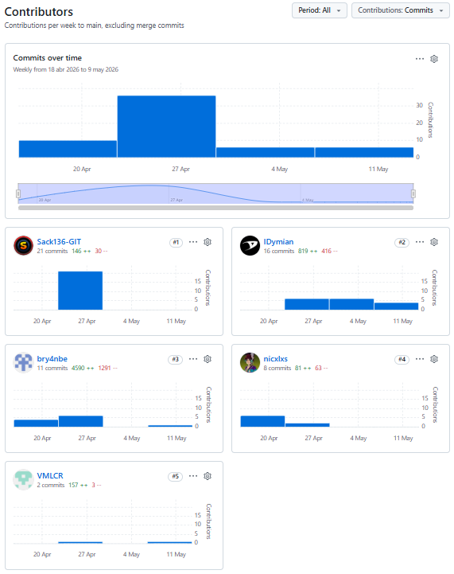
</p>
<p align="center">
  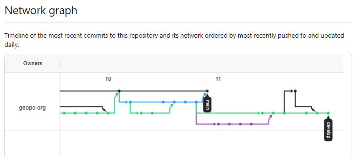
</p>

**2. Repository: Frontend Web Application**
*Desarrollo de la interfaz responsiva y lógica de cliente (Angular).*
<p align="center">
  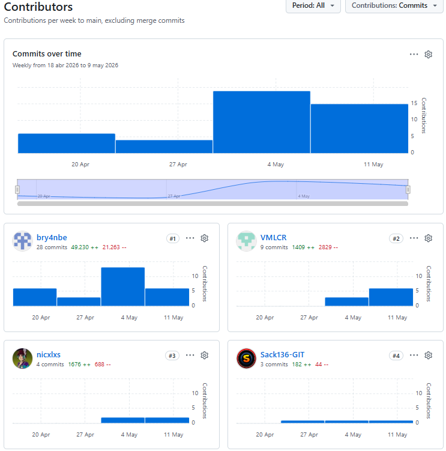
</p>
<p align="center">
  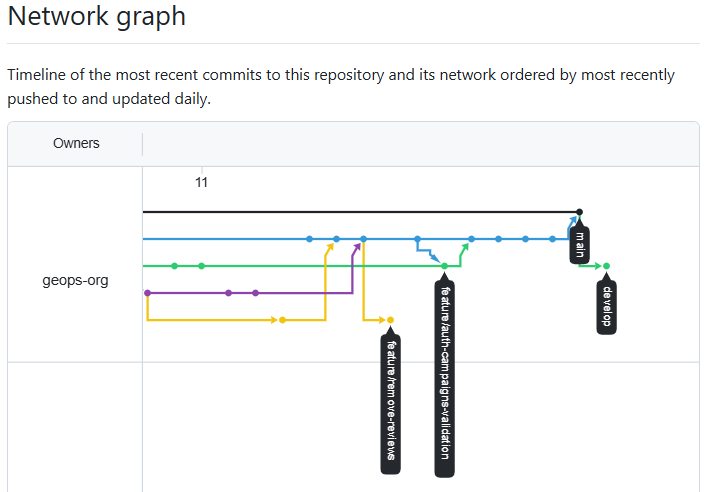
</p>

**3. Repository: Backend RESTful API**
*Desarrollo de la lógica de negocio, seguridad y persistencia (Spring Boot).*
<p align="center">
  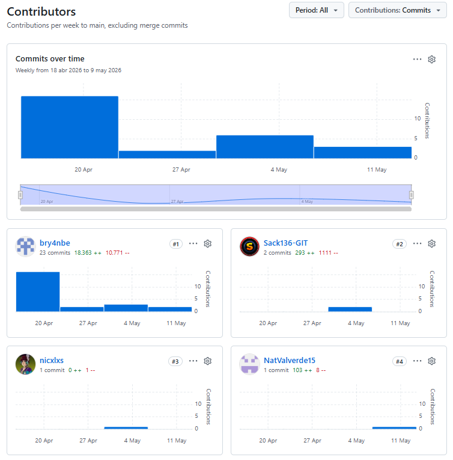
</p>
<p align="center">
  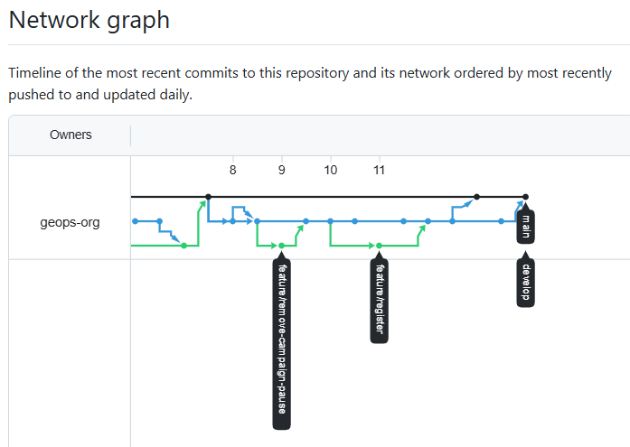
</p>


- [Universidad Peruana de Ciencias Aplicadas](#universidad-peruana-de-ciencias-aplicadas)
  - [Informe de TB1](#informe-de-tb1)
    - [Relación de integrantes](#relación-de-integrantes)
  - [Registro de Versiones](#registro-de-versiones)
- [Capítulo 1: Introducción](#capítulo-1-introducción)
  - [1.1. Startup Profile](#11-startup-profile)
    - [1.1.1. Descripcion del Startup](#111-descripcion-del-startup)
    - [1.1.2. Perfiles de Integrantes del equipo](#112-perfiles-de-integrantes-del-equipo)
  - [1.2. Solution Profile](#12-solution-profile)
    - [1.2.1 Antecedentes y problemática](#121-antecedentes-y-problemática)
      - [1.2.1.1. What](#1211-what)
        - [1.2.1.1.1. ¿Cuál es el problema?](#12111-cuál-es-el-problema)
        - [1.2.1.1.2. ¿Cuál es la relación con la persona en cuestión?](#12112-cuál-es-la-relación-con-la-persona-en-cuestión)
      - [1.2.1.2. When](#1212-when)
        - [1.2.1.2.1. ¿Cuándo sucede el problema?](#12121-cuándo-sucede-el-problema)
        - [1.2.1.2.2. ¿Cuándo utiliza el cliente el producto?](#12122-cuándo-utiliza-el-cliente-el-producto)
      - [1.2.1.3. Where](#1213-where)
        - [1.2.1.3.1. ¿Dónde está el cliente cuando usa el producto?](#12131-dónde-está-el-cliente-cuando-usa-el-producto)
        - [1.2.1.3.2. ¿A dónde se dirige?](#12132-a-dónde-se-dirige)
        - [1.2.1.3.3. ¿Dónde surge el problema?](#12133-dónde-surge-el-problema)
      - [1.2.1.4. Who](#1214-who)
        - [1.2.1.4.1. ¿Quiénes están involucrados?](#12141-quiénes-están-involucrados)
        - [1.2.1.4.2. ¿A quiénes les sucede el problema?](#12142-a-quiénes-les-sucede-el-problema)
        - [1.2.1.4.3. ¿Quién lo utilizará?](#12143-quién-lo-utilizará)
      - [1.2.1.5. Why](#1215-why)
        - [1.2.1.5.1. ¿Cuál es la causa del problema?](#12151-cuál-es-la-causa-del-problema)
      - [1.2.1.6. How](#1216-how)
        - [1.2.1.6.1. ¿En qué condiciones los clientes usan nuestro producto?](#12161-en-qué-condiciones-los-clientes-usan-nuestro-producto)
        - [1.2.1.6.2. ¿Cómo nos conocieron los compradores?](#12162-cómo-nos-conocieron-los-compradores)
        - [1.2.1.6.3. ¿Cómo prefieren los usuarios acceder a nuestro contenido?](#12163-cómo-prefieren-los-usuarios-acceder-a-nuestro-contenido)
        - [1.2.1.6.4. ¿Qué llevó a la persona a llegar a esta situación?](#12164-qué-llevó-a-la-persona-a-llegar-a-esta-situación)
      - [1.2.1.7. How much](#1217-how-much)
    - [1.2.2. Lean UX Process](#122-lean-ux-process)
      - [1.2.2.1. Lean UX Problem Statements](#1221-lean-ux-problem-statements)
      - [1.2.2.2. Lean UX Assumptions](#1222-lean-ux-assumptions)
      - [1.2.2.3. Lean UX Hypothesis Statements](#1223-lean-ux-hypothesis-statements)
      - [1.2.2.4. Lean UX Canvas](#1224-lean-ux-canvas)
  - [1.3. Segmentos objetivos](#13-segmentos-objetivos)
- [Capitulo 2: Requirements Elicitation \& Analysis](#capitulo-2-requirements-elicitation--analysis)
  - [2.1. Competidores](#21-competidores)
    - [2.1.1. Analisis competitivo](#211-analisis-competitivo)
    - [¿Por qué llevar a cabo este análisis?](#por-qué-llevar-a-cabo-este-análisis)
    - [2.1.2. Estrategias y tácticas frente a competidores](#212-estrategias-y-tácticas-frente-a-competidores)
    - [1. Estrategias Ofensivas: Aprovechando Debilidades de la Competencia](#1-estrategias-ofensivas-aprovechando-debilidades-de-la-competencia)
    - [2. Estrategias Defensivas: Afrontando Fortalezas de la Competencia](#2-estrategias-defensivas-afrontando-fortalezas-de-la-competencia)
    - [3. Aprovechamiento del Contexto (Oportunidades y Amenazas)](#3-aprovechamiento-del-contexto-oportunidades-y-amenazas)
    - [🟢 Oportunidades: Impulso del Crecimiento](#-oportunidades-impulso-del-crecimiento)
    - [🔴 Amenazas: Mitigación de Riesgos](#-amenazas-mitigación-de-riesgos)
  - [2.2. Entrevistas](#22-entrevistas)
    - [2.2.1. Diseño de entrevistas](#221-diseño-de-entrevistas)
    - [Fase 1: Identificación y Perfilamiento del Negocio](#fase-1-identificación-y-perfilamiento-del-negocio)
    - [Fase 2: Comportamiento y Marketing Actual](#fase-2-comportamiento-y-marketing-actual)
    - [Fase 3: Identificación de Puntos de Dolor (El Problema)](#fase-3-identificación-de-puntos-de-dolor-el-problema)
    - [Fase 4: Validación de la Solución (GeoPS Business)](#fase-4-validación-de-la-solución-geops-business)
    - [Fase 5: Cierre y Sugerencias](#fase-5-cierre-y-sugerencias)
    - [Fase 1: Identificación y Perfilamiento (Filiación)](#fase-1-identificación-y-perfilamiento-filiación)
    - [Fase 2: Comportamiento y Hábitos de Compra](#fase-2-comportamiento-y-hábitos-de-compra)
    - [Fase 3: Identificación de Puntos de Dolor (El Problema)](#fase-3-identificación-de-puntos-de-dolor-el-problema-1)
    - [Fase 4: Validación de la Solución (GeoPS)](#fase-4-validación-de-la-solución-geops)
    - [Fase 5: Cierre y Sugerencias](#fase-5-cierre-y-sugerencias-1)
    - [2.2.2. Registro de entrevistas](#222-registro-de-entrevistas)
    - [2.2.3. Análisis de entrevistas](#223-análisis-de-entrevistas)
  - [1. Segmento: Usuario Consumidor](#1-segmento-usuario-consumidor)
    - [Características Objetivas (Perfil y Comportamiento)](#características-objetivas-perfil-y-comportamiento)
    - [Características Subjetivas (Puntos de Dolor y Expectativas)](#características-subjetivas-puntos-de-dolor-y-expectativas)
  - [2. Segmento: Usuario Proveedor / Dueño de Tienda](#2-segmento-usuario-proveedor--dueño-de-tienda)
    - [Características Objetivas (Gestión y Marketing)](#características-objetivas-gestión-y-marketing)
    - [Características Subjetivas (Necesidades y Riesgos)](#características-subjetivas-necesidades-y-riesgos)
  - [2.3. Needfinding](#23-needfinding)
    - [2.3.1. User Personas](#231-user-personas)
    - [2.3.2  User Task Matrix](#232--user-task-matrix)
    - [2.3.3. User Journey Mapping](#233-user-journey-mapping)
    - [2.3.4. Empathy Mapping](#234-empathy-mapping)
  - [2.4. Ubiquitous Language](#24-ubiquitous-language)
- [Capitulo 3: Requirements Specification](#capitulo-3-requirements-specification)
  - [3.1. User Stories](#31-user-stories)
  - [3.2. Impact Mapping](#32-impact-mapping)
  - [3.3. Product Backlog](#33-product-backlog)
- [Capítulo 4: Product Design](#capítulo-4-product-design)
  - [4.1. Style Guidelines](#41-style-guidelines)
    - [4.1.1. General Style Guidelines](#411-general-style-guidelines)
    - [4.1.2. Web Style Guidelines](#412-web-style-guidelines)
  - [4.2. Information Architecture](#42-information-architecture)
    - [4.2.1. Organization Systems](#421-organization-systems)
    - [4.2.2. Labeling Systems](#422-labeling-systems)
    - [4.2.3. SEO Tags and Meta Tags](#423-seo-tags-and-meta-tags)
    - [4.2.4. Searching Systems](#424-searching-systems)
    - [4.2.5. Navigation Systems](#425-navigation-systems)
  - [4.3. Landing Page UI Design](#43-landing-page-ui-design)
    - [4.3.1. Landing Page Wireframe](#431-landing-page-wireframe)
    - [4.3.2. Landing Page Mock-up](#432-landing-page-mock-up)
  - [4.4. Web Applications UX/UI Design](#44-web-applications-uxui-design)
    - [4.4.1. Web Applications Wireframes](#441-web-applications-wireframes)
    - [4.4.2. Web Applications Wireflow Diagrams](#442-web-applications-wireflow-diagrams)
    - [4.4.3. Web Applications Mock-ups](#443-web-applications-mock-ups)
    - [4.4.4. Web Applications User Flow Diagrams](#444-web-applications-user-flow-diagrams)
  - [4.5. Web Applications Prototyping](#45-web-applications-prototyping)
  - [4.6. Domain-Driven Software Architecture](#46-domain-driven-software-architecture)
    - [4.6.1. Software Architecture Context Diagram](#461-software-architecture-context-diagram)
- [4.6.2. Software Architecture Container Diagram](#462-software-architecture-container-diagram)
- [4.6.3. Software Architecture Components Diagrams](#463-software-architecture-components-diagrams)
  - [4.6.3.1. Identity Context Components Diagram](#4631-identity-context-components-diagram)
  - [4.6.3.2. Campaign Context Components Diagram](#4632-campaign-context-components-diagram)
  - [4.6.3.3. Offers Context Components Diagram](#4633-offers-context-components-diagram)
  - [4.6.3.4. Shared Kernel Components Diagram](#4634-shared-kernel-components-diagram)
  - [4.7. Software Object-Oriented Design](#47-software-object-oriented-design)
    - [4.7.1. Class Diagrams](#471-class-diagrams)
    - [4.7.2. Class Dictionary](#472-class-dictionary)
  - [4.8. Database Design](#48-database-design)
    - [4.8.1. Relational/Non-Relational Database Diagram](#481-relationalnon-relational-database-diagram)
- [Capítulo 5: Product Implementation](#capítulo-5-product-implementation)
  - [5.1. Software Configuration Management](#51-software-configuration-management)
    - [5.1.1. Software Development Environment Configuration](#511-software-development-environment-configuration)
    - [5.1.2. Source Code Management](#512-source-code-management)
    - [5.1.3. Source Code Style Guide \& Conventions](#513-source-code-style-guide--conventions)
    - [5.1.4. Software Deployment Configuration](#514-software-deployment-configuration)
  - [5.2. Product Implementation \& Deployment.](#52-product-implementation--deployment)
    - [5.2.1. Sprint Backlogs](#521-sprint-backlogs)
    - [5.2.2. Implemented Landing Page Evidence](#522-implemented-landing-page-evidence)
    - [5.2.3. Implemented Frontend-Web Application Evidence](#523-implemented-frontend-web-application-evidence)
    - [5.2.4. Implemented RESTful API and/or Serverless Backend Evidence](#524-implemented-restful-api-andor-serverless-backend-evidence)
    - [5.2.5. RESTful API documentation](#525-restful-api-documentation)
  - [5.3 Video About-the-Product](#53-video-about-the-product)
- [Conclusiones](#conclusiones)
- [Bibliografía](#bibliografía)
- [Anexos](#anexos)


---

## Student Outcome 

**ABET – EAC - Student Outcome 4**

La capacidad de reconocer responsabilidades éticas y profesionales en situaciones de ingeniería y hacer juicios informados, que deben considerar el impacto de las soluciones de ingeniería en contextos globales, económicos, ambientales y sociales.

En el siguiente cuadro se describe las acciones realizadas y enunciados de conclusiones por parte del grupo, que permiten sustentar el haber alcanzado el logro del **ABET – EAC - Student Outcome 4**.

| Criterio específico | Acciones Realizadas | Conclusiones |
|:---|:---|:---|
| **Responsabilidad ética y profesional** | **Choy Robles, Vanessa May Lang**<br>**TB1:** Lideró la especificación de requerimientos técnicos, asegurando que las User Stories priorizaran la seguridad de datos en el registro.<br>**TP1:** Implementó validaciones de registro y decidió retirar la sección de reviews para proteger la integridad de los comercios afiliados.<br><br>**Barba Estrada, Bryan Eduardo**<br>**TB1:** Realizó el análisis del Startup Business Model enfocado en PyMEs.<br>**TP1:** Evaluó el impacto económico del modelo de publicidad hiperlocal para asegurar un beneficio justo al comerciante.<br><br>**Salazar Caballero, Alvaro Fabrizzio**<br>**TB1:** Diseñó los User Personas basados en la cultura asiática.<br>**TP1:** Validó que el diseño responsive del Frontend respete la privacidad de ubicación del usuario final.<br><br>**Cárdenas Concha, Santiago Iván**<br>**TB1:** Elaboró el Impact Mapping y el Architecture Overview Diagram.<br>**TP1:** Aseguró que el diseño de clases y la arquitectura del sistema minimicen el uso innecesario de recursos del servidor.<br><br>**Vera Nuñez, Nicolas Alejandro**<br>**TB1:** Desarrolló el análisis competitivo frente a grandes plataformas.<br>**TP1:** Verificó que las estrategias de marketing de GeoPS no incurran en prácticas de publicidad invasiva.<br><br>**Valverde Portuguez, Natalia Ximena**<br>**TB1:** Dirigió la fase inicial de alineación estratégica, definiendo la misión y visión centrada en la digitalización ética de comercios locales.<br>**TP1:** Supervisó que el Lean UX Canvas mantuviera el enfoque en soluciones de bajo costo para las PyMEs.<br><br>**Diestra Zambrano, Adriana Maria**<br>**TB1:** Sustentó el análisis "How Much" con datos de importación globales.<br>**TP1:** Validó que la documentación de la API refleje con transparencia las capacidades del sistema. | El equipo demostró un juicio profesional sólido al equilibrar la innovación tecnológica con la responsabilidad social. Al asignar responsables específicos para la seguridad de datos y el análisis de impacto económico, se garantizó que **GeoPS Labs** no solo sea una herramienta funcional, sino un motor de crecimiento ético para las PyMEs orientales en Lima Moderna. Esta estructura permitió que cada decisión técnica, desde el manejo de la base de datos hasta la interfaz de usuario, estuviera alineada con los estándares de privacidad y transparencia.<br><br>Se consolidó un entorno de desarrollo responsable mediante la ejecución de los Sprints de TB1 y TP1, integrando arquitectura de software y diseño de bases de datos bajo principios profesionales. El cumplimiento de los objetivos se evidencia en la entrega de un producto que protege la reputación de los negocios locales y ofrece una experiencia segura al consumidor, transformando la problemática detectada en una solución de ingeniería consciente de su impacto global y económico. |

## Capítulo 1: Introducción

### 1.1. Startup Profile

#### 1.1.1. Descripcion del Startup

**GeoPS Labs** es una startup enfocada en el desarrollo de soluciones tecnológicas que centralizan la oferta de productos asiáticos y orientales en la zona de Lima Moderna, conectando este creciente mercado de cultura oriental (gastronomía, cosmética e insumos coreanos, japoneses y chinos) con usuarios mediante publicidad hiperlocalizada basada en análisis de geolocalización inteligente.

A través de una plataforma web accesible desde cualquier navegador, los usuarios pueden visualizar ofertas de insumos, alimentos y artículos orientales en tiempo real, mientras que los comercios especializados acceden a un panel de gestión de campañas con herramientas de marketing basadas en proximidad y perfil de movimiento. Esto permite aumentar la conversión de sus estrategias publicitarias con un menor costo y mayor control de resultados en un mercado de nicho. **GeoPS Labs** apuesta por combinar tecnología, datos y experiencia de usuario para generar beneficios reales, priorizando siempre la privacidad y la relevancia en la entrega de contenidos.
  
**Misión**

Conectar personas y comercios de productos orientales en Lima Moderna de manera inteligente y relevante, facilitando el acceso a la cultura y productos de origen asiático mediante tecnología web de geolocalización respetuosa y personalizada.
  
**Visión**

Ser la plataforma web líder en la centralización y publicidad hiperlocalizada de productos asiáticos en Latinoamérica, revolucionando la manera en que los comercios especializados y usuarios interactúan en el entorno digital urbano.

<div align="center">
  
</div>

#### 1.1.2. Perfiles de Integrantes del equipo

<div align="center">
  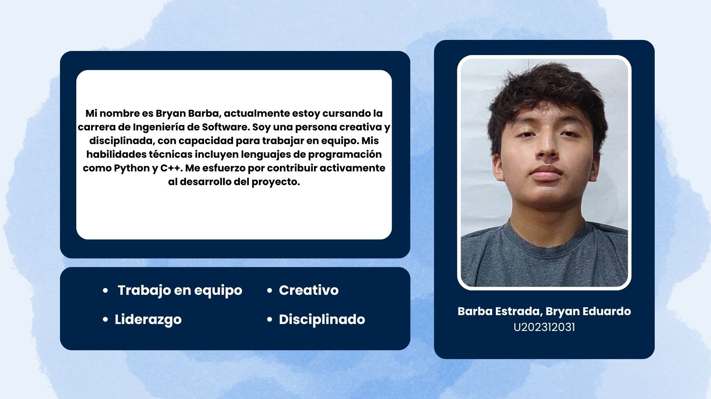<br>
  <strong>Bryan</strong>
  <br><br>
  
  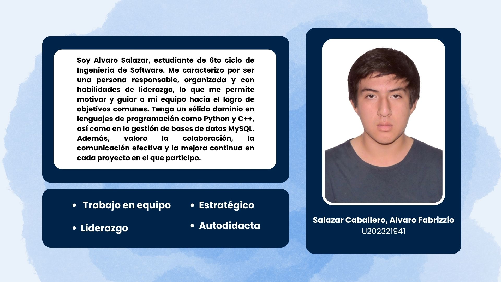<br>
  <strong>Álvaro</strong>
  <br><br>

  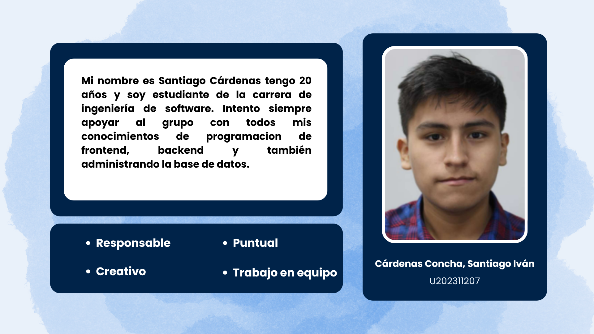<br>
  <strong>Santiago</strong>
  <br><br>

  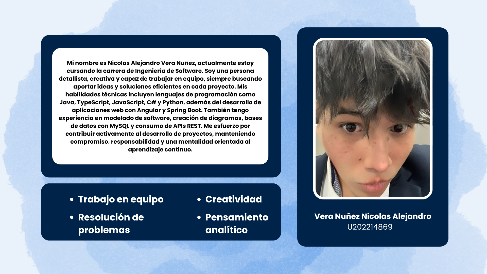<br>
  <strong>Nicolas</strong>
  <br><br>

  <br>
  <strong>Vanesa</strong>
  <br><br>

  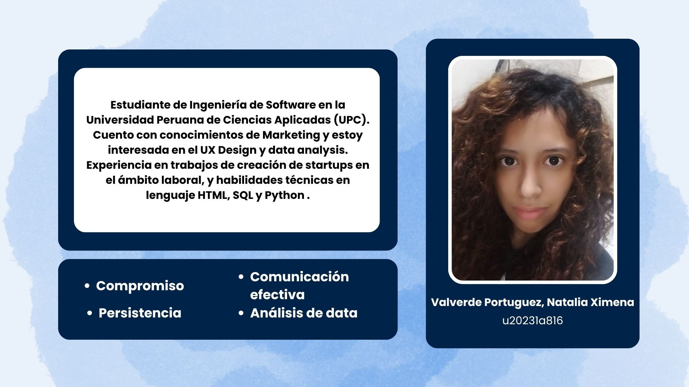<br>
  <strong>Ximena</strong>
  <br><br>
  
  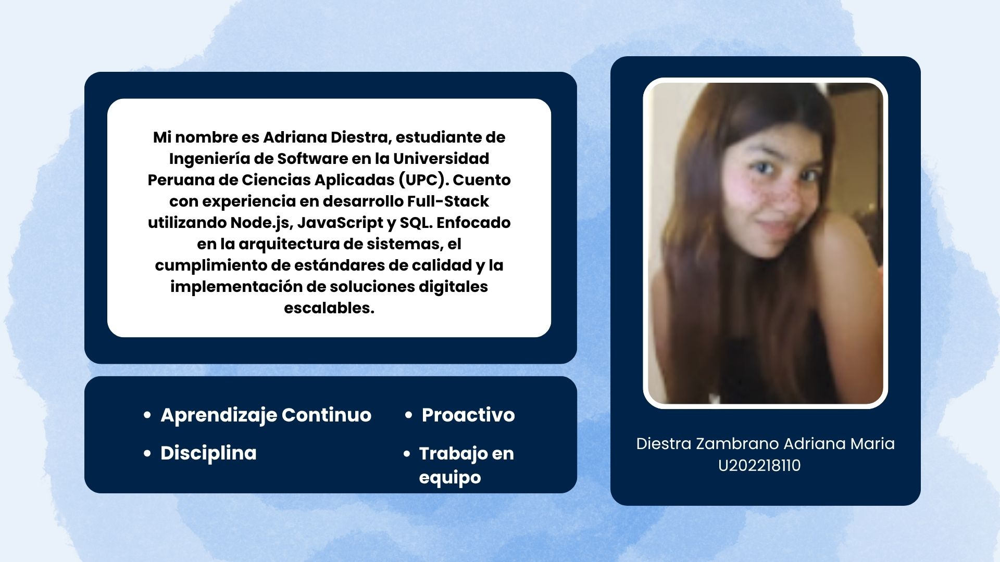<br>
  <strong>Adriana</strong>
</div>

### 1.2. Solution Profile

**GeoPS Labs (Geo Publicity Service)** es una plataforma web que centraliza comercios de productos asiáticos y orientales (Corea, Japón y China) con consumidores en Lima Moderna mediante geolocalización inteligente y notificaciones web push, ofreciendo promociones y publicidad relevante en tiempo real.

La solución permite a los negocios especializados gestionar campañas digitales de manera sencilla y accesible desde un navegador, mientras que los usuarios disfrutan de una experiencia rápida y personalizada para localizar artículos de gastronomía o cosmética oriental sin necesidad de descargar aplicaciones adicionales.

Con un diseño responsive que se adapta a cualquier dispositivo, **GeoPS Labs** busca:

- Optimizar la búsqueda de productos asiáticos específicos y de tendencia en zonas de conveniencia.

- Impulsar la digitalización de las PyMEs dedicadas al rubro oriental en el mercado peruano.

- Fortalecer la conexión entre negocios especializados y clientes interesados en la cultura asiática dentro de Lima Moderna. 

#### 1.2.1 Antecedentes y problemática

En el Perú, las PyMEs del sector de importación y comercialización de productos asiáticos enfrentan barreras críticas para digitalizarse, dependiendo aún de métodos tradicionales o redes sociales saturadas donde el mensaje se pierde (PCM, 2023). En Lima Moderna, el interés por la gastronomía, cosmética e insumos orientales ha crecido exponencialmente, logrando que la penetración de marcas asiáticas en los hogares pase del 9.3% al 24.6% en solo tres años (Kantar, 2025). Sin embargo, los consumidores experimentan fatiga publicitaria, desconfiando de anuncios genéricos, pese a que el 83% de peruanos declara preferir activamente estos productos (IPSOS, 2025).

  Aunque existen apps de delivery, estas cobran comisiones de hasta el 30%, lo que asfixia el margen de las PyMEs y deja un vacío para que los comercios locales conecten directamente con los vecinos. Con peruanos pasando más de 5 horas diarias conectados (Loza, 2024), existe una desconexión: el cliente quiere el producto asiático de tendencia que está cerca, pero no tiene una herramienta eficiente para localizarlo. GeoPS Labs cierra esta brecha centralizando la oferta oriental en una plataforma web responsiva que elimina los altos costos de intermediación.


##### 1.2.1.1. What
###### 1.2.1.1.1. ¿Cuál es el problema?
Las PyMEs de productos asiáticos en Lima enfrentan altos costos para pautar en grandes plataformas y falta de herramientas para medir cuántos usuarios de su entorno cercano realmente ingresan a su establecimiento físico. Según el BID (2020), el 74% de las micro y pequeñas empresas carece de capacidades para adoptar herramientas digitales competitivas. A esto se suma que el 64% de los usuarios considera la publicidad online irrelevante (Nielsen, 2021), ignorando ofertas de productos orientales por no considerarlas oportunas o geográficamente accesibles.

###### 1.2.1.1.2. ¿Cuál es la relación con la persona en cuestión?
Para el consumidor de Lima Moderna, la problemática se traduce en frustración: recibe publicidad de productos asiáticos genéricos que no puede adquirir de inmediato o que requieren envíos costosos, perdiendo oportunidades de ahorro en su zona. Para el comerciante, implica ineficiencia: invierte en publicidad sin métricas de proximidad claras, limitando su capacidad de competir con grandes importadoras que dominan el entorno digital (World Bank, 2019).

##### 1.2.1.2. When
###### 1.2.1.2.1. ¿Cuándo sucede el problema?
El problema es crítico en el momento de la intención de compra inmediata, cuando el usuario busca un insumo o producto asiático específico y la publicidad que recibe no es contextual. Según el Informe Digital 2024 (Kemp, 2024), aunque los peruanos pasan más de 5 horas conectados, la saturación de anuncios masivos disminuye la utilidad de la información en el momento clave de decisión.

###### 1.2.1.2.2. ¿Cuándo utiliza el cliente el producto?
Los consumidores pueden acceder a GeoPS Web en cualquier momento de su jornada digital, ya sea desde dispositivos de escritorio en sus hogares o mediante smartphones. A diferencia de las aplicaciones móviles que requieren instalación, esta solución web elimina fricciones y permite un acceso inmediato, especialmente en instantes donde la proximidad y la oportunidad de adquirir productos asiáticos son factores decisivos. Esto resulta clave porque, de acuerdo con Think with Google (2019), el 76% de las personas que buscan algo cercano en su dispositivo visitan un negocio relacionado en el plazo de 24 horas, y el 28% de esas búsquedas resultan en una compra. Con GeoPS Web, se busca que estas oportunidades de mercado no se pierdan por falta de visibilidad o relevancia geográfica de los comercios especializados.

##### 1.2.1.3. Where
###### 1.2.1.3.1. ¿Dónde está el cliente cuando usa el producto?
El cliente se encuentra principalmente en los distritos que conforman Lima Moderna (San Borja, Surco, Miraflores, San Isidro, Jesús María, Lince, Magdalena y Pueblo Libre), navegando desde su smartphone o laptop. La geolocalización habilitada en los navegadores modernos permite que la experiencia de GeoPS Web sea fluida y precisa, detectando la ubicación del usuario en tiempo real para mostrar ofertas exclusivas de tiendas de productos orientales y asiáticos situadas a pocos metros de su posición actual.

###### 1.2.1.3.2. ¿A dónde se dirige?
El usuario suele estar en trayectos hacia su hogar, oficina o centros de estudio. GeoPS Web aprovecha estos desplazamientos para recomendar promociones en comercios especializados que se encuentran en su ruta habitual dentro de los distritos de la zona moderna.

###### 1.2.1.3.3. ¿Dónde surge el problema?
El problema surge en los entornos comerciales de Lima Moderna, donde la alta densidad de negocios asiáticos carece de un canal digital centralizado que organice su oferta para el público local. Según el Banco Mundial (2019), esta desconexión tecnológica limita la competitividad de las PyMEs y genera pérdidas al no conectar el stock de nicho con consumidores cercanos. GeoPS Labs resuelve esta brecha mediante publicidad hiperlocal desde el navegador, vinculando la oferta especializada con la demanda urbana en tiempo real.

##### 1.2.1.4. Who
###### 1.2.1.4.1. ¿Quiénes están involucrados?
En el ecosistema de GeoPS Web intervienen principalmente tres actores clave que dan vida a la plataforma:

- Consumidores de Cultura Asiática: Usuarios residentes o visitantes de Lima Moderna que buscan productos auténticos de tendencia (K-Beauty, J-Food, snacks coreanos, cosmética japonesa, etc.) de forma rápida, verificada y sin pagar sobrecostos por envíos a larga distancia.

- PyMEs Orientales Especializadas: Pequeños y medianos comercios (markets, boutiques de skincare o restaurantes) que necesitan digitalizar su oferta de nicho para captar al público de su entorno geográfico inmediato de manera eficiente.

- Administradores de GeoPS Labs: Actúan como el facilitador tecnológico responsable de garantizar la seguridad de los datos, la usabilidad de la plataforma web y la transparencia en la entrega de las notificaciones de proximidad.

###### 1.2.1.4.2. ¿A quiénes les sucede el problema?
El problema afecta a los consumidores de Lima Moderna, quienes debido a la fatiga publicitaria y la falta de información centralizada, pierden oportunidades de ahorro en productos asiáticos cercanos, y a las PyMEs del sector oriental, que quedan invisibilizadas frente a grandes cadenas al no poder costear marketing digital ni altas comisiones de delivery. Según Nielsen (2021), esta desconexión se refleja en que el 64% de los usuarios considera irrelevante la publicidad actual, mientras que el Banco Mundial (2019) advierte que esta falta de herramientas de proximidad limita severamente la competitividad de los pequeños negocios locales.
  
###### 1.2.1.4.3. ¿Quién lo utilizará?
La plataforma será utilizada por consumidores entusiastas de la cultura asiática en Lima Moderna, quienes buscan acceso inmediato a promociones de K-Beauty o J-Food sin descargar aplicaciones adicionales, y por dueños de PyMEs orientales, que requieren un panel sencillo para autogestionar su publicidad hiperlocal sin depender de intermediarios costosos. Este formato de aplicación web responde a la tendencia marcada por Statista (2022), donde más del 70% de los usuarios prefieren soluciones digitales de acceso directo y sin procesos complejos de instalación, consolidando a GeoPS Web como una herramienta ágil para conectar la oferta especializada con la demanda local en tiempo real.
  
##### 1.2.1.5. Why
###### 1.2.1.5.1. ¿Cuál es la causa del problema?
La causa principal radica en una brecha estructural de acceso tecnológico y económico: las PyMEs de productos asiáticos carecen de los recursos financieros y conocimientos técnicos para competir en canales digitales tradicionales o costear comisiones de delivery, lo que las mantiene atadas a métodos de difusión ineficientes (BID, 2020). Por otro lado, para los consumidores, la saturación de publicidad genérica y la falta de una plataforma centralizada que organice la oferta por proximidad generan desconfianza y fatiga publicitaria (Nielsen, 2021). Esta combinación de factores, sumada a la limitada adopción de herramientas de geolocalización por parte de los pequeños comercios, crea una desconexión donde la oferta especializada no logra alcanzar al público interesado que se encuentra en su entorno inmediato (World Bank, 2019).

##### 1.2.1.6. How
###### 1.2.1.6.1. ¿En qué condiciones los clientes usan nuestro producto?
Los usuarios acceden a GeoPS Web desde el navegador en momentos de necesidad inmediata, ya sea para localizar ofertas de productos asiáticos cerca de su posición o al planear una compra de tendencia en Lima Moderna. Bajo estas condiciones, el cliente demanda rapidez, personalización y simplicidad sin fricciones de descarga; mientras tanto, las PyMEs lo utilizan como una herramienta de bajo costo y fácil gestión para visibilizar su stock en tiempo real. Según Think with Google (2019), esta capacidad de respuesta inmediata es decisiva, ya que la mayoría de las búsquedas de proximidad se realizan bajo condiciones de movilidad y resultan en una visita al negocio físico en menos de 24 horas.

###### 1.2.1.6.2. ¿Cómo nos conocieron los compradores?
La plataforma se da a conocer estratégicamente mediante redes sociales, motores de búsqueda y marketing de contenidos enfocado en tendencias asiáticas. En el Perú, más del 70% de los usuarios descubre nuevas marcas en línea, principalmente a través de anuncios digitales y recomendaciones en comunidades especializadas (Kemp, 2024). GeoPS Web aprovecha este comportamiento para captar al público de Lima Moderna que ya consume contenido sobre cultura oriental, convirtiendo ese interés digital en visitas presenciales a los comercios locales.
  
###### 1.2.1.6.3. ¿Cómo prefieren los usuarios acceder a nuestro contenido?
Los usuarios prefieren la inmediatez de las notificaciones web push combinada con la autonomía de la búsqueda activa dentro de la plataforma. Esta preferencia por la personalización contextual es clave para GeoPS Web, considerando que un 60% de los consumidores latinoamericanos valora que la publicidad sea relevante según su ubicación (Nielsen, 2021).
  
###### 1.2.1.6.4. ¿Qué llevó a la persona a llegar a esta situación?
Los consumidores llegaron a esta situación debido a la saturación de publicidad genérica y la creciente falta de confianza en anuncios que no coinciden con su ubicación real. Por su parte, las PyMEs del sector asiático se enfrentan a la presión de digitalizarse bajo barreras económicas y técnicas que las mantienen invisibilizadas. Según el Banco Mundial (2019), esta desconexión es una consecuencia directa de la falta de herramientas tecnológicas accesibles que permitan a los pequeños comercios competir en igualdad de condiciones en el entorno digital.
  
##### 1.2.1.7. How much
El mercado de productos orientales en el Perú se sustenta en un crecimiento robusto y sostenido de las importaciones asiáticas, destacando especialmente la categoría de Bienes de consumo, que según los datos de WITS, ha liderado el volumen de importación con una recuperación notable hacia el año 2023. Esta tendencia macroeconómica se traduce localmente en una demanda inelástica donde rubros específicos como el K-Beauty han logrado incorporar a 104,000 nuevos hogares compradores, mientras que la gastronomía asiática genera ingresos superiores a los S/ 2,086 millones anuales, impulsados principalmente por el alto poder adquisitivo de los niveles socioeconómicos A y B en Lima Moderna. A pesar de este flujo constante de productos alimenticios y bienes de consumo evidenciado en la Gráfica N° 1, persiste una brecha crítica en la visibilidad local, lo que justifica la propuesta de valor de GeoPS al conectar este stock masivo de productos de tendencia con los consumidores que se encuentran en su entorno geográfico inmediato.

**Gráfico 1**<br>
*Tendencias de importación — Análisis "How much"*

<div align="center">
    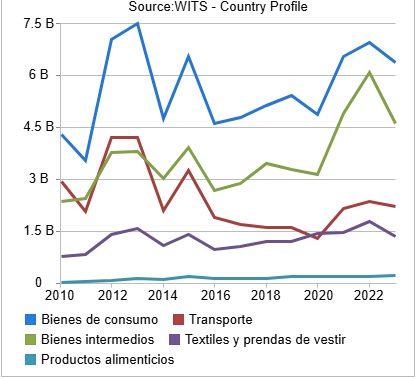
</div>

*Nota.* Elaboración propia basada en datos de WITS - Country Profile.

#### 1.2.2. Lean UX Process
  
##### 1.2.2.1. Lean UX Problem Statements
- Hemos observado que los consumidores interesados en productos orientales/asiáticos en Lima Moderna descubren constantemente productos atractivos en redes sociales, pero tienen dificultades para encontrar dónde comprarlos cerca, verificar su disponibilidad o identificar tiendas confiables que los ofrezcan.
**¿Cómo podríamos ayudar a estos consumidores a descubrir productos asiáticos auténticos, cercanos y disponibles en tiempo real desde una sola plataforma?**

- Hemos observado que los negocios especializados en productos orientales/asiáticos dependen principalmente de redes sociales para promocionarse, lo que limita su visibilidad local, dificulta captar clientes cercanos en el momento de compra y reduce su capacidad de convertir interés digital en visitas al local.
**¿Cómo podríamos ayudar a estos negocios a aumentar su visibilidad hiperlocal y atraer consumidores cercanos con intención real de compra?**

- Hemos observado que los consumidores desconfían de promociones poco claras, productos no auténticos o publicaciones desactualizadas, especialmente cuando descubren productos importados en redes sociales sin información verificable sobre precio, ubicación o disponibilidad.
**¿Cómo podríamos ofrecer una experiencia confiable y transparente que permita descubrir productos orientales con mayor seguridad y confianza?**

- Hemos observado que muchas tiendas especializadas en productos asiáticos tienen una oferta valiosa y diferenciada, pero no cuentan con herramientas simples para comunicar promociones, disponibilidad y novedades de forma geolocalizada y en tiempo real.  
**¿Cómo podríamos facilitar a estos negocios una forma simple y efectiva de promocionar sus productos a consumidores cercanos sin depender exclusivamente de redes sociales?**

##### 1.2.2.2. Lean UX Assumptions
  
**Business Outcomes (Resultados de negocio que esperamos)**  
  - Incrementar en al menos un 20% la visibilidad digital de tiendas especializadas en productos asiáticos durante los primeros 6 meses, mediante una plataforma enfocada en descubrimiento hiperlocal.
  - Aumentar en un 15% la afluencia de clientes a negocios afiliados en Lima Moderna durante el primer semestre, gracias a promociones geolocalizadas y descubrimiento contextual.
  - Lograr que al menos el 30% de los negocios afiliados publiquen promociones activas semanalmente durante los primeros 3 meses, validando el uso recurrente de la plataforma.
  - Consolidar un modelo de monetización escalable basado en suscripciones premium y promoción destacada para negocios especializados.

**User Outcomes (Resultados esperados para los usuarios)**  
  - Los consumidores podrán descubrir productos orientales auténticos de forma rápida y centralizada, evitando búsquedas dispersas en redes sociales o tiendas no verificadas.
  - Los usuarios encontrarán tiendas cercanas con productos asiáticos disponibles, promociones vigentes y ubicación clara, reduciendo tiempo e incertidumbre en el proceso de compra.
  - Los consumidores recibirán una experiencia más confiable al visualizar información relevante y actualizada sobre productos, precios, disponibilidad y reputación del negocio. 
  - Los negocios podrán promocionar productos específicos, comunicar novedades y atraer clientes cercanos sin depender únicamente de Instagram o TikTok.

**Features (Características clave que lo habilitan)**  

*Para consumidores:*
  - Descubrimiento de productos asiáticos por ubicación y categoría
  - Mapa interactivo con tiendas orientales cercanas
  - Visualización de productos destacados, promociones y disponibilidad
  - Sistema de reseñas y validación de tiendas
  - Guardado de productos y tiendas favoritas
  - Notificaciones sobre nuevos productos o promociones cercanas

*Para negocios:*  
  - Panel web para registrar productos, promociones y stock destacado  
  - Publicación de ofertas en tiempo real 
  - Visibilidad geolocalizada dentro de Lima Moderna
  - Gestión de promociones por producto y categoría
  - Métricas de interacción (clics, vistas, guardados)
  - Herramientas para destacar productos nuevos o en tendencia

##### 1.2.2.3. Lean UX Hypothesis Statements

- **Si implementamos una plataforma de descubrimiento geolocalizado** que permita a los usuarios encontrar productos orientales/asiáticos cercanos según su ubicación,
**entonces** observaremos que los consumidores descubrirán tiendas y productos de interés con mayor rapidez y frecuencia,
**porque asumimos** que los usuarios valoran encontrar productos auténticos y difíciles de conseguir de forma inmediata, cercana y centralizada,
**mediremos** el tiempo promedio de descubrimiento, cantidad de búsquedas realizadas por usuario y número de clics en productos o tiendas cercanas.

- **Si ofrecemos a los consumidores información clara y verificada** sobre productos asiáticos, incluyendo precio, disponibilidad, ubicación y autenticidad,
**entonces** aumentará la confianza del usuario al explorar productos y tiendas dentro de la plataforma,
**porque asumimos** que los consumidores desconfían de publicaciones ambiguas o desactualizadas y prefieren información transparente antes de decidir una compra,
**mediremos** la tasa de interacción con productos verificados, tiempo de permanencia en fichas de producto y porcentaje de consultas realizadas sobre tiendas verificadas.

- **Si ofrecemos a los negocios especializados un panel web intuitivo** para registrar productos, publicar promociones y destacar novedades en tiempo real,
**entonces** aumentará la frecuencia con la que los negocios actualizan su catálogo y promociones dentro de GeoPS,
**porque asumimos** que una herramienta simple y rápida reducirá la dependencia exclusiva de redes sociales y facilitará la promoción digital de productos especializados,
**mediremos** la frecuencia de publicación de productos, número de promociones activas por negocio y tasa de actualización semanal del catálogo.  

- **Si integramos un mapa interactivo** con tiendas especializadas en productos asiáticos y la distancia respecto al usuario,
**entonces** facilitaremos la decisión de visitar una tienda física cercana,
**porque asumimos** que la proximidad y la conveniencia son factores clave cuando los consumidores buscan productos específicos en el momento,
**mediremos** la cantidad de interacciones con el mapa, clics en “cómo llegar” y número de visitas a perfiles de tiendas desde la vista geolocalizada.

- **Si incorporamos un sistema de reseñas y valoraciones verificadas** sobre tiendas y productos orientales,
**entonces** aumentará la percepción de confianza y credibilidad dentro de la plataforma,
**porque asumimos** que los consumidores confían más en la experiencia de otros compradores al momento de probar productos importados o poco conocidos,
**mediremos** el número de reseñas publicadas, calificación promedio por tienda, tasa de interacción con reseñas y su impacto en la visualización de productos.
  
##### 1.2.2.4. Lean UX Canvas
**Figura 1**<br>
*Lean UX Canvas — GeoPS Labs*

<div align="center">
    
</div>

*Nota.* Elaboración propia.

### 1.3. Segmentos objetivos

**Segmento Objetivo #1: Negocios especializados en productos orientales/asiáticos**

**Aspectos Demográficos**  
- Sexo: Todos los géneros.  
- Edad: 24 años a más.  
- Nivel Socioeconómico: Medio (propietarios o administradores de pequeños y medianos negocios).
- Ocupación: Dueños, administradores o encargados de negocios especializados.   

**Aspectos Geográficos**  
- Nacionalidad: Peruana.  
- Zona Geográfica: Lima Moderna.
- Distritos objetivo: Jesús María, Lince, Magdalena del Mar, Pueblo Libre, Surquillo y San Miguel.

**Aspectos Psicográficos**  
- Dolor Principal: Tienen productos con alta demanda e interés creciente, pero carecen de visibilidad hiperlocal y herramientas accesibles para conectar con consumidores cercanos en el momento exacto de compra.

- Objetividad: Aumentar su visibilidad, atraer clientes cercanos y convertir interés digital en visitas al local mediante promociones segmentadas y descubrimiento geolocalizado.

- Nuestra Solución: GeoPS les ofrece una plataforma web donde pueden promocionar productos asiáticos, publicar ofertas en tiempo real, aparecer en búsquedas geolocalizadas y conectar con consumidores cercanos interesados en este tipo de productos.

**Segmento Objetivo #2: Consumidores urbanos interesados en productos orientales/asiáticos**

**Aspectos Demográficos**  
- Sexo: Todos los géneros.  
- Edad: 18 a 45 años.  
- Nivel Socioeconómico: Medio y medio–alto (jóvenes profesionales, estudiantes, familias).  
- Ocupación: Estudiantes, jóvenes profesionales y consumidores digitales.

**Aspectos Geográficos**  
- Nacionalidad: Peruana.  
- Zona Geográfica: Lima Moderna.
- Distritos objetivo: Jesús María, Lince, Magdalena del Mar, Pueblo Libre, Surquillo y San Miguel.

**Aspectos Psicográficos**  
- Dolor Principal: Descubren productos orientales en redes sociales o por recomendación, pero no saben dónde encontrarlos cerca, si están disponibles o si realmente valen la pena.

- Objetividad: Descubrir productos asiáticos auténticos, tiendas cercanas y promociones relevantes de manera rápida, confiable y centralizada.

- Nuestra Solución: GeoPS les permite descubrir productos orientales cercanos, explorar tiendas especializadas, recibir promociones relevantes y encontrar productos auténticos en tiempo real desde una sola plataforma.

---

## Capitulo 2: Requirements Elicitation & Analysis
### 2.1. Competidores
#### 2.1.1. Analisis competitivo


#### ¿Por qué llevar a cabo este análisis?
Realizar este análisis competitivo es vital porque valida la propuesta de valor única de **GeoPS** al demostrar cómo su enfoque hiperlocalizado resuelve carencias de las plataformas masivas. Además, fundamenta empíricamente los supuestos del **Lean UX**, permitiendo crear tácticas defensivas y de crecimiento más realistas y adaptadas al entorno limeño. Finalmente, optimiza los valiosos recursos del equipo de ingeniería, asegurando que el desarrollo de software se enfoque exclusivamente en programar funcionalidades que marquen una verdadera diferencia competitiva.


**Tabla 1**   
*Análisis competitivo — GeoPS vs Competidores*

| Categoría | Detalle |**Startup: GeoPS** <div align="center"></div> | **Competidor 1: Cuponatic** <div align="center"></div> | **Competidor 2: Tiendeo** <div align="center"></div> | **Competidor 3: Mesa 24/7** <div align="center"></div> |
| :--- | :--- | :--- | :--- | :--- | :--- |
| **Perfil** | **Overview** | Plataforma de publicidad hiperlocalizada en Lima enfocada en negocios de cultura asiática (gastronomía, belleza, hobbies). | Plataforma consolidada de venta de cupones de descuento masivos para una amplia gama de productos y servicios a nivel nacional. | Directorio y agregador de folletos digitales y ofertas geolocalizadas, enfocado en grandes cadenas de retail y supermercados. | Plataforma peruana líder en reservas de restaurantes que utiliza geolocalización y ofrece beneficios por asistencia. |
| | **Ventaja Competitiva** | **Especialización y Comunidad:** Promociones inmediatas de nichos específicos (K-Beauty, ramen) cerca del usuario. | **Descuentos agresivos:** Atrae volumen de tráfico con precios muy por debajo del mercado. | **Centralización de retail:** Facilita comparar folletos de grandes marcas en un solo lugar. | **Credibilidad gastronómica:** Reseñas validadas y sistema de fidelización (puntos/cashback). |
| **Marketing** | **Mercado Objetivo** | Consumidores amantes de la cultura asiática y PyMEs del rubro en Lima. | Público masivo que busca el mayor ahorro posible en servicios generales. | Consumidores tradicionales y planificadores de compras en centros comerciales. | Comensales de ticket medio-alto que buscan asegurar reservas con beneficios. |
| | **Estrategias** | Publicidad hiperlocal, mapas temáticos, notificaciones push y dashboard para PyMEs. | Cupones prepagados, campañas masivas por email y sistema de referidos. | Catálogos interactivos, alertas por zona y buscador de productos. | Reservas online, acumulación de puntos y módulos de delivery. |
| **Producto** | **Precios & Costos** | Modelo Freemium / Suscripción PyME. Gratis para el consumidor. | Venta de cupones prepago. El negocio cede margen por comisión. | Modelo B2B por digitalización y cobro por volumen de impresiones/clics. | Comisiones por reserva o suscripción mensual para la PyME. |
| | **Canales** | Aplicación web responsiva (Web App). | Web, App móvil y Email Marketing. | Web y Aplicación móvil. | Web y Aplicación móvil. |
| **SWOT** | **Fortalezas** | Alta especialización, cero fricción de descarga y relevancia por proximidad. | Marca consolidada, catálogo masivo y alto volumen de tráfico. | Eficiencia en catálogos de grandes cadenas para compras masivas. | Sólido sistema de reservas y alta credibilidad en el sector. |
| | **Debilidades** | Dependencia de alta densidad de negocios inicial para evitar un "mapa vacío". | Fricción de pago adelantado y atracción de clientes con baja fidelidad. | Modelo excluyente que ignora a las PyMEs y pequeños negocios locales. | Enfoque limitado a restaurantes, dejando fuera otros rubros comerciales. |
| | **Oportunidades** | Crecimiento de cultura Otaku/K-pop, alianzas con micro-influencers y rutas temáticas. | Diversificación de servicios digitales y programas de fidelidad. | Integración con e-commerce y notificaciones ultra-personalizadas por distrito. | Expansión a segmentos de fast food o integración con tarjetas de crédito. |
| | **Amenazas** | Competencia de gigantes (Google Maps, TikTok) o apps masivas abriendo nichos. | Fatiga del modelo de cupones y pérdida de cuota ante apps de nicho. | Crecimiento del e-commerce directo de marcas y Google Shopping. | Reservas directas vía WhatsApp Business o Instagram sin intermediarios. |

*Nota.* Elaboración propia.

#### 2.1.2. Estrategias y tácticas frente a competidores 

Este documento detalla el enfoque estratégico preliminar para posicionar a **GeoPS** frente a los actores establecidos del mercado, capitalizando nuestra especialización en el nicho de cultura asiática.

#### 1. Estrategias Ofensivas: Aprovechando Debilidades de la Competencia

| Debilidad del Competidor | Estrategia de GeoPS | Táctica de Implementación |
| :--- | :--- | :--- |
| **Abandono de PyMEs (Tiendeo/Cuponatic):** Los grandes agregadores suelen ignorar a los pequeños negocios locales independientes. | **Inclusión Hiperlocal:** Convertirnos en el aliado tecnológico principal de las pequeñas empresas del nicho asiático. | Implementar un **Dashboard de Autogestión** simple para que los dueños de locales publiquen ofertas en tiempo real sin intermediarios. |
| **Fricción de Pago (Cuponatic):** Obligar al usuario a pagar antes de probar el servicio genera desconfianza. | **Conversión Directa:** Eliminar la barrera del prepago para fomentar el flujo de clientes al local. | Utilizar cupones de **"Muestra y Canje"** mediante códigos QR que se validan directamente en el establecimiento físico. |
| **Falta de Especialización (Mesa 24/7):** Las plataformas genéricas no entienden las dinámicas de comunidades específicas. | **Curaduría de Nicho:** Crear una experiencia de usuario que hable el lenguaje de la comunidad (Otaku, K-pop, Foodie). | Lanzamiento de **Mapas Temáticos** (ej. "La Ruta del Ramen" o "K-Beauty Tour") que guíen al usuario por circuitos específicos de Lima. |

#### 2. Estrategias Defensivas: Afrontando Fortalezas de la Competencia

| Fortaleza del Competidor | Estrategia de GeoPS | Táctica de Implementación |
| :--- | :--- | :--- |
| **Gran Volumen de Tráfico (Gigantes):** Plataformas masivas tienen millones de usuarios. | **Fidelización por Relevancia:** No buscamos el tráfico masivo, sino el tráfico de alta conversión mediante proximidad. | Sistema de **Geofencing** que envíe notificaciones push personalizadas solo cuando el usuario esté a menos de 500m de un local de su interés. |
| **Credibilidad y Reseñas (Mesa 24/7):** Los usuarios confían en plataformas con historial. | **Validación Social de Nicho:** Construir credibilidad a través de las figuras de autoridad dentro de la comunidad. | Alianzas con **Micro-influencers** de cultura asiática en Lima para que validen y recomienden locales a través de la Web App. |

#### 3. Aprovechamiento del Contexto (Oportunidades y Amenazas)

#### 🟢 Oportunidades: Impulso del Crecimiento
* **Táctica de Gamificación:** Aprovechar el auge de la cultura gamer y otaku creando un sistema de "Check-ins" en locales que otorgue insignias virtuales o descuentos exclusivos por nivel de fidelidad.
* **Alianzas Estratégicas:** Colaborar con eventos masivos en Lima (como convenciones de anime o festivales gastronómicos) para ser el mapa oficial del evento dentro de la aplicación.

#### 🔴 Amenazas: Mitigación de Riesgos
* **Estrategia Anti-Plataformas (Google Maps/TikTok):** A diferencia de Google Maps, que es informativo, GeoPS debe ser **transaccional y comunitario**. 
* **Táctica:** Fomentar la creación de una "Pizarra de Anuncios" comunitaria donde los locales puedan publicar ofertas relámpago de última hora (ej. "Happy Hour de Bubble Tea por la próxima hora"), algo que los algoritmos globales no procesan con rapidez.


### 2.2. Entrevistas
#### 2.2.1. Diseño de entrevistas

Segmento #1: Usuario Proveedor / Tienda (GeoPS Business)

#### Fase 1: Identificación y Perfilamiento del Negocio
* **Establecimiento y Cargo:** Nombre del local y cargo del entrevistado.
* **Tipo de negocio:** (Restaurante, Minimarket, Tienda temática, etc.)
* **Origen de productos:** (Coreano, Japonés, Chino, etc.)
* **Perfil del cliente:** ¿Cuál es el perfil de su cliente principal?
* **Rotación:** ¿Qué productos o platos son los que más rápido se agotan o tienen mayor rotación?

#### Fase 2: Comportamiento y Marketing Actual
1. ¿Qué medios utiliza actualmente para promocionar sus productos o nuevas ofertas?
2. ¿Cómo se asegura de que las personas que viven o trabajan cerca se enteren de que usted tiene una oferta hoy?

#### Fase 3: Identificación de Puntos de Dolor (El Problema)
1. ¿Qué tan difícil es para usted atraer a nuevos clientes que no conocen su local pero están caminando a pocas cuadras de distancia?
2. ¿Tiene productos que a veces no se venden porque los clientes no saben que los tiene en stock o que están en oferta?
3. Si quisiera liquidar un stock rápidamente (oferta relámpago), ¿tiene alguna forma de avisar al instante a la gente que está en los alrededores?

#### Fase 4: Validación de la Solución (GeoPS Business)
1. Si existiera una aplicación donde usted pudiera publicar una oferta en 2 minutos y que les aparezca en el mapa a todos los que están cerca, **¿qué tan útil le resultaría del 1 al 5?**
2. ¿Le interesaría que la aplicación enviará una notificación automática a los celulares de los usuarios cuando estos pasen cerca de su tienda?
3. ¿Qué datos de sus clientes le gustaría conocer a través de la app? (Preferencias, horarios de mayor flujo, etc.)

#### Fase 5: Cierre y Sugerencias
* ¿Hay alguna funcionalidad adicional que usted, como dueño de negocio, consideraría indispensable?

Segmento #2: Usuario Consumidor (GeoPS)
  
#### Fase 1: Identificación y Perfilamiento (Filiación)
* **Nombre completo:**
* **Edad:**
* **Ocupación:**
* **Distrito de residencia:**
* **Frecuencia de consumo:** ¿Con qué frecuencia consumes o compras productos de origen asiático?
* **Intereses:** ¿Qué tipo de productos buscas con mayor frecuencia? (Comida, belleza, hobbies, etc.)

#### Fase 2: Comportamiento y Hábitos de Compra
1. ¿Cómo te enteras habitualmente de nuevas tiendas o restaurantes de productos orientales?
2. ¿Sueles planificar tus compras de estos productos o los compras cuando los encuentras por casualidad?
3. ¿Qué tan lejos estás dispuesto a desplazarte para conseguir un ingrediente o producto asiático específico?
4. ¿Utilizas actualmente alguna aplicación para buscar ofertas o ubicar negocios locales? ¿Cuál y por qué?

#### Fase 3: Identificación de Puntos de Dolor (El Problema)
1. Cuéntame de la última vez que quisiste comprar un producto asiático específico y no sabías dónde encontrarlo cerca de ti. ¿Qué hiciste?
2. ¿Qué tan difícil te resulta comparar precios entre diferentes tiendas orientales de tu zona?

#### Fase 4: Validación de la Solución (GeoPS)
1. Si existiera una aplicación que te mostrara en un mapa interactivo solo las tiendas asiáticas con ofertas activas cerca de donde estás, **¿qué tan útil te resultaría del 1 al 5?**
2. ¿Qué te parecería recibir una notificación push en tu celular cuando estés caminando cerca de una tienda que tenga en oferta tu snack o ingrediente favorito?
3. ¿Qué información es indispensable para ti antes de decidir visitar una tienda nueva que aparece en el mapa?

#### Fase 5: Cierre y Sugerencias
* ¿Hay alguna funcionalidad adicional que te gustaría que tuviera una app dedicada a encontrar productos orientales?

#### 2.2.2. Registro de entrevistas

Segmento #1: Dueños de negocios locales

**Tabla 2**   
*Registro de entrevistas — Segmento 1*

| Número de registro | Datos del entrevistado | Captura |
| :--- | :--- | :--- |
| **1** | **Nombre:** Cristian Salvador<br>**Edad:** 28 años<br>**Establecimiento:** Tienda de productos importados (Referente)<br>**Cargo:** Dueño / Encargado<br>**Duración:** Aprox. 5 minutos<br> **Enlace:** [https://l1nq.com/8gjygzw](https://acortar.link/gTCaPh) <br> **Resumen:** El entrevistado maneja una tienda con alta variedad de productos, siendo las sopas instantáneas, snacks y bebidas los más buscados. Actualmente usa Instagram, WhatsApp y carteles físicos, pero nota que la publicidad digital a veces llega a personas muy lejanas que no concretan la compra. Califica la solución de GeoPS con un **5**, destacando su utilidad para liquidar stock próximo a vencer y atraer clientes que transitan por la zona. Le interesa contar con estadísticas de visualizaciones y rutas para medir la efectividad de sus ofertas. Expresó preocupación por el costo y la curva de aprendizaje, sugiriendo una interfaz sencilla. |  **Figura 4**<br> *Entrevista 1 — Segmento 2* <div align="center">  </div> *Nota.* Elaboración propia. |
| **2** | **Nombre:** Néstor Rojas<br>**Establecimiento:** Terra Inc.<br>**Giro:** Inciensos, plantas y productos orgánicos asiáticos<br>**Duración:** Aprox. 8 minutos<br> **Enlace:** https://acortar.link/aSbB2F <br>**Resumen:** Néstor opera un negocio con clientes de diversos distritos que llegan principalmente por canales online. Indica que los inciensos tienen alta rotación, mientras que las plantas demoran más en venderse. Valora la propuesta de GeoPS con un **5**, resaltando que facilitaría captar al público que transita cerca y le ahorraría costos en publicidad tradicional como volantes. Le entusiasma la idea de notificaciones automáticas para liquidar saldos de inventario y evitar pérdidas por vencimiento. Como aporte adicional, sugiere que el mapa de la aplicación incluya coordenadas exactas y guías de accesibilidad para evitar que el cliente se desanime al no encontrar el local. |  **Figura 5**<br> *Entrevista 1 — Segmento 2* <div align="center">  </div> *Nota.* Elaboración propia. |

*Nota.* Elaboración propia.

Segmento #2: Consumidores de ofertas de diferentes ámbitos

**Tabla 3**   
*Registro de entrevistas — Segmento 2*  

| Número de registro | Datos del entrevistado | Captura |
| :--- | :--- | :--- |
| **1** | **Nombre:** Ariana Puscan <br> **Edad:** 28 años <br> **Distrito:** Magdalena <br> **Ocupación:** Abogada <br> **Duración de la entrevista:** 5 minutos y 49 segundos <br> **Enlace:** https://l1nq.com/8gjygzw <br> **Resumen:** En este video, se entrevista a Ariana Puscan, una joven de 28 años del distrito de Magdalena. Es una consumidora recurrente de snacks asiáticos, adquiriéndolos mensualmente. Su descubrimiento de productos se basa principalmente en recomendaciones y ofertas vistas en Instagram y TikTok. Sus compras son mayoritariamente impulsivas o casuales cuando encuentra artículos en supermercados, sin apoyarse en aplicaciones específicas. Recientemente, visitó un establecimiento tras verlo en redes sociales, teniendo una experiencia satisfactoria. Finalmente, considera que nuestra aplicación sería de gran valor. La percibe como una herramienta clave para localizar puntos de venta exactos y facilitar el acceso a una mayor variedad de productos asiáticos. | **Figura 6**<br> *Entrevista 1 — Segmento 2* <div align="center">  </div> *Nota.* Elaboración propia. |
| **2** | **Nombre:** Olga Consuelo Arce Quesada <br> **Edad:** 25 años <br> **Distrito:** Magdalena <br> **Ocupación:** Comunicadora Corporativa <br> **Duración de la entrevista:** 7 minutos y 16 segundos <br> **Enlace:** https://l1nq.com/ck0dyrh <br> **Resumen:** En este video, Olga Consuelo Arce Quesada, de 25 años, de Magdalena. Es una consumidora frecuente de snacks, bebidas y productos de belleza. Si bien descubre tiendas asiáticas mediante redes sociales o de forma presencial, señala una brecha en la información: las ofertas no están digitalizadas y solo las descubre al visitar el punto de venta. Su experiencia revela una dificultad específica al buscar productos de belleza, ya que no suelen estar disponibles en cadenas comerciales como Miniso. Actualmente, su búsqueda depende exclusivamente de la suerte al encontrar recomendaciones en TikTok, lo que dificulta la compra efectiva. Olga valida positivamente la propuesta de nuestra aplicación. Destaca la importancia de una plataforma integral que geolocalice tiendas cercanas, ofrezca visibilidad de ofertas en tiempo real y permita filtrar los establecimientos por categorías para optimizar su experiencia de compra. | **Figura 7**<br> *Entrevista 2 — Segmento 2* <div align="center">  </div> *Nota.* Elaboración propia. |
| **3** | **Nombre:** Lupe de la Cruz <br> **Edad:** 22 años <br> **Distrito:** Jesús María <br> **Ocupación:** Estudiante <br> **Duración de la entrevista:** Aprox. 5 minutos <br> **Enlace:** https://acortar.link/BfP5q1 <br> **Resumen:** En esta entrevista se conversó con Lupe de la Cruz, una joven estudiante de Jesús María. Es una consumidora quincenal de productos orientales, enfocada principalmente en snacks, dulces y bebidas. Su descubrimiento de locales se basa en redes sociales y exploración física ocasional. Relató una mala experiencia reciente al encontrar un local cerrado por falta de información actualizada, lo que validó la utilidad de la aplicación. Califica la utilidad del mapa interactivo con un puntaje de 4 a 5 estrellas. Valora positivamente las notificaciones push personalizadas y considera indispensable que la app muestre horarios de atención y listas de precios. Finalmente, propuso como feedback la posibilidad de realizar reservas de productos a través de la plataforma. | **Figura 8**<br> *Entrevista 3 — Segmento 1* <div align="center">  </div> *Nota.* Elaboración propia. |

#### 2.2.3. Análisis de entrevistas

### 1. Segmento: Usuario Consumidor
Este segmento agrupa a jóvenes de entre 22 y 28 años residentes en distritos de Lima Moderna como Magdalena y Jesús María, interesados en el nicho de productos asiáticos.

#### Características Objetivas (Perfil y Comportamiento)
* **Frecuencia de Consumo:** El **100%** de las entrevistadas consume productos asiáticos de forma recurrente, variando entre una frecuencia mensual y quincenal.
* **Canales de Descubrimiento:** El **100%** identifica a las redes sociales (Instagram y TikTok) como su principal fuente de información sobre nuevas tiendas y ofertas.
* **Preferencia de Productos:** Existe una tendencia marcada (**100%**) hacia la búsqueda de snacks, dulces y bebidas importadas.
* **Planificación de Compra:** El **100%** de los usuarios realiza compras impulsivas o casuales cuando encuentra locales durante sus trayectos diarios, aunque ocasionalmente planifican si buscan algo específico.
* **Radio de Desplazamiento:** Se identifica un límite de movilidad de aproximadamente **5 kilómetros** para compras específicas.

#### Características Subjetivas (Puntos de Dolor y Expectativas)
* **Incertidumbre en el Servicio:** El **100%** de las entrevistadas reportó frustraciones relacionadas con la falta de información actualizada, como encontrar locales cerrados o no hallar el stock deseado.
* **Valoración de la Solución:** La utilidad percibida de un mapa interactivo es extremadamente alta (**100%**), con calificaciones de entre 4 y 5 estrellas.
* **Factores Críticos de Decisión:** La disponibilidad de **listas de precios** y **horarios de atención** son considerados elementos indispensables antes de visitar un local nuevo.
* **Deseo de Personalización:** Existe un alto interés (**100%**) en recibir notificaciones push siempre que el contenido sea acorde a sus preferencias específicas de snacks o bebidas.

### 2. Segmento: Usuario Proveedor / Dueño de Tienda
Este segmento comprende a propietarios y administradores de negocios especializados en productos orientales, desde alimentos importados hasta productos orgánicos.

#### Características Objetivas (Gestión y Marketing)
* **Canales de Difusión Actual:** El **100%** utiliza una combinación de redes sociales (Instagram/WhatsApp) y carteles físicos fuera de sus locales para promocionarse.
* **Eficacia Publicitaria:** El **50%** de los proveedores siente que la publicidad en redes sociales es ineficiente al atraer consultas de personas que viven muy lejos y no concretan la compra.
* **Gestión de Inventario:** Existe una preocupación compartida (**100%**) por la rotación de stock, especialmente en productos próximos a vencer o plantas de lenta salida.
* **Presencia Digital Básica:** El **50%** ya utiliza herramientas como Google Maps para posicionar su dirección y recibir referencias de clientes.

#### Características Subjetivas (Necesidades y Riesgos)
* **Aceptación de Geolocalización:** El **100%** de los entrevistados otorgó una calificación de **5/5** a la función de ofertas geolocalizadas para atraer público cercano y vender stock rápidamente.
* **Interés en Analítica:** Los dueños de negocio consideran vital (**100%**) conocer estadísticas sobre cuánta gente vio su publicación para medir la efectividad de sus campañas.
* **Barreras de Adopción:** Las principales preocupaciones subjetivas son el **costo** del servicio y la **complejidad de uso**, priorizando herramientas sencillas.
* **Visión de Accesibilidad:** Los proveedores sugieren que el mapa debe incluir coordenadas exactas y guías de accesibilidad para evitar que el cliente se desanime al no encontrar el local.

### 2.3. Needfinding
#### 2.3.1. User Personas
  
**Segmento #1: Dueños de negocios locales**

**Figura 9**<br>
*User Persona — Segmento 1*

  <div align="center">
      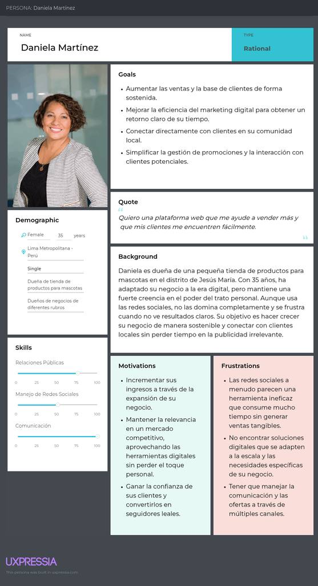
  </div>

  *Nota.* Elaboración propia (realizado en Uxpressia).

**Segmento #2: Consumidores de ofertas de diferentes ámbitos**

  **Figura 10**<br>
  *User Persona — Segmento 2*

  <div align="center">
      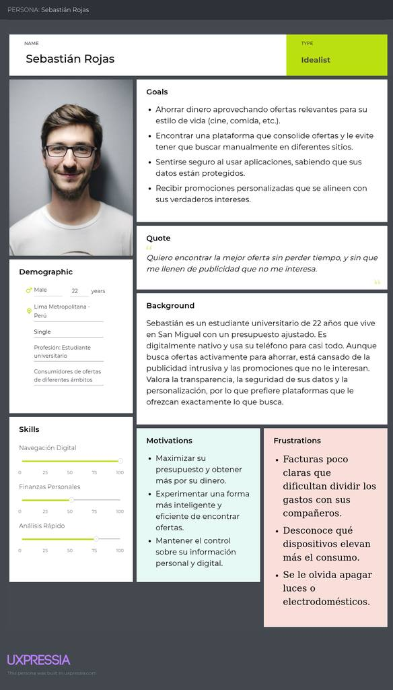
  </div>

  *Nota.* Elaboración propia (realizado en Uxpressia).

  #### 2.3.2  User Task Matrix

  **Segmento #1: Dueños de negocios locales**

  **Tabla 4**
  *User Task Matrix — Segmento 1*  

  | Task                                                                    | Frecuencia | Importancia |
  | ----------------------------------------------------------------------- | ---------- | ----------- |
  | Promocionar productos y servicios en redes sociales                     | Alto       | Alto        |
  | Responder a consultas de clientes por diversos canales                  | Alto       | Alto        |
  | Crear y publicar ofertas especiales o promociones                       | Medio      | Alto        |
  | Actualizar el inventario de productos y sus precios                     | Medio      | Medio       |
  | Buscar nuevas ideas de marketing o tendencias digitales                 | Bajo       | Medio       |
  | Registrar y dar seguimiento a nuevos clientes                           | Alto       | Alto        |
  | Analizar qué tipo de promoción genera más ventas                        | Bajo       | Medio       |
  | Interactuar con comentarios o mensajes de clientes en sus publicaciones | Medio      | Alto        |

  *Nota.* Elaboración propia.

  **Segmento #2: Consumidores de ofertas de diferentes ámbitos**

  **Tabla 5**   
  *User Task Matrix — Segmento 2*

  | Task                                                              | Frecuencia | Importancia |
  | ----------------------------------------------------------------- | ---------- | ----------- |
  | Buscar activamente ofertas para productos o servicios específicos | Alto       | Alto        |
  | Validar la credibilidad de una oferta (reputación, comentarios)   | Alto       | Alto        |
  | Comparar precios y promociones entre diferentes tiendas o apps    | Alto       | Alto        |
  | Leer reseñas y opiniones de otros usuarios                        | Medio      | Alto        |
  | Planificar gastos personales y asignar un presupuesto para ocio   | Alto       | Alto        |
  | Revisar notificaciones de ofertas que le interesan                | Alto       | Alto        |
  | Compartir ofertas encontradas con amigos o familiares             | Bajo       | Bajo        |
  | Guardar ofertas para usarlas en el futuro                         | Medio      | Medio       |

  *Nota.* Elaboración propia.
  
  #### 2.3.3. User Journey Mapping

  **Segmento #1: Dueños de negocios locales**

  **Figura 11**<br>
  *User Journey Mapping — Segmento 1*

  <div align="center">
      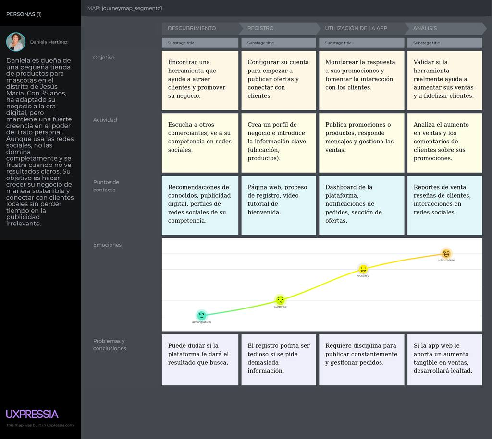
  </div>

  *Nota.* Elaboración propia (realizado en Uxpressia).

  **Segmento #2: Consumidores de ofertas de diferentes ámbitos**

  **Figura 12**<br>
  *User Journey Mapping — Segmento 2*

  <div align="center">
      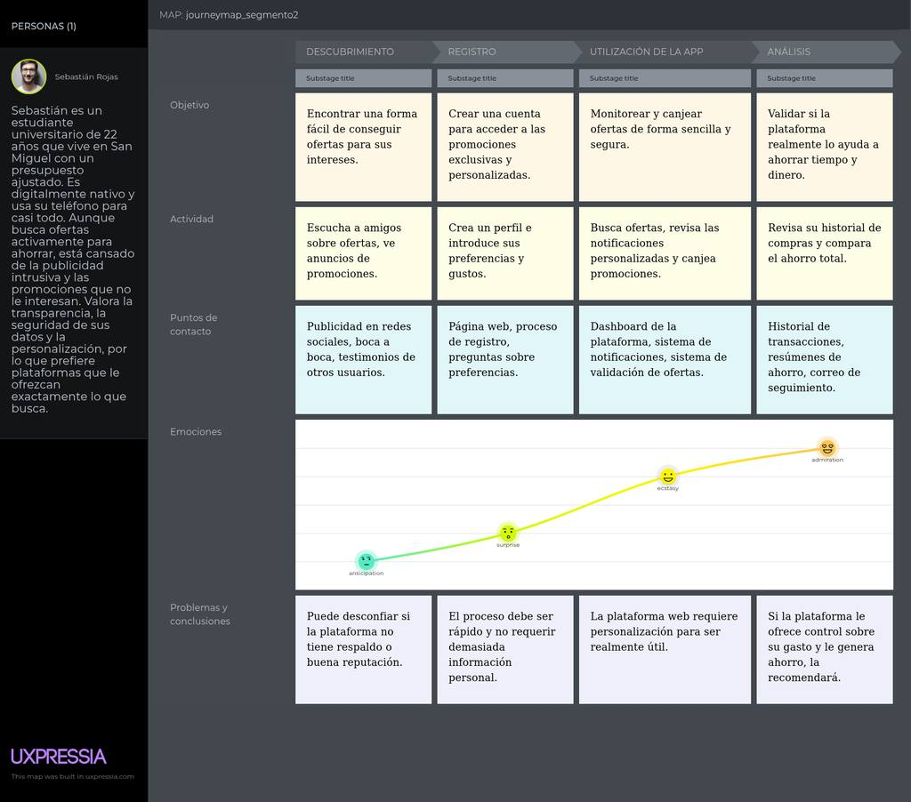
  </div>

  *Nota.* Elaboración propia (realizado en Uxpressia).

  #### 2.3.4. Empathy Mapping

  **Segmento #1: Dueños de negocios locales**

  **Figura 13**<br>
  *Empathy Mapping — Segmento 1*

  <div align="center">
      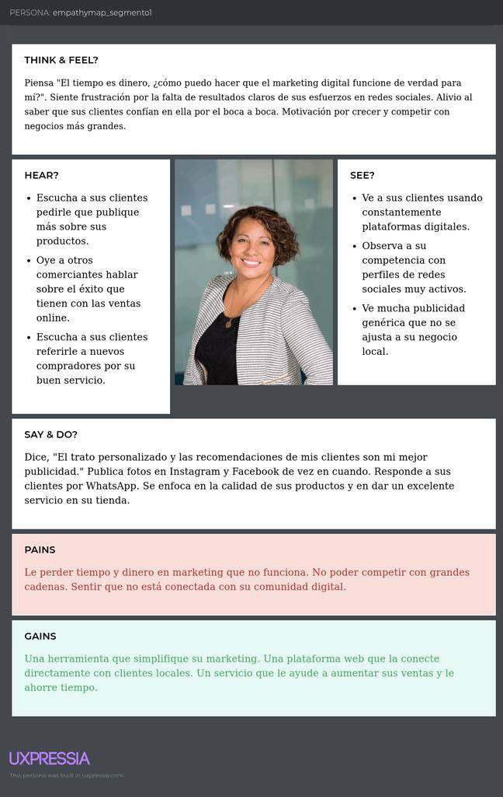
  </div>

  *Nota.* Elaboración propia (realizado en Uxpressia).

  **Segmento #2: Consumidores de ofertas de diferentes ámbitos**

  **Figura 14**<br>
  *Empathy Mapping — Segmento 2*

  <div align="center">
      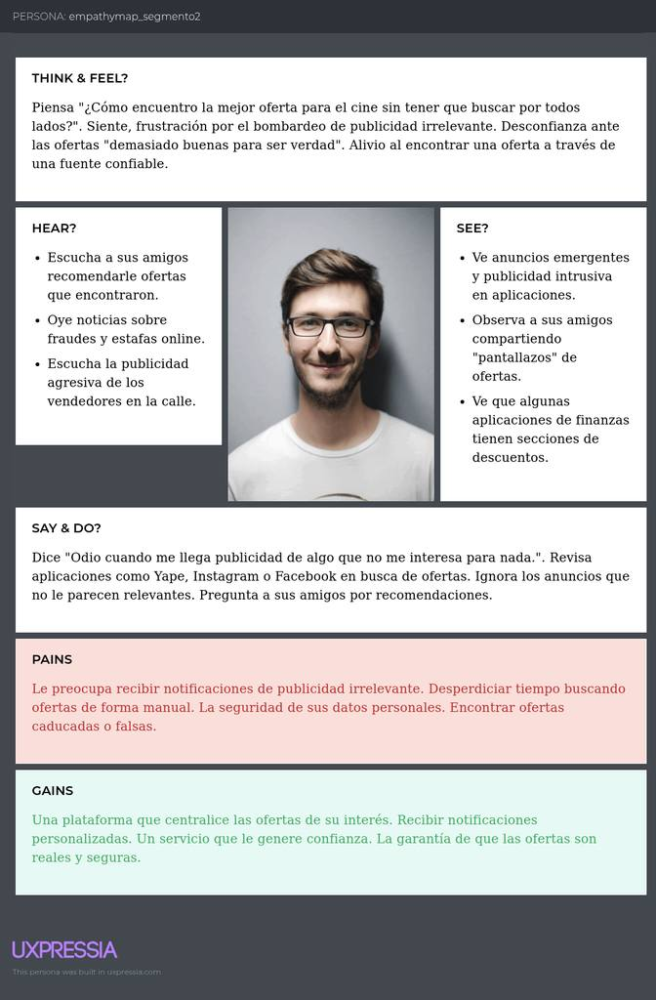
  </div>

  *Nota.* Elaboración propia (realizado en Uxpressia).


### 2.4. Ubiquitous Language   

* **Oferta:** Una promoción, descuento o paquete especial que un negocio publica con el objetivo de atraer a nuevos clientes o fidelizar a los existentes.

* **Dueño de Negocio:** La persona encargada de un negocio local que busca herramientas y estrategias para promocionar sus productos o servicios.

* **Consumidor:** Un usuario que busca activamente promociones y descuentos, con la meta de ahorrar dinero o encontrar productos de su interés.

* **Conversión:** El momento en que un consumidor completa una acción deseada, como canjear una oferta, realizar una compra o contactar a un negocio.

* **Credibilidad:** El nivel de confianza que una oferta o un negocio genera en el consumidor, influenciado por la reputación y la transparencia de la información.

* **Canje:** El proceso en el que un consumidor valida y utiliza una oferta para obtener el beneficio prometido por el negocio.

* **Fidelización:** Las estrategias que un negocio implementa para retener a sus clientes y fomentar que repitan sus compras a largo plazo.

---

## Capitulo 3: Requirements Specification 
### 3.1. User Stories

Las User Stories representan las necesidades y expectativas de los usuarios finales expresadas en un lenguaje sencillo y centrado en su valor.  
A través de ellas se traduce lo que los usuarios quieren lograr al usar el producto, asegurando que las funcionalidades desarrolladas estén alineadas con sus objetivos reales.

**Tabla 6**   
*Epics — Agrupación de requerimientos de alto nivel del producto GeoPS*  

| Epic                                | ID   |
| ----------------------------------- | ---- |
| Registro y Autenticación            | EP01 |
| Descubrimiento y Gestión de Ofertas | EP02 |
| Gestión de Campañas Publicitarias   | EP03 |

*Nota.* Elaboración propia.

**Tabla 7**   
*User Stories — Especificación de requerimientos funcionales de GeoPS*

### 3.1.2. User Stories

EP01: Gestión de Cuentas y Accesos

<table style="width: 100%; border-collapse: collapse; font-family: Arial, sans-serif; border: 1px solid black; margin-bottom: 20px;">
  <tr style="text-align: center; background-color: #f2f2f2;">
    <td style="border: 1px solid black; padding: 8px; width: 25%;"><b>Story ID</b></td>
    <td style="border: 1px solid black; padding: 8px; width: 25%;"><b>User</b></td>
    <td style="border: 1px solid black; padding: 8px; width: 25%;"><b>Priority</b></td>
    <td style="border: 1px solid black; padding: 8px; width: 25%;"><b>Epic</b></td>
  </tr>
  <tr style="text-align: center;">
    <td style="border: 1px solid black; padding: 8px;">US01</td>
    <td style="border: 1px solid black; padding: 8px;">Usuario Final</td>
    <td style="border: 1px solid black; padding: 8px;">1</td>
    <td style="border: 1px solid black; padding: 8px;">EP01</td>
  </tr>
  <tr>
    <td style="border: 1px solid black; padding: 8px; text-align: center; background-color: #f2f2f2;"><b>Title</b></td>
    <td colspan="3" style="border: 1px solid black; padding: 8px;">Registro de Usuario en la Plataforma Web</td>
  </tr>
  <tr>
    <td colspan="4" style="border: 1px solid black; padding: 8px; text-align: center; background-color: #f2f2f2;"><b>Description</b></td>
  </tr>
  <tr>
    <td colspan="4" style="border: 1px solid black; padding: 15px;">
      Como usuario, quiero poder registrarme en la plataforma web con mi correo electrónico y contraseña para poder acceder a las ofertas personalizadas.
    </td>
  </tr>
  <tr>
    <td colspan="4" style="border: 1px solid black; padding: 8px; text-align: center; background-color: #f2f2f2;"><b>Acceptance Criteria</b></td>
  </tr>
  <tr>
    <td colspan="4" style="border: 1px solid black; padding: 15px; line-height: 1.6;">
      <b>Escenario 1: Registro exitoso.</b> Dado que estoy en la página de registro, cuando ingreso un correo válido y contraseña segura, entonces el sistema crea la cuenta y muestra un mensaje de éxito.<br><br>
      <b>Escenario 2: Correo duplicado.</b> Dado que ingreso un correo ya registrado, cuando hago clic en "Registrar", entonces el sistema muestra un error indicando que la cuenta ya existe.<br><br>
      <b>Escenario 3: Contraseña débil.</b> Dado que ingreso una contraseña menor a 8 caracteres, cuando intento registrarme, entonces el sistema solicita una contraseña más robusta.
    </td>
  </tr>
</table>

<table style="width: 100%; border-collapse: collapse; font-family: Arial, sans-serif; border: 1px solid black; margin-bottom: 20px;">
  <tr style="text-align: center; background-color: #f2f2f2;">
    <td style="border: 1px solid black; padding: 8px; width: 25%;"><b>Story ID</b></td>
    <td style="border: 1px solid black; padding: 8px; width: 25%;"><b>User</b></td>
    <td style="border: 1px solid black; padding: 8px; width: 25%;"><b>Priority</b></td>
    <td style="border: 1px solid black; padding: 8px; width: 25%;"><b>Epic</b></td>
  </tr>
  <tr style="text-align: center;">
    <td style="border: 1px solid black; padding: 8px;">US02</td>
    <td style="border: 1px solid black; padding: 8px;">Usuario Final</td>
    <td style="border: 1px solid black; padding: 8px;">1</td>
    <td style="border: 1px solid black; padding: 8px;">EP01</td>
  </tr>
  <tr>
    <td style="border: 1px solid black; padding: 8px; text-align: center; background-color: #f2f2f2;"><b>Title</b></td>
    <td colspan="3" style="border: 1px solid black; padding: 8px;">Inicio de Sesión de Usuario en la Plataforma Web</td>
  </tr>
  <tr>
    <td colspan="4" style="border: 1px solid black; padding: 8px; text-align: center; background-color: #f2f2f2;"><b>Description</b></td>
  </tr>
  <tr>
    <td colspan="4" style="border: 1px solid black; padding: 15px;">
      Como usuario, quiero poder iniciar sesión en la plataforma web con mi correo electrónico y contraseña para acceder a mis ofertas guardadas.
    </td>
  </tr>
  <tr>
    <td colspan="4" style="border: 1px solid black; padding: 8px; text-align: center; background-color: #f2f2f2;"><b>Acceptance Criteria</b></td>
  </tr>
  <tr>
    <td colspan="4" style="border: 1px solid black; padding: 15px; line-height: 1.6;">
      <b>Escenario 1: Autenticación correcta.</b> Dado que estoy en login, cuando ingreso credenciales válidas, entonces el sistema me redirige a "Mis ofertas guardadas".<br><br>
      <b>Escenario 2: Credenciales incorrectas.</b> Dado que ingreso una contraseña errónea, cuando intento entrar, entonces el sistema muestra un mensaje de alerta y no permite el acceso.<br><br>
      <b>Escenario 3: Recuperación de clave.</b> Dado que olvidé mi clave, cuando hago clic en "¿Olvidaste tu contraseña?", entonces el sistema envía un enlace de recuperación al correo registrado.
    </td>
  </tr>
</table>

<table style="width: 100%; border-collapse: collapse; font-family: Arial, sans-serif; border: 1px solid black; margin-bottom: 20px;">
  <tr style="text-align: center; background-color: #f2f2f2;">
    <td style="border: 1px solid black; padding: 8px; width: 25%;"><b>Story ID</b></td>
    <td style="border: 1px solid black; padding: 8px; width: 25%;"><b>User</b></td>
    <td style="border: 1px solid black; padding: 8px; width: 25%;"><b>Priority</b></td>
    <td style="border: 1px solid black; padding: 8px; width: 25%;"><b>Epic</b></td>
  </tr>
  <tr style="text-align: center;">
    <td style="border: 1px solid black; padding: 8px;">US03</td>
    <td style="border: 1px solid black; padding: 8px;">Dueño de Negocio</td>
    <td style="border: 1px solid black; padding: 8px;">1</td>
    <td style="border: 1px solid black; padding: 8px;">EP01</td>
  </tr>
  <tr>
    <td style="border: 1px solid black; padding: 8px; text-align: center; background-color: #f2f2f2;"><b>Title</b></td>
    <td colspan="3" style="border: 1px solid black; padding: 8px;">Registro de Negocio en la Plataforma Web</td>
  </tr>
  <tr>
    <td colspan="4" style="border: 1px solid black; padding: 8px; text-align: center; background-color: #f2f2f2;"><b>Description</b></td>
  </tr>
  <tr>
    <td colspan="4" style="border: 1px solid black; padding: 15px;">
      Como dueño de negocio, quiero poder registrar mi negocio proporcionando información detallada para poder crear campañas publicitarias.
    </td>
  </tr>
  <tr>
    <td colspan="4" style="border: 1px solid black; padding: 8px; text-align: center; background-color: #f2f2f2;"><b>Acceptance Criteria</b></td>
  </tr>
  <tr>
    <td colspan="4" style="border: 1px solid black; padding: 15px; line-height: 1.6;">
      <b>Escenario 1: Registro completo.</b> Dado que ingreso datos obligatorios del negocio (RUC, nombre, rubro), cuando guardo, entonces el sistema crea el perfil empresarial.<br><br>
      <b>Escenario 2: Validación de RUC.</b> Dado que ingreso un RUC inválido o mal formado, cuando intento registrarme, entonces el sistema bloquea la acción y solicita un número válido.<br><br>
      <b>Escenario 3: Falta de documentos.</b> Dado que no adjunto la verificación de identidad solicitada, cuando guardo, entonces el sistema marca el perfil como "Pendiente de Validación".
    </td>
  </tr>
</table>

<table style="width: 100%; border-collapse: collapse; font-family: Arial, sans-serif; border: 1px solid black; margin-bottom: 20px;">
  <tr style="text-align: center; background-color: #f2f2f2;">
    <td style="border: 1px solid black; padding: 8px; width: 25%;"><b>Story ID</b></td>
    <td style="border: 1px solid black; padding: 8px; width: 25%;"><b>User</b></td>
    <td style="border: 1px solid black; padding: 8px; width: 25%;"><b>Priority</b></td>
    <td style="border: 1px solid black; padding: 8px; width: 25%;"><b>Epic</b></td>
  </tr>
  <tr style="text-align: center;">
    <td style="border: 1px solid black; padding: 8px;">US04</td>
    <td style="border: 1px solid black; padding: 8px;">Dueño de Negocio</td>
    <td style="border: 1px solid black; padding: 8px;">1</td>
    <td style="border: 1px solid black; padding: 8px;">EP01</td>
  </tr>
  <tr>
    <td style="border: 1px solid black; padding: 8px; text-align: center; background-color: #f2f2f2;"><b>Title</b></td>
    <td colspan="3" style="border: 1px solid black; padding: 8px;">Inicio de Sesión de Negocio en la Plataforma Web</td>
  </tr>
  <tr>
    <td colspan="4" style="border: 1px solid black; padding: 8px; text-align: center; background-color: #f2f2f2;"><b>Description</b></td>
  </tr>
  <tr>
    <td colspan="4" style="border: 1px solid black; padding: 15px;">
      Como dueño de negocio, quiero poder iniciar sesión con mi correo electrónico y contraseña para acceder al panel de gestión de campañas.
    </td>
  </tr>
  <tr>
    <td colspan="4" style="border: 1px solid black; padding: 8px; text-align: center; background-color: #f2f2f2;"><b>Acceptance Criteria</b></td>
  </tr>
  <tr>
    <td colspan="4" style="border: 1px solid black; padding: 15px; line-height: 1.6;">
      <b>Escenario 1: Acceso al panel.</b> Dado que ingreso credenciales de empresa correctas, cuando autentico, entonces el sistema me muestra el Dashboard de gestión de campañas.<br><br>
      <b>Escenario 2: Bloqueo por seguridad.</b> Dado que realizo 5 intentos fallidos consecutivos, cuando intento ingresar nuevamente, entonces el sistema bloquea la cuenta temporalmente por seguridad.
    </td>
  </tr>
</table>

EP02: Experiencia de Usuario y Navegación

<table style="width: 100%; border-collapse: collapse; font-family: Arial, sans-serif; border: 1px solid black; margin-bottom: 20px;">
  <tr style="text-align: center; background-color: #f2f2f2;">
    <td style="border: 1px solid black; padding: 8px; width: 25%;"><b>Story ID</b></td>
    <td style="border: 1px solid black; padding: 8px; width: 25%;"><b>User</b></td>
    <td style="border: 1px solid black; padding: 8px; width: 25%;"><b>Priority</b></td>
    <td style="border: 1px solid black; padding: 8px; width: 25%;"><b>Epic</b></td>
  </tr>
  <tr style="text-align: center;">
    <td style="border: 1px solid black; padding: 8px;">US05</td>
    <td style="border: 1px solid black; padding: 8px;">Usuario Final</td>
    <td style="border: 1px solid black; padding: 8px;">2</td>
    <td style="border: 1px solid black; padding: 8px;">EP02</td>
  </tr>
  <tr>
    <td style="border: 1px solid black; padding: 8px; text-align: center; background-color: #f2f2f2;"><b>Title</b></td>
    <td colspan="3" style="border: 1px solid black; padding: 8px;">Búsqueda de Ofertas por Categoría</td>
  </tr>
  <tr>
    <td colspan="4" style="border: 1px solid black; padding: 8px; text-align: center; background-color: #f2f2f2;"><b>Description</b></td>
  </tr>
  <tr>
    <td colspan="4" style="border: 1px solid black; padding: 15px;">
      Como usuario, quiero poder filtrar ofertas por categoría (K-Beauty, Ramen, etc.) para encontrar fácilmente las promociones que me interesan.
    </td>
  </tr>
  <tr>
    <td colspan="4" style="border: 1px solid black; padding: 8px; text-align: center; background-color: #f2f2f2;"><b>Acceptance Criteria</b></td>
  </tr>
  <tr>
    <td colspan="4" style="border: 1px solid black; padding: 15px; line-height: 1.6;">
      <b>Escenario 1: Filtrado efectivo.</b> Dado que selecciono una categoría, cuando el sistema procesa la solicitud, entonces solo se visualizan los banners correspondientes.<br><br>
      <b>Escenario 2: Categoría sin stock.</b> Dado que elijo una categoría sin ofertas vigentes, cuando filtro, entonces el sistema muestra un mensaje indicando "No hay ofertas por el momento".<br><br>
      <b>Escenario 3: Limpiar filtros.</b> Dado que tengo un filtro activo, cuando presiono "Limpiar", entonces el sistema vuelve a mostrar todas las ofertas disponibles.
    </td>
  </tr>
</table>

<table style="width: 100%; border-collapse: collapse; font-family: Arial, sans-serif; border: 1px solid black; margin-bottom: 20px;">
  <tr style="text-align: center; background-color: #f2f2f2;">
    <td style="border: 1px solid black; padding: 8px; width: 25%;"><b>Story ID</b></td>
    <td style="border: 1px solid black; padding: 8px; width: 25%;"><b>User</b></td>
    <td style="border: 1px solid black; padding: 8px; width: 25%;"><b>Priority</b></td>
    <td style="border: 1px solid black; padding: 8px; width: 25%;"><b>Epic</b></td>
  </tr>
  <tr style="text-align: center;">
    <td style="border: 1px solid black; padding: 8px;">US06</td>
    <td style="border: 1px solid black; padding: 8px;">Usuario Final</td>
    <td style="border: 1px solid black; padding: 8px;">1</td>
    <td style="border: 1px solid black; padding: 8px;">EP02</td>
  </tr>
  <tr>
    <td style="border: 1px solid black; padding: 8px; text-align: center; background-color: #f2f2f2;"><b>Title</b></td>
    <td colspan="3" style="border: 1px solid black; padding: 8px;">Visualización de Detalles de Oferta</td>
  </tr>
  <tr>
    <td colspan="4" style="border: 1px solid black; padding: 8px; text-align: center; background-color: #f2f2f2;"><b>Description</b></td>
  </tr>
  <tr>
    <td colspan="4" style="border: 1px solid black; padding: 15px;">
      Como usuario, quiero visualizar los detalles de una oferta para conocer toda la información antes de aprovecharla.
    </td>
  </tr>
  <tr>
    <td colspan="4" style="border: 1px solid black; padding: 8px; text-align: center; background-color: #f2f2f2;"><b>Acceptance Criteria</b></td>
  </tr>
  <tr>
    <td colspan="4" style="border: 1px solid black; padding: 15px; line-height: 1.6;">
      <b>Escenario 1: Carga de detalles.</b> Dado que selecciono una oferta, cuando carga la página, entonces visualizo descripción, precio, vigencia y ubicación en tiempo real.<br><br>
      <b>Escenario 2: Oferta expirada.</b> Dado que intento entrar a una oferta que acaba de vencer, cuando el sistema valida, entonces muestra un aviso de "Oferta Finalizada".<br><br>
      <b>Escenario 3: Enlace a mapas.</b> Dado que estoy viendo el detalle, cuando hago clic en la ubicación, entonces el sistema abre la navegación externa para guiarme al local.
    </td>
  </tr>
</table>

<table style="width: 100%; border-collapse: collapse; font-family: Arial, sans-serif; border: 1px solid black; margin-bottom: 20px;">
  <tr style="text-align: center; background-color: #f2f2f2;">
    <td style="border: 1px solid black; padding: 8px; width: 25%;"><b>Story ID</b></td>
    <td style="border: 1px solid black; padding: 8px; width: 25%;"><b>User</b></td>
    <td style="border: 1px solid black; padding: 8px; width: 25%;"><b>Priority</b></td>
    <td style="border: 1px solid black; padding: 8px; width: 25%;"><b>Epic</b></td>
  </tr>
  <tr style="text-align: center;">
    <td style="border: 1px solid black; padding: 8px;">US14</td>
    <td style="border: 1px solid black; padding: 8px;">Usuario Final</td>
    <td style="border: 1px solid black; padding: 8px;">3</td>
    <td style="border: 1px solid black; padding: 8px;">EP02</td>
  </tr>
  <tr>
    <td style="border: 1px solid black; padding: 8px; text-align: center; background-color: #f2f2f2;"><b>Title</b></td>
    <td colspan="3" style="border: 1px solid black; padding: 8px;">Configuración de Idioma en la Plataforma Web</td>
  </tr>
  <tr>
    <td colspan="4" style="border: 1px solid black; padding: 8px; text-align: center; background-color: #f2f2f2;"><b>Description</b></td>
  </tr>
  <tr>
    <td colspan="4" style="border: 1px solid black; padding: 15px;">
      Como usuario, quiero seleccionar el idioma de la plataforma para visualizar contenido en mi preferencia.
    </td>
  </tr>
  <tr>
    <td colspan="4" style="border: 1px solid black; padding: 8px; text-align: center; background-color: #f2f2f2;"><b>Acceptance Criteria</b></td>
  </tr>
  <tr>
    <td colspan="4" style="border: 1px solid black; padding: 15px; line-height: 1.6;">
      <b>Escenario 1: Cambio inmediato.</b> Dado que selecciono un nuevo idioma, cuando confirmo, entonces toda la interfaz se traduce automáticamente.<br><br>
      <b>Escenario 2: Persistencia.</b> Dado que cerré sesión tras cambiar el idioma, cuando vuelvo a ingresar, entonces la plataforma mantiene mi preferencia anterior.
    </td>
  </tr>
</table>

EP03: Gestión de Campañas Hiperlocalizadas

<table style="width: 100%; border-collapse: collapse; font-family: Arial, sans-serif; border: 1px solid black; margin-bottom: 20px;">
  <tr style="text-align: center; background-color: #f2f2f2;">
    <td style="border: 1px solid black; padding: 8px; width: 25%;"><b>Story ID</b></td>
    <td style="border: 1px solid black; padding: 8px; width: 25%;"><b>User</b></td>
    <td style="border: 1px solid black; padding: 8px; width: 25%;"><b>Priority</b></td>
    <td style="border: 1px solid black; padding: 8px; width: 25%;"><b>Epic</b></td>
  </tr>
  <tr style="text-align: center;">
    <td style="border: 1px solid black; padding: 8px;">US05</td>
    <td style="border: 1px solid black; padding: 8px;">Usuario Final</td>
    <td style="border: 1px solid black; padding: 8px;">2</td>
    <td style="border: 1px solid black; padding: 8px;">EP02</td>
  </tr>
  <tr>
    <td style="border: 1px solid black; padding: 8px; text-align: center; background-color: #f2f2f2;"><b>Title</b></td>
    <td colspan="3" style="border: 1px solid black; padding: 8px;">Búsqueda de Ofertas por Categoría</td>
  </tr>
  <tr>
    <td colspan="4" style="border: 1px solid black; padding: 8px; text-align: center; background-color: #f2f2f2;"><b>Description</b></td>
  </tr>
  <tr>
    <td colspan="4" style="border: 1px solid black; padding: 15px;">
      Como usuario, quiero poder filtrar ofertas por categoría (K-Beauty, Ramen, etc.) para encontrar fácilmente las promociones que me interesan.
    </td>
  </tr>
  <tr>
    <td colspan="4" style="border: 1px solid black; padding: 8px; text-align: center; background-color: #f2f2f2;"><b>Acceptance Criteria</b></td>
  </tr>
  <tr>
    <td colspan="4" style="border: 1px solid black; padding: 15px; line-height: 1.6;">
      <b>Escenario 1: Filtrado efectivo.</b> Dado que selecciono una categoría, cuando el sistema procesa la solicitud, entonces solo se visualizan los banners correspondientes.<br><br>
      <b>Escenario 2: Categoría sin stock.</b> Dado que elijo una categoría sin ofertas vigentes, cuando filtro, entonces el sistema muestra un mensaje indicando "No hay ofertas por el momento".<br><br>
      <b>Escenario 3: Limpiar filtros.</b> Dado que tengo un filtro activo, cuando presiono "Limpiar", entonces el sistema vuelve a mostrar todas las ofertas disponibles.
    </td>
  </tr>
</table>

<table style="width: 100%; border-collapse: collapse; font-family: Arial, sans-serif; border: 1px solid black; margin-bottom: 20px;">
  <tr style="text-align: center; background-color: #f2f2f2;">
    <td style="border: 1px solid black; padding: 8px; width: 25%;"><b>Story ID</b></td>
    <td style="border: 1px solid black; padding: 8px; width: 25%;"><b>User</b></td>
    <td style="border: 1px solid black; padding: 8px; width: 25%;"><b>Priority</b></td>
    <td style="border: 1px solid black; padding: 8px; width: 25%;"><b>Epic</b></td>
  </tr>
  <tr style="text-align: center;">
    <td style="border: 1px solid black; padding: 8px;">US06</td>
    <td style="border: 1px solid black; padding: 8px;">Usuario Final</td>
    <td style="border: 1px solid black; padding: 8px;">1</td>
    <td style="border: 1px solid black; padding: 8px;">EP02</td>
  </tr>
  <tr>
    <td style="border: 1px solid black; padding: 8px; text-align: center; background-color: #f2f2f2;"><b>Title</b></td>
    <td colspan="3" style="border: 1px solid black; padding: 8px;">Visualización de Detalles de Oferta</td>
  </tr>
  <tr>
    <td colspan="4" style="border: 1px solid black; padding: 8px; text-align: center; background-color: #f2f2f2;"><b>Description</b></td>
  </tr>
  <tr>
    <td colspan="4" style="border: 1px solid black; padding: 15px;">
      Como usuario, quiero visualizar los detalles de una oferta para conocer toda la información antes de aprovecharla.
    </td>
  </tr>
  <tr>
    <td colspan="4" style="border: 1px solid black; padding: 8px; text-align: center; background-color: #f2f2f2;"><b>Acceptance Criteria</b></td>
  </tr>
  <tr>
    <td colspan="4" style="border: 1px solid black; padding: 15px; line-height: 1.6;">
      <b>Escenario 1: Carga de detalles.</b> Dado que selecciono una oferta, cuando carga la página, entonces visualizo descripción, precio, vigencia y ubicación en tiempo real.<br><br>
      <b>Escenario 2: Oferta expirada.</b> Dado que intento entrar a una oferta que acaba de vencer, cuando el sistema valida, entonces muestra un aviso de "Oferta Finalizada".<br><br>
      <b>Escenario 3: Enlace a mapas.</b> Dado que estoy viendo el detalle, cuando hago clic en la ubicación, entonces el sistema abre la navegación externa para guiarme al local.
    </td>
  </tr>
</table>

<table style="width: 100%; border-collapse: collapse; font-family: Arial, sans-serif; border: 1px solid black; margin-bottom: 20px;">
  <tr style="text-align: center; background-color: #f2f2f2;">
    <td style="border: 1px solid black; padding: 8px; width: 25%;"><b>Story ID</b></td>
    <td style="border: 1px solid black; padding: 8px; width: 25%;"><b>User</b></td>
    <td style="border: 1px solid black; padding: 8px; width: 25%;"><b>Priority</b></td>
    <td style="border: 1px solid black; padding: 8px; width: 25%;"><b>Epic</b></td>
  </tr>
  <tr style="text-align: center;">
    <td style="border: 1px solid black; padding: 8px;">US14</td>
    <td style="border: 1px solid black; padding: 8px;">Usuario Final</td>
    <td style="border: 1px solid black; padding: 8px;">3</td>
    <td style="border: 1px solid black; padding: 8px;">EP02</td>
  </tr>
  <tr>
    <td style="border: 1px solid black; padding: 8px; text-align: center; background-color: #f2f2f2;"><b>Title</b></td>
    <td colspan="3" style="border: 1px solid black; padding: 8px;">Configuración de Idioma (Español/Ingles) en la Plataforma Web</td>
  </tr>
  <tr>
    <td colspan="4" style="border: 1px solid black; padding: 8px; text-align: center; background-color: #f2f2f2;"><b>Description</b></td>
  </tr>
  <tr>
    <td colspan="4" style="border: 1px solid black; padding: 15px;">
      Como usuario, quiero seleccionar el idioma de español o ingles en la plataforma para visualizar contenido en mi preferencia.
    </td>
  </tr>
  <tr>
    <td colspan="4" style="border: 1px solid black; padding: 8px; text-align: center; background-color: #f2f2f2;"><b>Acceptance Criteria</b></td>
  </tr>
  <tr>
    <td colspan="4" style="border: 1px solid black; padding: 15px; line-height: 1.6;">
      <b>Escenario 1: Cambio inmediato.</b> Dado que selecciono un nuevo idioma, cuando confirmo, entonces toda la interfaz se traduce automáticamente.<br><br>
      <b>Escenario 2: Persistencia.</b> Dado que cerré sesión tras cambiar el idioma, cuando vuelvo a ingresar, entonces la plataforma mantiene mi preferencia anterior.
    </td>
  </tr>
</table>

*Nota.* Elaboración propia.

**Technical Stories**

Las Technical Stories detallan requerimientos técnicos derivados de las User Stories.  
Están orientadas al equipo de desarrollo y especifican aspectos relacionados con infraestructura, integraciones, seguridad o rendimiento, necesarios para que las funcionalidades puedan implementarse correctamente.

**Tabla 8**  
*Technical Stories — Requerimientos técnicos para la implementación del producto GeoPS*  

| Story ID | Título                                      | Descripción                                                                                                           | Criterios de Aceptación                                                                                                                                                                                                                                                                                                               | Relacionado con (US ID) |
| -------- | ------------------------------------------- | --------------------------------------------------------------------------------------------------------------------- | ------------------------------------------------------------------------------------------------------------------------------------------------------------------------------------------------------------------------------------------------------------------------------------------------------------------------------------- | ----------------------- |
| TS01     | Endpoint: Registrar usuario                 | Como Developer, deseo exponer `POST /auth/register` para crear cuentas de usuario con validación de email y password. | **Scenario: Registro exitoso**<br> Dado un payload válido,<br> Cuando envío POST `/auth/register`,<br> Entonces responde 201 con id y email.<br><br> **Scenario: Email en uso**<br> Dado un email ya registrado,<br> Cuando envío POST `/auth/register`,<br> Entonces responde 409 con error `email_taken`.                           | US01                    |
| TS02     | Endpoint: Login de usuario                  | Como Developer, deseo exponer `POST /auth/login` para autenticar usuarios y emitir un JWT.                            | **Scenario: Credenciales válidas**<br> Dado email y password correctos,<br> Cuando envío POST `/auth/login`,<br> Entonces responde 200 con `access_token`.<br><br> **Scenario: Credenciales inválidas**<br> Dado password incorrecto,<br> Cuando envío POST `/auth/login`,<br> Entonces responde 401 con error `invalid_credentials`. | US02                    |
| TS04     | Endpoint: Búsqueda de ofertas por categoría | Como Developer, deseo exponer `GET /offers?category={slug}` para filtrar ofertas.                                     | **Scenario: Categoría válida**<br> Dado category existente,<br> Cuando envío GET,<br> Entonces responde 200 con lista de ofertas.<br><br> **Scenario: Categoría inválida**<br> Dado category no existe,<br> Cuando envío GET,<br> Entonces responde 200 con lista vacía.                                                              | US05                    |
| TS05     | Endpoint: Detalle de oferta                 | Como Developer, deseo exponer `GET /offers/{id}` para obtener detalles completos.                                     | **Scenario: Oferta encontrada**<br> Dado id válido,<br> Cuando envío GET,<br> Entonces responde 200 con detalle.<br><br> **Scenario: Oferta inexistente**<br> Dado id inválido,<br> Cuando envío GET,<br> Entonces responde 404 con error `not_found`.                                                                                | US06                    |
| TS07     | Endpoint: Crear campaña                     | Como Developer, deseo exponer `POST /campaigns` para que un proveedor cree campañas publicitarias.                    | **Scenario: Creación válida**<br> Dado payload con título, fechas y presupuesto correctos,<br> Cuando envío POST,<br> Entonces responde 201 con estado `draft`.<br><br> **Scenario: Fechas inválidas**<br> Dado `endDate < startDate`,<br> Cuando envío POST,<br> Entonces responde 422 con error `invalid_dates`.                    | US07                    |
| TS08     | Endpoint: Editar campaña                    | Como Developer, deseo exponer `PUT /campaigns/{id}` para editar campañas existentes.                                  | **Scenario: Actualización válida**<br> Dado proveedor dueño de campaña,<br> Cuando envío PUT,<br> Entonces responde 200 con `updated=true`.<br><br> **Scenario: Sin permisos**<br> Dado proveedor no dueño,<br> Cuando envío PUT,<br> Entonces responde 403 con error `forbidden`.                                                    | US08                    |

*Nota.* Elaboración propia.

### 3.2. Impact Mapping

El Impact Mapping es una técnica de planificación estratégica que conecta los objetivos del negocio con los entregables del producto. Ayuda a visualizar cómo las funcionalidades contribuyen a alcanzar los resultados esperados, identificando actores, impactos deseados y soluciones clave.

**Figura 14**<br>
*Impact Mapping — GeoPS*

<div align="center">
    
</div>

*Nota.* Elaboración propia (realizado en Uxpressia).

### 3.3. Product Backlog

El **Product Backlog** es una lista priorizada de funcionalidades, mejoras y requisitos técnicos que guiarán la evolución del producto.  
Su propósito es organizar el trabajo en función del valor que aporta al usuario y al negocio, sirviendo como una hoja de ruta flexible y adaptable durante el desarrollo.

**Enlace al Tablero:** https://geops-org.atlassian.net/jira/software/projects/GEOP/boards/69/backlog?atlOrigin=eyJpIjoiODc2NDI0MDBkOGE4NGZmMGFiOWYzNmZiZTY5NDk5ZWUiLCJwIjoiaiJ9

**Vista del Product Backlog en Jira**

**Figura 15**<br>
*Product Backlog — GeoPS*

<div align="center">
    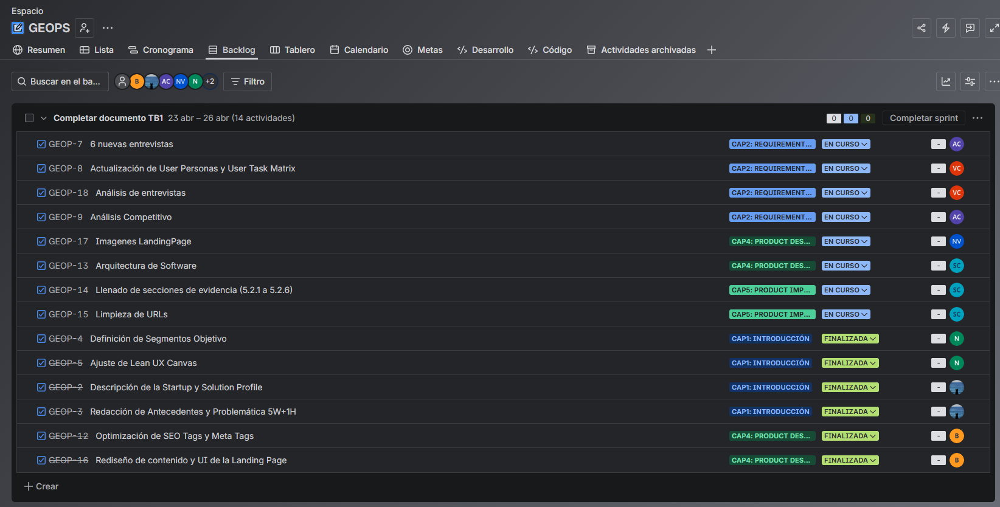
</div>

*Nota.* Elaboración propia (realizado en Jira).

**Tabla 9**   
*Product Backlog — Priorización de funcionalidades del producto GeoPS*  

| # Orden | User Story ID | Título                                                       | Descripción                                                                                                                                         | Story Points |
| ------- | ------------- | ------------------------------------------------------------ | --------------------------------------------------------------------------------------------------------------------------------------------------- | ------------ |
| 1       | US01          | Registro de Usuario en la Plataforma Web                     | Como usuario, quiero poder registrarme en la plataforma web con mi correo electrónico y contraseña para poder acceder a las ofertas personalizadas. | 5            |
| 2       | US02          | Inicio de Sesión de Usuario en la Plataforma Web             | Como usuario, quiero poder iniciar sesión en la plataforma web con mi correo electrónico y contraseña para acceder a mis ofertas guardadas.         | 3            |
| 3       | US03          | Registro de Negocio en la Plataforma Web                     | Como dueño de negocio, quiero poder registrar mi negocio proporcionando información detallada para poder crear campañas publicitarias.              | 5            |
| 4       | US04          | Inicio de Sesión de Negocio en la Plataforma Web             | Como dueño de negocio, quiero poder iniciar sesión con mi correo electrónico y contraseña para acceder al panel de gestión de campañas.             | 3            |
| 5       | US05          | Búsqueda de Ofertas por Categoría en la Plataforma Web       | Como usuario, quiero poder filtrar ofertas por categoría para encontrar fácilmente las promociones que me interesan.                                | 3            |
| 6       | US06          | Visualización de Detalles de Oferta en la Plataforma Web     | Como usuario, quiero poder visualizar los detalles de una oferta para conocer toda la información antes de aprovecharla.                            | 2            |
| 7       | US07          | Creación de Campaña Publicitaria en la Plataforma Web        | Como dueño de negocio, quiero crear campañas publicitarias para promocionar mis productos o servicios.                                              | 8            |
| 8       | US08          | Edición de Campaña Publicitaria en la Plataforma Web         | Como dueño de negocio, quiero editar campañas publicitarias existentes para actualizar información y mejorar efectividad.                           | 5            |
| 9       | US9          | Eliminación de Campaña Publicitaria en la Plataforma Web     | Como dueño de negocio, quiero eliminar campañas publicitarias para retirar promociones que ya no deseo mantener.                                    | 3            |
| 10      | US10          | Visualización de Campañas Activas en la Plataforma Web       | Como dueño de negocio, quiero visualizar todas mis campañas activas para dar seguimiento.                                                           | 3            |
| 11      | US11          | Configuración de Presupuesto de Campaña en la Plataforma Web | Como dueño de negocio, quiero configurar presupuesto de campañas para controlar gastos y optimizar inversión.                                       | 3            |
| 12      | US12          | Programar Fecha de Inicio de Campaña en la Plataforma Web    | Como dueño de negocio, quiero programar fecha de inicio para campañas.                                                                              | 3            |
| 13      | US13          | Programar Fecha de Fin de Campaña en la Plataforma Web       | Como dueño de negocio, quiero programar fecha de fin para campañas.                                                                                 | 3            |
| 14      | US14          | Configuración de Idioma(Español/Ingles) en la Plataforma Web                 | Como usuario, quiero seleccionar idioma español o ingles en la plataforma para visualizar contenido en mi preferencia.                                               | 2            |


*Nota.* Elaboración propia.

---

## Capítulo 4: Product Design

### 4.1. Style Guidelines

  #### 4.1.1. General Style Guidelines

  **Branding**

  - El nombre completo de nuestro servicio es “Geo Publicity Service”.
  - Para el dominio web y la aplicación, así como para ser más memorable, se utilizará el nombre corto GeoPS.
  - El tagline es “Promociones cerca de ti”, reflejando el servicio principal de promocionar ofertas de diversas tiendas cerca de tu ubicación.
  - El logo tiene un diseño sencillo, lo que lo hace minimalista y fácil de recordar. Además, el uso del color morado demuestra creatividad e innovación.

  **Figura 16**<br>
  *Logo — GeoPS*

  <div align="center">
      
  </div>

  *Nota.* Elaboración propia.

  **Typography**

  Las tipografías seleccionadas son Poppins y Lobster. Lobster fué elegida principalmente para representar nuestro Logo GeoPS de una manera expresiva, atrayendo la atención de los usuarios a nuestra landing page. La tipografía Poppins se utiliza en los párrafos, títulos, subtítulos y botones de la página, transmitiendo claridad y profesionalismo, ofreciendo una buena legibilidad en la página web mediante su amplia variedad de pesos de letra.

  **Tamaños y peso de tipografía**

  Lobster: Peso 400, 60 px de tamaño para el logo.
  Poppins:

  - Títulos: Peso 600, 35 px de tamaño.
  - Párrafos y texto secundario: Peso 300, 20 px de tamaño.
  - Texto terciario: Peso 400, 16 px de tamaño.
  - Pié de imagen y video: Peso 300, 16 px de tamaño.
  - Texto dentro de imágenes: Peso 600, 24 px de tamaño.
  - Texto de botones CTA: Peso 600, 25 px de tamaño.

  **Colors**

  Utilizaremos la siguiente paleta de colores:

  **Figura 17**<br>
  *Paleta de Colores — GeoPS*

  <div align="center">
      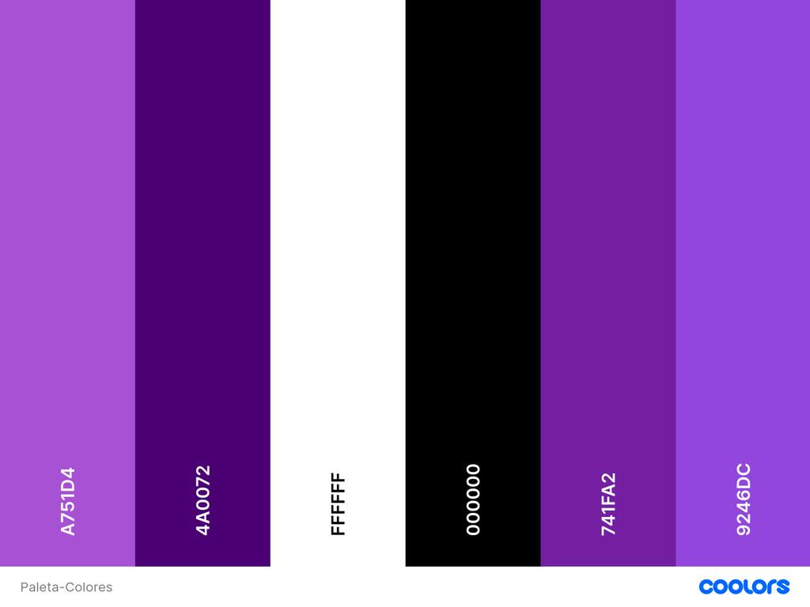
  </div>

  *Nota.* Elaboración propia (realizado en Coolors).

  <br>

  |                                                                         |                                                                                                                                                                                                                                                     |
  | ----------------------------------------------------------------------- | --------------------------------------------------------------------------------------------------------------------------------------------------------------------------------------------------------------------------------------------------- |
  |  | El color amatista se utiliza principalmente en el menú vertical, el cual necesita resaltar. Este color representa la innovación y modernidad, atrayendo la atención de los usuarios sin tener que ser agresivo.                                     |
  |      | El color índigo es utilizado para secciones que desean llamar la atención mostrando información importante, todo en un espacio pequeño. El color muestra elegancia, formalidad y confianza al ser un color fuerte.                                  |
  |      | El color blanco es utilizado en el cuerpo de la página web. El color blanco muestra un área limpia, clara y donde hay espacio visual para mostrar las secciones de nuestra landing page.                                                            |
  |        | El color negro es utilizado en botones principales y el footer de nuestra página. El color negro demuestra profesionalismo y un contraste fuerte con los otros colores utilizados, especialmente el color blanco.                                   |
  |            | El color uva es utilizado en botones CTA de tamaño mediano y secciones con imágenes. Este color muestra energía, dinamismo y una personalidad fuerte, en comparación a otros botones principales. También ayuda a destacar el texto de los botones. |
  | 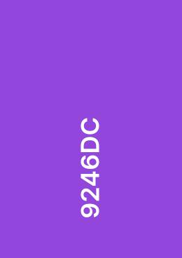 | El color verónica es utilizado en botones pequeños CTA. Este color muestra juventud y frescura al ser un poco más claro que los otros colores de tono parecido.                                                                                     |

  **Spacing**

  - El espacio en el diseño de GeoPS se enfocará en proporcionar una experiencia visual clara y accesible para el usuario, reflejando los principios de orden y claridad. Se utilizarán márgenes amplios para resaltar los elementos clave, como botones y áreas interactivas, permitiendo una navegación fluida y sin distracciones.
  - Al utilizar muchas imágenes, consideramos utilizar un espaciado horizontal entre las imágenes lo suficiente para mostrarlas con claridad visual y sin que interrumpa la navegación del usuario.
  - El espaciado será utilizado para diferenciar las zonas de información, especialmente en secciones interactivas con párrafos.

  **Tonos de Comunicación**

  El tono de comunicación de GeoPS será amigable, cercano y orientado al usuario. Buscamos establecer una conexión genuina mediante un lenguaje claro y accesible a todos, sin utilizar demasiados tecnicismos. Resaltaremos los beneficios y la facilidad de uso de nuestra aplicación web, sin abrumar al usuario con tanta información. Queremos que el usuario se sienta valorado y escuchado en cada interacción.

  #### 4.1.2. Web Style Guidelines

  En esta sección, se describe la guía de nuestra landing page con sus características en el estilo para mantener una coherencia visual.

  **Estructura general de la página**

  **Cabecera**:

  - Logotipo: El logotipo de nuestra startup está ubicado en la esquina superior izquierda. Cuando haces click, te redirigirá a la página principal.
  - Barra de búsqueda: La barra de búsqueda está ubicada en la parte superior derecha. Servirá para ubicar fácilmente y rápidamente secciones en la página.
  - Menú de navegación: El menú de navegación se ubica en la parte superior izquierda y en la esquina derecha. Es un conjunto de botones que permite la navegación en la página principal. Los botones designados son: 
  <br>

    1. Inicio
    2. Marcas
    3. Conoce más
    4. Inicia sesión

  **Cuerpo**:

  - Sección principal: La sección principal es la que va a atraer al usuario. Se muestran promociones conocidas y ofertas.
  - Beneficios: Muestra que nuestra página ofrece beneficios, ofertas y promociones en diversas tiendas.
  - Empresas que confían en nosotros: Muestra las marcas que tienen confianza en nosotros y están dispuestos a promocionar sus productos en nuestra página.
  - Quienes somos: Muestra información de la empresa y permite conocer más de nosotros mediante un botón.
  - Planes: Permite la muestra y promoción de los planes de compra de nuestra empresa para los usuarios de la página.
  - Promociones: Muestra diversas promociones de diferentes tipos en varias tiendas.
  - Invitación a los negocios: Sección de llamado a los usuarios que tienen negocios que desean participar en nuestro programa.
  - Dudas: Sección que muestra preguntas frecuentes de nuestra empresa y las responde de una manera corta y clara.
  - Conocenos mejor: Muestra los videos que hablan sobre nuestra marca de empresa para conectar con el usuario que ve los videos.

  **Pié de página**:

  - Copyright: Se incluye la información sobre los derechos de autor de la marca.
  - Enlaces de soporte: Se proporcionan links de soporte y ayuda, tales como “Nosotros”, “Servicios” y “Contacto”.
  - Redes sociales: Se incluyen los iconos de las redes sociales de nuestro emprendimiento para conectar con la audiencia en otras plataformas, las cuales son Instagram y LinkedIn.
  - Logotipo y eslogan: Se incluye el Logo con su eslogan que representa nuestra empresa. La frase designada es: “Promociones cerca de ti”

  **Diseño de la Landing Page**:

  **Figura 18**<br>
  *Landing Page — GeoPS*

  <div align="center">
      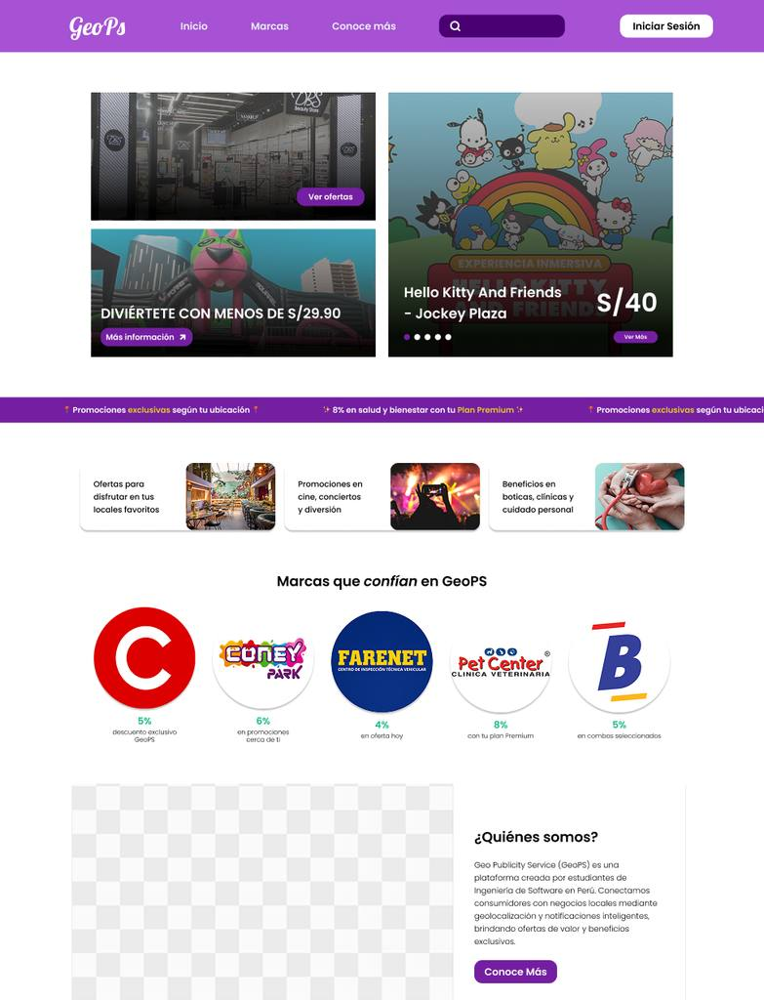
      <br>
      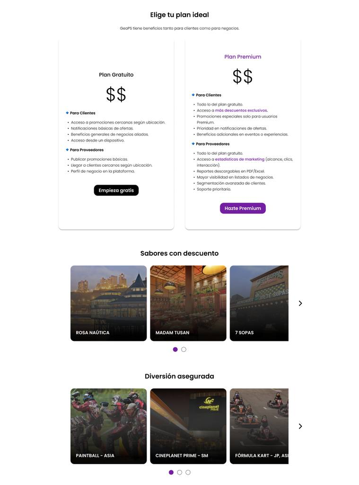
      <br>
      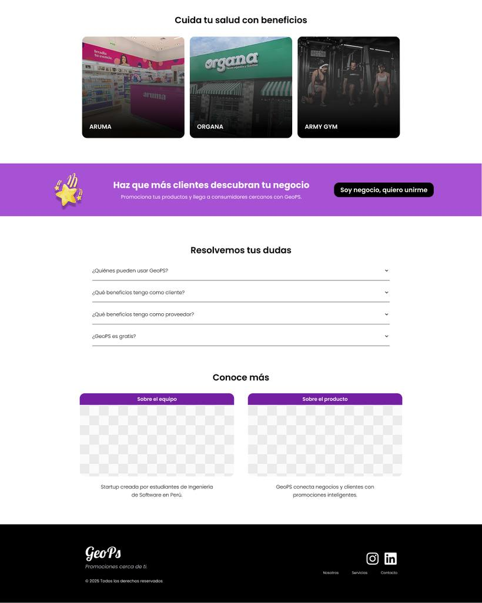
  </div>

  *Nota.* Elaboración propia (realizado en Figma).

### 4.2. Information Architecture

  #### 4.2.1. Organization Systems

  Se aplicarán distintos sistemas de organización de contenido tanto visual como estructural, adaptados al flujo operativo de nuestros usuarios (consumidores y negocios locales). Esto permitirá ofrecer una experiencia clara, intuitiva y eficaz durante el uso de la plataforma.

  **Organización Visual del Contenido**

  **Jerárquica:**
  En las pantallas principales, como el Dashboard de usuario y el panel de negocios, los elementos más importantes (promociones destacadas, métricas de campaña) estarán resaltados con mayor tamaño, color contrastante y posición superior.

  **Secuencial:**
  Utilizado en procesos como la creación de campañas publicitarias o el registro de preferencias de usuario. Se presentarán pasos guiados (wizard) que aseguren que tanto consumidores como negocios completen los procesos de manera ordenada y sin omitir información clave.

  **Matricial:**
  Aplicada en la visualización de datos cruzados, como patrones de movilidad de consumidores versus resultados de campañas. Los negocios podrán ver las relaciones entre ubicación, horario y efectividad publicitaria.

  **Esquemas de Categorización del Contenido**

  **Por Tópicos:**
  Será el sistema predominante en los menús de navegación. Las funcionalidades estarán agrupadas en temas específicos:

  _Para consumidores:_

  - Promociones cercanas
  - Favoritos
  - Historial de ofertas
  - Ajustes de privacidad

  _Para negocios:_

  - Campañas
  - Segmentación
  - Métricas
  - Configuración

  **Cronológico:**
  Usado en los reportes de campañas publicitarias (para negocios) y en el historial de notificaciones recibidas (para consumidores). La información se mostrará ordenada por fecha y hora, permitiendo un seguimiento preciso.

  **Alfabético:**
  Utilizado en listados como directorios de comercios o categorías de productos, facilitando la búsqueda rápida por nombre.

  **Según audiencia:**
  La experiencia estará personalizada según el segmento objetivo:

  - **Consumidores de ofertas locales:** acceso a promociones activas, historial de notificaciones, filtros de búsqueda por categoría, proximidad o momento del día.

  - **Dueños de negocios locales:** acceso a herramientas de creación de campañas, segmentación por patrones de movilidad, visualización de métricas en dashboards interactivos y configuración de notificaciones.

  #### 4.2.2. Labeling Systems

  En GeoPS se ha implementado un sistema de etiquetado claro y funcional, adaptado al entorno de consumo y gestión de campañas locales. El objetivo es reducir la carga cognitiva y facilitar la interacción rápida con la plataforma.

  **Principios utilizados**

  **Simplicidad y claridad:**
  Se prioriza el uso de términos breves y familiares para cada segmento. Ejemplo para consumidores: "Ofertas cercanas", "Favoritos", "Historial". Ejemplo para negocios: "Campañas", "Segmentación", "Métricas".

  **Evitar ambigüedad:**
  Se evita la jerga técnica. Por ejemplo, se prefiere "Crear campaña" en lugar de "Configurar pauta publicitaria", o "Promoción activa" en lugar de "Anuncio en circulación".

  **Consistencia visual:**
  Todas las etiquetas siguen una presentación uniforme en botones, menús y formularios, asegurando que el usuario reconozca patrones de uso fácilmente.

  #### 4.2.3. SEO Tags and Meta Tags

  Las Meta Tags son esenciales para el posicionamiento de la plataforma en buscadores y para su correcta presentación en navegadores y redes sociales.

  **Meta Tags a utilizar en GeoPS**

  **Título:**

  ```html
  <title>
    GeoPS | Publicidad Hiperlocal y Contextual para Consumidores y Negocios
  </title>
  ```

  **Codificación de caracteres:**

  ```html
  <meta charset="UTF-8" />
  ```

  **Descripción:**

  ```html
  <meta
    name="description"
    content="GeoPS es una aplicación web que conecta negocios locales con consumidores mediante publicidad hiperlocal y contextual. Ofrece promociones relevantes en el momento y lugar adecuado, cuidando la privacidad y simplicidad de uso."
  />
  ```

  **Palabras clave:**

  ```html
  <meta
    name="keywords"
    content="publicidad local, promociones cercanas, geolocalización, campañas digitales, consumidores, negocios locales, ofertas hiperlocales, marketing contextual, GeoPS"
  />
  ```

  **Autor y Derechos de Autor:**

  ```html
  <meta name="author" content="GeoPS Team - UPC" />
  <meta name="copyright" content="GeoPS © 2025. Todos los derechos reservados." />
  ```

  **Viewport:**

  ```html
  <meta name="viewport" content="width=device-width, initial-scale=1.0" />
  ```

  #### 4.2.4. Searching Systems

  Los sistemas de búsqueda en GeoPS facilitan el acceso rápido a promociones o campañas según el segmento objetivo.

  **Opciones de búsqueda en la aplicación**

  **Barra de búsqueda global:**

  - Presente en el encabezado superior.
  - Permite búsquedas generales tanto para consumidores como para negocios.
  - Incluye icono de lupa y placeholder "Buscar promociones o campañas".

  **Filtros por módulo:**

  _Para consumidores:_

  - Categoría de producto/servicio
  - Distancia/proximidad
  - Horario de vigencia
  - Negocio emisor de la promoción

  _Para negocios:_

  - Campañas activas/inactivas
  - Segmentación (ubicación, rango horario, movilidad)
  - Tipo de promoción
  - Resultados por fecha

  **Visualización:**

  - Resultados organizados por relevancia o cercanía.
  - Paginación de 10 resultados por página.
  - Indicadores visuales de color para destacar promociones activas.
  - Acciones rápidas (Guardar, Editar, Compartir).

  #### 4.2.5. Navigation Systems

  Los sistemas de navegación guiarán a los usuarios a través de la Landing Page y la aplicación web, adaptados a cada segmento objetivo.

  **Navegación de la Landing Page**

  **Menú principal:**
  Logo GeoPS, Productos, Negocios, Nosotros, Planes, Registrarse, Iniciar Sesión.

  **Secciones principales:**

  - **Hero section:** "Publicidad hiperlocal y contextual al alcance de todos" con botón "Comenzar ahora".
  - **Características:** Tarjetas con los beneficios para consumidores y negocios.
  - **Nosotros:** Información sobre la startup, misión y visión.
  - **Planes:** Opciones diferenciadas para consumidores (gratis) y negocios (básico, premium).
  - **Contacto:** Formulario para consultas o soporte.

  **Navegación de la aplicación web**

  **Estructura general:**

  - **Menú superior:** Logo, búsqueda, notificaciones, perfil.
  - **Dashboard principal:**
    - Para consumidores: Promociones cercanas y destacadas.
    - Para negocios: Resumen de campañas y métricas.

  **Menú lateral por perfil:**

  - **Consumidores:** Promociones, Favoritos, Historial, Ajustes.
  - **Negocios:** Campañas, Segmentación, Métricas, Configuración.

  **Elementos auxiliares:**

  - Botones de acción rápida (guardar, crear, compartir).
  - Notificaciones en tiempo real.
  - Enlaces entre módulos relacionados.

### 4.3. Landing Page UI Design

  #### 4.3.1. Landing Page Wireframe

  **Enlace Diseño Figma:** https://www.figma.com/design/mHHx8WStPBr63tLYj42pBX/GeoPs?node-id=336-2468&t=1Nm0EVmUTgy7sfDx-1

  **Figura 19**<br>
  *Wireframe — Landing Page GeoPS*

  <div align="center">
      
  </div>

  *Nota.* Elaboración propia (realizado en Figma).

  #### 4.3.2. Landing Page Mock-up

  **Enlace Diseño Figma:** https://www.figma.com/design/mHHx8WStPBr63tLYj42pBX/GeoPs?node-id=336-2468&t=1Nm0EVmUTgy7sfDx-1

  **Figura 20**<br>
  *Mock-up — Landing Page GeoPS*

  <div align="center">
      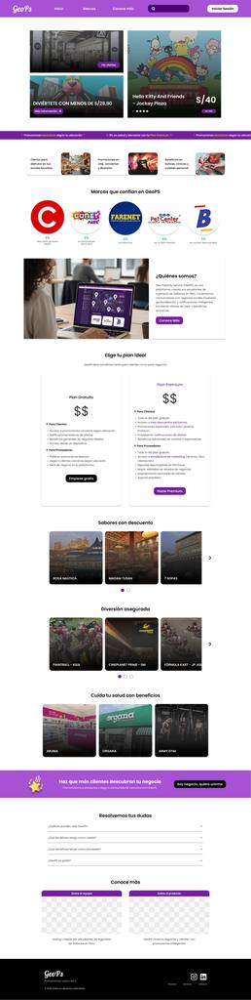
  </div>

  *Nota.* Elaboración propia (realizado en Figma).

### 4.4. Web Applications UX/UI Design

  #### 4.4.1. Web Applications Wireframes

  **Enlace Diseño Figma:** https://www.figma.com/design/mHHx8WStPBr63tLYj42pBX/GeoPs?node-id=336-2468&t=1Nm0EVmUTgy7sfDx-1

  **Login**

  **Inicio de sesión y registro**

  **Figura 21**<br>
  *Wireframe — Inicio de Sesión y Registro*

  <div align="center">
      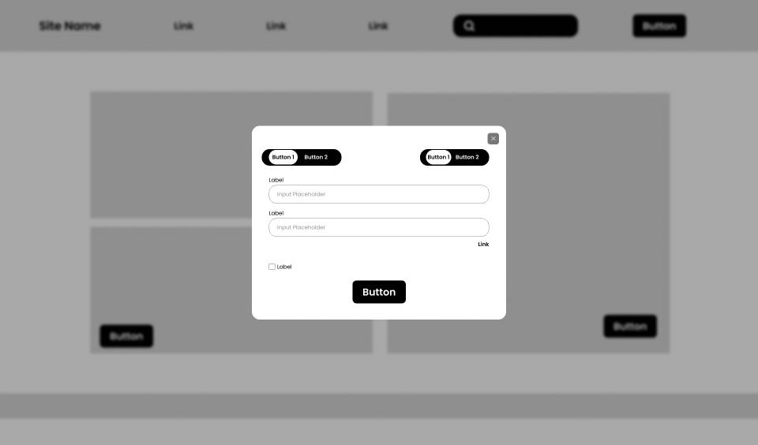
  </div>

  *Nota.* Elaboración propia (realizado en Figma).

  **Consumidores**

  **Home**

  **Figura 22**<br>
  *Wireframe — Home Consumidor*

  <div align="center">
      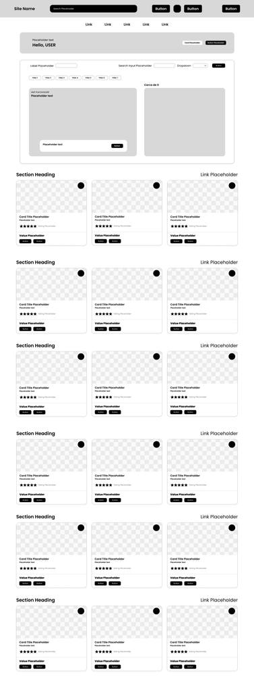
  </div>

  *Nota.* Elaboración propia (realizado en Figma).
  <br>
  
  **Ofertas**

  **Figura 23**<br>
  *Wireframe — Ofertas Consumidor*

  <div align="center">
      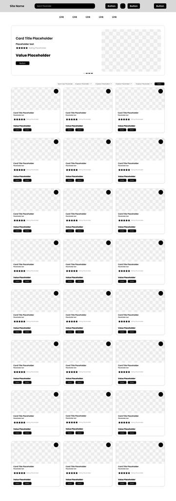
  </div>

  *Nota.* Elaboración propia (realizado en Figma).
  <br>
  
  **Categorías**

  **Figura 24**<br>
  *Wireframe — Categorías Consumidor*

  <div align="center">
      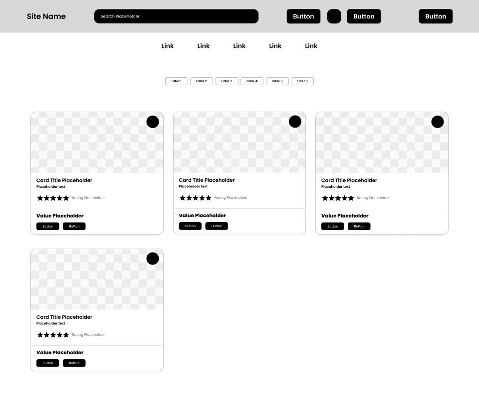
  </div>

  *Nota.* Elaboración propia (realizado en Figma).
  <br>

  **Favoritos**

  **Figura 25**<br>
  *Wireframe — Favoritos Consumidor*

  <div align="center">
      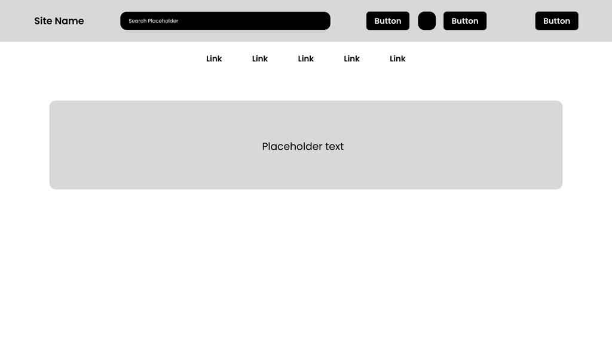
  </div>

  *Nota.* Elaboración propia (realizado en Figma).
  <br>

  **Mis Cupones**

  **Figura 26**<br>
  *Wireframe — Mis Cupones Consumidor*

  <div align="center">
      
  </div>

  *Nota.* Elaboración propia (realizado en Figma).
  <br>

  **Planes**

  **Figura 27**<br>
  *Wireframe — Planes Consumidor*

  <div align="center">
      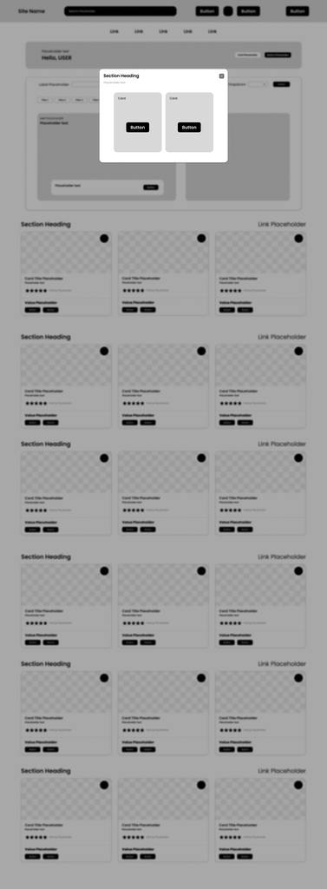
  </div>

  *Nota.* Elaboración propia (realizado en Figma).
  <br>

  **Acceso Ubicación**

  **Figura 28**<br>
  *Wireframe — Acceso a Ubicación Consumidor*

  <div align="center">
      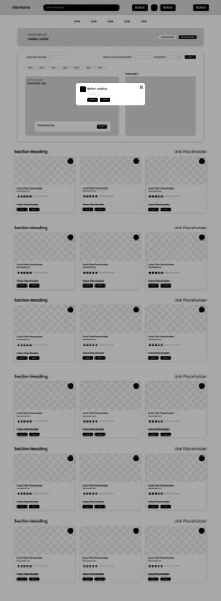
  </div>

  *Nota.* Elaboración propia (realizado en Figma).
  <br>

  - Ubicación Permitida

    **Figura 29**<br>
    *Wireframe — Ubicación Permitida Consumidor*

    <div align="center">
        
    </div>

    *Nota.* Elaboración propia (realizado en Figma).
    <br>

  **Secciones**

  **Figura 30**<br>
  *Wireframe — Secciones Consumidor*

  <div align="center">
      
  </div>

  *Nota.* Elaboración propia (realizado en Figma).
  <br>

  **Carrito de Compras**

  **Figura 31**<br>
  *Wireframe — Agregar Oferta al Carrito Consumidor*

  <div align="center">
      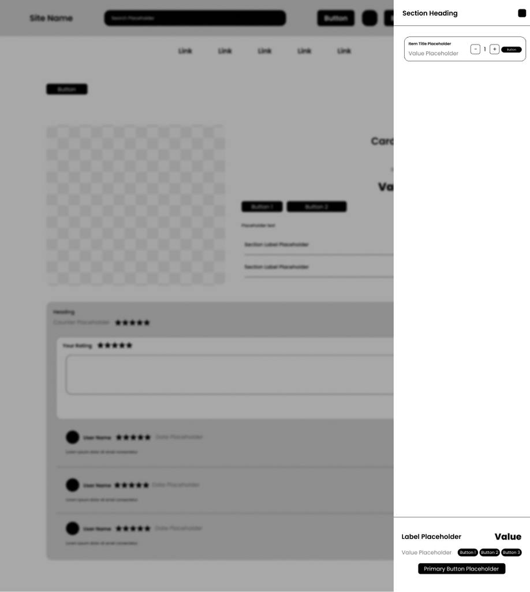
  </div>

  *Nota.* Elaboración propia (realizado en Figma).
  <br>

  **Pago**

  **Figura 32**<br>
  *Wireframe — Pago Consumidor*

  <div align="center">
      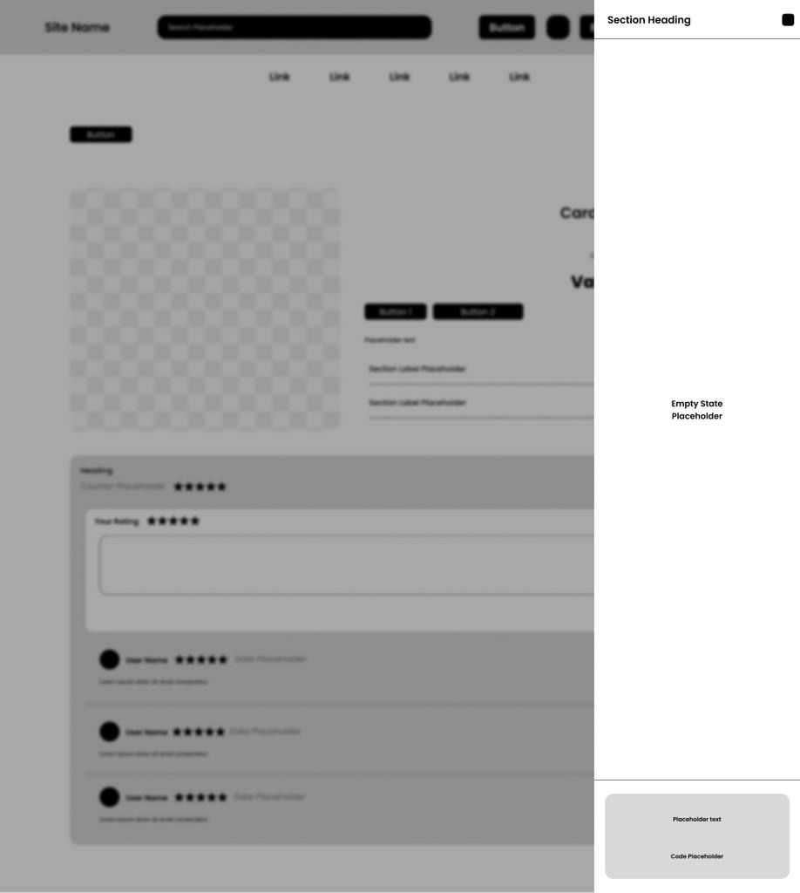
  </div>

  *Nota.* Elaboración propia (realizado en Figma).
  <br>

  **Ayuda**

  **Figura 33**<br>
  *Wireframe — Ayuda Consumidor*

  <div align="center">
      
  </div>

  *Nota.* Elaboración propia (realizado en Figma).
  <br>

  **Notificaciones**

  - Notificaciones Generales

    **Figura 34**<br>
    *Wireframe — Notificaciones Consumidor*

    <div align="center">
        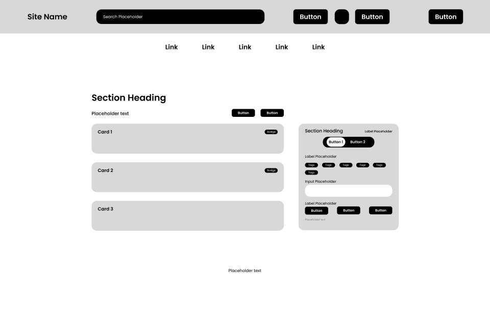
    </div>

    *Nota.* Elaboración propia (realizado en Figma).
    <br>

  - Notificaciones Leídas

    **Figura 35**<br>
    *Wireframe — Notificaciones Leídas Consumidor*

    <div align="center">
        
    </div>

    *Nota.* Elaboración propia (realizado en Figma).
    <br>

  - Sin Notificaciones

    **Figura 36**<br>
    *Wireframe — Sin Notificaciones Consumidor*

    <div align="center">
        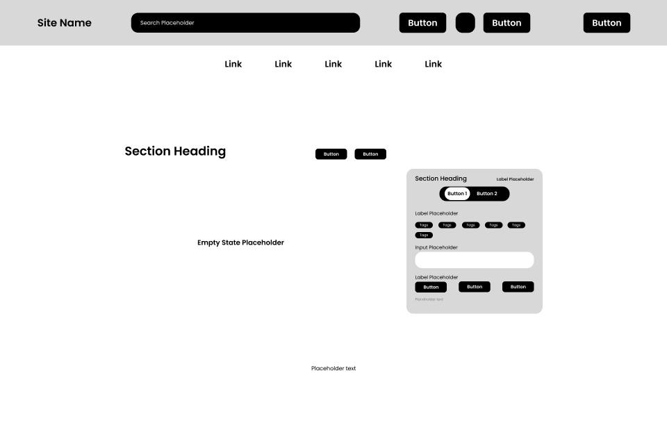
    </div>

    *Nota.* Elaboración propia (realizado en Figma).
    <br>

  **Perfil**

  **Figura 37**<br>
  *Wireframe — Perfil Consumidor*

  <div align="center">
      
  </div>

  *Nota.* Elaboración propia (realizado en Figma).
  <br>

  - Editar Perfil

    **Figura 38**<br>
    *Wireframe — Editar Perfil Consumidor*

    <div align="center">
        
    </div>

    *Nota.* Elaboración propia (realizado en Figma).
    <br>

  **Cerrar Sesión**

  **Figura 39**<br>
  *Wireframe — Cerrar Sesión Consumidor*

  <div align="center">
      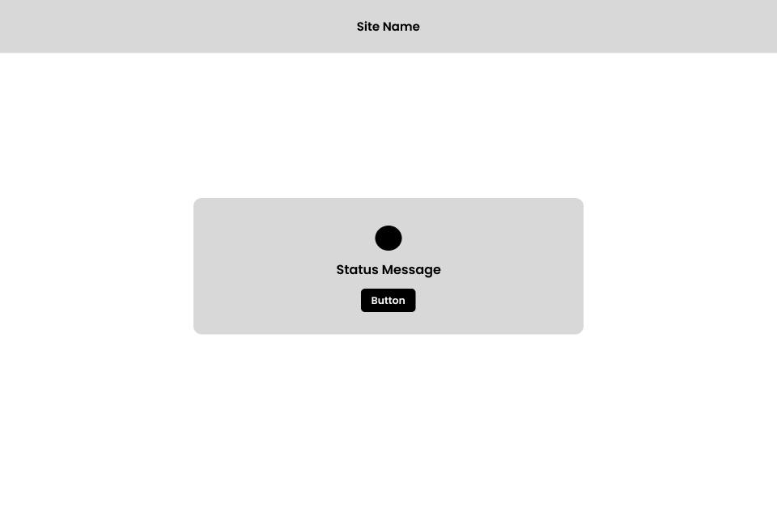
  </div>

  *Nota.* Elaboración propia (realizado en Figma).

  **Proveedores**

  **Resumen**

  **Figura 40**<br>
  *Wireframe — Resumen Proveedor*

  <div align="center">
      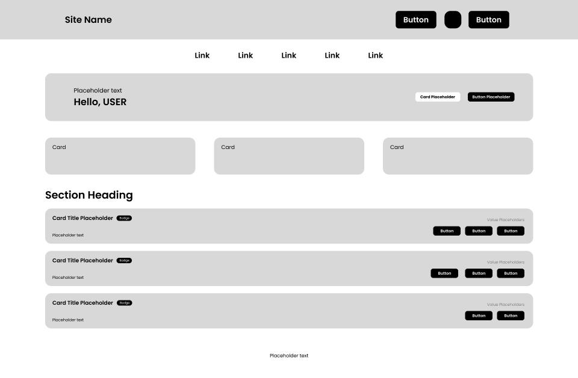
  </div>

  *Nota.* Elaboración propia (realizado en Figma).
  <br>

  **Campañas**

  **Figura 41**<br>
  *Wireframe — Campañas Proveedor*

  <div align="center">
      
  </div>

  *Nota.* Elaboración propia (realizado en Figma).
  <br>

  **Crear**

  **Figura 42**<br>
  *Wireframe — Crear Campaña Proveedor*

  <div align="center">
      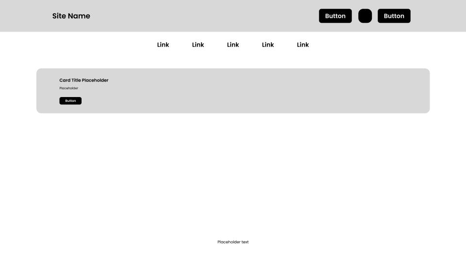
  </div>

  *Nota.* Elaboración propia (realizado en Figma).
  <br>

  - Crear campaña

    **Figura 43**<br>
    *Wireframe — Formulario Crear Campaña Proveedor*

    <div align="center">
        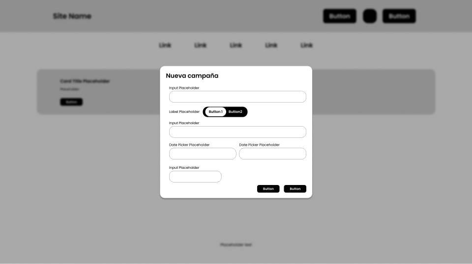
    </div>

    *Nota.* Elaboración propia (realizado en Figma).
    <br>

  - Campaña creada

    **Figura 44**<br>
    *Wireframe — Campaña Creada Proveedor*

    <div align="center">
        
    </div>

    *Nota.* Elaboración propia (realizado en Figma).
    <br>

  **Reportes**

  **Figura 45**<br>
  *Wireframe — Reportes Proveedor*

  <div align="center">
      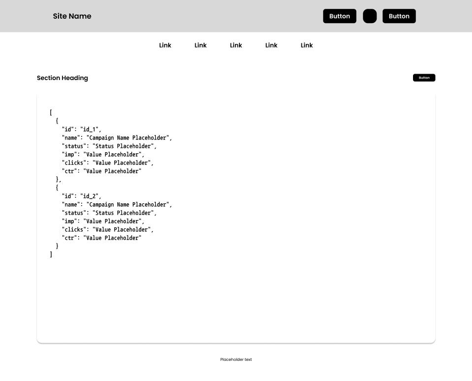
  </div>

  *Nota.* Elaboración propia (realizado en Figma).
  <br>

  **Comentarios**

  **Figura 46**<br>
  *Wireframe — Comentarios Proveedor*

  <div align="center">
      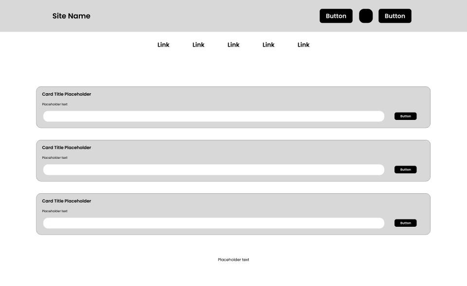
  </div>

  *Nota.* Elaboración propia (realizado en Figma).
  <br>

  **Planes**

  **Figura 47**<br>
  *Wireframe — Planes Proveedor*

  <div align="center">
      
  </div>

  *Nota.* Elaboración propia (realizado en Figma).
  <br>

  **Ayuda**

  **Figura 48**<br>
  *Wireframe — Ayuda Proveedor*

  <div align="center">
      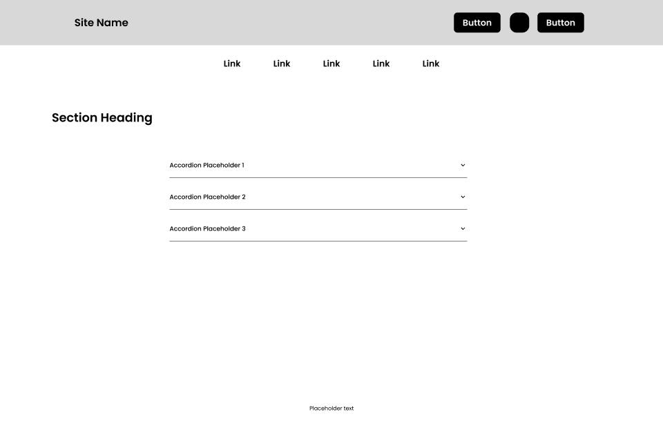
  </div>

  *Nota.* Elaboración propia (realizado en Figma).
  <br>

  **Notificaciones**

  - Notificaciones Generales

    **Figura 49**<br>
    *Wireframe — Notificaciones Proveedor*

    <div align="center">
        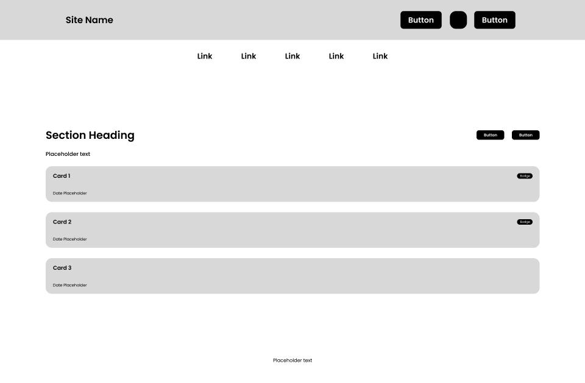
    </div>

    *Nota.* Elaboración propia (realizado en Figma).
    <br>

  - Notificaciones Leídas

    **Figura 50**<br>
    *Wireframe — Notificaciones Leídas Proveedor*

    <div align="center">
        
    </div>

    *Nota.* Elaboración propia (realizado en Figma).
    <br>

  - Sin Notificaciones

    **Figura 51**<br>
    *Wireframe — Sin Notificaciones Proveedor*

    <div align="center">
        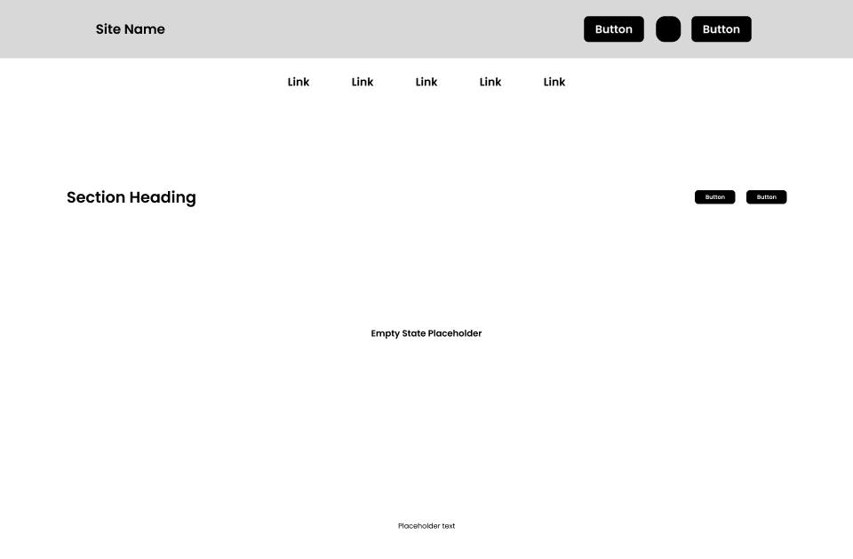
    </div>

    *Nota.* Elaboración propia (realizado en Figma).
    <br>

  **Perfil**

  **Figura 52**<br>
  *Wireframe — Perfil Proveedor*

  <div align="center">
      
  </div>

  *Nota.* Elaboración propia (realizado en Figma).
  <br>

  - Editar perfil

    **Figura 53**<br>
    *Wireframe — Editar Perfil Proveedor*

    <div align="center">
        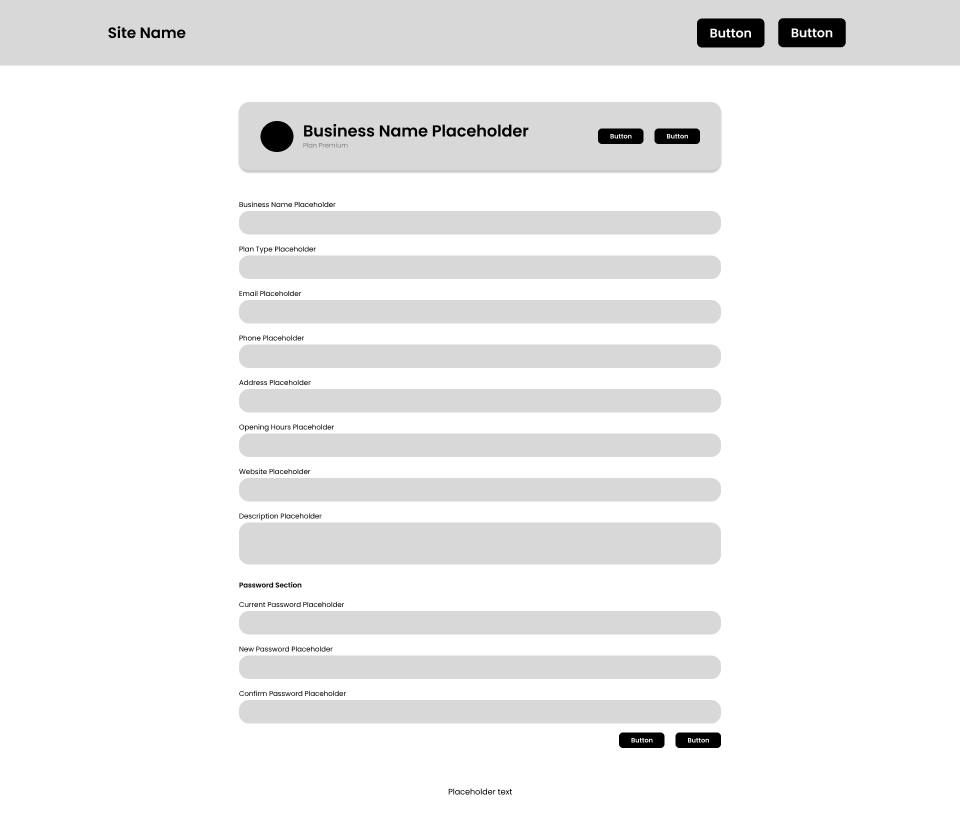
    </div>

    *Nota.* Elaboración propia (realizado en Figma).
    <br>

  **Cerrar Sesión**

  **Figura 54**<br>
  *Wireframe — Cerrar Sesión Proveedor*

  <div align="center">
      
  </div>

  *Nota.* Elaboración propia (realizado en Figma).

  #### 4.4.2. Web Applications Wireflow Diagrams

  Ver Wireflows Diagrams Overflow: https://overflow.io/s/FAPMCERY

  **Login**

  **User Goal: Iniciar Sesión**

  - Usuario: Cliente o Proveedor

    El usuario accede a la aplicación desde la vista de login, elige su rol (cliente o proveedor) e ingresa sus credenciales. Si los datos son correctos, el sistema valida la información y redirige al dashboard correspondiente. En caso contrario, se muestra un mensaje de error para reintentar.

    **Figura 55**<br>
    *User Goal — Iniciar Sesión*

    <div align="center">
        
    </div>

    *Nota.* Elaboración propia (realizado en Overflow).

  **Consumidores**

  **User Goal: Visualizar planes**

  - Usuario: Consumidor

    El consumidor ingresa a la sección de planes desde el home. Allí puede ver las opciones de suscripción disponibles. Cada plan muestra sus características principales y beneficios. El usuario evalúa y elige el que mejor se ajusta a sus necesidades.

    **Figura 56**<br>
    *User Goal — Visualizar Planes*

    <div align="center">
        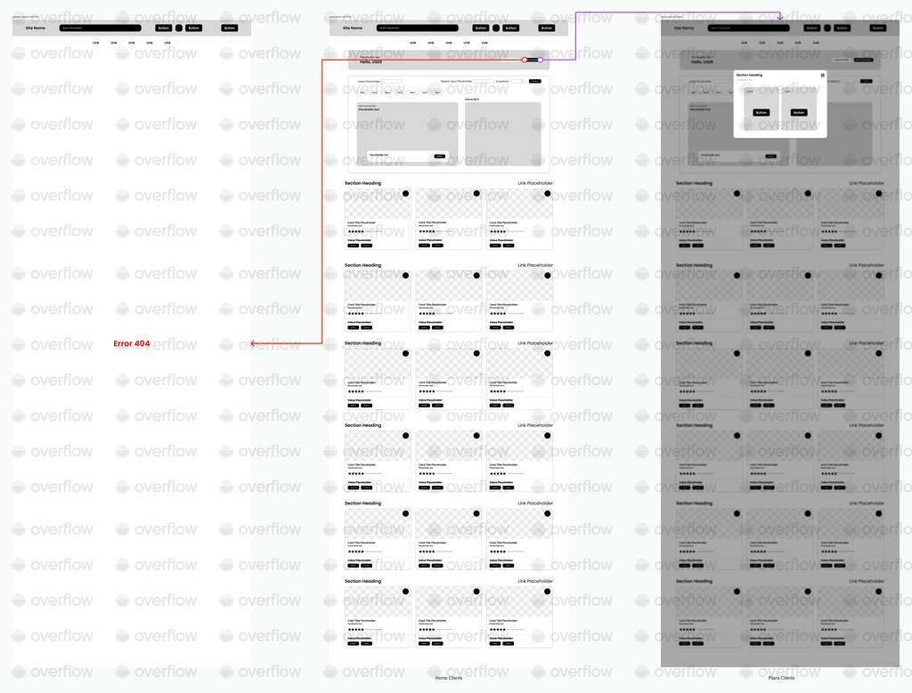
    </div>

    *Nota.* Elaboración propia (realizado en Overflow).
    <br>

  **User Goal: Permitir acceso a ubicación**

  - Usuario: Consumidor

    El sistema solicita al consumidor acceso a su ubicación. El usuario recibe una ventana emergente para aceptar o rechazar. Al aceptar, la aplicación muestra ofertas cercanas personalizadas. Si no lo permite, solo se muestran resultados generales.

    **Figura 57**<br>
    *User Goal — Permitir Acceso a Ubicación*

    <div align="center">
          
    </div>

    *Nota.* Elaboración propia (realizado en Overflow).
    <br>

  **User Goal: Acceso a Ayuda, Notificaciones y Perfil**

  - Usuario: Consumidor

    El consumidor desde el header accede al centro de ayuda, revisa sus notificaciones (con la opción de marcar como leídas o limpiarlas) y puede entrar a su perfil. En el perfil tiene acceso a la información registrada y ajustes personales.

    **Figura 58**<br>
    *User Goal — Acceso a Ayuda, Notificaciones y Perfil*

    <div align="center">
        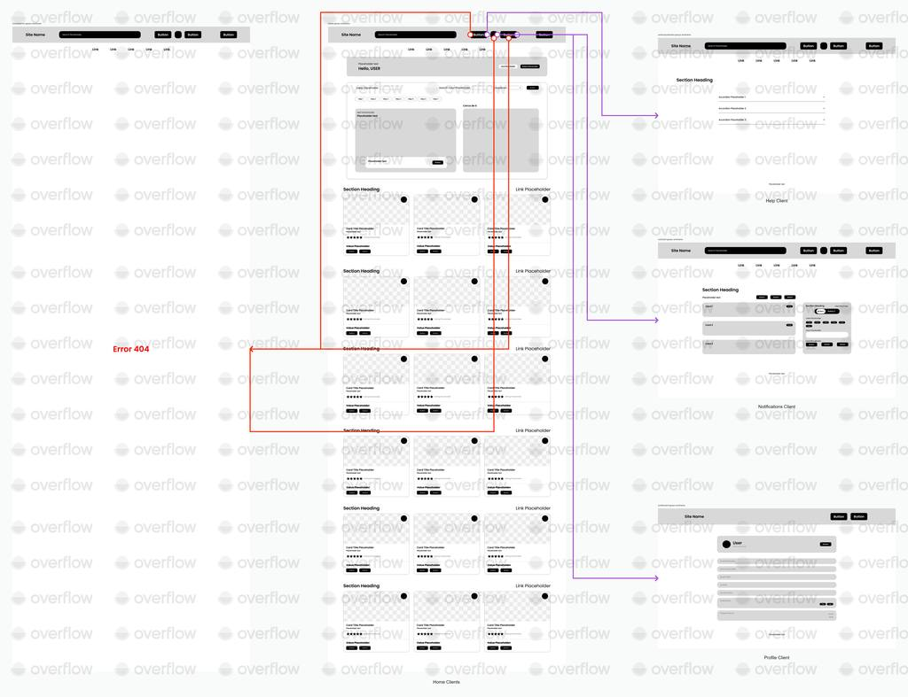
    </div>

    *Nota.* Elaboración propia (realizado en Overflow).
    <br>

  **User Goal: Acceso a Links Principales (Ofertas, Categorías, Favoritos, Cupones)**

  - Usuario: Consumidor

    Desde el home, el consumidor selecciona alguno de los accesos rápidos (Ofertas, Categorías, Favoritos, Cupones). El sistema lo redirige a la sección correspondiente. En cada sección se muestran los elementos relacionados, organizados para facilitar la navegación.

    **Figura 59**<br>
    *User Goal — Acceso a links Principales*

    <div align="center">
        
    </div>

    *Nota.* Elaboración propia (realizado en Overflow).
    <br>

  **User Goal: Detalle de Sección y Proceso de Pago**

  - Usuario: Consumidor

    El consumidor entra a una sección (ej. cines), selecciona una oferta y accede al detalle. Desde allí puede añadir al carrito o comprar directamente. Posteriormente continúa con el proceso de pago, confirmando el método y finalizando la transacción.

    **Figura 60**<br>
    *User Goal — Detalle de Sección y Proceso de Pago*

    <div align="center">
        
    </div>

    *Nota.* Elaboración propia (realizado en Overflow).
    <br>

  **User Goal: Cerrar Sesión**

  - Usuario: Consumidor

    El consumidor, desde el perfil, selecciona la opción de cerrar sesión. El sistema valida la acción y cierra la cuenta activa.

    **Figura 61**<br>
    *User Goal — Cerrar Sesión*

    <div align="center">
        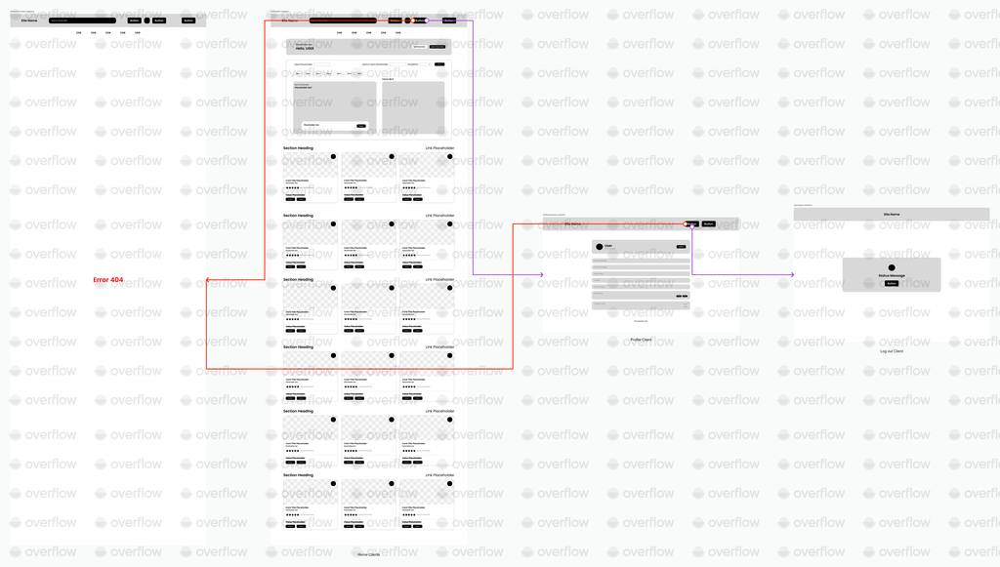
    </div>

    *Nota.* Elaboración propia (realizado en Overflow).

  **Proveedores**

  **User Goal: Visualizar Planes**

  - Usuario: Proveedor

    El proveedor accede a la sección de planes desde la opción resumen. Allí se le muestran las opciones de suscripción que permiten ampliar beneficios en la plataforma.

    **Figura 62**<br>
    *User Goal — Visualizar Planes*

    <div align="center">
        
    </div>

    *Nota.* Elaboración propia (realizado en Overflow).
    <br>

  **User Goal: Acceso a Ayuda, Notificaciones y Perfil**

  - Usuario: Proveedor

    El proveedor accede desde el header a secciones complementarias. En Ayuda, encuentra respuestas rápidas a dudas frecuentes. En Notificaciones, revisa avisos relevantes y puede marcarlos como leídos o eliminarlos. Finalmente, en Perfil, gestiona la información de su negocio.

    **Figura 63**<br>
    *User Goal — Acceso a Ayuda, Notificaciones y Perfil*

    <div align="center">
        
    </div>

    *Nota.* Elaboración propia (realizado en Overflow).
    <br>

  **User Goal: Acceso a Lnks Principales**

  - Usuario: Proveedor

    El proveedor, desde la vista de resumen, puede navegar hacia los enlaces principales de la plataforma: campañas, creación de nuevas promociones, reportes y comentarios de clientes.

    **Figura 64**<br>
    *User Goal — Acceso a links Principales*

    <div align="center">
        
    </div>

    *Nota.* Elaboración propia (realizado en Overflow).
    <br>

  **User Goal: Cerrar Sesión**

  - Usuario: Proveedor

    El proveedor, desde el perfil, selecciona cerrar sesión. El sistema valida la acción y cierra la cuenta activa.

    **Figura 65**<br>
    *User Goal — Cerrar Sesión*

    <div align="center">
        
    </div>

    *Nota.* Elaboración propia (realizado en Overflow).

  #### 4.4.3. Web Applications Mock-ups

  **Enlace Diseño Figma:** https://www.figma.com/design/mHHx8WStPBr63tLYj42pBX/GeoPs?node-id=336-2468&t=1Nm0EVmUTgy7sfDx-1

  **Login**

  **Inicio de Sesión y Registro**

  **Figura 66**<br>
  *Mock-up — Inicio de Sesión y Registro*

  <div align="center">
      
  </div>

  *Nota.* Elaboración propia (realizado en Figma).

  **Consumidores**

  **Home**

  **Figura 67**<br>
  *Mock-up — Home*

  <div align="center">
      
  </div>

  *Nota.* Elaboración propia (realizado en Figma).
  <br>

  **Ofertas**

  **Figura 68**<br>
  *Mock-up — Ofertas*

  <div align="center">
      
  </div>

  *Nota.* Elaboración propia (realizado en Figma).
  <br>

  **Categorias**

  **Figura 69**<br>
  *Mock-up — Categorías*

  <div align="center">
      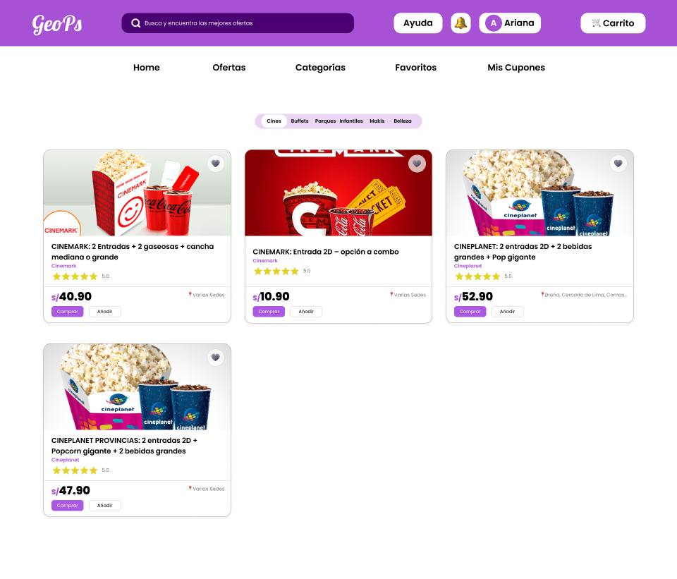
  </div>

  *Nota.* Elaboración propia (realizado en Figma).
  <br>

  **Favoritos**

  **Figura 70**<br>
  *Mock-up — Favoritos*

  <div align="center">
      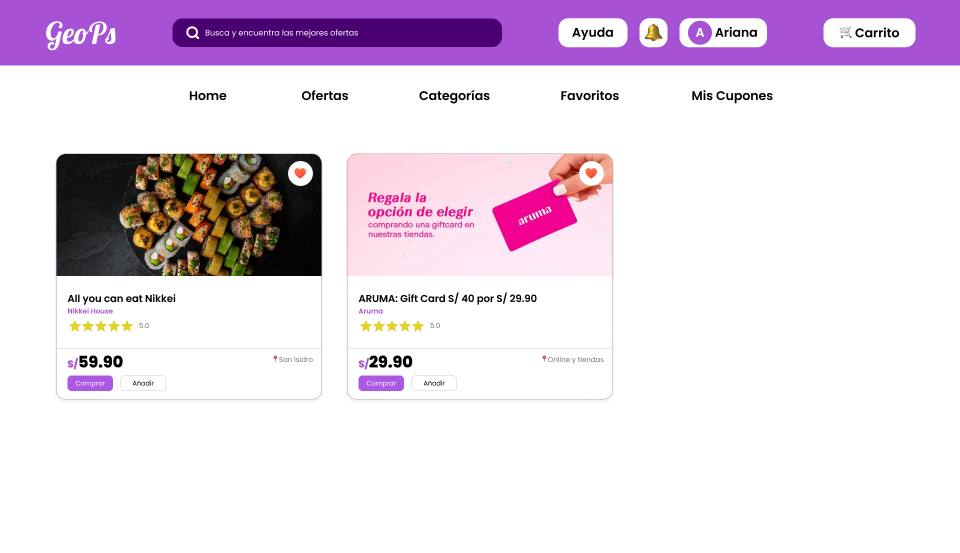
  </div>

  *Nota.* Elaboración propia (realizado en Figma).
  <br>

  **Cupones**

  **Figura 71**<br>
  *Mock-up — Cupones*

  <div align="center">
      
  </div>

  *Nota.* Elaboración propia (realizado en Figma).
  <br>

  **Planes**

  **Figura 72**<br>
  *Mock-up — Planes*

  <div align="center">
      
  </div>

  *Nota.* Elaboración propia (realizado en Figma).
  <br>

  **Acceso Ubicación**

  **Figura 73**<br>
  *Mock-up — Solicitud de Acceso a Ubicación*

  <div align="center">
      
  </div>

  *Nota.* Elaboración propia (realizado en Figma).
  <br>

  **Ubicación Permitida**

  **Figura 74**<br>
  *Mock-up — Ubicación Permitida*

  <div align="center">
      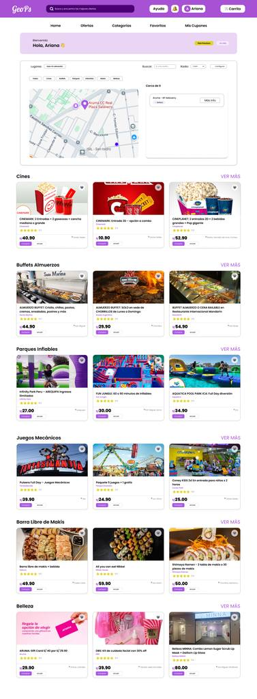
  </div>

  *Nota.* Elaboración propia (realizado en Figma).
  <br>

  **Secciones**

  - Cines

    **Figura 75**<br>
    *Mock-up — Sección Cines*

    <div align="center">
        
    </div>

    *Nota.* Elaboración propia (realizado en Figma).
    <br>

  - Buffets

    **Figura 76**<br>
    *Mock-up — Sección Buffets*

    <div align="center">
        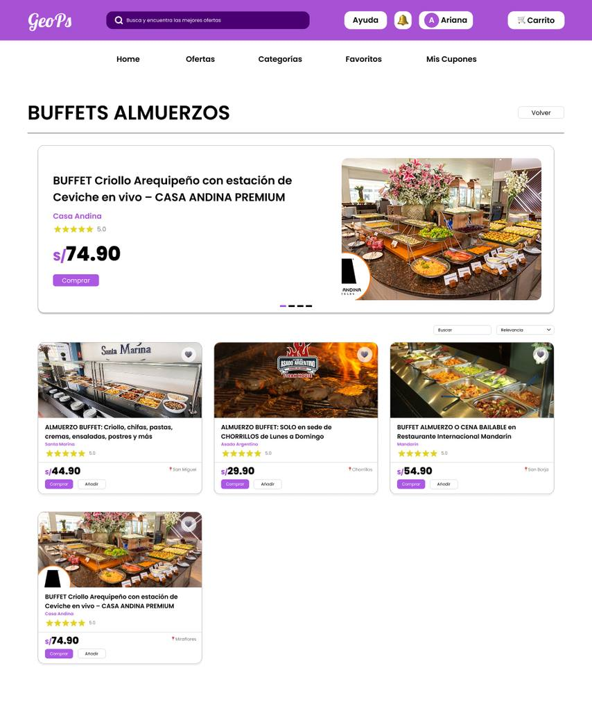
    </div>

    *Nota.* Elaboración propia (realizado en Figma).
    <br>

  - Parques

    **Figura 77**<br>
    *Mock-up — Sección Parques*

    <div align="center">
        
    </div>

    *Nota.* Elaboración propia (realizado en Figma).
    <br>

  - Juegos

    **Figura 78**<br>
    *Mock-up — Sección Juegos*

    <div align="center">
        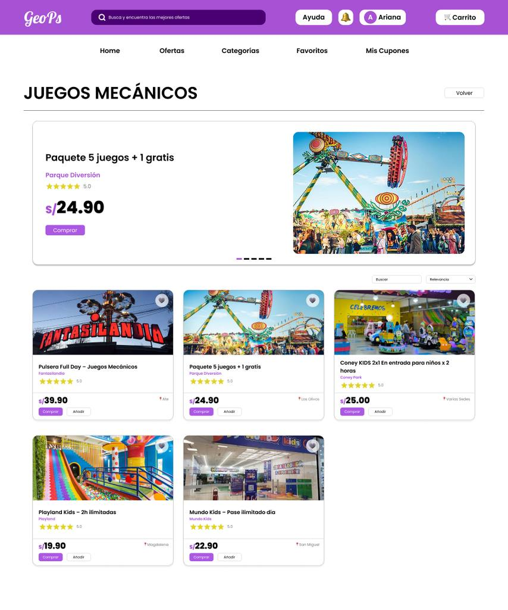
    </div>

    *Nota.* Elaboración propia (realizado en Figma).
    <br>

  - Makis

    **Figura 79**<br>
    *Mock-up — Sección Makis*

    <div align="center">
        
    </div>

    *Nota.* Elaboración propia (realizado en Figma).
    <br>

  - Belleza

    **Figura 80**<br>
    *Mock-up — Sección Belleza*

    <div align="center">
        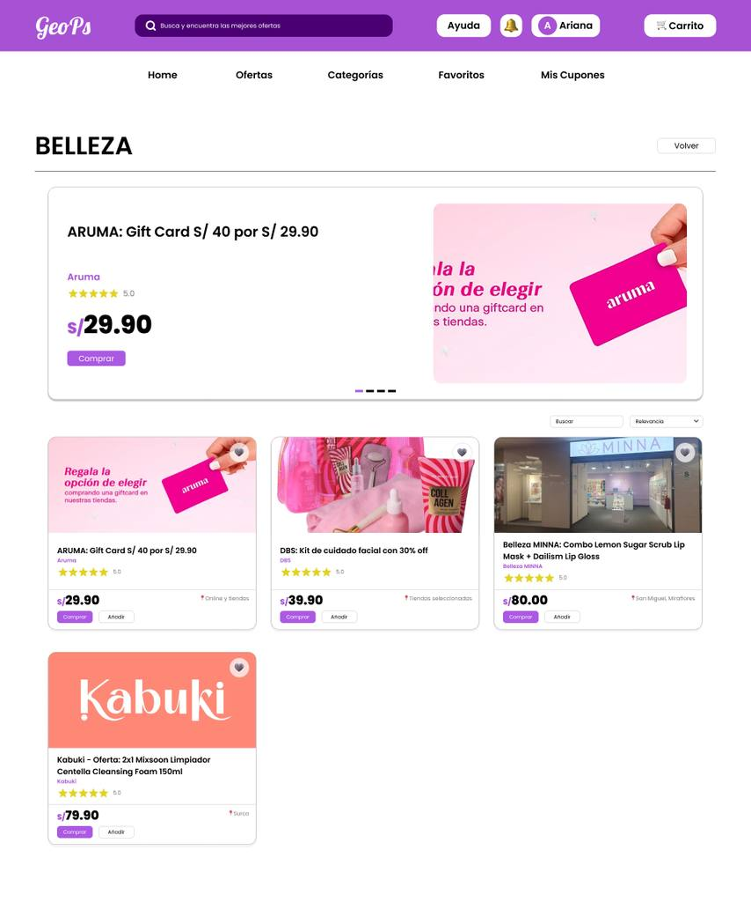
    </div>

    *Nota.* Elaboración propia (realizado en Figma).
    <br>

  **Carrito de Compras**

  - Agregar Oferta al Carrito

    **Figura 81**<br>
    *Mock-up — Agregar Oferta al Carrito*

    <div align="center">
        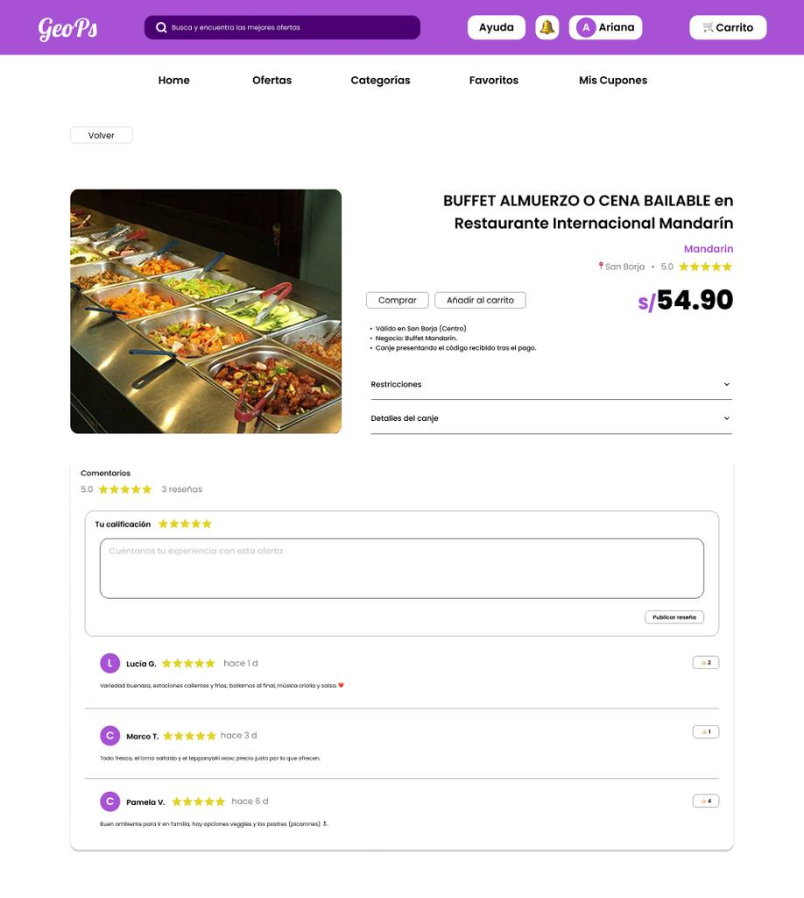
    </div>

    *Nota.* Elaboración propia (realizado en Figma).
    <br>

  - Oferta Agregada al Carrito

    **Figura 82**<br>
    *Mock-up — Oferta Agregada al Carrito*

    <div align="center">
        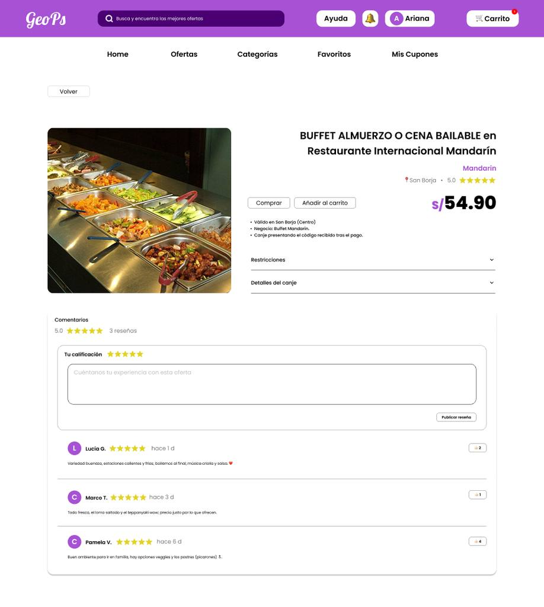
    </div>

    *Nota.* Elaboración propia (realizado en Figma).
    <br>

  **Pago**

  - Ver Carrito

    **Figura 83**<br>
    *Mock-up — Carrito de Compras*

    <div align="center">
        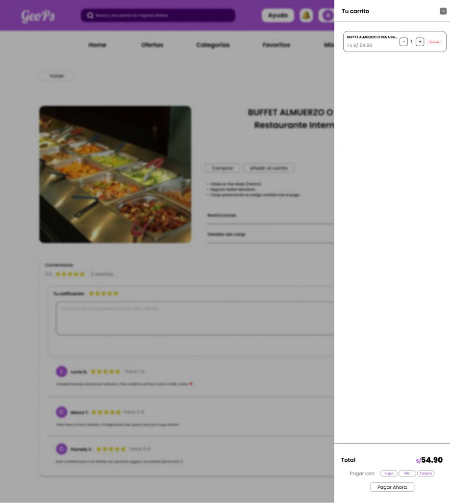
    </div>

    *Nota.* Elaboración propia (realizado en Figma).
    <br>

  - Procesar Pago

    **Figura 84**<br>
    *Mock-up — Proceso de Pago*

    <div align="center">
        
    </div>

    *Nota.* Elaboración propia (realizado en Figma).
    <br>
    
  **Ayuda**

  **Figura 85**<br>
  * *

  <div align="center">
      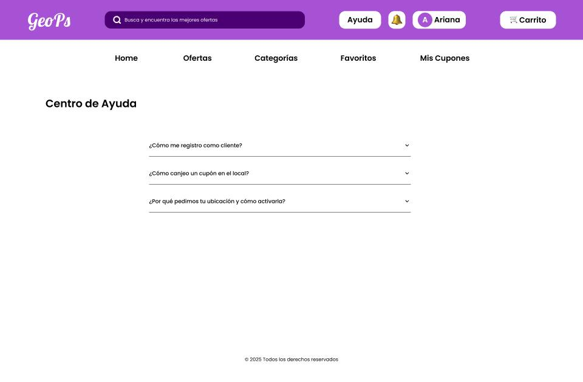
  </div>

  *Nota.* Elaboración propia (realizado en Figma).
  <br>

  **Notificaciones**

  - Notificaciones Generales

    **Figura 86**<br>
    *Mock-up — Notificaciones Generales*

    <div align="center">
        
    </div>

    *Nota.* Elaboración propia (realizado en Figma).
    <br>

  - Notificaciones Leídas

    **Figura 87**<br>
    *Mock-up — Notificaciones leídas*

    <div align="center">
        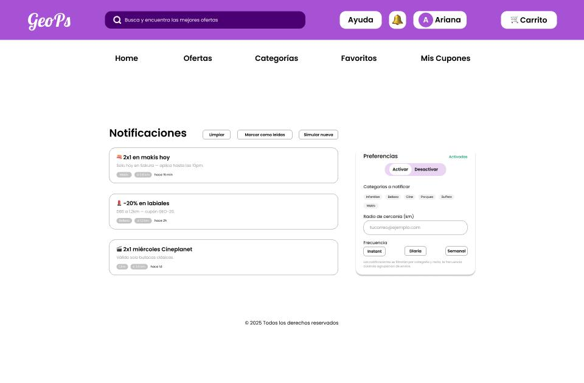
    </div>

    *Nota.* Elaboración propia (realizado en Figma).
    <br>

  - Sin Notificaciones

    **Figura 88**<br>
    *Mock-up — Sin Notificaciones*

    <div align="center">
        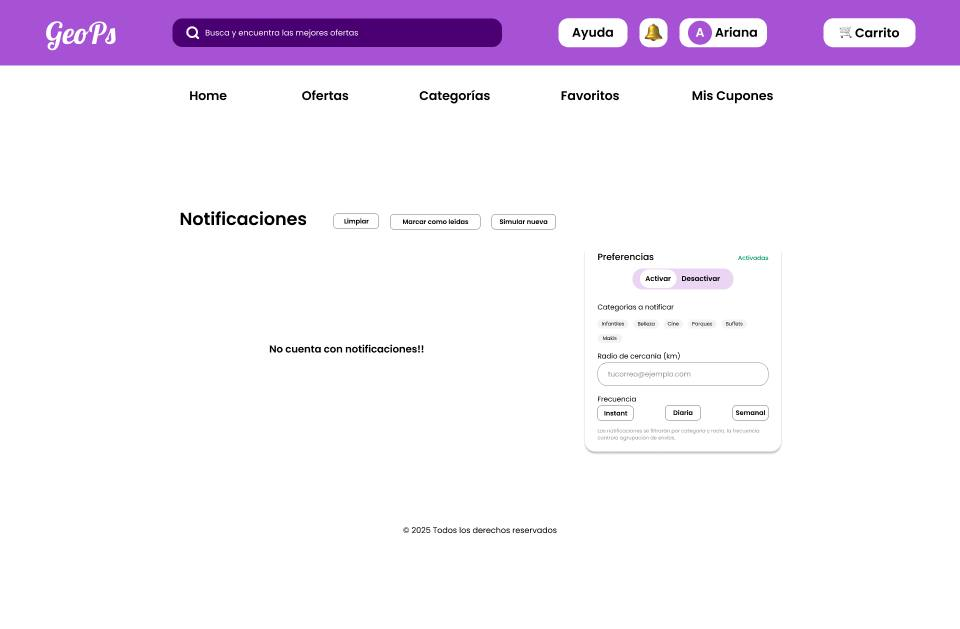
    </div>

    *Nota.* Elaboración propia (realizado en Figma).
    <br>

  **Perfil**

  **Figura 89**<br>
  *Mock-up — Perfil*

  <div align="center">
      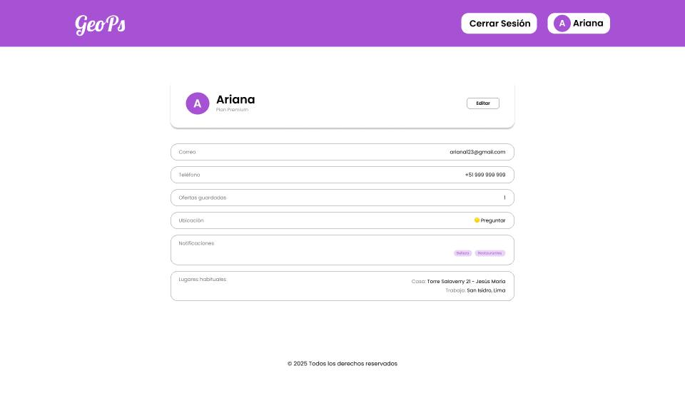
  </div>

  *Nota.* Elaboración propia (realizado en Figma).
  <br>

  - Editar Perfil

    **Figura 90**<br>
    *Mock-up — Editar Perfil*

    <div align="center">
        
    </div>

    *Nota.* Elaboración propia (realizado en Figma).
    <br>

  **Cerrar Sesión**

  **Figura 91**<br>
  *Mock-up — Cerrar Sesión*

  <div align="center">
      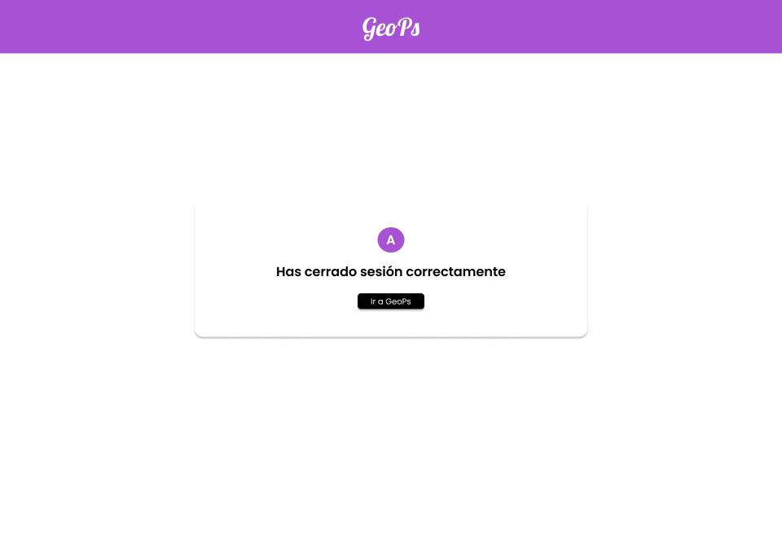
  </div>

  *Nota.* Elaboración propia (realizado en Figma).

  **Proveedores**

  **Resumen**

  **Figura 92**<br>
  *Mockup — Resumen Proveedor*

  <div align="center">
      
  </div>

  *Nota.* Elaboración propia (realizado en Figma).  
  <br>

  **Campañas**

  **Figura 93**<br>
  *Mockup — Campañas Proveedor*

  <div align="center">
      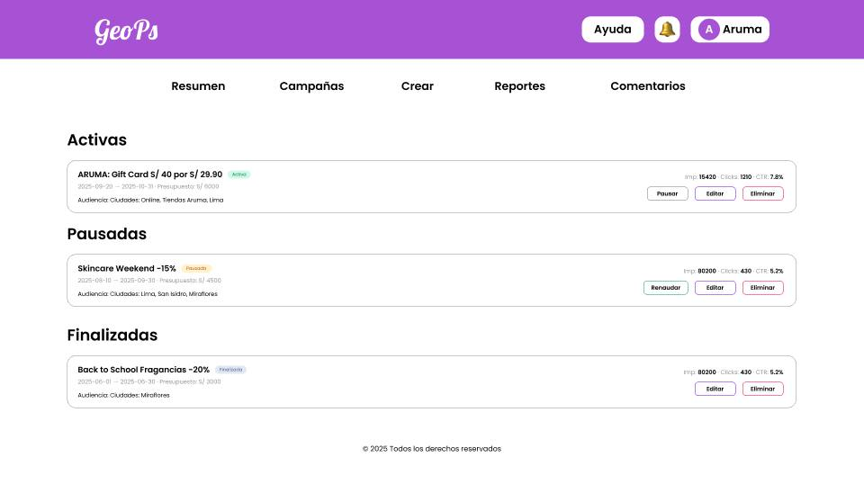
  </div>

  *Nota.* Elaboración propia (realizado en Figma).  
  <br>

  **Crear**

  **Figura 94**<br>
  *Mockup — Sección Crear Proveedor*

  <div align="center">
      
  </div>

  *Nota.* Elaboración propia (realizado en Figma).  
  <br>

  - Crear Campaña

    **Figura 95**<br>
    *Mockup — Crear Campaña Proveedor*

    <div align="center">
        
    </div>

    *Nota.* Elaboración propia (realizado en Figma).  
    <br>

  - Campaña Creada

    **Figura 96**<br>
    *Mockup — Campaña Creada Proveedor*

    <div align="center">
        
    </div>

    *Nota.* Elaboración propia (realizado en Figma).  
    <br>

  **Reportes**

  **Figura 97**<br>
  *Mockup — Reportes Proveedor*

  <div align="center">
      
  </div>

  *Nota.* Elaboración propia (realizado en Figma).  
  <br>

  **Comentarios**

  **Figura 98**<br>
  *Mockup — Comentarios Proveedor*

  <div align="center">
      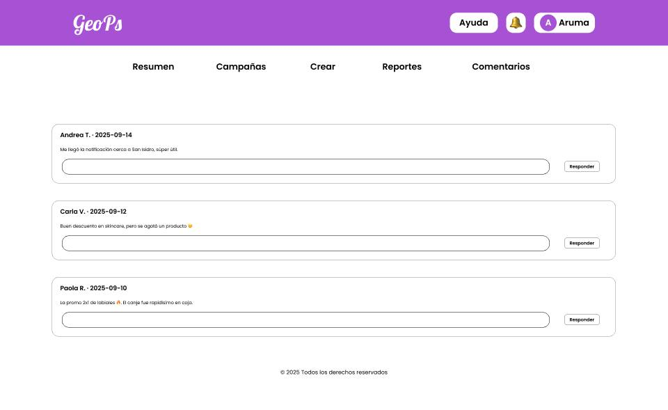
  </div>

  *Nota.* Elaboración propia (realizado en Figma).  
  <br>

  **Planes**

  **Figura 99**<br>
  *Mockup — Planes Proveedor*

  <div align="center">
      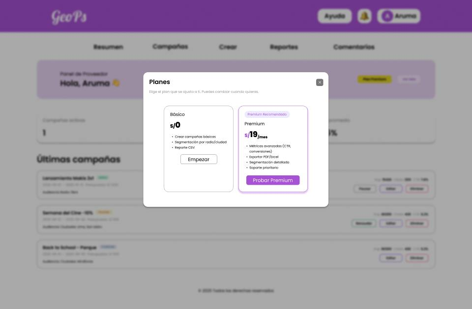
  </div>

  *Nota.* Elaboración propia (realizado en Figma).  
  <br>

  **Ayuda**

  **Figura 100**<br>
  *Mockup — Ayuda Proveedor*

  <div align="center">
      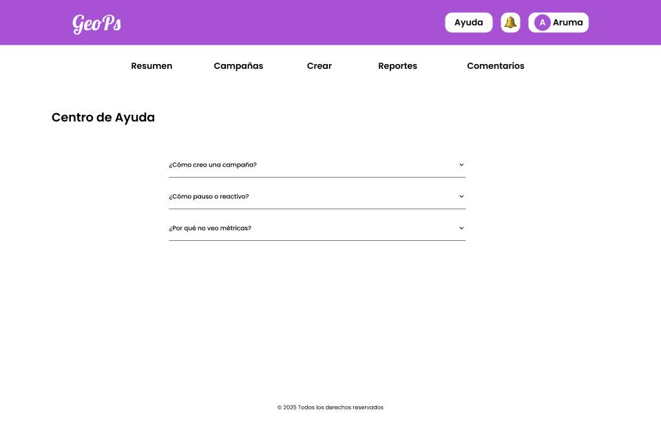
  </div>

  *Nota.* Elaboración propia (realizado en Figma).  
  <br>

  **Notificaciones**

  - Notificaciones Generales

    **Figura 101**<br>
    *Mockup — Notificaciones Proveedor*

    <div align="center">
        
    </div>

    *Nota.* Elaboración propia (realizado en Figma).  
    <br>

  - Notificaciones Leídas

    **Figura 102**<br>
    *Mockup — Notificaciones Leídas Proveedor*
  
    <div align="center">
        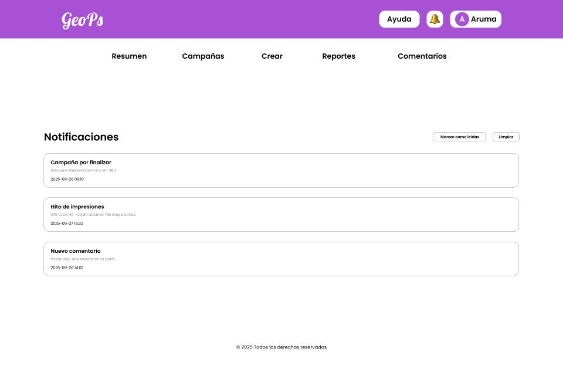
    </div>
  
    *Nota.* Elaboración propia (realizado en Figma).  
    <br>

  - Sin Notificaciones

    **Figura 103**<br>
    *Mockup — Sin Notificaciones Proveedor*

    <div align="center">
        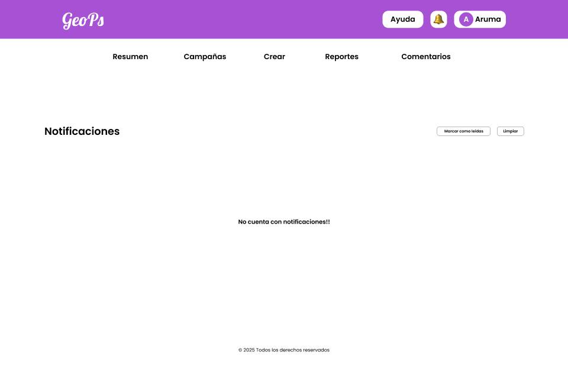
    </div>

    *Nota.* Elaboración propia (realizado en Figma).  
    <br>

  **Perfil**

  **Figura 104**<br>
  *Mockup — Perfil Proveedor*

  <div align="center">
      
  </div>

  *Nota.* Elaboración propia (realizado en Figma).  
  <br>

  - Editar perfil

    **Figura 105**<br> 
    *Mockup — Editar Perfil Proveedor*

    <div align="center">
        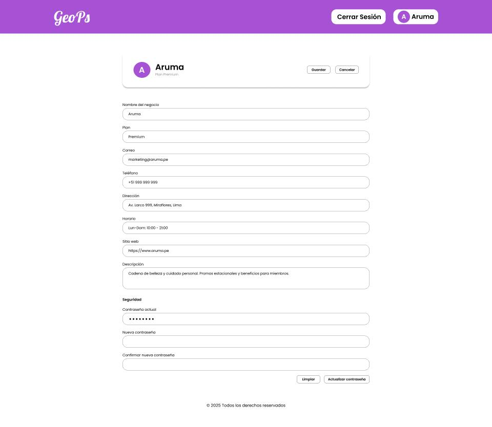
    </div>

    *Nota.* Elaboración propia (realizado en Figma).  
    <br>

  **Cerrar Sesión**

  **Figura 106**<br> 
  *Mockup — Cerrar Sesión Proveedor*

  <div align="center">
      
  </div>

  *Nota.* Elaboración propia (realizado en Figma).

  #### 4.4.4. Web Applications User Flow Diagrams

  **General**

  Iniciar Sesión en Consumidor o Proveedor:

  **Figura 107**<br>
  *USFD — Iniciar sesión (Cliente / Proveedor)*

  <div align="center">
      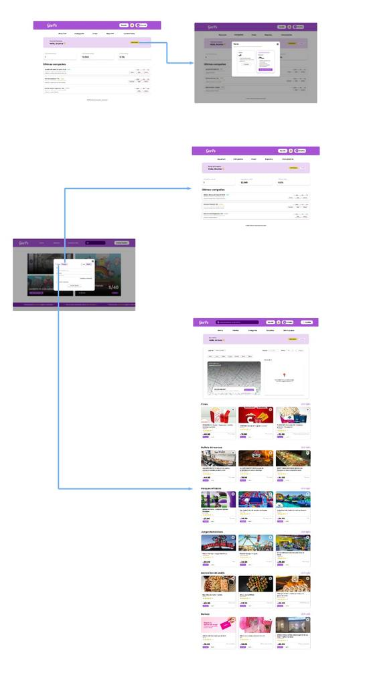
  </div>

  *Nota.* Elaboración propia.  
  <br>

  **Consumidores**

  **Acceder a Opciones de Empresa (Campañas, Crear, Reportes y Comentarios)**

  **Figura 108**<br>
  *USFD — Acceso a links principales Consumidor*

  <div align="center">
      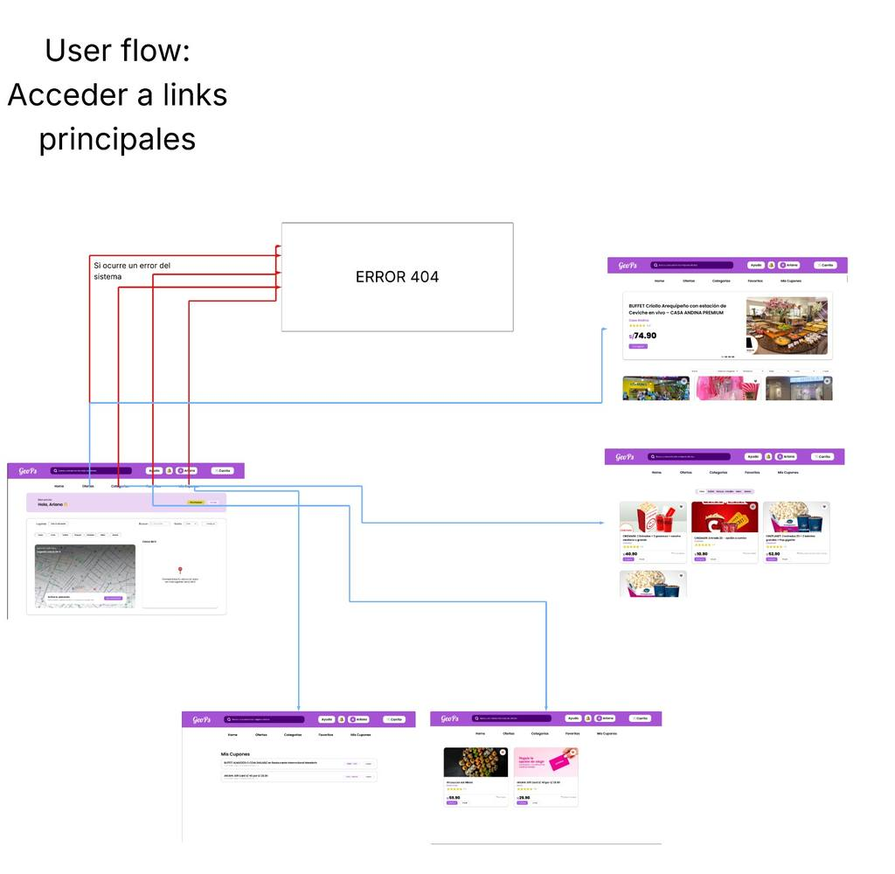
  </div>

  *Nota.* Elaboración propia.  
  <br>

  **Acceder a Links Principales**

  **Figura 109**<br>
  *USFD — Acceso a links principales Consumidor*

  <div align="center">
      
  </div>

  *Nota.* Elaboración propia.  
  <br>

  **Cerrar Sesión**

  **Figura 110**<br>
  *USFD — Cerrar sesión Consumidor*

  <div align="center">
      
  </div>

  *Nota.* Elaboración propia.  
  <br>

  **Proveedores**

  **Acceder a Links Principales**

  **Figura 111**<br>
  *USFD — Acceso a Links Principales Proveedor*

  <div align="center">
      
  </div>

  *Nota.* Elaboración propia.  
  <br>

  **Acceder a Ayuda, Notificaciones y Perfil**

  **Figura 112**<br>
  *USFD — Acceso a Ayuda, Notificaciones y Perfil Proveedor*

  <div align="center">
      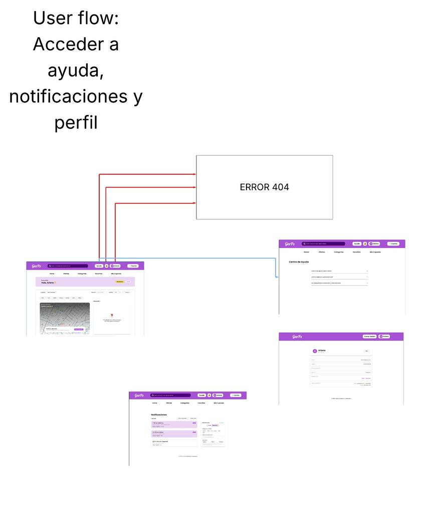
  </div>

  *Nota.* Elaboración propia.  
  <br>

  **Cerrar Sesión**

  **Figura 113**<br>
  *USFD — Cerrar Sesión Proveedor*

  <div align="center">
      
  </div>

  *Nota.* Elaboración propia.

  ### 4.5. Web Applications Prototyping

  Para el desarrollo del prototype utilizamos la herramienta Figma, en la cual agregamos interacciones a los mock-ups previamente diseñados. Esto permitió simular el flujo de navegación y visualizar la experiencia del usuario de manera más realista.

  **Enlace Diseño Figma Prototype:** https://www.figma.com/proto/mHHx8WStPBr63tLYj42pBX/GeoPs?node-id=2-511&t=I0J1dH7e40wYL90d-1&scaling=min-zoom&content-scaling=fixed&page-id=0%3A1&starting-point-node-id=426%3A3299

  **Figura 114**<br>
  *Prototype — GeoPS*

  <div align="center">
      
  </div>

  *Nota.* Elaboración propia (realizado en Figma).  
  <br>

  **Enlace Video Web Application Prototype:** https://upcedupe-my.sharepoint.com/:v:/g/personal/u202318049_upc_edu_pe/IQD6SaN-XMsAR6NvgRD_Ev7BAf-nnmSLy5uYleYv0lLnt0Q?nav=eyJyZWZlcnJhbEluZm8iOnsicmVmZXJyYWxBcHAiOiJTdHJlYW1XZWJBcHAiLCJyZWZlcnJhbFZpZXciOiJTaGFyZURpYWxvZy1MaW5rIiwicmVmZXJyYWxBcHBQbGF0Zm9ybSI6IldlYiIsInJlZmVycmFsTW9kZSI6InZpZXcifX0%3D&e=V5Lp6h

### 4.6. Domain-Driven Software Architecture

La arquitectura de software de GeoPS API está basada en un enfoque de **monolito modular orientado por Domain-Driven Design (DDD)**. El backend se implementa como una aplicación Spring Boot organizada internamente en módulos de dominio, lo que permite mantener una estructura clara, mantenible y alineada con las responsabilidades del negocio.

El backend se organiza en bounded contexts que representan responsabilidades específicas del sistema: **Identity**, **Campaign**, **Offers** y un módulo transversal denominado **Shared Kernel**. Cada bounded context mantiene una separación interna entre las capas de dominio, aplicación, infraestructura e interfaces REST, lo que facilita la mantenibilidad del código y permite que cada módulo evolucione de forma ordenada.

GeoPS API aplica una separación tipo **CQRS ligero**, diferenciando los servicios de comando, encargados de operaciones de escritura, de los servicios de consulta, encargados de operaciones de lectura. Esta separación permite organizar mejor los casos de uso y reducir la mezcla de responsabilidades dentro de cada bounded context.

Se utilizó el modelo C4 para representar la arquitectura desde diferentes niveles de abstracción: contexto, contenedores y componentes. En esta versión del sistema, los diagramas representan una aplicación web Angular que consume una API REST desarrollada en Spring Boot, la cual persiste información en una base de datos MySQL.

#### 4.6.1. Software Architecture Context Diagram

**Figura 115**<br>
*Software Architecture Context Diagram — GeoPS*

<div align="center">
    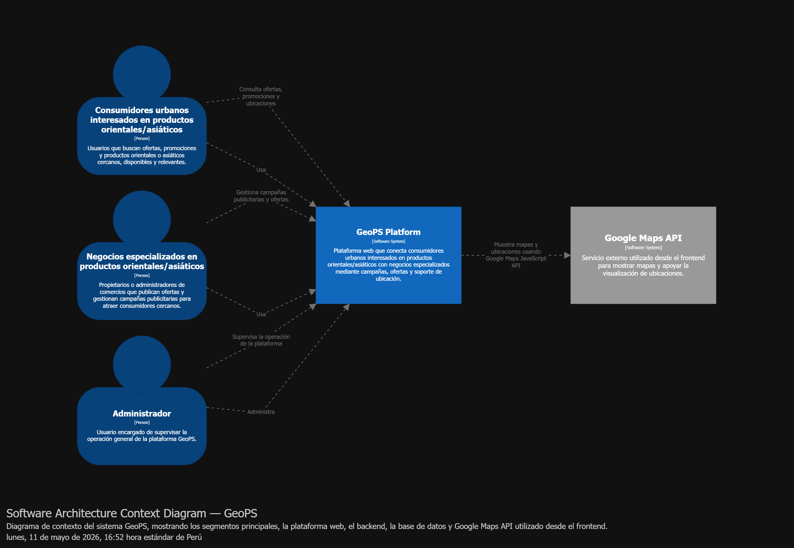
</div>

*Nota.* Elaboración propia (realizado en Structurizr).  

El Diagrama de Contexto de GeoPS muestra la interacción entre los actores principales del sistema y la plataforma web. Los consumidores urbanos interesados en productos orientales/asiáticos utilizan la aplicación para consultar ofertas y promociones disponibles, mientras que los negocios especializados en productos orientales/asiáticos acceden al sistema para gestionar campañas publicitarias y publicar ofertas asociadas. Los administradores pueden supervisar la operación general de la plataforma.

A nivel externo, el sistema se compone de la aplicación web GeoPS, el backend GeoPS API, la base de datos MySQL y servicios externos utilizados por la interfaz web. La aplicación web consume los endpoints REST expuestos por GeoPS API mediante HTTP y JSON. La autenticación se gestiona mediante tokens JWT generados por el backend.

La plataforma utiliza **Google Maps API desde el frontend** para mostrar mapas, apoyar la visualización de ubicaciones y facilitar la experiencia de exploración de ofertas o negocios cercanos dentro de la aplicación web.

**Actores principales:**

- **Negocios especializados en productos orientales/asiáticos:** Propietarios o administradores de comercios que gestionan campañas publicitarias y publican ofertas asociadas a productos orientales o asiáticos.
- **Consumidores urbanos interesados en productos orientales/asiáticos:** Usuarios que consultan ofertas, promociones y productos orientales o asiáticos disponibles dentro de la plataforma.
- **Administrador:** Usuario encargado de supervisar la operación general del sistema.

**Sistemas y dependencias principales:**

- **GeoPS Web Application:** Aplicación web desarrollada en Angular, utilizada por consumidores y propietarios de negocio.
- **GeoPS API:** Backend desarrollado en Spring Boot que centraliza la lógica de negocio y expone endpoints REST.
- **MySQL Database:** Base de datos relacional utilizada para almacenar usuarios, perfiles, campañas, ofertas y datos de auditoría.
- **JWT Authentication:** Mecanismo de autenticación basado en tokens para proteger las operaciones del sistema.
- **Google Maps API:** Servicio utilizado desde el frontend para visualización de mapas y soporte de ubicación.

#### 4.6.2. Software Architecture Container Diagram

**Figura 116**<br>
*Software Architecture — Container Diagram GeoPS*

<div align="center">
    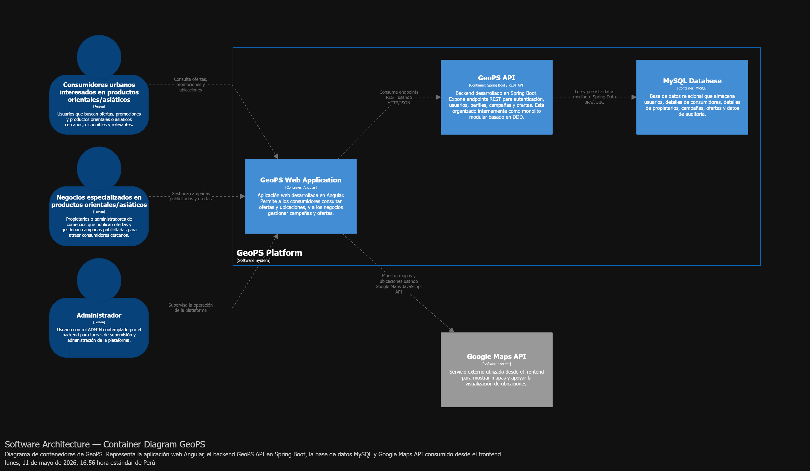
</div>

*Nota.* Elaboración propia (realizado en Structurizr).  

El Diagrama de Contenedores de GeoPS muestra los elementos desplegables principales del sistema. La aplicación web Angular funciona como cliente principal y permite a los consumidores urbanos interesados en productos orientales/asiáticos consultar promociones y ubicaciones mediante Google Maps API, mientras que los negocios especializados en productos orientales/asiáticos pueden gestionar campañas y ofertas desde la misma plataforma.

GeoPS API es el contenedor backend principal. Está desarrollado con Spring Boot y centraliza la lógica de negocio del sistema mediante bounded contexts internos. Dentro de este contenedor se encuentran los módulos **Identity**, **Campaign**, **Offers** y **Shared Kernel**.

La base de datos MySQL funciona como el contenedor de persistencia del sistema. En ella se almacenan los usuarios, detalles de consumidores, detalles de propietarios, campañas, ofertas y campos de auditoría. La comunicación entre GeoPS API y MySQL se realiza mediante Spring Data JPA y JDBC.

**Contenedores principales:**

- **Angular Web Application:** Interfaz web utilizada por consumidores urbanos interesados en productos orientales/asiáticos y por negocios especializados en productos orientales/asiáticos para acceder a las funcionalidades de GeoPS.
- **GeoPS API - Spring Boot:** Backend modular que expone endpoints REST y contiene la lógica de negocio.
- **MySQL Database:** Base de datos relacional que almacena la información persistente del sistema.
- **Google Maps API:** Servicio externo consumido desde el frontend para mostrar mapas y apoyar funcionalidades basadas en ubicación.

**Módulos internos de GeoPS API:**

- **Identity Context:** Gestiona usuarios, autenticación, roles, JWT y perfiles de consumidores o propietarios.
- **Campaign Context:** Gestiona campañas publicitarias, validaciones de fechas, presupuesto, estados y métricas básicas.
- **Offers Context:** Gestiona ofertas asociadas a campañas y valida que pertenezcan a campañas existentes y activas.
- **Shared Kernel:** Contiene elementos transversales como auditoría, roles, configuración CORS, OpenAPI, sanitización de texto y estrategia de nombres para persistencia.

#### 4.6.3. Software Architecture Components Diagrams

Los diagramas de componentes detallan la estructura interna del contenedor backend **GeoPS API**. Debido a que el backend está organizado como un monolito modular basado en Domain-Driven Design, los componentes se presentan por bounded context. Esta decisión permite representar con mayor claridad las responsabilidades internas de cada módulo y evita saturar un único diagrama con todos los controladores, servicios, repositorios y componentes transversales.

Cada bounded context mantiene una separación interna entre controladores REST, servicios de aplicación, modelos de dominio, repositorios e integraciones internas. Los bounded contexts representados son **Identity**, **Campaign**, **Offers** y **Shared Kernel**.

---

##### 4.6.3.1. Identity Context Components Diagram

**Figura 117**<br>
*Software Architecture — Identity Context Components Diagram*

<div align="center">
    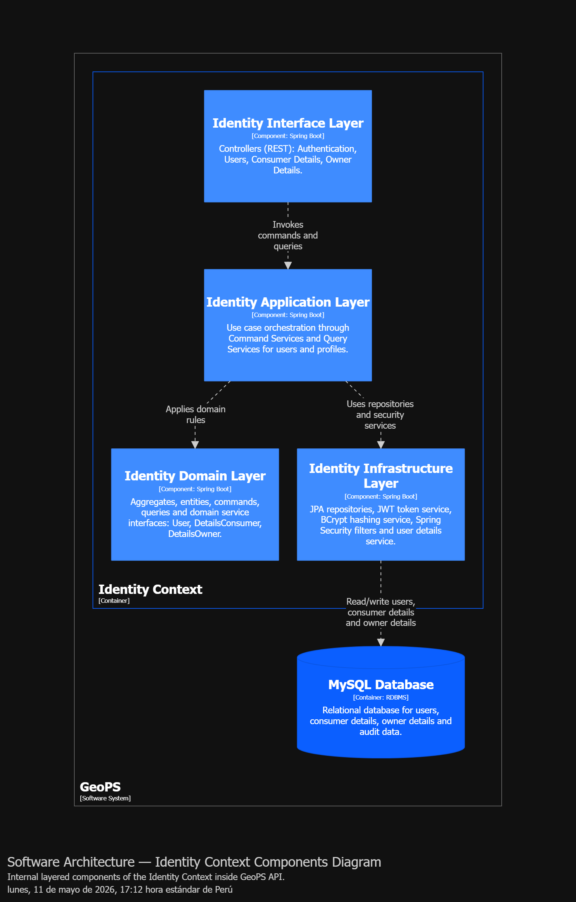
</div>

*Nota.* Elaboración propia (realizado en Structurizr).

El **Identity Context** es el bounded context encargado de gestionar la identidad de los usuarios dentro de GeoPS. Sus responsabilidades principales incluyen el registro de usuarios, inicio de sesión, generación de tokens JWT, validación de credenciales, hashing de contraseñas, administración de roles y gestión de información complementaria de los usuarios.

Este contexto soporta los dos segmentos principales del sistema: **consumidores urbanos interesados en productos orientales/asiáticos** y **negocios especializados en productos orientales/asiáticos**. Para ello, contiene entidades como `User`, `DetailsConsumer` y `DetailsOwner`. La entidad `User` representa la identidad principal del sistema, mientras que `DetailsConsumer` y `DetailsOwner` permiten almacenar información específica según el tipo de usuario.

A nivel de componentes, Identity se organiza mediante controladores REST, servicios de comando, servicios de consulta, servicios de seguridad y repositorios JPA. Los controladores reciben las solicitudes HTTP desde la aplicación web, los servicios de aplicación ejecutan los casos de uso, y los repositorios permiten persistir o consultar información en la base de datos MySQL.

**Componentes principales de Identity Context:**

- `AuthenticationController`
- `UserController`
- `DetailsConsumerController`
- `DetailsOwnerController`
- `UserCommandService`
- `UserQueryService`
- `DetailsConsumerCommandService`
- `DetailsConsumerQueryService`
- `DetailsOwnerCommandService`
- `DetailsOwnerQueryService`
- `TokenService`
- `HashingService`
- `UserRepository`
- `DetailsConsumerRepository`
- `DetailsOwnerRepository`

**Relaciones principales:**

- La aplicación web consume los endpoints de autenticación, usuarios y perfiles mediante HTTP/JSON.
- `AuthenticationController` delega el registro e inicio de sesión a los servicios de usuario, token y hashing.
- `UserController` utiliza servicios de comando y consulta para actualizar y recuperar información de usuarios.
- `DetailsConsumerController` y `DetailsOwnerController` administran la información complementaria de consumidores y negocios.
- Los repositorios JPA acceden a MySQL para persistir usuarios y perfiles.

---

##### 4.6.3.2. Campaign Context Components Diagram

**Figura 118**<br>
*Software Architecture — Campaign Context Components Diagram*

<div align="center">
    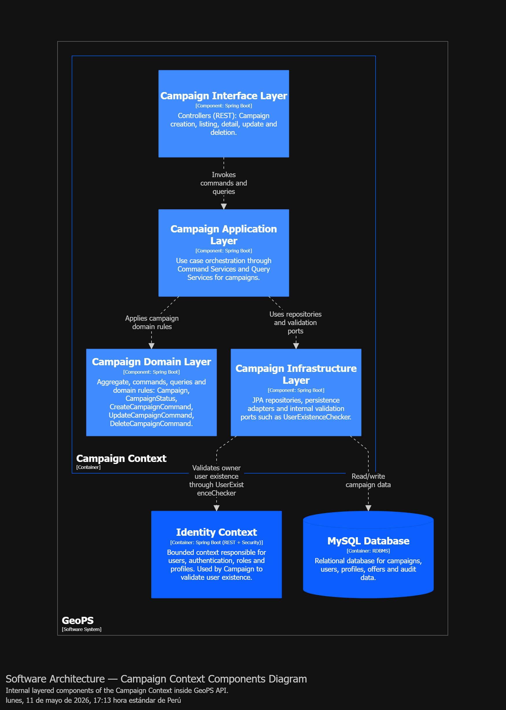
</div>

*Nota.* Elaboración propia (realizado en Structurizr).

El **Campaign Context** es el bounded context encargado de gestionar las campañas publicitarias creadas por los negocios especializados en productos orientales/asiáticos. Sus responsabilidades principales incluyen la creación, consulta, actualización y eliminación de campañas, además de la validación de reglas de negocio asociadas a fechas, presupuesto, estado y métricas básicas.

La entidad principal de este contexto es `Campaign`, que representa una campaña publicitaria dentro de la plataforma. Esta entidad contiene información como identificador del propietario, nombre, descripción, fecha de inicio, fecha de fin, estado, presupuesto estimado, impresiones, clics y CTR. El CTR se calcula a partir de la relación entre clics e impresiones, permitiendo medir el rendimiento básico de una campaña.

Campaign se comunica internamente con Identity mediante el puerto `UserExistenceChecker`, utilizado para validar que el usuario asociado a una campaña exista. Esta relación mantiene el bajo acoplamiento entre contextos, ya que Campaign no necesita conocer directamente la implementación interna de Identity.

**Componentes principales de Campaign Context:**

- `CampaignController`
- `CampaignCommandService`
- `CampaignQueryService`
- `CampaignRepository`
- `CreateCampaignCommand`
- `UpdateCampaignCommand`
- `DeleteCampaignCommand`
- `GetCampaignByIdQuery`
- `GetAllCampaignsQuery`
- `GetAllCampaignsByUserIdQuery`
- `UserExistenceChecker`
- `TextSanitizer`

**Relaciones principales:**

- La aplicación web consume los endpoints de campañas mediante HTTP/JSON.
- `CampaignController` recibe solicitudes de creación, consulta, actualización y eliminación de campañas.
- `CampaignCommandService` ejecuta operaciones de escritura y aplica reglas de negocio.
- `CampaignQueryService` ejecuta operaciones de lectura sobre campañas.
- `CampaignRepository` persiste y consulta campañas en MySQL.
- `UserExistenceChecker` valida la existencia del usuario propietario mediante el Identity Context.
- `TextSanitizer` se utiliza para limpiar campos de texto como nombre y descripción de la campaña.

---

##### 4.6.3.3. Offers Context Components Diagram

**Figura 119**<br>
*Software Architecture — Offers Context Components Diagram*

<div align="center">
    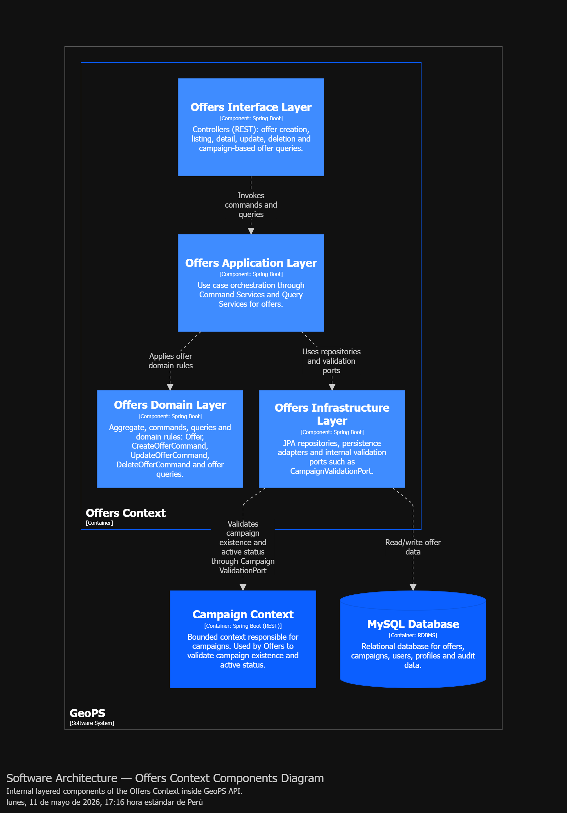
</div>

*Nota.* Elaboración propia (realizado en Structurizr).

El **Offers Context** es el bounded context encargado de administrar las ofertas o promociones asociadas a campañas. Sus responsabilidades principales incluyen la creación, consulta, actualización y eliminación de ofertas, así como la validación de que cada oferta pertenezca a una campaña existente y activa.

La entidad principal de este contexto es `Offer`, que contiene datos como identificador de campaña, título, negocio asociado, precio, fecha de validez, calificación, ubicación, categoría e imagen. Este contexto representa la parte visible de las promociones que los consumidores urbanos interesados en productos orientales/asiáticos pueden consultar dentro de la plataforma.

Offers se comunica internamente con Campaign mediante el puerto `CampaignValidationPort`, utilizado para validar la existencia y el estado de la campaña asociada. Esta estructura permite que Offers dependa de Campaign únicamente mediante una interfaz de validación, evitando acoplamiento directo con la implementación interna del contexto de campañas.

**Componentes principales de Offers Context:**

- `OfferController`
- `OfferCommandService`
- `OfferQueryService`
- `OfferRepository`
- `CreateOfferCommand`
- `UpdateOfferCommand`
- `DeleteOfferCommand`
- `GetOfferByIdQuery`
- `GetAllOffersQuery`
- `GetOffersByCampaignIdQuery`
- `CampaignValidationPort`

**Relaciones principales:**

- La aplicación web consume los endpoints de ofertas mediante HTTP/JSON.
- `OfferController` recibe solicitudes para crear, consultar, actualizar y eliminar ofertas.
- `OfferCommandService` ejecuta operaciones de escritura sobre ofertas.
- `OfferQueryService` ejecuta operaciones de lectura.
- `OfferRepository` persiste y consulta ofertas en MySQL.
- `CampaignValidationPort` valida que la campaña asociada exista y se encuentre activa.

---

##### 4.6.3.4. Shared Kernel Components Diagram

**Figura 120**<br>
*Software Architecture — Shared Kernel Components Diagram*

<div align="center">
    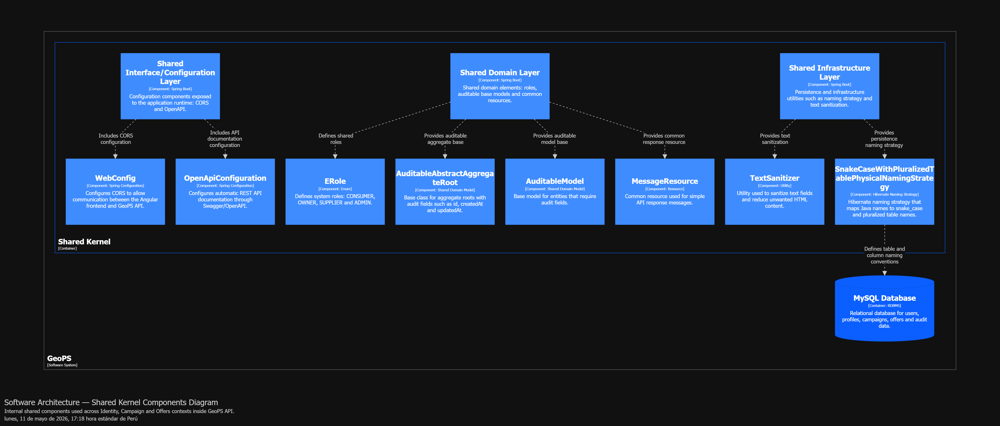
</div>

*Nota.* Elaboración propia (realizado en Structurizr).

El **Shared Kernel** agrupa elementos transversales utilizados por los distintos bounded contexts del backend. Este módulo contiene componentes comunes que no pertenecen exclusivamente a Identity, Campaign u Offers, pero que son necesarios para el funcionamiento general del sistema.

Entre sus responsabilidades se encuentran la auditoría automática, la definición de roles, la configuración CORS para permitir la comunicación con la aplicación web Angular, la configuración OpenAPI para documentar los endpoints REST, la sanitización de texto, los recursos de respuesta comunes y la estrategia personalizada de nombres para tablas y columnas en la base de datos.

**Componentes principales de Shared Kernel:**

- `AuditableAbstractAggregateRoot`
- `AuditableModel`
- `ERole`
- `WebConfig`
- `OpenApiConfiguration`
- `TextSanitizer`
- `SnakeCaseWithPluralizedTablePhysicalNamingStrategy`
- `MessageResource`

**Relaciones principales:**

- Los bounded contexts utilizan `ERole` para validar roles del sistema.
- Las entidades principales heredan o utilizan modelos auditables para registrar `createdAt` y `updatedAt`.
- `WebConfig` permite la comunicación entre el frontend Angular y GeoPS API.
- `OpenApiConfiguration` documenta los endpoints REST disponibles.
- `TextSanitizer` apoya la limpieza de campos de texto usados por los casos de uso.
- `MessageResource` se utiliza para respuestas simples de la API.

---

**Patrones arquitectónicos implementados**

Los patrones arquitectónicos implementados en GeoPS API son **Domain-Driven Design**, **monolito modular**, **arquitectura por capas** y **CQRS ligero**. DDD se evidencia en la separación del backend por bounded contexts y en el uso de entidades, comandos, consultas y servicios de dominio. El monolito modular permite desplegar el backend como una sola aplicación Spring Boot, manteniendo separación lógica entre módulos. La arquitectura por capas organiza el código en dominio, aplicación, infraestructura e interfaces REST. Finalmente, CQRS ligero se aplica mediante la separación entre servicios de comando para escritura y servicios de consulta para lectura.

Además, se aplican patrones como **Repository Pattern**, para abstraer el acceso a datos mediante repositorios JPA, y **Assembler / Transformer Pattern**, para convertir entidades de dominio en recursos REST y viceversa.

### 4.7. Software Object-Oriented Design

#### 4.7.1. Class Diagrams

El diseño orientado a objetos de GeoPS se organiza siguiendo los principios de Domain-Driven Design, con separación entre entidades de dominio, comandos, consultas, servicios de aplicación, repositorios y controladores REST. El backend se encuentra dividido en tres bounded contexts principales: **Identity**, **Campaign** y **Offers**, además de un **Shared Kernel** para elementos transversales.

Cada bounded context concentra sus propias clases de dominio y sus propios casos de uso. Identity agrupa las clases relacionadas con usuarios, autenticación y perfiles; Campaign agrupa las clases relacionadas con campañas publicitarias, estados y métricas; Offers agrupa las clases relacionadas con ofertas asociadas a campañas; y Shared contiene clases comunes de configuración, auditoría, roles y utilidades. Esta estructura permite mantener una separación clara entre responsabilidades y evita mezclar lógica de negocio de distintos módulos.

**Figura 121**<br>
*Diagrama de Clases de GeoPS*

<div align="center">
    
</div>

*Nota.* Elaboración propia.

**Bounded Contexts implementados:**

**Contextos principales:**

1. **Identity BC:** Gestiona usuarios, autenticación, roles, JWT y perfiles de consumidores o propietarios.
2. **Campaign BC:** Gestiona campañas publicitarias, validaciones de fechas, estados, presupuesto, métricas básicas e interacción con usuarios propietarios.
3. **Offers BC:** Gestiona ofertas asociadas a campañas y valida que solo se creen ofertas sobre campañas existentes y activas.

**Shared Kernel:**

4. **Shared Kernel:** Agrupa componentes transversales como auditoría, roles, configuración CORS, configuración OpenAPI, sanitización de texto, recursos comunes y estrategia de nombres para persistencia.

**Arquitectura por capas:**

- **Domain Layer:** Aggregates, value objects, commands, queries y service interfaces.
- **Application Layer:** Command services y query services para la ejecución de casos de uso.
- **Infrastructure Layer:** Repositories, persistencia con Spring Data JPA, seguridad, hashing y tokens.
- **Interfaces Layer:** REST controllers, resources y assemblers/transformers.

#### 4.7.2. Class Dictionary

**Identity Bounded Context**

**Tabla 10**   
*Class Dictionary — Identity BC*  

| **Clase** | **Atributos / Métodos principales** | **Descripción** |
|---|---|---|
| **User** | id, name, email, phone, password, role, plan, createdAt, updatedAt | Aggregate root que representa al usuario principal del sistema. Gestiona datos de identidad, rol y plan. |
| **DetailsConsumer** | user, categoriasFavoritas, permisoUbicacion, direccionCasa, direccionTrabajo, direccionUniversidad | Entidad que almacena información complementaria del usuario consumidor. |
| **DetailsOwner** | user, businessName, businessType, taxId, website, description, address, horarioAtencion | Entidad que almacena información complementaria del propietario de negocio. |
| **UserCommandService** | handle(CreateUserCommand), handle(UpdateUserCommand), handle(DeleteUserCommand) | Servicio de comandos para operaciones de escritura sobre usuarios. |
| **UserQueryService** | handle(GetUserByIdQuery), handle(GetUserByEmailQuery), handle(GetUserByPhoneQuery) | Servicio de consultas para recuperar información de usuarios. |
| **AuthenticationController** | signUp(), signIn() | Controlador REST encargado del registro e inicio de sesión de usuarios. |
| **UserController** | getUserById(), getUserByEmail(), updateUser() | Controlador REST para consulta y actualización de usuarios. |
| **DetailsConsumerController** | getDetailsByUserId(), createDetails(), updateDetails() | Controlador REST para gestionar información adicional de consumidores. |
| **DetailsOwnerController** | getDetailsByUserId(), createDetails(), updateDetails() | Controlador REST para gestionar información adicional de propietarios. |
| **UserRepository** | findByEmail(), findByPhone(), existsByEmail(), existsByPhone() | Repositorio JPA para persistencia y consulta de usuarios. |
| **TokenService** | generateToken(), validateToken(), getUsernameFromToken() | Servicio encargado de generar y validar tokens JWT. |
| **HashingService** | encode(), matches() | Servicio encargado de aplicar hashing a contraseñas mediante BCrypt. |

*Nota.* Elaboración propia.

**Campaign Bounded Context**

**Tabla 11**   
*Class Dictionary — Campaign BC*  

| **Clase** | **Atributos / Métodos principales** | **Descripción** |
|---|---|---|
| **Campaign** | id, userId, name, description, startDate, endDate, status, estimatedBudget, totalImpressions, totalClicks, CTR, createdAt, updatedAt | Aggregate root que representa una campaña publicitaria creada por un propietario de negocio. |
| **CampaignStatus** | ACTIVE, FINALIZED | Enumeración que representa los estados disponibles de una campaña. |
| **CreateCampaignCommand** | userId, name, description, startDate, endDate, estimatedBudget, requesterRole | Comando utilizado para crear una campaña. Valida fechas, presupuesto, texto y rol del usuario. |
| **UpdateCampaignCommand** | id, name, description, startDate, endDate, status, estimatedBudget, totalImpressions, totalClicks | Comando utilizado para actualizar una campaña existente. |
| **DeleteCampaignCommand** | id | Comando utilizado para eliminar una campaña. |
| **CampaignCommandService** | handle(CreateCampaignCommand), handle(UpdateCampaignCommand), handle(DeleteCampaignCommand) | Servicio de comandos encargado de crear, actualizar y eliminar campañas. |
| **CampaignQueryService** | handle(GetCampaignByIdQuery), handle(GetAllCampaignsQuery), handle(GetAllCampaignsByUserIdQuery) | Servicio de consultas encargado de obtener campañas por ID, por usuario o de forma general. |
| **CampaignController** | createCampaign(), getAllCampaigns(), getCampaignById(), getCampaignsByUserId(), updateCampaign(), deleteCampaign() | Controlador REST que expone los endpoints de campañas. |
| **CampaignRepository** | findByUserId(), findById(), save(), deleteById() | Repositorio JPA para persistencia y consulta de campañas. |
| **UserExistenceChecker** | existsById() | Puerto interno utilizado para validar la existencia de un usuario desde el Campaign Context. |

*Nota.* Elaboración propia.

**Offers Bounded Context**

**Tabla 12**   
*Class Dictionary — Offers BC*  

| **Clase** | **Atributos / Métodos principales** | **Descripción** |
|---|---|---|
| **Offer** | id, campaignId, title, partner, price, validTo, rating, location, category, imageUrl, createdAt, updatedAt | Aggregate root que representa una oferta asociada a una campaña. |
| **CreateOfferCommand** | campaignId, title, partner, price, validTo, rating, location, category, imageUrl | Comando utilizado para crear una oferta. Valida datos obligatorios, precio, calificación y campaña asociada. |
| **UpdateOfferCommand** | id, title, partner, price, validTo, rating, location, category, imageUrl | Comando utilizado para actualizar una oferta existente. |
| **DeleteOfferCommand** | id | Comando utilizado para eliminar una oferta. |
| **OfferCommandService** | handle(CreateOfferCommand), handle(UpdateOfferCommand), handle(DeleteOfferCommand) | Servicio de comandos encargado de crear, actualizar y eliminar ofertas. |
| **OfferQueryService** | handle(GetOfferByIdQuery), handle(GetAllOffersQuery), handle(GetOffersByCampaignIdQuery) | Servicio de consultas encargado de obtener ofertas por ID, por campaña o de forma general. |
| **OfferController** | createOffer(), getAllOffers(), getOfferById(), getOffersByCampaignId(), updateOffer(), deleteOffer() | Controlador REST que expone los endpoints de ofertas. |
| **OfferRepository** | findByCampaignId(), findById(), save(), deleteById() | Repositorio JPA para persistencia y consulta de ofertas. |
| **CampaignValidationPort** | existsById(), isActive() | Puerto interno utilizado para validar existencia y estado de una campaña desde el Offers Context. |

*Nota.* Elaboración propia.

**Shared Kernel**

**Tabla 13**   
*Class Dictionary — Shared Kernel*  

| **Clase** | **Atributos / Métodos principales** | **Descripción** |
|---|---|---|
| **AuditableAbstractAggregateRoot** | id, createdAt, updatedAt | Clase base abstracta para aggregates con soporte de auditoría automática. |
| **AuditableModel** | createdAt, updatedAt | Clase base para modelos auditables. |
| **ERole** | CONSUMER, OWNER, SUPPLIER, ADMIN | Enumeración de roles disponibles en el sistema. |
| **WebConfig** | addCorsMappings() | Configuración CORS para permitir comunicación con la aplicación web Angular. |
| **OpenApiConfiguration** | customOpenAPI() | Configuración de documentación automática de endpoints mediante OpenAPI/Swagger. |
| **TextSanitizer** | sanitize() | Utilidad para limpiar texto y reducir riesgos asociados a contenido HTML no deseado. |
| **SnakeCaseWithPluralizedTablePhysicalNamingStrategy** | toPhysicalTableName(), toPhysicalColumnName() | Estrategia de nombres para convertir clases y atributos Java a nombres de tablas y columnas en snake_case. |
| **MessageResource** | message | Recurso genérico para respuestas simples de API. |

*Nota.* Elaboración propia.

**Patrones de diseño implementados:**

- **Domain-Driven Design:** Organización del backend en bounded contexts con responsabilidades claramente definidas.
- **Monolito modular:** Despliegue único de Spring Boot con separación lógica interna por módulos de dominio.
- **CQRS ligero:** Separación entre servicios de comando y servicios de consulta.
- **Arquitectura por capas:** Separación entre dominio, aplicación, infraestructura e interfaces REST.
- **Repository Pattern:** Uso de repositorios JPA para abstraer el acceso a datos.
- **Assembler / Transformer Pattern:** Conversión entre entidades de dominio y recursos REST.

### 4.8. Database Design

#### 4.8.1. Relational/Non-Relational Database Diagram

El diseño de base de datos de GeoPS utiliza un modelo relacional basado en MySQL. La base de datos soporta los módulos actualmente implementados en el backend: usuarios, detalles de consumidores, detalles de propietarios, campañas y ofertas. El diseño mantiene campos de auditoría como fecha de creación y fecha de actualización, alineándose con la configuración de auditoría utilizada por la aplicación.

La persistencia se centra en las entidades principales del sistema y en las relaciones lógicas entre ellas. Los datos se organizan de acuerdo con los bounded contexts definidos en la arquitectura del backend, manteniendo una separación clara entre identidad, campañas, ofertas y elementos compartidos.

**Figura 122**<br>
*Diagrama de Base de Datos — GeoPS*

<div align="center">
    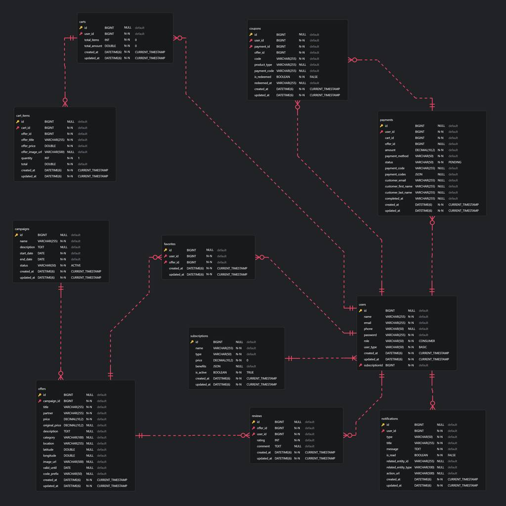
</div>

*Nota.* Elaboración propia. El diseño representa las tablas principales implementadas actualmente en GeoPS API.

**Convenciones de nomenclatura implementadas:**

- **Nombres de tablas:** snake_case pluralizado, por ejemplo `users`, `campaigns`, `offers`.
- **Columnas:** snake_case, por ejemplo `user_id`, `created_at`, `updated_at`.
- **Primary Keys:** identificadores numéricos autogenerados.
- **Timestamps:** campos de auditoría `created_at` y `updated_at`.
- **Motor de base de datos:** MySQL con persistencia gestionada mediante Spring Data JPA.
- **Relaciones lógicas entre módulos:** uso de identificadores como `user_id` y `campaign_id` para mantener bajo acoplamiento entre bounded contexts.

**Descripción de las principales tablas por bounded context:**

**Identity BC:**

- **users:** Tabla principal de usuarios del sistema. Almacena información como nombre, correo electrónico, teléfono, contraseña cifrada, rol, plan y campos de auditoría.
- **details_consumers:** Tabla asociada a usuarios consumidores. Almacena preferencias, permisos de ubicación y direcciones relevantes.
- **details_owners:** Tabla asociada a usuarios propietarios. Almacena información del negocio, como nombre comercial, tipo de negocio, RUC, sitio web, descripción, dirección y horario de atención.

**Campaign BC:**

- **campaigns:** Tabla que almacena las campañas publicitarias creadas por usuarios propietarios. Contiene información como `user_id`, nombre, descripción, fecha de inicio, fecha de fin, estado, presupuesto estimado, impresiones, clics, CTR y campos de auditoría.
- El campo `user_id` permite asociar la campaña con el propietario responsable. Esta asociación se maneja como una referencia lógica entre el Campaign Context y el Identity Context.

**Offers BC:**

- **offers:** Tabla que almacena las ofertas asociadas a campañas. Contiene información como `campaign_id`, título, negocio asociado, precio, fecha de validez, calificación, ubicación, categoría, imagen y campos de auditoría.
- El campo `campaign_id` permite asociar cada oferta con una campaña existente. Antes de crear una oferta, el backend valida que la campaña exista y que se encuentre activa.

**Características técnicas de optimización:**

1. **Auditoría automática:** Las entidades principales incluyen campos como `created_at` y `updated_at`, gestionados por la configuración de auditoría de JPA.
2. **Índices en campos relevantes:** Se recomienda indexar campos de búsqueda frecuente como `email`, `user_id`, `campaign_id`, `status` y fechas de vigencia.
3. **Tipos de datos apropiados:** Se utilizan identificadores numéricos para claves primarias, cadenas para datos descriptivos, fechas para periodos de vigencia y valores numéricos para métricas y presupuesto.
4. **Separación lógica por bounded context:** Aunque las tablas conviven en una misma base de datos, su diseño respeta la organización modular del backend.

**Relaciones principales entre tablas:**

- `users` 1:1 `details_consumers`, según el tipo de usuario.
- `users` 1:1 `details_owners`, según el tipo de usuario.
- `users` 1:N `campaigns`, ya que un propietario puede crear varias campañas.
- `campaigns` 1:N `offers`, ya que una campaña puede contener varias ofertas.

El diseño prioriza la simplicidad, la integridad de datos y la alineación con el backend actualmente implementado. Funcionalidades como pagos, carritos, cupones, favoritos, reseñas, notificaciones avanzadas, cache distribuido o geolocalización avanzada pueden considerarse como extensiones futuras del sistema.

## Capítulo 5: Product Implementation

A continuación, se presentará un repositorio central y organizado que servirá como guía para el desarrollo enfocado y consistente de nuestra solución GeoPS.

### 5.1. Software Configuration Management

En esta sección se incluyen los links de las aplicaciones y productos de software realizados durante el ciclo del proyecto en los programas que se utilizaron para desarrollar la plataforma de publicidad hiperlocalizada GeoPS.

  #### 5.1.1. Software Development Environment Configuration

  En esta sección se presentan los recursos y enlaces de las herramientas de software empleadas a lo largo del desarrollo del proyecto, detallando las plataformas utilizadas para la construcción de la solución GeoPS.

  **Product UX/UI Design**

  Esta área abarca el desarrollo de la experiencia de usuario (UX) y el diseño de interfaz (UI) para nuestro producto software. La experiencia de usuario se concentra en analizar y optimizar la interacción global del usuario con la aplicación, mientras que el diseño de interfaz aborda los elementos visuales y la facilidad de uso. Nuestro enfoque UX/UI tiene como meta generar una experiencia fluida, visualmente atractiva y funcional para todos los usuarios. Para este proyecto, desarrollamos prototipos de sitio web adaptados tanto para escritorio como para dispositivos móviles.

  + Figma: Plataforma de diseño colaborativo y herramienta de vectores gráficos basada en la nube, que se distingue por su accesibilidad web y permite desarrollar mockups tanto para navegadores de escritorio como para móviles. https://www.figma.com/design/

  + UXPressia: Solución digital especializada en el mapeo del recorrido del usuario que facilita la creación de mapas de impacto y perfiles de usuario. Esta plataforma nos ha proporcionado los fundamentos para desarrollar User Personas, Mapas de Empatía y Journey Maps. https://uxpressia.com/

  + MIRO: Espacio de trabajo visual colaborativo en línea, utilizado para investigación, lluvia de ideas, esquemas conceptuales, diagramas de estado actual y futuro, además de múltiples actividades de colaboración en equipo. https://miro.com/app/dashboard/

  + Lucid Chart: Plataforma de diagramación colaborativa basada en navegador web, que facilita el trabajo en equipo en tiempo real para crear diagramas UML, mapas conceptuales, esquemas de software y diversos tipos de representaciones gráficas. https://lucid.app/documents#/dashboard

  + Structurizr: Herramienta especializada de diseño arquitectónico que implementa el modelo C4, permitiendo la representación visual de la arquitectura de software de nuestro proyecto. https://structurizr.com/

  **Software Development**

  Comprende la metodología completa de construcción, diseño, codificación, evaluación y mantenimiento de aplicaciones software. Abarca la materialización de especificaciones establecidas durante el ciclo de desarrollo, empleando diversos lenguajes de programación, herramientas especializadas y tecnologías actuales. La finalidad es desarrollar un producto de software robusto y de excelente calidad que satisfaga las especificaciones y expectativas del cliente.

  + GitHub: Plataforma de control de versiones y repositorio colaborativo diseñado para gestionar y almacenar el progreso de proyectos desarrollados por equipos de trabajo. https://github.com/OpenSourceDevUPC

  + Visual Studio Code: Editor de código avanzado que incorpora extensiones personalizables, permitiendo añadir funcionalidades específicas que optimizan la productividad y eficiencia en el desarrollo de software. https://code.visualstudio.com/

  + HTML: Lenguaje fundamental de marcado para la construcción y estructuración de sitios web. Emplea elementos de marcado para organizar contenido como textos, imágenes y vínculos. En conjunto con CSS y TypeScript, constituye el fundamento de la web contemporánea. Implementaremos este lenguaje para desarrollar la estructura de nuestra página web. https://www.jetbrains.com/help/webstorm/editing-html-files.html

  + CSS: Lenguaje de hojas de estilo especializado en gestionar el diseño y presentación visual de páginas web. Facilita la definición de colores, tipografías, espaciados y demás elementos estéticos para optimizar la apariencia del sitio web. Este lenguaje será fundamental para implementar el diseño visual de nuestra plataforma. https://www.jetbrains.com/help/webstorm/style-sheets.html#ws_css_completion

  + TypeScript: Lenguaje de programación versátil y de alto nivel utilizado para incorporar interactividad y comportamiento dinámico en aplicaciones web. Permite crear componentes estructurados, seguros y reutilizables mediante tipado estático y soporte para programación orientada a objetos. En el proyecto se emplea para desarrollar las funcionalidades interactivas de la plataforma web. ttps://www.jetbrains.com/help/webstorm/typescript-support.html

  + C#: Lenguaje de programación creado por Microsoft, orientado principalmente al desarrollo de aplicaciones dentro del entorno .NET. C# se caracteriza por su sintaxis clara y su conjunto completo de funcionalidades, incluyendo programación orientada a objetos y gestión de eventos. https://learn.microsoft.com/es-es/dotnet/csharp/

  + Angular: Framework robusto para el desarrollo de aplicaciones web y móviles contemporáneas. Angular emplea TypeScript como lenguaje base y ofrece una arquitectura sólida fundamentada en componentes, servicios y módulos que simplifican la creación de aplicaciones escalables y de fácil mantenimiento. https://angular.io/

  **Software Deployment**

  Constituye el procedimiento de despliegue y puesta en marcha del software en ambientes de producción o en dispositivos de usuarios finales. Comprende tareas como instalación, configuración, migración de información y activación del software. Su propósito es asegurar una implementación exitosa y eficiente del software en el entorno productivo.

  + Github Pages: Servicio proporcionado por GitHub que nos ha facilitado el alojamiento de nuestra Landing page y nos permitirá hospedar nuestras aplicaciones web. https://pages.github.com/

  **Software Documentation**

  Involucra la elaboración y actualización de documentos que detallan el software, abarcando su arquitectura, diseño, operación, instalación, configuración, uso y mantenimiento. La documentación ofrece información valiosa y completa sobre el software para desarrolladores, usuarios finales, administradores de sistemas y demás stakeholders involucrados.

  + Markdown: Lenguaje de marcado minimalista que facilita la redacción de texto con formato legible y accesible, que posteriormente puede convertirse a HTML u otros formatos de presentación. Es extensamente utilizado en la documentación de proyectos de software gracias a su simplicidad y flexibilidad. Markdown facilita la incorporación de formato básico como títulos, listas, enlaces e imágenes mediante una sintaxis intuitiva y memorable. https://www.markdownguide.org/getting-started/

  #### 5.1.2. Source Code Management

  Para el proyecto GeoPS, utilizamos GitHub como plataforma de control de versiones y colaboración. A continuación se detallan las convenciones adoptadas:

  **Enlace Organización GeoPS:** https://github.com/geops-org

  **Repositorios GitHub:**
  + Enlace Repositorio Project Report: https://github.com/geops-org/geops-report
  + Enlace Repositorio Landing Page: https://github.com/geops-org/geops-landing
  + Enlace Repositorio FrontEnd: https://github.com/geops-org/geops-web
  + Enlace Repositorio BackEnd: https://github.com/geops-org/geops-api

  **GitFlow Workflow:**
  Utilizamos GitFlow como modelo de ramificación:
  + **main:** Rama principal con código de producción estable
  + **develop:** Rama de desarrollo con las últimas características implementadas
  + **feature/:** Ramas para el desarrollo de nuevas funcionalidades específicas
  + **release/:** Ramas para preparar nuevas versiones
  + **hotfix/:** Ramas para correcciones urgentes en producción

  **Conventional Commits:**
  Aplicamos la convención de Conventional Commits para mantener un historial claro:
  + `feat`: Nueva funcionalidad
  + `fix`: Corrección de errores
  + `docs`: Cambios en documentación
  + `style`: Cambios de formato de código
  + `refactor`: Refactorización de código
  + `test`: Adición o modificación de tests

  #### 5.1.3. Source Code Style Guide & Conventions

  En esta sección, establecemos las convenciones y reglas para el estilo del código y convenciones de programación que usamos para la creación de la landing page de GeoPS. Aplicamos estas prácticas con el fin de garantizar la coherencia, legibilidad y calidad del código durante el desarrollo de la página web informativa.

  En este proyecto, empleamos HTML5, CSS3 y TypeScript para desarrollar la landing page, utilizando además frameworks como Bootstrap para el diseño responsivo y bibliotecas para animaciones e interactividad. Por otro lado, utilizamos Gherkin para los casos de prueba del proyecto.

  **Nomenclatura y Convenciones Generales**

  Los nombres asignados a variables, funciones, clases y elementos se definirán en idioma inglés, procurando que tengan relación directa con las secciones y funcionalidades de la landing page. Se evitará el uso inconsistente de mayúsculas y minúsculas, priorizando el uso de camelCase para TypeScript y kebab-case para CSS.

  Ejemplo:
  ```css
  .hero-section {} /* Buena práctica para sección principal */
  .promotion-card {} /* Buena práctica para tarjetas de promociones */
  .contact-form {} /* Buena práctica para formularios de contacto */
  ```

  **Sangría e Identación**

  Utilizamos 2 espacios para la sangría en lugar de tabulaciones, siguiendo las recomendaciones de Google para mantener consistencia en el código de la landing page.

  **HTML5 - Estructura para Landing Page GeoPS**

  + **Document Type:** Utilizamos `<!DOCTYPE html>` para HTML5
  + **Etiquetas Semánticas:** Empleamos etiquetas semánticas apropiadas para la estructura de la landing page:

    ```html
    <header>
      <nav class="navbar">
        <div class="nav-brand">
          
        </div>
        <ul class="nav-menu">
          <li><a href="#home">Inicio</a></li>
          <li><a href="#about">Nosotros</a></li>
          <li><a href="#contact">Contacto</a></li>
        </ul>
      </nav>
    </header>

    <main>
      <section class="hero-section">
        <div class="hero-content">
          <h1 class="hero-title">Conectamos PyMEs con clientes</h1>
          <p class="hero-description">Publicidad efectiva para negocios locales</p>
          <button class="cta-button">Comenzar Ahora</button>
        </div>
      </section>

      <section class="features-section">
        <article class="feature-card">
          <h3>Para Consumidores</h3>
          <p>Descubre ofertas y promociones cercanas</p>
        </article>
      </section>
    </main>
    ```

  + **Atributos Semánticos y de Accesibilidad:**
    ```html
    <button class="cta-button" 
            aria-label="Comenzar registro en GeoPS"
            data-action="register">
      Comenzar Ahora
    </button>

    
    ```

  **CSS3 - Estilos para Landing Page**

  + **Variables CSS para Consistencia:**
    ```css
    :root {
      --primary-color: #3498db;
      --secondary-color: #2c3e50;
      --accent-color: #e74c3c;
      --text-color: #2c3e50;
      --background-color: #ffffff;
      --border-radius: 8px;
      --box-shadow: 0 4px 6px rgba(0, 0, 0, 0.1);
    }
    ```

  + **Componentes Reutilizables:**
    ```css
    .btn {
      padding: 12px 24px;
      border: none;
      border-radius: var(--border-radius);
      font-weight: 600;
      cursor: pointer;
      transition: all 0.3s ease;
    }

    .btn-primary {
      background-color: var(--primary-color);
      color: white;
    }

    .btn-primary:hover {
      background-color: #2980b9;
      transform: translateY(-2px);
      box-shadow: var(--box-shadow);
    }

    .card {
      background: white;
      border-radius: var(--border-radius);
      box-shadow: var(--box-shadow);
      padding: 2rem;
      margin: 1rem 0;
    }
    ```

  + **Responsive Design para Dispositivos Móviles:**
    ```css
    /* Mobile First Approach */
    .hero-section {
      padding: 2rem 1rem;
      text-align: center;
    }
  
    .hero-title {
      font-size: 2rem;
      margin-bottom: 1rem;
    }
  
    /* Tablet */
    @media (min-width: 768px) {
      .hero-section {
        padding: 4rem 2rem;
      }
  
      .hero-title {
        font-size: 2.5rem;
      }
  
      .features-section {
        display: grid;
        grid-template-columns: repeat(2, 1fr);
        gap: 2rem;
      }
    }
  
    /* Desktop */
    @media (min-width: 1024px) {
      .hero-section {
        padding: 6rem 2rem;
      }
  
      .hero-title {
        font-size: 3rem;
      }
  
      .features-section {
        grid-template-columns: repeat(3, 1fr);
      }
    }
    ```

  **typeScript - Funcionalidades de Landing Page**

  + **Convenciones para Interactividad:**
    ```typescript
    // Navegación suave entre secciones
    function smoothScrollTo(targetId) {
      const element = document.getElementById(targetId);
      if (element) {
        element.scrollIntoView({
          behavior: 'smooth',
          block: 'start'
        });
      }
    }

    // Gestión de formularios
    function validateContactForm(formData) {
      const { name, email, message } = formData;
      const errors = [];

      if (!name || name.trim().length < 2) {
        errors.push('El nombre debe tener al menos 2 caracteres');
      }

      if (!isValidEmail(email)) {
        errors.push('Por favor ingresa un email válido');
      }

      return {
        isValid: errors.length === 0,
        errors
      };
    }

    function isValidEmail(email) {
      const emailRegex = /^[^\s@]+@[^\s@]+\.[^\s@]+$/;
      return emailRegex.test(email);
    }
    ```

  + **Manejo de Eventos y Animaciones:**
    ```typescript
    // Inicialización de eventos DOM
    document.addEventListener('DOMContentLoaded', function() {
      initializeNavigation();
      initializeAnimations();
      initializeForms();
    });

    function initializeNavigation() {
      const navLinks = document.querySelectorAll('.nav-menu a');

      navLinks.forEach(link => {
        link.addEventListener('click', function(e) {
          e.preventDefault();
          const targetId = this.getAttribute('href').substring(1);
          smoothScrollTo(targetId);
        });
      });
    }

    // Animaciones en scroll
    function initializeAnimations() {
      const observerOptions = {
        threshold: 0.1,
        rootMargin: '0px 0px -50px 0px'
      };

      const observer = new IntersectionObserver(function(entries) {
        entries.forEach(entry => {
          if (entry.isIntersecting) {
            entry.target.classList.add('animate-in');
          }
        });
      }, observerOptions);

      document.querySelectorAll('.feature-card').forEach(card => {
        observer.observe(card);
      });
    }
    ```

  **Gherkin - Casos de Prueba para Landing Page**

  Aplicamos las siguientes convenciones para los escenarios de prueba:

  ```gherkin
  #------- Escenario de navegación en landing page -------
  Scenario: Usuario navega por las secciones de la landing page
    Given que el usuario está en la landing page de GeoPS
    When hace clic en el enlace "Nosotros" del menú de navegación
    Then debería desplazarse suavemente a la sección "Quiénes Somos"
    And debería ver la información sobre GeoPsLabs
    And el enlace "Nosotros" debería estar resaltado en el menú

  #------- Escenario de formulario de contacto -------
  Scenario: Usuario envía formulario de contacto
    Given que el usuario está en la sección de contacto
    When completa el formulario con los siguientes datos:
      | campo   | valor                    |
      | nombre  | Juan Pérez              |
      | email   | juan@email.com          |
      | mensaje | Estoy interesado en GeoPS |
    And hace clic en "Enviar mensaje"
    Then debería ver un mensaje de confirmación
    And debería recibir un email de confirmación

  #------- Escenario de diseño responsivo -------
  Scenario: Landing page se adapta a dispositivos móviles
    Given que el usuario accede desde un dispositivo móvil
    When carga la landing page de GeoPS
    Then debería ver el menú de navegación como hamburger menu
    And las tarjetas de características deberían apilarse verticalmente
    And todos los elementos deberían ser legibles y accesibles
  ```

  #### 5.1.4. Software Deployment Configuration
  En esta sección presentamos los pasos que seguimos para desplegar los proyectos incluidos en este trabajo:

  - **Landing Page:**  
    Para el despliegue de la landing page, escogimos GitHub Pages, un servicio de hosting gratuito que permite publicar sitios web estáticos directamente desde repositorios de GitHub. Esta alternativa nos permitió centralizar el código fuente y la página web en un mismo entorno, facilitando el control de versiones y asegurando que cada actualización realizada en el repositorio se refleje automáticamente en el sitio publicado.

  - **Base de Datos:**  
    Para el despliegue de la base de datos, optamos por Railway como plataforma. Esta herramienta simplifica considerablemente el proceso de aprovisionamiento, ya que permite crear instancias de bases de datos, como PostgreSQL o MySQL, en pocos pasos desde su panel de administración. Además, Railway genera de forma automática las credenciales de acceso y gestiona las variables de entorno, lo que reduce la complejidad de la configuración manual. Asimismo, incorpora funcionalidades como copias de seguridad automáticas y monitoreo integrado, lo que facilita la administración de la infraestructura.

  - **Backend:**  
    El backend fue desplegado también en Railway, aprovechando la facilidad que ofrece esta plataforma para gestionar tanto la base de datos como la aplicación dentro de un mismo ecosistema. Para ello, implementamos un Dockerfile optimizado que encapsula la aplicación Java junto con todas sus dependencias y configuraciones necesarias. Railway detecta automáticamente este archivo, construye la imagen del contenedor y realiza el despliegue correspondiente. De este modo, pudimos definir las variables de entorno desde el panel de la plataforma, reduciendo significativamente la complejidad de la configuración inicial y beneficiándonos de funcionalidades como el escalado automático, los despliegues continuos y el monitoreo integrado.

  - **Frontend:**  
    Para el despliegue de la aplicación frontend, elegimos Vercel, una plataforma especializada en el hosting de aplicaciones web modernas y con una integración eficiente con repositorios Git. Esta plataforma automatiza el proceso de compilación y despliegue, de manera que cada cambio enviado a la rama configurada genera una nueva versión de la aplicación en producción. Además, Vercel optimiza el rendimiento de forma automática y proporciona características avanzadas como vistas previas de despliegue, lo que facilita el flujo de trabajo durante el desarrollo y la publicación.

### 5.2. Product Implementation & Deployment.

  #### 5.2.1. Sprint Backlogs
  
  #### 5.2.2. Implemented Landing Page Evidence

  Este sitio web representa la cara pública del proyecto, desplegado eficientemente a través de GitHub Pages para garantizar una alta disponibilidad y tiempos de carga rápidos. La landing page funciona como el punto de entrada principal, presentando la identidad visual de la marca y explicando de forma interactiva el valor del ecosistema hiperlocal para conectar a los usuarios con la cultura asiática en Lima.

  <div align="center">
    
  </div>

  En esta sección la aplicación presenta su propuesta de valor como un radar hiperlocal en Lima, ofreciendo un acceso directo para que los usuarios creen su cuenta y exploren el ecosistema.

  <div align="center">
    
  </div>

  Aquí la plataforma detalla su proceso operativo basado en la búsqueda de productos, la geolocalización exacta de stands y la verificación de inventario real en tiendas aliadas.

  <div align="center">
    
  </div>

  La interfaz permite elegir entre perfiles de consumidor o negocio, resaltando funciones para comparar precios y navegar con precisión dentro de las galerías más importantes de la ciudad.

  <div align="center">
    
  </div>

  La Landing Page utiliza este espacio para mostrar su funcionamiento interno mediante videos demostrativos y presentar al equipo responsable de la transformación digital de los comercios asiáticos.

  <div align="center">
    
  </div>

  En esta ventana final, el sistema resuelve dudas frecuentes de los usuarios sobre costos y beneficios, proporcionando además los accesos para el registro formal de nuevos proveedores.

  #### 5.2.3. Implemented Frontend-Web Application Evidence
  
  Aquí se presenta el frontend de la aplicación completamente desplegado en Vercel, ofreciendo una interfaz de usuario rápida, responsiva y optimizada para la interacción en tiempo real. Esta implementación permite que tanto usuarios como dueños de negocios accedan a todas las funcionalidades del ecosistema GeoPS de manera fluida y segura directamente desde la web.
    
  <div align="center">
    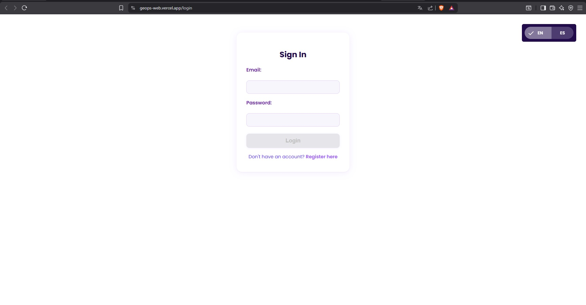
  </div>

  La aplicación muestra el formulario de inicio de sesión donde el usuario ingresa sus credenciales para acceder al panel de administración de su negocio.

  <div align="center">
    
  </div>

  En esta ventana, la plataforma permite el registro de nuevos usuarios recolectando datos básicos y definiendo el tipo de perfil, ya sea como consumidor o proveedor.

  <div align="center">
    
  </div>

  El sistema presenta un tablero de resumen con métricas clave como impresiones, clics y CTR promedio para monitorear el rendimiento general de las campañas activas.

  <div align="center">
    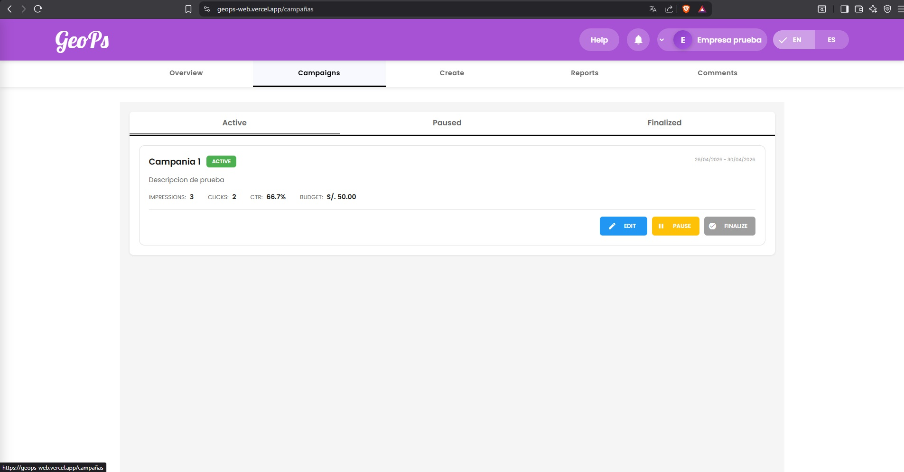
  </div>

  Aquí la interfaz organiza las campañas por estados (activas, pausadas o finalizadas), permitiendo al administrador editar, pausar o finalizar cada anuncio de forma individual.

  <div align="center">
    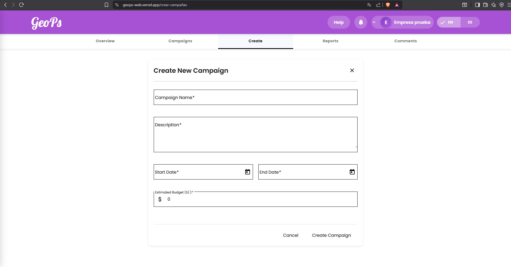
  </div>

  La plataforma ofrece un formulario para crear nuevas campañas publicitarias, donde se define el nombre, descripción, fechas de vigencia y el presupuesto estimado en soles.

  <div align="center">
    
  </div>

  En esta sección, la app genera reportes detallados que se pueden filtrar y exportar en formato JSON, mostrando un resumen general de la inversión y el impacto alcanzado.

  <div align="center">
    
  </div>

  La ventana de comentarios permite al dueño del negocio visualizar la calificación promedio y leer las reseñas de los clientes para gestionar la reputación del establecimiento.

  <div align="center">
    
  </div>

  La aplicación cuenta con un centro de ayuda integrado que resuelve dudas frecuentes sobre la creación de campañas, gestión de métricas y estados de los anuncios.

  <div align="center">
    
  </div>

  Aquí se muestra el perfil del negocio con información de contacto, el plan actual de suscripción y un resumen de ofertas guardadas o ubicaciones frecuentes.

  <div align="center">
    
  </div>

  La interfaz de configuración permite editar detalles críticos del negocio como el RUC, tipo de establecimiento (ej. Chifa), dirección física, horarios de atención y enlaces web.

  #### 5.2.4. Acuerdo de servicio SaaS
  1. Nuestros Términos de Servicio (SaaS Agreement)
En GeoPS Labs, mantenemos la propiedad intelectual de nuestra plataforma, otorgando a los comercios una licencia de uso mediante suscripción mensual. Este acuerdo garantiza que los negocios accedan a nuestras herramientas de publicidad sin derecho a replicar, modificar o distribuir nuestro código fuente, asegurando que la tecnología siempre trabaje a favor del crecimiento del ecosistema local.

2. Compromiso de Disponibilidad (SLA)
Nos comprometemos a que GeoPS esté disponible y operativo al menos el 99% del tiempo. Entendemos que cada minuto cuenta para una PyME, por lo que establecemos un tiempo de respuesta técnica de máximo 24 horas ante incidencias críticas, garantizando que tus promociones nunca dejen de llegar a los clientes que caminan cerca de tu tienda.

3. Seguridad y Resguardo de Credenciales
En GeoPS Labs, garantizamos la protección absoluta de las llaves de acceso a nuestra plataforma mediante protocolos de encriptación de alta seguridad. Nos comprometemos a que todas las contraseñas de usuarios y comercios sean almacenadas de forma cifrada, asegurando que solo el titular de la cuenta tenga el control sobre su perfil. Esta política impide cualquier acceso no autorizado a los paneles de gestión de campañas, manteniendo la integridad de las cuentas y la confianza en nuestro ecosistema digital.

4. Resguardo de Confidencialidad (NDA)
Toda nuestra arquitectura técnica, algoritmos de geovallado y bases de datos estratégicas sobre el mercado asiático en Lima son activos exclusivos de GeoPS Labs. Este acuerdo obliga a todos nuestros colaboradores y socios a mantener bajo estricta reserva cualquier información sensible, asegurando que nuestra ventaja competitiva y la de nuestros clientes esté siempre blindada.

5. Política de Publicidad Responsable (Uso Aceptable)
Para garantizar una experiencia de usuario de alta calidad, GeoPS Labs se reserva el derecho de dar de baja a comercios que realicen prácticas de spam o publicidad engañosa. Limitamos la frecuencia de notificaciones para evitar la fatiga publicitaria, asegurando que cada alerta sea una oportunidad real de ahorro y no una molestia para el vecino de Lima Moderna

  
  
  #### 5.2.5. RESTful API documentation
  Aquí se observa el backend del proyecto desplegado y documentado con Swagger UI, lo cual permite visualizar y probar de forma interactiva todos los endpoints de la API. La interfaz facilita la gestión del CRUD y la verificación de la lógica de negocio directamente desde el navegador, asegurando que la comunicación entre el servidor y la base de datos sea correcta.

  <div align="center">
    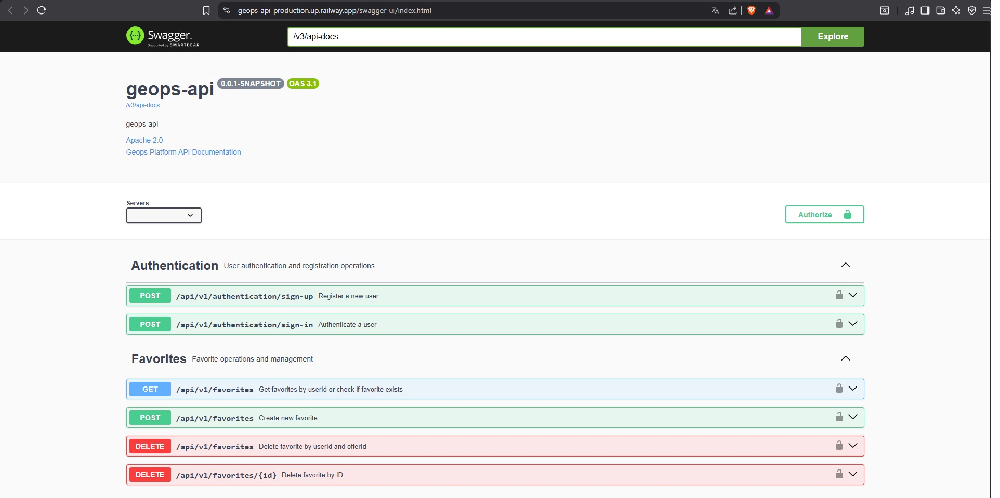
  </div>

  <div align="center">
    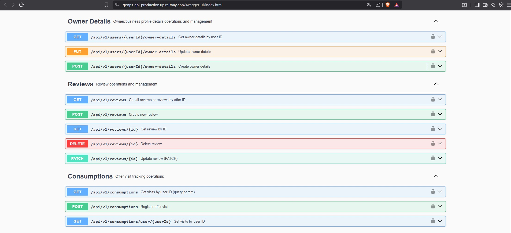
  </div>

  <div align="center">
    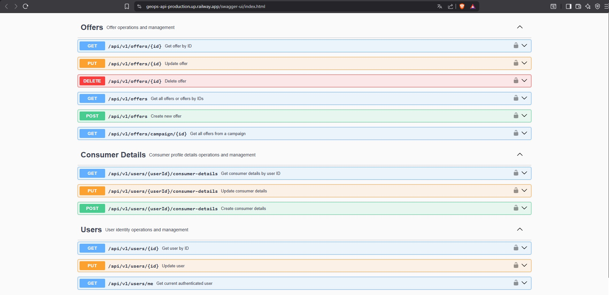
  </div>

  <div align="center">
    
  </div>

  <div align="center">
    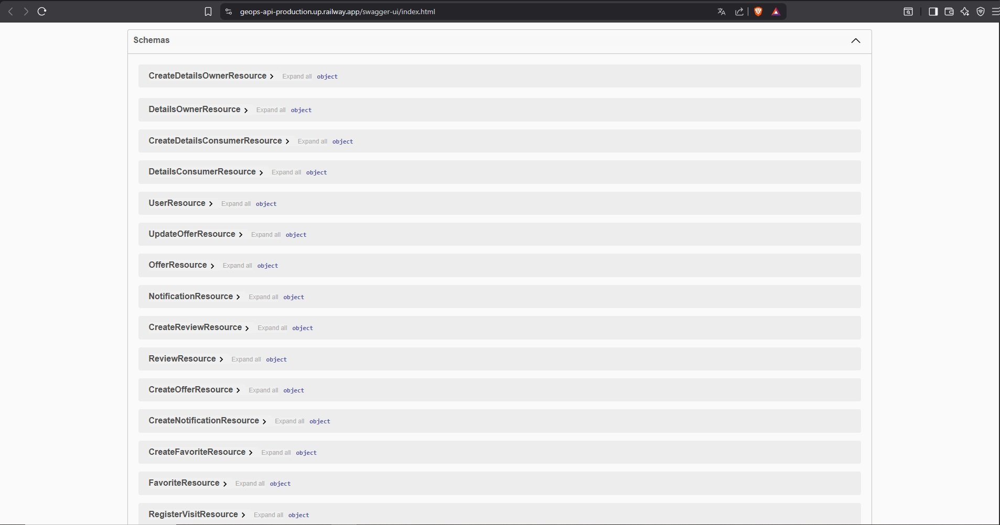
  </div>


### 5.3 Video About-the-Product

**Enlace Video About The Product - GeoPs:** https://upcedupe-my.sharepoint.com/:v:/g/personal/u202318049_upc_edu_pe/IQClpsJt1lv0SJVXaTq_7_RwAZulho-4j7SJR3cHofT9Bpo?nav=eyJyZWZlcnJhbEluZm8iOnsicmVmZXJyYWxBcHAiOiJTdHJlYW1XZWJBcHAiLCJyZWZlcnJhbFZpZXciOiJTaGFyZURpYWxvZy1MaW5rIiwicmVmZXJyYWxBcHBQbGF0Zm9ybSI6IldlYiIsInJlZmVycmFsTW9kZSI6InZpZXcifX0%3D&e=pc3X8P


# Capítulo 6: Product Verification & Validation

## 6.1. Testing Suites & Validation

### 6.1.1. Core Entities Unit Tests
Se han implementado pruebas unitarias para validar la lógica de negocio de las entidades principales en ambos extremos de la aplicación.

* **Frontend (Angular):** Utilizando **Jasmine** y **Karma**, se validan los modelos de datos y la lógica de los componentes en `src/app/components`. Se asegura que las clases de TypeScript procesen correctamente los datos antes de enviarlos a la API.

<div align="center">
    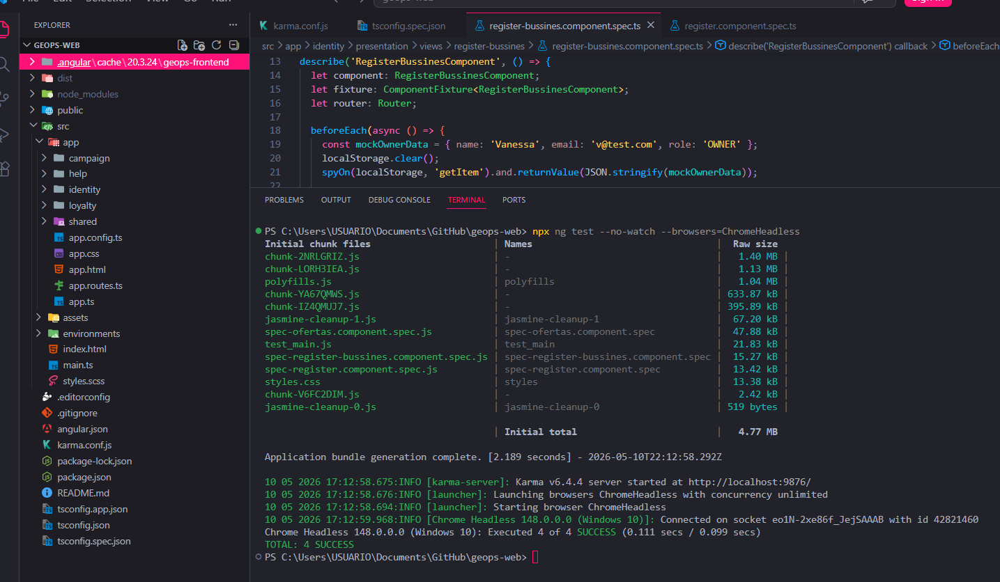
</div>

* **Backend (Java + JUnit):** Se implementaron pruebas unitarias utilizando **JUnit 5** para verificar la lógica de los modelos y entidades de dominio (ej. `Promotion`, `Business`, `User`). Se validaron reglas de negocio como la estructura de los identificadores, cálculos de descuentos y restricciones de campos obligatorios, asegurando que los métodos devuelvan los valores esperados sin errores de lógica interna.

#### 6.1.2. Core Integration Tests
Se realizaron pruebas de integración para asegurar la correcta interoperabilidad entre los módulos del sistema, enfocándose en el flujo de datos entre las capas de la aplicación.

* **Interacción API-Base de Datos:** Se validó que el backend en Java se comunique correctamente con la base de datos **MySQL Workbench**, verificando que las operaciones de persistencia (Guardar negocio, buscar promociones) se ejecuten íntegramente.

<div align="center">
    
</div>

* **Comunicación Frontend-Backend:** Se probaron los servicios de Angular que consumen la API REST en Java, asegurando que los objetos JSON sean mapeados correctamente y que los códigos de estado HTTP (200, 201, 400, 404) sean manejados de forma adecuada por la interfaz.

<div align="center">
    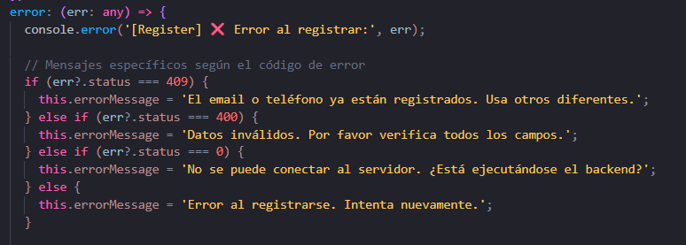
</div>

* **Pruebas de Integración del Backend (Identity):** Se desarrollaron pruebas de integración en el backend utilizando Spring Boot Test y MockMvc para validar el endpoint de registro de usuarios (/sign-up) del bounded context Identity. Las pruebas verificaron escenarios de registro exitoso, ausencia de campos obligatorios y solicitudes vacías, comprobando el correcto procesamiento de objetos JSON y el manejo de respuestas HTTP 200 OK y 400 Bad Request.

<div align="center">
    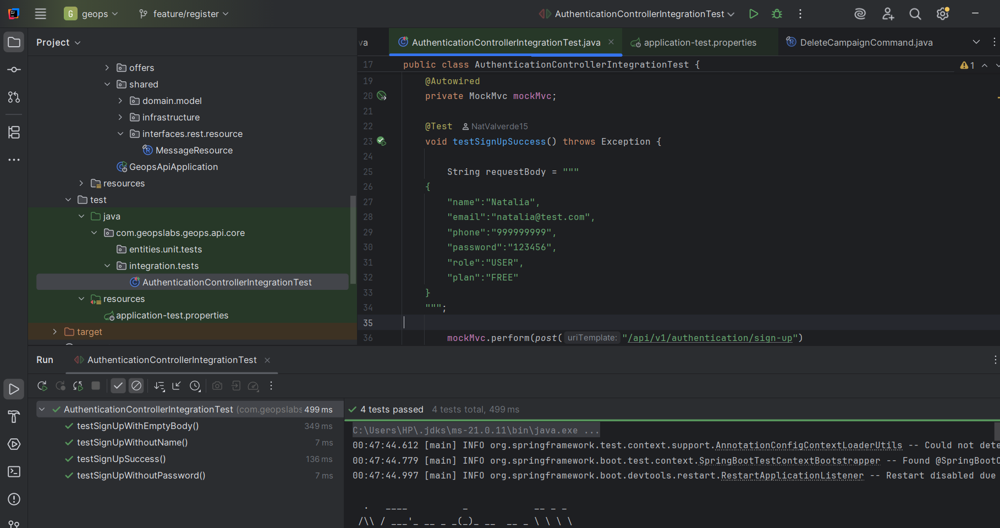
</div>
* **Pruebas de Integración del Frontend (loyalty):** Se desarrollaron pruebas unitarias en el frontend con Jasmine para el componente OfertasComponent. La primera prueba valida el filtrado por categoría, asegurando que al seleccionar “Comida China” solo se mantengan las ofertas de esa categoría y se excluyan las demás. La segunda prueba verifica la visualización de detalles al hacer click, confirmando que se registre correctamente el campaignId mediante la llamada a recordCampaignClick, comprobando el comportamiento esperado del flujo de interacción del usuario.
<div align="center">
    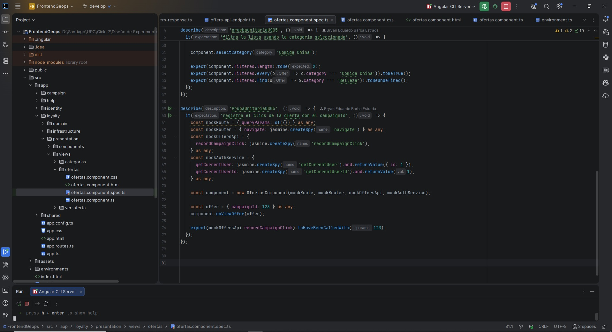
</div>
#### 6.1.3. Core Behavior-Driven Development (BDD)
Se aplicaron técnicas de BDD para definir el comportamiento del sistema desde la perspectiva del usuario final, utilizando el lenguaje Gherkin para describir los escenarios de interacción.

* **Herramienta:** Se redactaron los escenarios siguiendo el formato de **Cucumber** para garantizar que las funcionalidades de GeoPS cumplan con los criterios de aceptación.
* **Escenario de Ejemplo: Búsqueda de productos asiáticos por proximidad.**
    * **Given** que el usuario consumidor se encuentra en el distrito de Lince.
    * **When** selecciona la categoría "Snacks Coreanos" en la plataforma.
    * **Then** el sistema debe mostrar una lista de tiendas en un radio de 3km con stock disponible.


#### 6.1.4. Core System Tests
Se ejecutaron pruebas de sistema de flujo completo para validar que GeoPS funciona correctamente en su totalidad. Estas pruebas cubrieron la navegación integral de la aplicación web responsiva, simulando el comportamiento real de los dos segmentos objetivo:

* **Flujo del Negocio:** Registro de tienda, carga de catálogo de productos asiáticos y publicación de una oferta flash.
* **Flujo del Consumidor:** Registro, búsqueda geolocalizada de ofertas en Lima Moderna y visualización de detalles de contacto del comercio.
* **Validación de Entorno:** Se verificó la respuesta del sistema y la adaptación del diseño (UI/UX) tanto en navegadores de escritorio como en dispositivos móviles, asegurando una experiencia fluida y sin errores en la integración con las APIs de mapas y geolocalización.

<div align="center">
    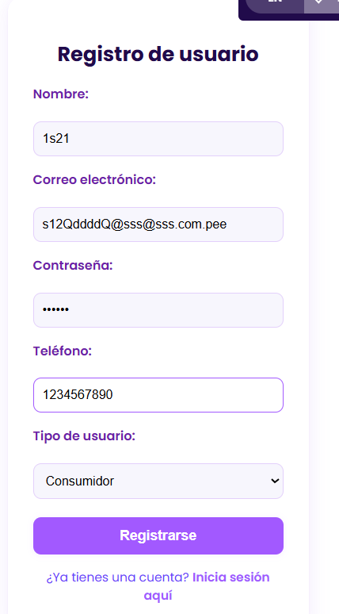
</div>

#### 6.1.5. Campaign Form Structure Tests

Frontend (Angular): Utilizando Jasmine y Karma, se valida la estructura del formulario reactivo del componente de edición de campañas en src/app/components. Se asegura que el FormGroup sea construido correctamente con exactamente los 6 campos requeridos — name, description, startDate, endDate, estimatedBudget y status — garantizando que cualquier modificación accidental en la definición del formulario, como la eliminación o el renombrado de un control, sea detectada de inmediato por el test.

<div align="center">
    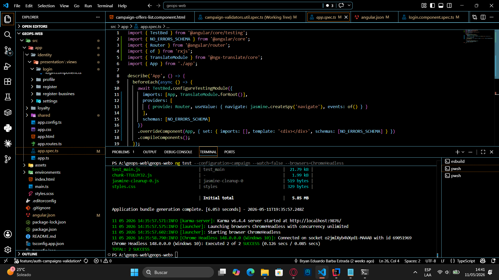
</div>

Pruebas de Integración del Backend (Campaigns): Se desarrollaron pruebas de integración en el backend utilizando Spring Boot Test y MockMvc para validar el endpoint de creación de campañas del bounded context Campaigns. Las pruebas verificaron la protección de entrada de datos, validando el formato de los campos, la seguridad de la información, los rangos de fechas y el presupuesto estimado, comprobando el correcto procesamiento de objetos JSON y el manejo de respuestas HTTP apropiadas.

<div align="center">
    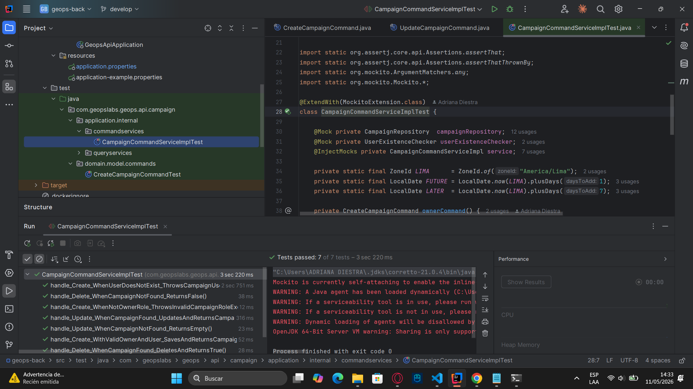
</div>

# Capítulo 7: DevOps Practices

## 7.1. Continuous Integration

### 7.1.1. Tools and Practices
En **GeoPS Labs**, empleamos una variedad de herramientas que optimizan tanto la creación como la validación de la funcionalidad. Seguimos las metodologías de Desarrollo Orientado por Comportamiento (**BDD**) y Desarrollo Orientado por Pruebas (**TDD**) para asegurar que nuestras soluciones mantengan altos niveles de calidad técnica y estén alineadas con las necesidades del negocio.

| Herramienta | Tipo | Descripción | Propósito |
| :--- | :--- | :--- | :--- |
| **JUnit 5** | Pruebas (TDD) | Framework para pruebas unitarias en Java. | Ejecutar pruebas automáticas en los componentes del backend para asegurar su correcto funcionamiento. |
| **Mockito** | Simulaciones (TDD) | Librería de simulación de objetos para Java. | Imitar el comportamiento de objetos externos (como repositorios) para realizar pruebas efectivas en aislamiento. |
| **Jasmine / Karma** | Pruebas (Frontend) | Framework y test runner para Angular. | Validar la lógica de los componentes y servicios de la interfaz de usuario en el navegador. |
| **Cucumber** | Herramienta de BDD | Framework para pruebas basadas en comportamiento. | Crear escenarios de prueba en lenguaje Gherkin que aseguren que el desarrollo cumpla con las historias de usuario. |

### 7.1.2. Build & Test Suite Pipeline Components
Nuestro pipeline de CI automatiza la integración y pruebas del código mediante **GitHub Actions**, manteniendo el proyecto siempre listo para un despliegue. Los componentes son:
1. **Compilación del Backend:** Uso de **Maven** para compilar el código Java y gestionar las dependencias.
2. **Pruebas de Backend:** Ejecución automática de la suite de pruebas unitarias con **JUnit**.
3. **Compilación del Frontend:** Uso de **Angular CLI** para compilar la aplicación y verificar errores de sintaxis.
4. **Pruebas de Frontend:** Ejecución de pruebas unitarias con **Karma** en modo *headless*.


## 7.2. Continuous Delivery

### 7.2.1. Tools and Practices
El objetivo es automatizar la entrega, manteniendo una etapa de validación previa al despliegue final en producción.

**Tools:**
* **GitHub Actions:** Automatiza el pipeline completo, permitiendo configurar etapas de despliegue manual.
* **Trello:** Utilizado para gestionar el proceso de aprobación; un administrador debe revisar y autorizar el paso a producción.
* **Docker:** Se usa para contenerizar la aplicación backend (Spring Boot), asegurando consistencia entre los entornos de desarrollo y staging.

**Practices:**
* **Feature Branching:** Las funcionalidades se desarrollan en ramas separadas y se fusionan a una rama estable tras pasar las pruebas automáticas.
* **Pipeline de Validación en Staging:** El código se valida en un entorno que simula las condiciones de producción antes del despliegue definitivo.
* **Despliegue Semiautomático:** El pipeline prepara la aplicación, pero el despliegue final requiere una **Aprobación Manual** por parte de un responsable del proyecto.

### 7.2.2. Stages Deployment Pipeline Components
1. **Integración Continua (CI):** Ejecución de pruebas al hacer un commit en la rama de desarrollo.
2. **Validación en Staging:** Simulación de escenarios de producción y pruebas de carga o seguridad.
3. **Despliegue Manual:** El paso final queda en espera de la aprobación de una persona para minimizar riesgos en los usuarios finales.
4. **Monitoreo y Feedback:** Análisis del rendimiento del nuevo código en el entorno de staging.


## 7.3. Continuous Deployment

### 7.3.1. Tools and Practices
El objetivo de **Continuous Deployment (CD)** es que los cambios aprobados pasen automáticamente a producción sin intervención manual, siempre que superen todas las validaciones.

**Tools:**
* **GitHub Actions:** Orquestador del pipeline de despliegue automático.
* **Docker:** Contenerización del backend en Java para asegurar la portabilidad.
* **Railway:** Gestión automatizada de la base de datos **MySQL**, incluyendo migraciones y backups.
* **Render:** Plataforma para el despliegue automático y monitoreo del backend en Spring Boot.
* **Firebase Hosting:** Para el frontend en Angular, garantizando un despliegue rápido mediante una CDN global.

**Practices:**
* **Commit-based Deployment:** Cada commit exitoso en la rama `main` o `develop` activa automáticamente el proceso de construcción y despliegue.
* **Rollback Automático:** En caso de detectar fallos post-despliegue, el sistema restaura automáticamente la versión anterior estable.

### 7.3.2. Production Deployment Pipeline Components

**Componentes del Pipeline de la Base de Datos (Railway):**
1. **Gestión de Migraciones:** Spring Boot gestiona automáticamente los cambios en el esquema de MySQL en Railway al modificar las entidades Java.
2. **Backup Automático:** Creación de copias de seguridad antes de aplicar migraciones críticas para evitar pérdida de datos.
3. **Validación de Esquema:** Scripts automatizados que aseguran que las nuevas tablas y relaciones están correctamente configuradas.

**Componentes del Pipeline del Backend (Render para Spring Boot):**
1. **Integración:** Render detecta el cambio, toma el código y lo construye con Maven.
2. **Construcción Docker:** Se genera la imagen del contenedor con todas las dependencias incluidas.
3. **Despliegue y Monitoreo:** Implementación de la nueva versión con alertas de rendimiento en tiempo real.

**Componentes del Pipeline del Frontend (Firebase para Angular):**
1. **Compilación:** Firebase CLI inicia el proceso de construcción en modo producción (`prod`).
2. **Despliegue en Hosting:** Implementación automática en los servidores de Firebase tras pasar las pruebas unitarias.
3. **Invalidación de Caché:** Limpieza automática de caché para que los usuarios de **GeoPS** reciban la versión más reciente al instante.


## Conclusiones

**Conclusiones y Recomendaciones**

El desarrollo del proyecto GeoPS permitió transformar una idea inicial en una solución tecnológica completa y funcional, integrando landing page, frontend interactivo con Angular y backend robusto con Spring Boot desplegado en la nube. A lo largo de los cuatro sprints se evidenció un progreso consistente en la capacidad técnica del equipo, tanto en términos de diseño de interfaces como en arquitectura de software, integración de servicios y despliegue continuo en plataformas de producción.

A lo largo del proyecto se evidenció una mejora progresiva en la organización del trabajo y en la coordinación del equipo. El uso de metodologías ágiles (Scrum), control de versiones mediante GitHub, gestión visual en Trello y comunicación por Discord y Google Meet permitió mantener un flujo de trabajo ordenado y eficiente. Cada sprint aportó valor incremental, fortaleciendo la arquitectura y asegurando la cohesión entre las distintas funcionalidades desarrolladas. El Sprint 4 marcó la culminación del MVP con la implementación del módulo completo de Proveedores, permitiendo a los negocios gestionar campañas publicitarias de manera efectiva.

Desde el punto de vista técnico, se construyó una plataforma sólida que integra módulos esenciales como autenticación, gestión de usuarios, favoritos, ofertas, reseñas, cupones, carritos, pagos, suscripciones y el nuevo módulo de campañas publicitarias para proveedores. El despliegue del backend en Railway y del frontend en Vercel confirma la capacidad del equipo para trabajar con servicios en la nube, manejando entornos reales de producción. La documentación completa del API con Swagger UI facilita la comprensión de los endpoints y permite la futura expansión del sistema.

Las validaciones realizadas con usuarios finales durante el Sprint 4 confirmaron la usabilidad y valor de la plataforma, recibiendo feedback positivo sobre la facilidad de uso, la funcionalidad de geolocalización y los filtros de búsqueda. Los usuarios destacaron la rapidez de GeoPS en comparación con otras plataformas existentes y sugirieron mejoras como el desarrollo de una aplicación móvil nativa y la incorporación de reseñas de usuarios para aumentar la credibilidad de las ofertas.

En su conjunto, el proyecto GeoPS se consolidó como una base tecnológica robusta y escalable, preparada para continuar creciendo en funcionalidades, pruebas automatizadas, mejoras de rendimiento y validaciones continuas de experiencia de usuario. Los resultados obtenidos reflejan un equipo técnicamente competente, organizado y capaz de ejecutar un ciclo completo de desarrollo de software moderno, desde la concepción hasta el deployment en producción y la validación con usuarios reales.

## Bibliografía

Banco Interamericano de Desarrollo (BID). (2020). *La digitalización de las pymes en América Latina y el Caribe*. BID. https://publications.iadb.org

Kemp, S. (2023). *Digital 2023: Peru*. DataReportal. https://datareportal.com/reports/digital-2023-peru

Loza, J. (2024, marzo 15). Peruanos pasan más de cinco horas diarias conectados a internet. *La República*. https://larepublica.pe

Nielsen. (2021). *Trust in Advertising 2021: Global Report*. Nielsen. https://www.nielsen.com

Organisation for Economic Co-operation and Development (OECD). (2020). *SME Policy Index: Latin America and the Caribbean 2019*. OECD Publishing. https://doi.org/10.1787/25203303

Think with Google. (2019). *How mobile search connects consumers to stores*. Google Insights. https://www.thinkwithgoogle.com

World Bank. (2019). *World Development Report 2019: The Changing Nature of Work*. World Bank. https://doi.org/10.1596/978-1-4648-1328-3


## Anexos

**Enlace Organización - GeoPs:** https://github.com/geops-org

**Despliegues y Documentación**

- Enlace Documentación Swagger: https://geops-api-production.up.railway.app/swagger-ui/index.html
  
- Enlace del Proyecto (BackEnd) API Deploy: https://geops-api-production.up.railway.app/
  
- Enlace del Proyecto (FrontEnd) Deploy: https://geops-frontend.vercel.app/login

- Enlace Landing Page Deploy: https://geops-org.github.io/geops-landing/


**Repositorios GitHub**

- Enlace Repositorio BackEnd: https://github.com/geops-org/geops-api

- Enlace Repositorio FrontEnd: https://github.com/geops-org/geops-web

- Enlace Repositorio Landing Page: https://github.com/geops-org/geops-landing

- Enlace Repositorio Project Report: https://github.com/geops-org/geops-report


**Video About The Product**

- Enlace Video About The Product - GeoPs: https://upcedupe-my.sharepoint.com/:v:/g/personal/u202318049_upc_edu_pe/IQClpsJt1lv0SJVXaTq_7_RwAZulho-4j7SJR3cHofT9Bpo?nav=eyJyZWZlcnJhbEluZm8iOnsicmVmZXJyYWxBcHAiOiJTdHJlYW1XZWJBcHAiLCJyZWZlcnJhbFZpZXciOiJTaGFyZURpYWxvZy1MaW5rIiwicmVmZXJyYWxBcHBQbGF0Zm9ybSI6IldlYiIsInJlZmVycmFsTW9kZSI6InZpZXcifX0%3D&e=pc3X8P


**Diseño Figma**

- Enlace Diseño Figma Prototype: https://www.figma.com/proto/mHHx8WStPBr63tLYj42pBX/GeoPs?node-id=2-511&t=I0J1dH7e40wYL90d-1&scaling=min-zoom&content-scaling=fixed&page-id=0%3A1&starting-point-node-id=426%3A3299

- Enlace Diseño Figma: https://www.figma.com/design/mHHx8WStPBr63tLYj42pBX/GeoPs?node-id=336-2468&t=1Nm0EVmUTgy7sfDx-1

**Videos Entrevistas**

